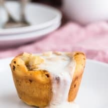
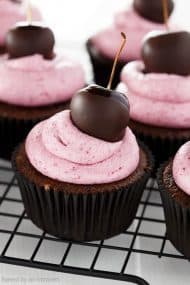

# Chocolate Pistachio Cake Recipe | Baked by an Introvert

Go

 

- [Facebook](https://www.facebook.com/bakedbyanintrovert/)
- [Instagram](https://www.instagram.com/introvertbaker/)
- [Pinterest](https://www.pinterest.com/introvertbaker/)
- [Twitter](https://twitter.com/IntrovertBaker)
- [YouTube](https://www.youtube.com/channel/UCfgM22zupzwI7RNqyXazLIQ)
- [Tumblr](http://introvertbaker.tumblr.com/)

 

Menu- [Home](https://www.bakedbyanintrovert.com/)
- [About](https://www.bakedbyanintrovert.com/about-me/)
- [Recipes](https://www.bakedbyanintrovert.com/recipe-index/)Toggle dropdown
    - [Bread](https://www.bakedbyanintrovert.com/bread/)
    - [Breakfast](https://www.bakedbyanintrovert.com/breakfast/)
    - [Brownies & Bars](https://www.bakedbyanintrovert.com/brownies-bars/)
    - [Cakes & Cupcakes](https://www.bakedbyanintrovert.com/cakes-cupcakes/)
    - [Candy & Treats Recipes](https://www.bakedbyanintrovert.com/candy-recipes/)
    - [Cheesecake Recipes](https://www.bakedbyanintrovert.com/cheesecake-recipes/)
    - [Cookies](https://www.bakedbyanintrovert.com/cookies/)
    - [Frozen Treats](https://www.bakedbyanintrovert.com/frozen-treats/)
    - [Healthy Eats](https://www.bakedbyanintrovert.com/healthy-eats/)
    - [No\-Bake Recipes](https://www.bakedbyanintrovert.com/no-bake-recipes/)
    - [Pies, Tarts & Crisps](https://www.bakedbyanintrovert.com/pies-tarts-crisps/)
    - [Savory Recipes](https://www.bakedbyanintrovert.com/savory-recipes/)
    - [By Season](https://www.bakedbyanintrovert.com/seasonal/)Toggle dropdown
        - [Christmas Recipes](https://www.bakedbyanintrovert.com/seasonal/christmas/)
        - [Fall Recipes](https://www.bakedbyanintrovert.com/seasonal/fall-recipes/)
        - [Spring Recipes](https://www.bakedbyanintrovert.com/seasonal/spring-recipes/)
        - [Summer Recipes](https://www.bakedbyanintrovert.com/seasonal/summer-recipes/)
        - [Valentine’s Day](https://www.bakedbyanintrovert.com/seasonal/valentines-day/)
    - [By Diet](https://www.bakedbyanintrovert.com/special-diet/)Toggle dropdown
        - [Dairy Free](https://www.bakedbyanintrovert.com/special-diet/dairy-free/)
        - [Gluten Free](https://www.bakedbyanintrovert.com/special-diet/gluten-free/)
        - [Vegan Recipes](https://www.bakedbyanintrovert.com/special-diet/vegan-recipes/)
- [Baking Basics](https://www.bakedbyanintrovert.com/baking-basics/)
- [Cookbook](https://www.bakedbyanintrovert.com/from-the-oven-cookbook/)
- [Contact](https://www.bakedbyanintrovert.com/contact/)

 

[Home](https://www.bakedbyanintrovert.com/) » [Cakes & Cupcakes](https://www.bakedbyanintrovert.com/cakes-cupcakes/) » Chocolate Pistachio Cake

# Chocolate Pistachio Cake

- [6 comments](https://www.bakedbyanintrovert.com/chocolate-pistachio-cake/#comments)
- March 9, 2017

 [Pin5K](https://www.bakedbyanintrovert.com/chocolate-pistachio-cake/)

 [Share62](https://www.facebook.com/share.php?u=https://www.bakedbyanintrovert.com/chocolate-pistachio-cake/)

 [Tweet](https://twitter.com/share?original_referer=/&text=Chocolate+Pistachio+Cake&url=https://www.bakedbyanintrovert.com/chocolate-pistachio-cake/&via=introvertbaker)

 [Stumble226](http://www.stumbleupon.com/submit?url=https://www.bakedbyanintrovert.com/chocolate-pistachio-cake/&title=Chocolate+Pistachio+Cake)

Shares 6K

This layered Chocolate Pistachio Cake will turn heads\! Rich decadent chocolate cake slathered in light, creamy pistachio frosting. It looks just as good as it tastes. A luscious chocolate ganache rests on top of the cake with a ring of crushed pistachios encasing it. It’s a chocolate lover’s dream\!

[PIN FOR LATER](https://www.pinterest.com/pin/104708760070933926/)

It’s starting to feel like spring here already. Currently, the windows are open and the sun is filling the office as I work. Oh, how I’ve missed these gorgeous days.

The weather has me craving time away. Maybe somewhere tropical. Somewhere warm.

That’s exactly what I’ll be doing at the end of the month. We’re sailing away on a 10 cruise and I. Can’t. Wait.

Report this ad

I’ve been busy planning enough recipes and posts to keep the blog afloat while we travel. And there’s been so much chocolate\! Earlier this week I shared these [homemade thin mints](https://www.bakedbyanintrovert.com/homemade-thin-mints/). And now this glorious chocolate pistachio cake.

This is a mega chocolate cake\! So full of rich chocolaty goodness but balanced with a light pistachio buttercream. It’s perfection.

While this chocolate pistachio cake looks extravagant and difficult, it’s actually really simple. I turned to my favorite chocolate cake base. It’s the same one used for this [peppermint fudge cake](https://www.bakedbyanintrovert.com/peppermint-fudge-cake/).

The chocolate batter contains both cocoa powder and melted chocolate which is enhanced with some strong brewed coffee. If you’d rather not add coffee to the cake, you can replace it with buttermilk.

After you bake the chocolate cake layers, it’s time to cover them with frosting. I am loving this pistachio frosting. It’s incredible.

You need unsalted shelled pistachios and a strong food processor. Follow the steps for making [homemade almond butter](https://www.bakedbyanintrovert.com/homemade-almond-butter/) and grind the pistachios into a paste.

Report this ad

Make a [basic vanilla buttercream frosting](https://www.bakedbyanintrovert.com/basic-vanilla-buttercream-frosting/) and stir the pistachio paste in at the very end. I like to add a drop of green food coloring also, but this it totally optional.

Make sure the cake is completely cool then spread some frosting in between each layer and cover the entire cake with the remaining frosting. Finish the cake with chocolate ganache and crushed pistachios.

> Feed your inner chocoholic some Chocolate Pistachio Cake.

More delicious chocolate recipes you must try – [triple chocolate mousse cake](https://www.bakedbyanintrovert.com/triple-chocolate-mousse-cake/), this [chocolate coconut cake](https://www.bakedbyanintrovert.com/chocolate-coconut-cake/), and this [chocolate peanut butter cup pound cake](http://www.thecookierookie.com/chocolate-peanut-butter-cup-pound-cake/).

5 from 1 vote

 

 Print

## Chocolate Pistachio Cake

This layered Chocolate Pistachio Cake will turn heads\! Rich decadent chocolate cake slathered in light, creamy pistachio frosting. It looks just as good as it tastes. A luscious chocolate ganache rests on top of the cake with a ring of crushed pistachios encasing it. It’s a chocolate lover’s dream\!

 

 CourseDessert 

 Prep Time 25 minutes 

 Cook Time 50 minutes 

 Total Time 1 hour 15 minutes 

 Yields 24 servings

 Calories 482 kcal

 Author Jen Sobjack

### Ingredients

#### For the cake

- 2cupsall\-purpose flour
- 2/3cupdark cocoa powderplus more for dusting the pans
- 2teaspoonsbaking soda
- 1teaspoonbaking powder
- 1teaspoonsalt
- 4ouncesunsweetened chocolatecoarsely chopped
- 3/4cupunsalted buttermelted
- 1 and 3/4cupsgranulated sugar
- 2large eggs
- 1tablespoonvanilla extract
- 1 and 1/2cupsbuttermilk
- 1/2cupstrong brewed coffeecooled

#### For the frosting

- 1 and 1/2cupsunsalted pistachiosshelled
- 1teaspooncanola oil
- 2cupsunsalted buttersoftened
- 2tablespoonsheavy cream
- 1tablespoonvanilla extract
- 1/4teaspoonsalt
- 3\-6cupsconfectioners' sugar
- 1\-2drops green food coloring
- 1cupunsalted pistachiosshelled and chopped \(for garnish\)

#### For the ganache

- 2ouncessemisweet chocolatecoarsely chopped
- 2tablespoonsunsalted buttercut into pieces
- 1tablespoon[light corn syrup](http://amzn.to/2pUocbT)

Report this ad

### Instructions

#### Make the cake

1. Heat the oven to 350°F. Spray 3 8\-inch round pans with nonstick spray. Line the bottoms with parchment paper cut into a circle to fit the pan. Spray the parchment paper with nonstick spray and dust the pan lightly with cocoa powder. Tap out any excess and set aside.
2. In a medium bowl, combine the flour, cocoa powder, baking soda, baking powder, and salt. Stir with a whisk and set aside.
3. Add the chocolate to a small heatproof bowl and set it over a pot of barely simmering water. Stir continuously until melted and smooth. Remove from heat. Set aside to cool.
4. Using a stand mixer fitted with a paddle attachment or a handheld electric mixer beat the butter and sugar together on medium\-low speed until light and fluffy. Beat in the eggs, one at a time, mixing well after each addition. Scrape down the sides of the bowl as needed. Beat in the vanilla. Add the melted chocolate and mix until well incorporated. With the mixer set to low speed. gradually add half the flour mixture, followed by the buttermilk and coffee, and then the remaining flour mixture. Beat just until combined. The batter will be thick.
5. Divide the batter evenly between the 3 prepared pans. Use an offset spatula to spread the batter all the way to the edges of the pan and smooth out the surface. Bake for 30 to 40 minutes, or until a toothpick inserted into the center comes out with only a few dry crumbs. Cool the cake in the pans for 10 minutes, then invert the cakes onto a wire rack to cool completely. Peel the parchment paper off the bottoms before filling.

#### Make the frosting

1. In a food processor, process the pistachios until they become coarsely ground. Stop and scrape down the sides of the bowl. Add the oil if the pistachios aren't breaking down easily. Continue to blend for 25\-30 minutes, stopping and scraping down the sides as needed throughout the process until smooth and creamy. Set aside.
2. In a stand mixer fitted with a paddle attachment or with an electric hand mixer, beat the butter on medium\-high speed until smooth. Add the cream, vanilla, and salt. Continue to beat until incorporated.
3. Add 2 cups of confectioner's sugar, beat on medium\-low speed until most of the sugar is moistened. Gradually add in the remaining sugar, one cup at a time. You may need more or less depending on how soft the butter is. Beat on medium\-low speed until the sugar is moistened. Turn the speed up to medium\-high and beat until light and fluffy. Scrape down the sides of the bowl as needed. Add the pistachio paste and food coloring. Mix until well combined.

#### Assemble the cake

1. Place one cake layer onto a serving platter. Add a generous amount of frosting and spread it to the edge with a spatula. Repeat with a second cake layer, topping it with a generous amount of frosting. Add the third cake layer and cover the top and sides of cake with frosting. Press chopped pistachios into the sides of the cake near the bottom and coming up less than halfway. Sprinkle pistachios over the outer edge on top of the cake creating a 1\-inch border. Set the cake in the freezer for 10 minutes.

#### Make the ganache

1. Place the chocolate, butter, and corn syrup in a medium heatproof bowl set over a pot of barely simmering water. Stir until melted and smooth. Remove from heat and let cool for 5 minutes.
2. Spoon the ganache over the top of the cake in the center of the pistachio border. Use the back of the spoon to create a smooth layer of ganache. Set the cake back into the freezer for 10 minutes.

#### Make ahead tip

1. Wrap baked and cooled cake layers tightly in plastic wrap and store them in the refrigerator. The frosting can be prepared, covered, and refrigerated overnight. Assemble and frost the cake within 2 days.
2. The frosted cake can be frozen for up to 2 months. Thaw it overnight in the refrigerator and let it come to room temperature just before serving. 

[Follow @introvertbaker on Instagram and share the recipes you make from my blog\! Use the hashtag \#bakedbyanintrovert.

Please also take a moment to rate and comment down below\!](https://www.instagram.com/introvertbaker/)

### You might also like these:

[

Chocolate Raspberry Cupcakes](https://www.bakedbyanintrovert.com/chocolate-raspberry-cupcakes/)

[

Triple Chocolate Mousse Cake](https://www.bakedbyanintrovert.com/triple-chocolate-mousse-cake/)

[

Chocolate Coconut Cake](https://www.bakedbyanintrovert.com/chocolate-coconut-cake/)

[

German Chocolate Banana Cake](https://www.bakedbyanintrovert.com/german-chocolate-banana-cake/)

## Categories:

- [Cakes & Cupcakes](https://www.bakedbyanintrovert.com/cakes-cupcakes/)

 

## Tags:

- [cake](https://www.bakedbyanintrovert.com/tag/cake/)
- [chocolate](https://www.bakedbyanintrovert.com/tag/chocolate/)
- [dessert](https://www.bakedbyanintrovert.com/tag/dessert/)
- [pistachio](https://www.bakedbyanintrovert.com/tag/pistachio/)

 

## Subscribe to receive new recipes delivered straight to your inbox\!

 

## 6 Comments

- ### [Manali@CookWithManali](http://www.cookwithmanali.com/)
    stunning cake Jen\! 
     enjoy your trip xoxo
    - [Reply](https://www.bakedbyanintrovert.com/chocolate-pistachio-cake/#comment-101279)
    - [11 months ago](https://www.bakedbyanintrovert.com/chocolate-pistachio-cake/#comment-101279)
- ### [cakespy](http://www.cakespy.com/)
    I’ve never been on a cruise\! Enjoy\!\! This cake looks like heaven on a plate for the rest of us on solid ground. 
    - [Reply](https://www.bakedbyanintrovert.com/chocolate-pistachio-cake/#comment-101295)
    - [11 months ago](https://www.bakedbyanintrovert.com/chocolate-pistachio-cake/#comment-101295)
- ### [Hallie B.| The Wordy Baker](http://thewordbaker.wordpress.com/)
    This looks amazing\! I love dark chocolate and pistachios together.
    - [Reply](https://www.bakedbyanintrovert.com/chocolate-pistachio-cake/#comment-101338)
    - [11 months ago](https://www.bakedbyanintrovert.com/chocolate-pistachio-cake/#comment-101338)
- ### [2pots2cook](http://www.2pots2cook.com/)
    I really enjoy your site. Thank you \!
    - [Reply](https://www.bakedbyanintrovert.com/chocolate-pistachio-cake/#comment-101560)
    - [11 months ago](https://www.bakedbyanintrovert.com/chocolate-pistachio-cake/#comment-101560)
- ### Abigail
    When my brother asked for a chocolate pistachio cake for his birthday, I thought he was joking.
    But he wasn’t, so I found this recipe. Honestly, Jen, this was the only recipe that caught my eye. Your cake is polished and beautiful.
    I made only a couple of minor changes to the recipe. I used cake flour \(sifted\) instead of all\-purpose and made the ganache with just melted chocolate and heavy cream. I used about 3 1/2 cups of powdered sugar in the frosting \(which was delicious\). Also, I could only process the pistachios for a couple of minutes before they started sticking to the sides of the food processor, which was fine by me. I was afraid that the frosting would be too grainy, but the pieces were small enough that it didn’t bother anyone.
    Everyone loved this cake. I make desserts for my family pretty frequently and everyone agreed that this was their favorite one yet. This is going to be my new go\-to recipe for chocolate cake… It’s so good.
    Thank you for the wonderful recipe\!
    - [Reply](https://www.bakedbyanintrovert.com/chocolate-pistachio-cake/#comment-102020)
    - [11 months ago](https://www.bakedbyanintrovert.com/chocolate-pistachio-cake/#comment-102020)
- ### Sabrina
    I love almonds and I am going to try to make this cake using almond butter as a substitute for the pistachios. If I thought my food processor could handle this I would make the pistachio version. Happy baking.
    - [Reply](https://www.bakedbyanintrovert.com/chocolate-pistachio-cake/#comment-102432)
    - [10 months ago](https://www.bakedbyanintrovert.com/chocolate-pistachio-cake/#comment-102432)

## Leave a Comment 

 Comment 

Name \* 

Email \* 

Website 

Recipe Rating

 

 Notify me of replies to my comment via e\-mail. 

 

 

 [

## ‹ Previous

Homemade Thin Mints](https://www.bakedbyanintrovert.com/homemade-thin-mints/)

[

## Next ›

Banana Peanut Butter Snack Bites](https://www.bakedbyanintrovert.com/banana-peanut-butter-snack-bites/)

## Subscribe to receive new recipes delivered straight to your inbox\!

 

## Recent Posts & Recipes

 
- 
- 
- 
- 

## Popular Recipes

 
- 
- 
- 
- 

## Featured On...

- 
- 
- 
- 
- 
- 

## Current Season

- 
- 
- 
- 
- 
- 

- © 2014 \- 2018 Baked by an Introvert
- [Home](http://www.bakedbyanintrovert.com/)
- [Site Policies](https://www.bakedbyanintrovert.com/site-policies/)
- [Terms of Use](https://www.bakedbyanintrovert.com/terms-use/)
- [Disclosure Policy](https://www.bakedbyanintrovert.com/disclosure-policy/)
- [Privacy Policy](https://www.bakedbyanintrovert.com/privacy-policy/)

 
- [Facebook](https://www.facebook.com/bakedbyanintrovert/)
- [Instagram](https://www.instagram.com/introvertbaker/)
- [Pinterest](https://www.pinterest.com/introvertbaker/)
- [Twitter](https://twitter.com/IntrovertBaker)
- [YouTube](https://www.youtube.com/channel/UCfgM22zupzwI7RNqyXazLIQ)
- [Tumblr](http://introvertbaker.tumblr.com/)

 

Proud Member of:

Mediavine Publisher Network

Food Innovation Group: Bon Appetit and Epicurious

­
