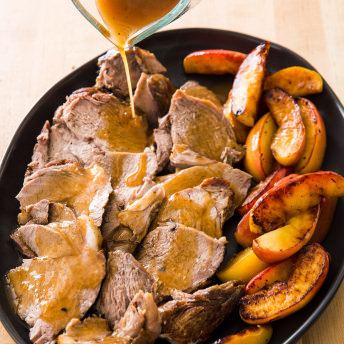
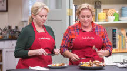
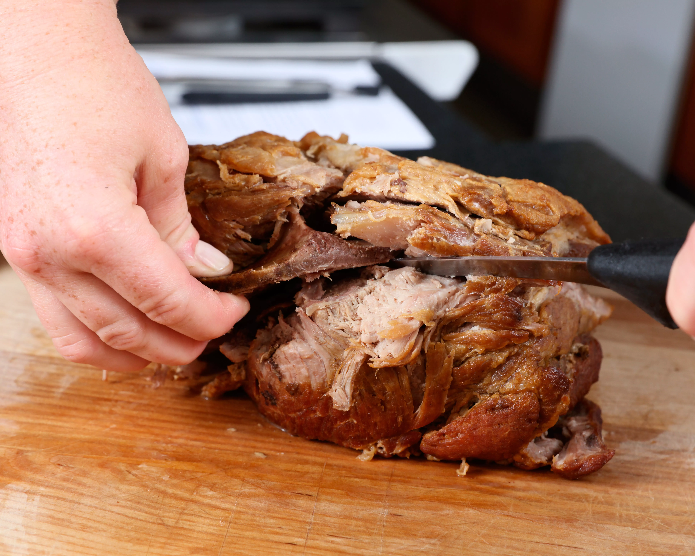
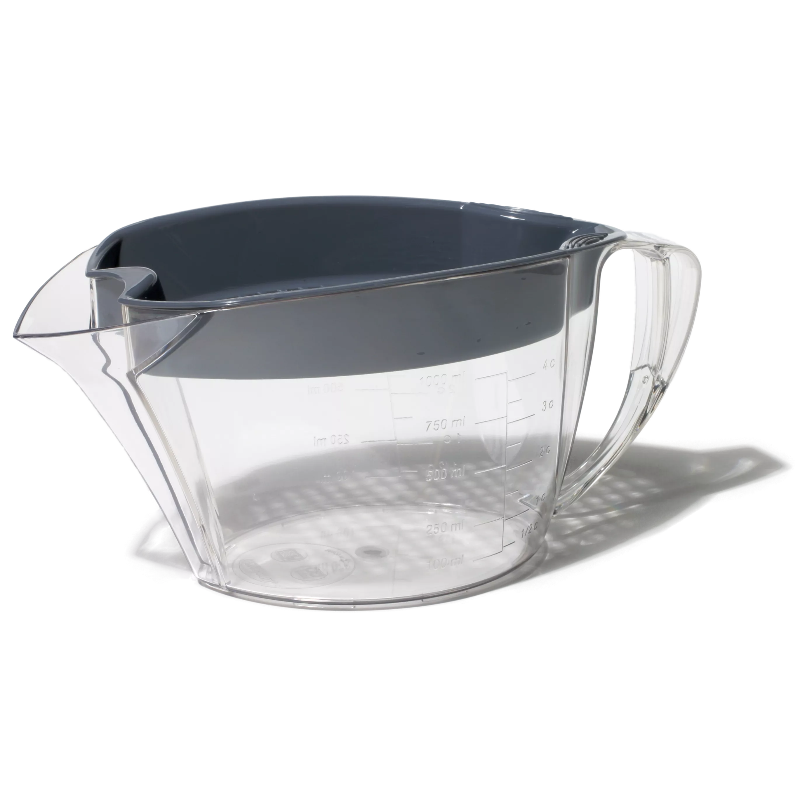
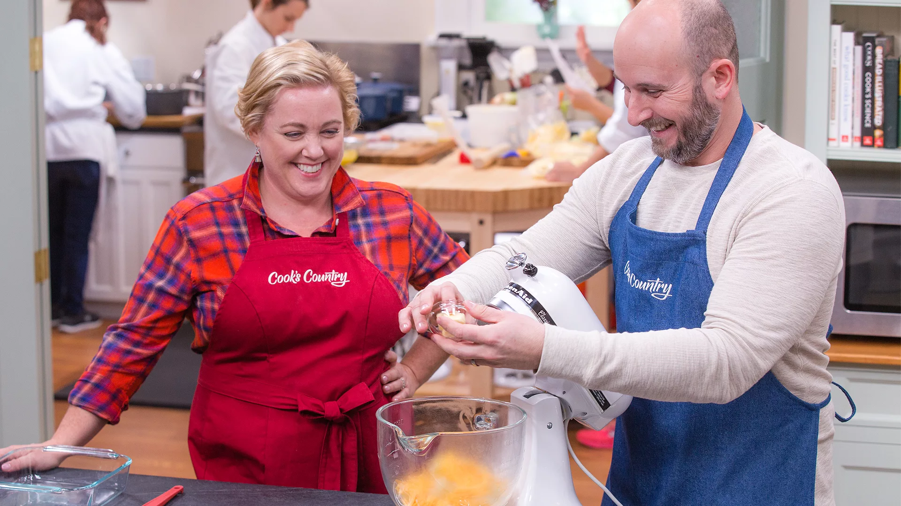
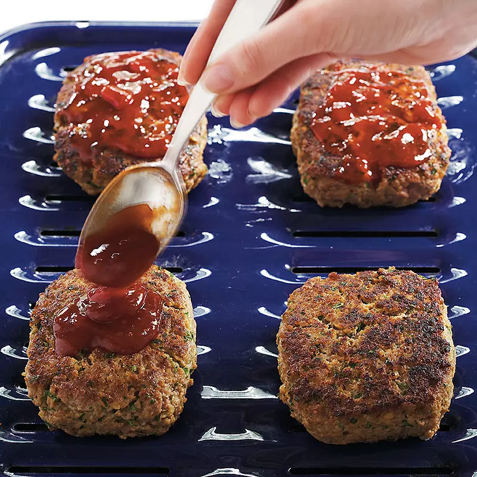
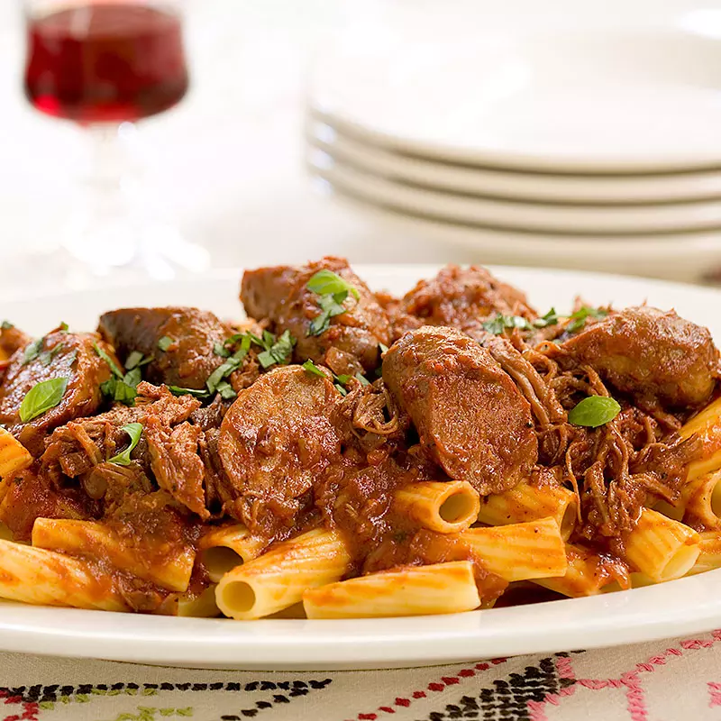

# Cider-Braised Pork Roast

      December/January 2016

 
 # Cider\-Braised Pork Roast

  Pork and apples are a tried\-and\-true combination. But cooking them together revealed some core problems.

 
 
  
   ## Why This Recipe Works

 Pork and apples are a classic combination, so for this recipe, we pair a flavorful bone\-in pork butt roast with apple cider. Boston butt is a good candidate for braising—its fat and connective tissue break down over the long cooking time, resulting in tender, silky meat. Rubbing the meat with a brown sugar–salt mixture and refrigerating it overnight seasons the meat and helps keep it juicy. Onions, garlic, bay leaf, cinnamon, and thyme are welcome additions that do not distract from the clean, sweet\-tart taste of cider. Apple butter and apple cider vinegar add more apple\-y punch, while a slurry of cornstarch and reserved cider thickens the braising liquid into a beautiful sauce. Apple wedges seared in flavorful pork fat unite the elements of this hearty roast. 

 
 Read More
 
        

  
 

    ## Ingredients

 [Print Shopping List](https://www.cookscountry.com/recipes/8598-cider-braised-pork-roast#) 
  ## Instructions

 Serves 8 

    ## Ingredients

 [Print Shopping List](https://www.cookscountry.com/recipes/8598-cider-braised-pork-roast#) 
   |1| \(5\- to 6\-pound\) bone\-in pork butt roast |
|-|----------------------------------------------|

 |¼| cup packed brown sugar |
|-|------------------------|

 || Kosher salt and pepper |
||------------------------|

 |3| tablespoons [vegetable oil](https://www.cookscountry.com/taste_tests/489-all-purpose-vegetable-oils) |
|-|------------------------------------------------------------------------------------------------------|

 |1| onion, halved and sliced thin |
|-|-------------------------------|

 |6| garlic cloves, smashed and peeled |
|-|-----------------------------------|

 |2| cups apple cider |
|-|------------------|

 |6| sprigs fresh thyme |
|-|--------------------|

 |2| bay leaves |
|-|------------|

 |1| cinnamon stick |
|-|----------------|

 |2| Braeburn apples, cored and cut into 8 wedges each |
|-|---------------------------------------------------|

 |¼| cup apple butter |
|-|------------------|

 |1| tablespoon cornstarch |
|-|-----------------------|

 |1| tablespoon [cider vinegar](https://www.cookscountry.com/taste_tests/312-cider-vinegar) |
|-|----------------------------------------------------------------------------------------|

 
 
   ## From Our Shop

 
  
 
  
 

   ## From Our Sponsors

 
  
 
 

   ## Instructions

 Serves 8 
   Pork butt roast is often labeled Boston butt in the supermarket. Plan ahead: This roast needs to cure for 18 to 24 hours before cooking. If you can’t find Braeburn apples, substitute Jonagold. If you don’t have a fat separator, strain the liquid through a fine\-mesh strainer into a medium bowl in step 4 and wait for it to settle.

 
      
 

 
   Watch the Cook's Country cast make this recipe
 Play Video

 
 
 
 
 **1.** Using sharp knife, trim fat cap on roast to 1/4 inch. Cut 1\-inch crosshatch pattern, 1/16 inch deep, in fat cap. Place roast on large sheet of plastic wrap. Combine sugar and 1/4 cup salt in bowl and rub mixture over entire roast and into slits. Wrap roast tightly in double layer of plastic, place on plate, and refrigerate for 18 to 24 hours.

**2.** Adjust oven rack to middle position and heat oven to 275 degrees. Unwrap roast and pat dry with paper towels, brushing away any excess salt mixture from surface. Season roast with pepper.

**3.** Heat oil in Dutch oven over medium\-high heat until just smoking. Sear roast until well browned on all sides, about 3 minutes per side. Turn roast fat side up. Scatter onion and garlic around roast and cook until fragrant and beginning to brown, about 2 minutes. Add 1 3/4 cups cider, thyme sprigs, bay leaves, and cinnamon stick and bring to simmer. Cover, transfer to oven, and braise until fork slips easily in and out of meat and meat registers 190 degrees, 2 1/4 to 2 3/4 hours.

**4.** Transfer roast to carving board, tent with aluminum foil, and let rest for 30 minutes. Strain braising liquid through fine\-mesh strainer into fat separator; discard solids and let liquid settle for at least 5 minutes.

**5.** About 10 minutes before roast is done resting, wipe out pot with paper towels. Spoon 1 1/2 tablespoons of clear, separated fat from top of fat separator into now\-empty pot and heat over medium\-high heat until shimmering. Season apples with salt and pepper. Space apples evenly in pot, cut side down, and cook until well browned on both cut sides, about 3 minutes per side. Transfer to platter and tent with foil.

**6.** Wipe out pot with paper towels. Return 2 cups defatted braising liquid to now\-empty pot and bring to boil over high heat. Whisk in apple butter until incorporated. Whisk cornstarch and remaining 1/4 cup cider together in bowl and add to pot. Return to boil and cook until thickened, about 1 minute. Off heat, add vinegar and season with salt and pepper to taste. Cover sauce and keep warm.

**7.** To carve roast, cut around inverted T\-shaped bone until it can be pulled free from roast \(use clean dish towel to grasp bone if necessary\). Slice pork and transfer to serving platter with apples. Pour 1 cup sauce over pork and apples. Serve, passing remaining sauce at table.

 
   ### Removing the Bone

 
   

 
  Using a long knife and holding onto the tip of the T\-shaped bone, cut the meat away from all sides of the bone until it is loose enough to pull out of the roast.

 
 
  ### Key EquipmentFat Separator

 The best tool to remove excess fat for a silky, not greasy, sauce.

 
   

 
  **OUR FAVORITE:** Trudeau Gravy Separator with Integrated Strainer

 
 

 
 

     ## Watch The Full Episode

 Full Episode     
 

  
   [Pork and Pierogi](https://www.cookscountry.com/episode/552-pork-and-pierogi)
 Season 10, Ep. 1
    
 
     
 
 
 
 
 
  
 
    ## More from Cook's Country

      
  
  Recipe

  [### Roast Pork Tenderloins with Figs and Balsamic Sauce](https://www.cookscountry.com/recipes/5419-roast-pork-tenderloins-with-figs-and-balsamic-sauce)

  
 
         
  
  Equipment Review

  [### Dutch Ovens](https://www.cookscountry.com/equipment_reviews/1025-dutch-ovens)

  
 
         
  
  Equipment Review

  [### Carving Boards](https://www.cookscountry.com/equipment_reviews/1568-carving-boards)

  
 
 

 

 
    ###  MORE IN  [Pork](https://www.cookscountry.com/recipes/browse/all?fR%5Bsearch_document_klass%5D%5B0%5D=recipe&fR%5Bsearch_main_ingredient_list%5D%5B0%5D=Pork&fR%5Bsearch_site_list%5D%5B0%5D=cco)  

  [BROWSE ALL](https://www.cookscountry.com/recipes/browse/all?fR%5Bsearch_document_klass%5D%5B0%5D=recipe&fR%5Bsearch_main_ingredient_list%5D%5B0%5D=Pork&fR%5Bsearch_site_list%5D%5B0%5D=cco)  
 
  
####  recipe 
[####  30\-Minute Meat Loaves](https://www.cookscountry.com/recipes/3162-30-minute-meat-loaves) 
  
####  recipe 
[####  Italian Sunday Gravy](https://www.cookscountry.com/recipes/3499-italian-sunday-gravy) 
####  recipe 
[####  Shepherd\-Style Spicy Pork Tacos \(Tacos al Pastor\)](https://www.cookscountry.com/recipes/5079-shepherd-style-spicy-pork-tacos-tacos-al-pastor) 
####  recipe 
[####  Clams and Chorizo \(Amêijoas na Cataplana\)](https://www.cookscountry.com/recipes/5103-clams-and-chorizo-ameijoas-na-cataplana) 

 
  
 
  
 
 
 
