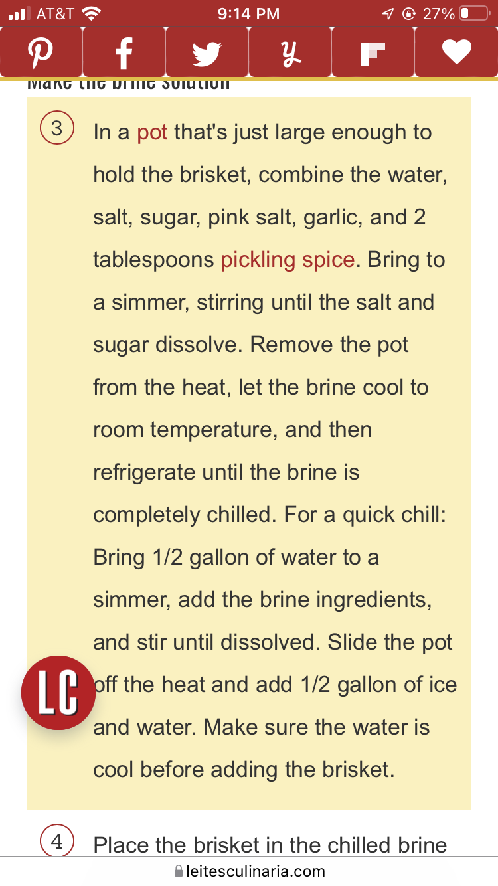

# Corned beef

`corned beef` `st patricks day` `irish`

[Homemade\_Corned\_Beef\_Recipe\-Leite's\_Culinaria.pdf](./file/Homemade_Corned_Beef_Recipe-Leite's_Culinaria.pdf)

Note: used store\-bought pickling spice supplemented with whole cloves and cinnamon sticks. Would probably keep the cinnamon sticks for the brine in the future but omit them from the slow cooker. 

Used leftovers for Reuben sandwich that was pretty great. 
