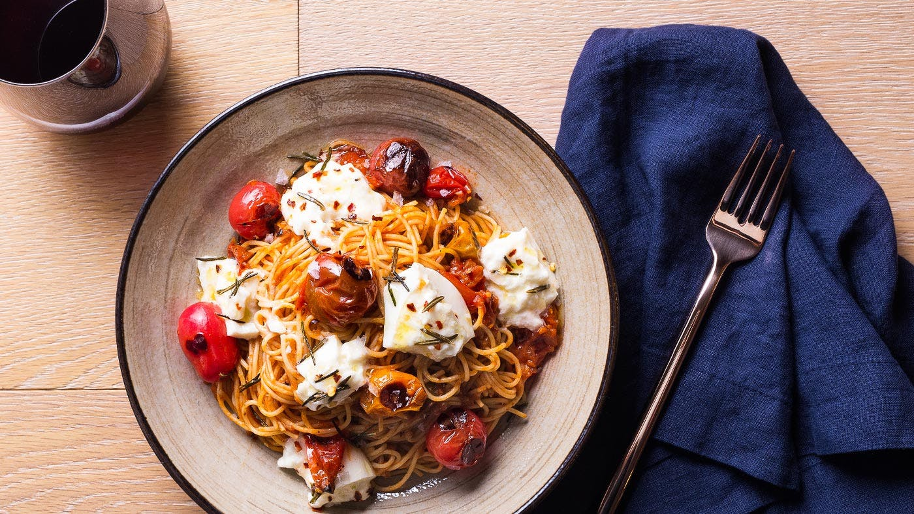
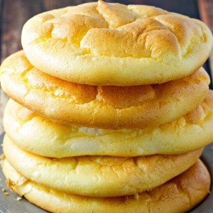
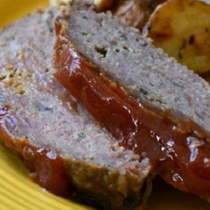
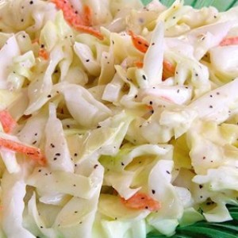
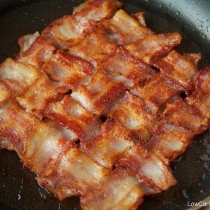
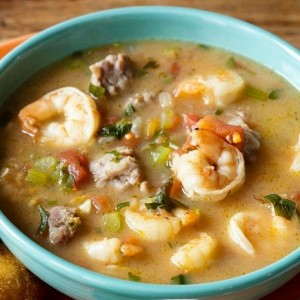
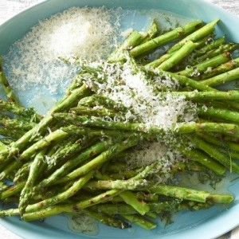
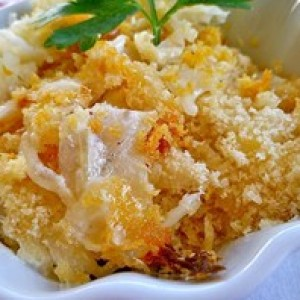

# How to Make Pasta with Charred Tomatoes and Burrata

 

 
[LOGIN | SIGN UP](https://www.tastingtable.com/login.htm) 

- [Categories](https://www.tastingtable.com/cook/recipes/charred-tomato-burrata-rosemary-oil-pasta-recipe)
    - [Eat](https://www.tastingtable.com/eat)
    - [Drink](https://www.tastingtable.com/drink)
    - [Cook](https://www.tastingtable.com/cook)
    - [Travel](https://www.tastingtable.com/travel)
    - [Entertain](https://www.tastingtable.com/entertain)
- [Topics](https://www.tastingtable.com/topics)
- [News](https://www.tastingtable.com/TTNow)
- [Restaurants](https://www.tastingtable.com/restaurants)
- [Recipes](https://www.tastingtable.com/recipes)
- [City Guides](https://www.tastingtable.com/travel/city-guides)
- [Events](https://www.tastingtable.com/events/guest-chefs)
- [Videos](https://www.tastingtable.com/videos)

  #### Recipes

# Pasta with Charred Tomatoes, Burrata and Rosemary Oil

Seriously, you should really burn your tomatoes
     

 
  

 
  

 
  

 
  

 
 
  2 Reviews  
 
100% would make again 

 

Photo: Rachel Vanni/Tasting Table

  
- 131__
-  __
-  __
-  __
- __
-  __
-  __

 

 By [Kristina Preka](https://www.tastingtable.com/author/kristina-preka)8/26/16

[Save]()

Yes, we know that summer [tomatoes](https://www.tastingtable.com/topic/Tomato-Recipes "Tasting Table") are perfect on their own—but we also like to give ours [a little char](https://www.tastingtable.com/entry_detail/national/17450/How_to_Grill_Vegetables_with_Seamus_Mullen.htm "Tasting Table") every now and then. [Blistering the skin](http://www.bbcgoodfood.com/recipes/1641/charred-tomatoes "BBC Good Food") adds a slightly bitter and smoky quality that can add great complexity to any dish. In this recipe, we use [cherry tomatoes](https://www.tastingtable.com/cook/national/tomato-recipes-tomato-oil-lettuce-entertain-you-restaurants "Tasting Table") to maximize the skin surface area to beautifully blister. When you’re charring them, use high heat, avoid overcrowding the pan and stir the tomatoes as little as possible, flipping only once or twice.

The [tomato sauce](https://www.tastingtable.com/cook/recipes/heirloom-tomato-sauce-recipe-canning-preserving "Tasting Table") is really the star of this dish. It’s both tart and sweet, with a hint of smokiness, which clings to thin strands of al dente angel\-hair pasta. Dots of [fresh burrata](https://www.tastingtable.com/cook/recipes/cherry-tomato-burrata-hand-pies-flaky-cheese-pastry-baking-recipe "Tasting Table") add creaminess, while a fragrant and herbaceous rosemary oil gives the dish a nice contrast.

_Check out our favorite [pasta](https://www.tastingtable.com/topic/Pasta-Recipes "Tasting Table") and_ [_tomato_](https://www.tastingtable.com/topic/Tomato-Recipes "Tasting Table") _recipes._

 ## Pasta with Charred Tomatoes, Burrata and Rosemary Oil

 Recipe from the Tasting Table Test Kitchen

**Yield:** 4 to 6 servings

**Prep Time:** 20 minutes, plus cooling time

**Cook Time:** 50 minutes

**Total Time:** 1 hour and 10 minutes, plus cooling time

 

 

#### Ingredients

**For the Rosemary Oil:**

½ cup olive oil

6 [rosemary sprigs](https://www.tastingtable.com/entry_detail/national/17810/A_Quick_and_Easy_Tip_for_Saving_Leftover_Herbs.htm "Tasting Table")

**For the Charred Tomato Sauce:**

¼ cup olive oil, divided

½ \(6 ounces\) yellow onion, finely diced

2 garlic cloves, minced

3 tablespoons tomato paste

1½ tablespoons light brown sugar

½ teaspoon crushed red pepper flakes

1 pound [heirloom tomatoes](https://www.tastingtable.com/index.htm "Tasting Table"), diced

1½ pounds heirloom cherry tomatoes

**For Assembly:**

1 pound angel\-hair pasta

Charred tomato sauce

Kosher salt and freshly ground black pepper, to taste

8 ounces [burrata](https://www.tastingtable.com/cook/recipes/cherry-tomato-burrata-hand-pies-flaky-cheese-pastry-baking-recipe "Tasting Table"), sliced into 1\-inch pieces

Rosemary oil, for drizzling

Fried rosemary leaves, for garnish

#### Directions

1. Make the [rosemary oil](https://www.tastingtable.com/entry_detail/chefs_recipes/17919/How_to_Make_Burnt_Cinnamon_Orange_and_Rosemary_Infused_Vine.htm "Tasting Table"): In a small saucepan, add the olive oil and rosemary, and bring to a simmer over medium heat. Reduce the heat to low and simmer for 5 minutes. Remove the pan from the heat and allow the rosemary to steep as the oil cools to room temperature. Strain and reserve the oil. Save a few fried rosemary leaves for garnish.

2. Make the charred tomato sauce: In a medium saucepan, heat 2 tablespoons of the olive oil over medium heat. Add the onions and sweat until translucent, 7 minutes. Add the garlic and sweat for 3 minutes. Add the tomato paste, brown sugar and crushed red pepper flakes, and cook until the tomato paste starts to separate and caramelizes, 7 minutes. Add the diced [heirloom](https://www.tastingtable.com/cook/national/where-to-buy-heirloom-seeds-online "Tasting Table") tomatoes and cook over medium heat until the tomatoes begin to break down, 15 minutes.

3. Meanwhile, in a large cast\-iron skillet, heat the remaining 2 tablespoons of olive oil over high heat. Add the [cherry tomatoes](https://www.tastingtable.com/cook/national/tomato-recipes-tomato-oil-lettuce-entertain-you-restaurants "Tasting Table") and cook, rolling every 2 to 3 minutes, until completely charred, 10 minutes. Add the tomato sauce to the skillet and stir to coat.

4. Bring a large pot of salted water to a boil. Cook the angel\-hair pasta until al dente, 4 to 5 minutes. Strain the pasta, reserving ½ cup of the pasta cooking liquid. Add the [pasta](https://www.tastingtable.com/topic/Pasta-Recipes "Tasting Table") to the skillet of sauce with the reserved cooking liquid. Season with salt and pepper, then transfer to a platter. Scatter the burrata over top, then drizzle with rosemary oil, garnish with a few fried rosemary leaves and serve.

HELP OTHER COOKS BY RATING THIS RECIPE
Rate this recipe: 

Would you make this recipe again?

 

##### Tags:

[\#MainDishes](https://www.tastingtable.com/topic/main-course-recipes-main-dish-dinner-ideas)[\#Summer](https://www.tastingtable.com/search?q=%22Summer%22 "Find articles with keyword '#Summer'")[\#Tomato](https://www.tastingtable.com/topic/Tomato-Recipes)[\#Pasta](https://www.tastingtable.com/topic/Pasta-Recipes)[\#Italian](https://www.tastingtable.com/topic/best-italian-food-recipes-homemade-pasta)[\#American](https://www.tastingtable.com/search?q=%22American%22 "Find articles with keyword '#American'")[\#WeeknightMeals](https://www.tastingtable.com/search?q=%22WeeknightMeals%22 "Find articles with keyword '#Weeknight Meals'")[\#Cheese](https://www.tastingtable.com/topic/Cheese-Recipes)[\#Vegetarian](https://www.tastingtable.com/topic/best-vegetarian-recipes-easy-healthy-dinner-recipes)[\#ComfortFood](https://www.tastingtable.com/topic/comfort-food-recipes-mac-and-cheese-potato-recipes-best-casseroles)

Want the inside scoop?

get the latest recipes, news and hacks from tasting table
Recaptcha requires verification

I'm not a robot

reCAPTCHA

[Privacy](https://www.google.com/intl/en/policies/privacy/) \- [Terms](https://www.google.com/intl/en/policies/terms/)

Your information will never be shared with a third party. I accept the [Terms & Conditions](http://tastingtable.com/terms) and [Privacy Policy](http://www.tastingtable.com/faq#privacypolicy) and confirm I am at least 21 years old.

 
-  __
-  __
-  __
- __

 

 

  __
HOT STUFF

[The Cloud Bread Recipe Everyone's Been Asking ForAllrecipes.com](http://www.zergnet.com/i/934560/35266/0/0/0)

[The Meatloaf Recipe That's Going ViralAllrecipes.com](http://www.zergnet.com/i/1434088/35266/0/0/0)

[Super Easy Coleslaw DressingAllrecipes.com](http://www.zergnet.com/i/1533982/35266/0/0/0)

[Everyone's Making These Delicious Lemon BrowniesAllrecipes.com](http://www.zergnet.com/i/709454/35266/0/0/0)

 

 
## More recommended

[**Must\-Have Pantry Essentials to Buy This Season**](https://www.tastingtable.com/cook/national/spring-kitchen-essentials-pantry-bakeware)[](#)[](#)[](#)

[**Spring into These 22 New Cookbooks**](https://www.tastingtable.com/cook/national/best-new-cookbooks-spring)[](#)[](#)[](#)

[**The Latest Cookbook Trend Has Nothing to Do with Food**](https://www.tastingtable.com/cook/national/best-artists-cookbooks)[](#)[](#)[](#)
87 

[**12 Crowd\-Pleasing Sides for Your St. Patrick's Day Feast**](https://www.tastingtable.com/cook/national/sides-corned-beef-vegetables)[](#)[](#)[](#)

[**11 Delicious Ways to Cook and Bake with Guinness**](https://www.tastingtable.com/cook/national/guinness-beer-recipes-chocolate-cake-stew)[](#)[](#)[](#)

[**This Little Magnet Is Changing How You Shop for Groceries**](https://www.tastingtable.com/cook/national/hiku-grocery-shopping-list)[](#)[](#)[](#)

[**9 Irish Coffee\-Inspired Desserts Better than the Real Thing**](https://www.tastingtable.com/cook/national/irish-coffee-dessert-recipes)[](#)[](#)[](#)
60 

[**8 Pie Recipes from Martha, Ina, Alton and Other Celebrity Chefs**](https://www.tastingtable.com/cook/national/celebrate-pi-day-pie-recipes)[](#)[](#)[](#)
158 

[**9 Essentials the Voltaggio Brothers Swear By**](https://www.tastingtable.com/cook/national/michael-bryan-voltaggio-essential-kitchen-gear)[](#)[](#)[](#)
329 

[**Molly Yeh's 9 Essential Kitchen Tools**](https://www.tastingtable.com/cook/national/molly-yeh-cakes-baking-kitchen-tools)[](#)[](#)[](#)
252 

[**Chef Floyd Cardoz Knows a Thing or Two About Taste**](https://www.tastingtable.com/cook/national/t-list-floyd-cardoz-chef-paowalla-essential-gear)[](#)[](#)[](#)
203 

[**Run like a Top Chef**](https://www.tastingtable.com/cook/national/top-chef-richard-blais-olympics-smoothie-recipe-running-gear)[](#)[](#)[](#)
598 

[**Conquer Cooking in the Great Outdoors with Grill Master Tim Love**](https://www.tastingtable.com/cook/national/tim-love-texas-barbecue-chef-camping-gear-best-grill)[](#)[](#)[](#)
244 

[**Burger Fiends, Prepare to Drool All Over This Book**](https://www.tastingtable.com/cook/national/porn-burger-book-mathew-ramsey-cookbook)[](#)[](#)[](#)

[**Salt & Straw Give Us the Scoop on Their Fave Things This Summer**](https://www.tastingtable.com/cook/national/salt-and-straw-guest-editors-picks-ice-cream-maker-gear)[](#)[](#)[](#)
248 

[**Taxes Are Exhausting, Eat Cheesecake Instead**](https://www.tastingtable.com/cook/national/tax-day-2016-easy-weeknight-meals-shakshuka-slow-cooker-recipes)[](#)[](#)[](#)
199 

.

prev

next

[## Monkfish Ragù

Keep Reading](https://www.tastingtable.com/cook/recipes/monkfish-ragu-recipe-pasta-sauce-italian-fish-coperta)

 [**RELATED** Heirloom Tomato Sauce](https://www.tastingtable.com/cook/recipes/heirloom-tomato-sauce-recipe-canning-preserving)

[**RELATED** Pasta with Tomato Sauce and Lemon Ricotta](https://www.tastingtable.com/entry_detail/chefs_recipes/14733/Tomato_ricotta_pasta_lemon.htm)

 ## Around the Web

[7 Clever Cake Mix Hacks That Aren't CakesAllrecipes.com](http://www.zergnet.com/i/1157378/35267/0/0/0)

[This Is How You Should Be Cooking BaconAllrecipes.com](http://www.zergnet.com/i/1013864/35267/0/0/0)

[How to Make Authentic Louisiana GumboAllrecipes.com](http://www.zergnet.com/i/1452827/35267/0/0/0)

[This is the Best Cheese to Use on Homemade PizzaFoxnews.com](http://www.zergnet.com/i/1492464/35267/0/0/0)

[This is How You Should Be Cooking AsparagusAllrecipes.com](http://www.zergnet.com/i/1531213/35267/0/0/0)

[7 Copycat Soups We're Dying To Make At HomeAllrecipes.com](http://www.zergnet.com/i/1433946/35267/0/0/0)

[A New & Delicious Way To Eat CabbageAllrecipes.com](http://www.zergnet.com/i/945929/35267/0/0/0)

[The Only Cocktail You'll Ever NeedLiquor.com](http://www.zergnet.com/i/885684/35267/0/0/0)

[wave\-blue.svg](./file/wave-blue.svg)

Get the Tasting Table newsletterfor adventurous eaters everywhereYour information will never be shared with a third party. I accept the [Terms & Conditions](http://tastingtable.com/terms) and [Privacy Policy](http://www.tastingtable.com/faq#privacypolicy) and confirm I am at least 21 years old.

- ##### Info
    [Contact](http://tastingtable.desk.com/customer/portal/emails/new)[FAQ](https://www.tastingtable.com/faq)[Help](http://tastingtable.assistly.com/)[Advertise](https://www.tastingtable.com/advertise)[Native Advertising](https://www.brandtale.com/tasting-table)[Sweepstakes](https://www.tastingtable.com/sweepstakes)
- ##### Company
    [About](https://www.tastingtable.com/company/about)[Team](https://www.tastingtable.com/company/team)[Press](https://www.tastingtable.com/company/press)[Jobs](https://www.tastingtable.com/company/jobs)
- ##### Account
    [LOGIN | SIGN UP](https://www.tastingtable.com/login.htm)[Unsubscribe](https://www.tastingtable.com/unsubscribe.htm)
- ##### Connect
    [Facebook](http://www.facebook.com/tastingtable)[Twitter](http://twitter.com/tastingtable)[Pinterest](http://pinterest.com/tastingtable/)[Instagram](http://instagram.com/tastingtable)[Google Plus](https://plus.google.com/110187743494478308748/posts)[DINE by Tasting Table](https://bnc.lt/dine_TTfooterwebsite)[Youtube](https://www.youtube.com/c/tastingtable?sub_confirmation=1)[Snapchat](http://www.tastingtable.com/cook/national/tasting-table-snapchat-channel-behind-the-scenes)

  

Tasting Table services genuine editorial. There is no pay for play. [Click here](http://tastingtable.com/faq#editpolicy) for our editorial policy

© 2008–2017 TDT Media Inc. doing business as Tasting Table. All Rights reserved.

[Terms & conditions](https://www.tastingtable.com/terms-conditions)[Privacy policy](http://tastingtable.com/faq#privacypolicy)[Editorial policy](http://tastingtable.com/faq#editpolicy)

 

     Send this to a friend\!

 
  
 
 Who should we send this to?

 Provide up to 2 friends' info:

 
   
  
 
   
  
 
 

Recaptcha requires verification

I'm not a robot

reCAPTCHA

[Privacy](https://www.google.com/intl/en/policies/privacy/) \- [Terms](https://www.google.com/intl/en/policies/terms/)

   

[SEND](#) 
  
 

 
 
 

 

   
