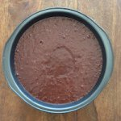

# Moist Chocolate Cake (No Eggs, No Butter) - As Easy As Apple Pie

`Egg Free` `Michael`

[MENU](https://aseasyasapplepie.com/moist-chocolate-cake-no-eggs-no-butter/#)

- [Home](https://aseasyasapplepie.com/)
- [About Me](https://aseasyasapplepie.com/about/)
- [Press](https://aseasyasapplepie.com/press/)
- [Contact](https://aseasyasapplepie.com/contact/)

- Browse Recipes:
- [by Category](https://aseasyasapplepie.com/recipes/)
    - [Appetizers & Snacks](https://aseasyasapplepie.com/category/recipes/appetizers-and-snacks/)
    - [Bread](https://aseasyasapplepie.com/category/recipes/bread/)
    - [Breakfast](https://aseasyasapplepie.com/category/recipes/breakfast/)
    - [Dinner](https://aseasyasapplepie.com/category/recipes/dinner/)
    - [Drinks](https://aseasyasapplepie.com/category/recipes/drinks/)
    - [Desserts](https://aseasyasapplepie.com/category/recipes/dessert/)
    - [Italian Recipes](https://aseasyasapplepie.com/category/recipes/italian-recipes/)
    - [Salads](https://aseasyasapplepie.com/category/recipes/salads/)
    - [Soup](https://aseasyasapplepie.com/category/recipes/soup/)
    - [All Recipes](https://aseasyasapplepie.com/category/recipes/)
    - [Recipe Index](https://aseasyasapplepie.com/recipes/)
- [by Diet](https://aseasyasapplepie.com/category/diet/)
    - [Dairy\-Free](https://aseasyasapplepie.com/category/diet/dairy-free/)
    - [Gluten\-Free](https://aseasyasapplepie.com/category/diet/gluten-free/)
    - [Healthy & Lighten up](https://aseasyasapplepie.com/category/diet/healthy-lighten-up/)
    - [Vegan](https://aseasyasapplepie.com/category/diet/vegan/)
    - [Vegetarian](https://aseasyasapplepie.com/category/diet/vegetarian/)
- [by Season](https://aseasyasapplepie.com/category/seasons/)
    - [Spring](https://aseasyasapplepie.com/category/seasons/spring/)
    - [Summer](https://aseasyasapplepie.com/category/seasons/summer/)
    - [Fall](https://aseasyasapplepie.com/category/seasons/fall/)
    - [Winter](https://aseasyasapplepie.com/category/seasons/winter/)

 
Oct31
# Moist Chocolate Cake \(No Eggs, No Butter\)

_posted by_ Elena ///[319 Comments »](https://aseasyasapplepie.com/moist-chocolate-cake-no-eggs-no-butter/#comments)

[Pin25.56K](https://aseasyasapplepie.com/moist-chocolate-cake-no-eggs-no-butter/)

[Share1.77K](https://www.facebook.com/share.php?u=https://aseasyasapplepie.com/moist-chocolate-cake-no-eggs-no-butter/)

[Yum292](https://www.yummly.com/urb/verify?url=https://aseasyasapplepie.com/moist-chocolate-cake-no-eggs-no-butter/)

[Tweet22](https://twitter.com/intent/tweet?text=A++soft,+moist,+sinfully-delicious+chocolate+cake,+which+is+eggless+and+butterless!+&url=https://aseasyasapplepie.com/moist-chocolate-cake-no-eggs-no-butter/&via=aseasyasapplpie)

[Flip](https://share.flipboard.com/bookmarklet/popout?v=2&title=Tools%20-%20Flipboard&url=https://aseasyasapplepie.com/moist-chocolate-cake-no-eggs-no-butter/)

**27.65K Shares**

[Jump to Recipe](https://aseasyasapplepie.com/moist-chocolate-cake-no-eggs-no-butter/#wprm-recipe-container-12877) [Print Recipe](https://aseasyasapplepie.com/wprm_print/12877)

_A  soft, sinfully\-delicious and moist chocolate cake, which is **eggless and butterless**. Isn’t it wonderful?_

This **moist chocolate cake** is the easiest cake I’ve ever come across. No fuss, no mess: you make it with just a wooden spoon. Be careful not to overmix the batter, otherwise the cake will be dense and heavy.

It’s a great recipe for those with egg sensitivities, or when you crave a good cake and you open the fridge to see you forgot to get eggs. You could never tell that it’s eggless, and the best part is it stays moist even after 3 or 4 days\!

You can use this moist chocolate cake as a basic sponge cake for birthdays, anniversaries, or for any other special occasion. Fill it with whipped cream, chocolate ganache,  jam or keep it plain, with just some powered sugar sprinkled over the top.

This time I used soy milk, but I previously tried it with dairy milk, or half milk and half juice.

I hope you will enjoy it\!

Recipe adapted from [Cookaround](https://forum-ricette.cookaround.com/threads/114697-Torta-al-cioccolato-morbidosissima-e-umida(senza-uova!))

\* For vegan, you can make your own powdered sugar \(recipe [here](https://www.vegankitchenmagick.com/how-to-make-vegan-powdered-sugar/)\)

**You don’t want to bake a cake? Try these [muffins](https://aseasyasapplepie.com/double-chocolate-muffins-no-eggs-no-butter/ "Double Chocolate Muffins (No Eggs, No Butter)")\!**

**Print**

5 from 88 votes

Moist Chocolate Cake\- No Eggs, No Butter
Prep Time:
5 mins

Cook Time:
40 mins

Total Time:
45 mins

 

_Author:_ As Easy As Apple Pie
_Course:_Cake 
_Servings_:11 

_A soft, moist, sinfully\-delicious cake, which is eggless and butterless\! Use two bowls and a wooden spoon to make this easy dessert._

 
Ingredients

- 1 ½ cup \+ 2 tablespoons\(200 grams\)all\-purpose flour_sifted_
- 1 cup\(200 grams\)granulated sugar
- ⅔ cup \+ 1 tablespoon\(75 grams\)unsweetened cocoa powder_sifted_
- 4 teaspoons\(16 grams\)baking powder
- 1 ¾ cup \+ 2 tablespoons\(450 ml\)soy milk or dairy milk
- 2½ tablespoons\(35 grams\)vegetable oil
- 1teaspoonvanilla extract
- powdered sugar for dusting

Instructions

1. Preheat the oven to 160 degrees C \(320 degrees F\).
2. In a large bowl, combine the flour, sugar, cocoa powder, and baking powder.
3. In a separate bowl, whisk the milk, vegetable oil, and vanilla extract.
4. Add the wet ingredients to the dry ingredients and stir with a wooden spoon until just combined.
5. 
6. Don't over\-mix\!
7. 
8. Pour the batter into a greased and floured 22 cm \(8 inch\) pan.
9. 
10. Bake for 40 minutes or until a toothpick inserted in the center comes out clean.
11. Cool the moist chocolate cake on a wire rack and dust with icing sugar before serving.
12. Enjoy it\!

Nutrition Information
_Amount per serving \(89g\)_ — Calories: **202**, Fat: **5g**, Saturated Fat: **1.3g**, Sodium: **24mg**, Carbohydrates: **39g**, Fiber: **3g**, Sugar: **20g**, Protein: **4.6g** 

#### Did you make this recipe?

Leave a comment or share a photo on Instagram with the hashtag [\#aseasyasapplepie](https://www.instagram.com/explore/tags/aseasyasapplepie/). We’d love to see what you come up with\!

_**©As Easy As Apple Pie** owns the copyright on all images and text and does not allow for its original recipes and pictures to be reproduced anywhere other than at this site unless authorization is given._

 

 

[Pin25.56K](https://aseasyasapplepie.com/moist-chocolate-cake-no-eggs-no-butter/)

[Share1.77K](https://www.facebook.com/share.php?u=https://aseasyasapplepie.com/moist-chocolate-cake-no-eggs-no-butter/)

[Yum292](https://www.yummly.com/urb/verify?url=https://aseasyasapplepie.com/moist-chocolate-cake-no-eggs-no-butter/)

[Tweet22](https://twitter.com/intent/tweet?text=A++soft,+moist,+sinfully-delicious+chocolate+cake,+which+is+eggless+and+butterless!+&url=https://aseasyasapplepie.com/moist-chocolate-cake-no-eggs-no-butter/&via=aseasyasapplpie)

[Flip](https://share.flipboard.com/bookmarklet/popout?v=2&title=Tools%20-%20Flipboard&url=https://aseasyasapplepie.com/moist-chocolate-cake-no-eggs-no-butter/)

**27.65K Shares**

_posted in_ [Cakes, Pies & Tarts](https://aseasyasapplepie.com/category/recipes/dessert/cakes-pies-tarts/), [Dairy\-Free](https://aseasyasapplepie.com/category/diet/dairy-free/), [Recipes](https://aseasyasapplepie.com/category/recipes/), [Vegan](https://aseasyasapplepie.com/category/diet/vegan/), [Vegetarian](https://aseasyasapplepie.com/category/diet/vegetarian/) _on_ October 31, 2014
[319 Comments »](https://aseasyasapplepie.com/moist-chocolate-cake-no-eggs-no-butter/#comments)

 [_« Previous Post_Homemade Hamburger Buns](https://aseasyasapplepie.com/homemade-hamburger-buns/)
[_Next Post »_Baked Hasselback Potatoes](https://aseasyasapplepie.com/baked-hasselback-potatoes/)

### You May Also Like:

 [

#### Ginger and Turmeric Carrot Soup](https://aseasyasapplepie.com/ginger-and-turmeric-carrot-soup/ "Ginger and Turmeric Carrot Soup")

 [

#### Nourishing Vegan Buddha Bowl](https://aseasyasapplepie.com/nourishing-vegan-buddha-bowl/ "Nourishing Vegan Buddha Bowl")

 [

#### Banana Peanut Butter Breakfast Muffins](https://aseasyasapplepie.com/banana-peanut-butter-breakfast-muffins/ "Banana Peanut Butter Breakfast Muffins")

 

### Subscribe via Email

## stay updated

 

### 319 comments on “Moist Chocolate Cake \(No Eggs, No Butter\)” 

1. 
    **Healing Tomato** —
    [November 10, 2014 @ 4:57 AM](https://aseasyasapplepie.com/moist-chocolate-cake-no-eggs-no-butter/#comment-607) 
    [Reply](https://aseasyasapplepie.com/moist-chocolate-cake-no-eggs-no-butter/#comment-607) 
    Very delicious recipe. I wish my cakes would turn out this moist\!
    - 
        **[Elena](https://aseasyasapplepie.com/)** —
        [November 11, 2014 @ 3:22 PM](https://aseasyasapplepie.com/moist-chocolate-cake-no-eggs-no-butter/#comment-632) 
        [Reply](https://aseasyasapplepie.com/moist-chocolate-cake-no-eggs-no-butter/#comment-632) 
        Thank you\! 
        - 
            **Nacetta** —
            [July 19, 2016 @ 7:33 PM](https://aseasyasapplepie.com/moist-chocolate-cake-no-eggs-no-butter/#comment-10624) 
            Can i use almond milk instead of soy
        - 
            **[Elena](https://aseasyasapplepie.com/)** —
            [July 20, 2016 @ 2:13 PM](https://aseasyasapplepie.com/moist-chocolate-cake-no-eggs-no-butter/#comment-10668) 
            Yes, you can use soy milk 
        - 
            **nidhi arora** —
            [November 21, 2017 @ 2:11 PM](https://aseasyasapplepie.com/moist-chocolate-cake-no-eggs-no-butter/#comment-20058) 
            Thank you. ……………..
        - 
            **Winter** —
            [March 18, 2017 @ 4:55 PM](https://aseasyasapplepie.com/moist-chocolate-cake-no-eggs-no-butter/#comment-16211) 
            I love it\! I am 10 years old and surprised my m8m. Made it all by myself. Really simple\!
        - 
            **Winter** —
            [March 18, 2017 @ 4:56 PM](https://aseasyasapplepie.com/moist-chocolate-cake-no-eggs-no-butter/#comment-16212) 
            \*\*Meant MOM\*\*
        - 
            **[Elena](https://aseasyasapplepie.com/)** —
            [March 19, 2017 @ 9:31 AM](https://aseasyasapplepie.com/moist-chocolate-cake-no-eggs-no-butter/#comment-16232) 
            That’s fantastic, well done\! I am sure your mom loved it 
        - 
            **robert** —
            [January 12, 2018 @ 4:56 PM](https://aseasyasapplepie.com/moist-chocolate-cake-no-eggs-no-butter/#comment-21233) 
            yes
        - 
            **Paula** —
            [February 15, 2017 @ 3:39 PM](https://aseasyasapplepie.com/moist-chocolate-cake-no-eggs-no-butter/#comment-15201) 
            Love this recipe I swop vanilla to orange flavoring/fresh orange
            All the family love it.thank you
        - 
            **[Elena](https://aseasyasapplepie.com/)** —
            [February 16, 2017 @ 10:15 AM](https://aseasyasapplepie.com/moist-chocolate-cake-no-eggs-no-butter/#comment-15318) 
            I love this cake with orange flavoring. Thank you for your feedback, Paula\! 
        - 
            **Cintia Smith** —
            [September 20, 2017 @ 11:45 AM](https://aseasyasapplepie.com/moist-chocolate-cake-no-eggs-no-butter/#comment-18615) 
            Hi its a brilliant recipe\! I didnt have Vanilla so i added cinnamon to the dry ingredients andna sprinkle of walnuts over the top – magic\! i ve got pics but cant upload them for you, how can i do it?
        - 
            **[Elena](https://aseasyasapplepie.com/)** —
            [September 20, 2017 @ 12:06 PM](https://aseasyasapplepie.com/moist-chocolate-cake-no-eggs-no-butter/#comment-18617) 
            Hi Cintia\! I would love to see your cake. 
             You can upload it on Instagram and tag me, upload it on the [Facebook page](https://web.facebook.com/aseasyasapplepie/), or [email it to me](https://aseasyasapplepie.com/contact/) 
    - 
        **Nicole** —
        [December 31, 2016 @ 8:02 PM](https://aseasyasapplepie.com/moist-chocolate-cake-no-eggs-no-butter/#comment-13888) 
        [Reply](https://aseasyasapplepie.com/moist-chocolate-cake-no-eggs-no-butter/#comment-13888) 
        This cake is delicious\! Please correct the grams on sugar and flour, it does not make any sense\! Thank you \!
        - 
            **[Elena](https://aseasyasapplepie.com/)** —
            [December 31, 2016 @ 8:17 PM](https://aseasyasapplepie.com/moist-chocolate-cake-no-eggs-no-butter/#comment-13890) 
            Hi Nicole\! The ingredients are correct. What doesn’t make sense?
        - 
            **Sophia** —
            [January 15, 2017 @ 3:10 AM](https://aseasyasapplepie.com/moist-chocolate-cake-no-eggs-no-butter/#comment-14202) 
            I saw the same said both sugar and flour are same grams but different in cup. Kinda confuse
        - 
            **[Elena](https://aseasyasapplepie.com/)** —
            [January 15, 2017 @ 8:13 AM](https://aseasyasapplepie.com/moist-chocolate-cake-no-eggs-no-butter/#comment-14208) 
            Density varies from ingredient to ingredient. 1 cup of feathers and 1 cup of stones will not weigh the same even though they have the same volume. The same with ingredients. 1 cup of water= 240 ml 1 cup flour=120 grams 1 cup sugar=200 grams 
        - 
            **Winter** —
            [March 18, 2017 @ 4:59 PM](https://aseasyasapplepie.com/moist-chocolate-cake-no-eggs-no-butter/#comment-16213) 
            It d does convert grams\! Probaly British.
    - 
        **Angela** —
        [September 19, 2017 @ 6:31 PM](https://aseasyasapplepie.com/moist-chocolate-cake-no-eggs-no-butter/#comment-18604) 
        [Reply](https://aseasyasapplepie.com/moist-chocolate-cake-no-eggs-no-butter/#comment-18604) 
        Is this cake sturdy enough to spread frosting on? I noticed you recommended powdered sugar as a topping instead. I am allergic to eggs so I have made a bunch of eggless cakes/cupcakes, so I know that sometimes they can get crumbly or do not want to hold together.
        - 
            **[Elena](https://aseasyasapplepie.com/)** —
            [September 20, 2017 @ 11:57 AM](https://aseasyasapplepie.com/moist-chocolate-cake-no-eggs-no-butter/#comment-18616) 
            Hi Angela\! You can spread frosting on the cake, just make sure that the cake is cold. You can put it in the fridge for a couple of hours or prepare it the night before, wrap it in cling film and refrigerate
2. 
    **Neha** —
    [November 15, 2014 @ 10:24 PM](https://aseasyasapplepie.com/moist-chocolate-cake-no-eggs-no-butter/#comment-662) 
    [Reply](https://aseasyasapplepie.com/moist-chocolate-cake-no-eggs-no-butter/#comment-662) 
    Hey thanks for sharing this recipe. I was just randomly searching for eggless recipes and came across this page..The cake turned out to be really yum\!
    - 
        **[Elena](https://aseasyasapplepie.com/)** —
        [November 16, 2014 @ 9:00 AM](https://aseasyasapplepie.com/moist-chocolate-cake-no-eggs-no-butter/#comment-665) 
        [Reply](https://aseasyasapplepie.com/moist-chocolate-cake-no-eggs-no-butter/#comment-665) 
        You are welcome\! 
         I am glad you enjoyed it\!
3. 
    **Mirjam** —
    [November 23, 2014 @ 8:51 PM](https://aseasyasapplepie.com/moist-chocolate-cake-no-eggs-no-butter/#comment-714) 
    [Reply](https://aseasyasapplepie.com/moist-chocolate-cake-no-eggs-no-butter/#comment-714) 
    Hi\! I used your delicious recipe with some peppermint extract and it was so good\!
    - 
        **[Elena](https://aseasyasapplepie.com/)** —
        [November 23, 2014 @ 9:15 PM](https://aseasyasapplepie.com/moist-chocolate-cake-no-eggs-no-butter/#comment-716) 
        [Reply](https://aseasyasapplepie.com/moist-chocolate-cake-no-eggs-no-butter/#comment-716) 
        Thank you for your feedback Mirjam\!That sounds so so good 
4. 
    **Lisa** —
    [December 1, 2014 @ 4:55 PM](https://aseasyasapplepie.com/moist-chocolate-cake-no-eggs-no-butter/#comment-779) 
    [Reply](https://aseasyasapplepie.com/moist-chocolate-cake-no-eggs-no-butter/#comment-779) 
    Wow\! This cake looks amazing\! How long does it keep for? \(or is it so good that you’ve never had it around long enough to find out?\!\)
    - 
        **[Elena](https://aseasyasapplepie.com/)** —
        [December 1, 2014 @ 5:12 PM](https://aseasyasapplepie.com/moist-chocolate-cake-no-eggs-no-butter/#comment-780) 
        [Reply](https://aseasyasapplepie.com/moist-chocolate-cake-no-eggs-no-butter/#comment-780) 
        Hi Lisa 
         I usually keep it in the fridge for 4 days. You can even freeze it \(sliced\)..no need to defrost it, just put it 30 seconds in the microwave. Let me know if you try it\!
5. 
    **Sofiia** —
    [December 6, 2014 @ 6:18 PM](https://aseasyasapplepie.com/moist-chocolate-cake-no-eggs-no-butter/#comment-833) 
     [Reply](https://aseasyasapplepie.com/moist-chocolate-cake-no-eggs-no-butter/#comment-833) 
    Hi\! Do you think I can substitute vegetable oil with coconut oil? Thanks a lot. Will be baking this today 
    - 
        **Sofiia** —
        [December 6, 2014 @ 6:20 PM](https://aseasyasapplepie.com/moist-chocolate-cake-no-eggs-no-butter/#comment-834) 
        [Reply](https://aseasyasapplepie.com/moist-chocolate-cake-no-eggs-no-butter/#comment-834) 
        Also, can I make it as a pie? You know, pour this mixing into a pie crust and bake all the same?
    - 
        **[Elena](https://aseasyasapplepie.com/)** —
        [December 6, 2014 @ 6:40 PM](https://aseasyasapplepie.com/moist-chocolate-cake-no-eggs-no-butter/#comment-836) 
        [Reply](https://aseasyasapplepie.com/moist-chocolate-cake-no-eggs-no-butter/#comment-836) 
        Hi Sofiia\! 
         Yes, you can substitute the vegetable oil with coconut oil.
        I don’t know if it will work putting it in a pie crust :/ Let me know if you try\!
        - 
            **jeane** —
            [September 4, 2016 @ 2:39 PM](https://aseasyasapplepie.com/moist-chocolate-cake-no-eggs-no-butter/#comment-11205) 
            Would there be anything else you can substitute the oil with? I never have these kind of oils in the kitchen. The only oil I ever have is olive oil and am also not a fan of adding vegetable, coconut oil or so to my baking.
        - 
            **[Elena](https://aseasyasapplepie.com/)** —
            [September 5, 2016 @ 12:52 PM](https://aseasyasapplepie.com/moist-chocolate-cake-no-eggs-no-butter/#comment-11220) 
            Hi Jeane\! I usually use light olive oil… Maybe you can use melted butter?
        - 
            **Natalie** —
            [September 30, 2016 @ 10:16 AM](https://aseasyasapplepie.com/moist-chocolate-cake-no-eggs-no-butter/#comment-11702) 
            I use rice bran oil which is better than blended vege oils etc.
        - 
            **Taberah** —
            [December 18, 2016 @ 11:06 PM](https://aseasyasapplepie.com/moist-chocolate-cake-no-eggs-no-butter/#comment-13601) 
            Applesauce can be used as a direct proportion replacement for oil in recipes. It is a good moist fat free replacement in most baking recipes.
    - 
        **Nikita** —
        [October 17, 2017 @ 5:33 AM](https://aseasyasapplepie.com/moist-chocolate-cake-no-eggs-no-butter/#comment-19194) 
        [Reply](https://aseasyasapplepie.com/moist-chocolate-cake-no-eggs-no-butter/#comment-19194) 
        I used coconut oil and this cake is to die for\!\!\! So moist and dense\!
6. 
    **charles** —
    [January 11, 2015 @ 10:06 PM](https://aseasyasapplepie.com/moist-chocolate-cake-no-eggs-no-butter/#comment-1653) 
    [Reply](https://aseasyasapplepie.com/moist-chocolate-cake-no-eggs-no-butter/#comment-1653) 
    I tried this recipe and it came out excellent. The cake is moist and also delicious.
    Thank you.
    - 
        **[Elena](https://aseasyasapplepie.com/)** —
        [January 12, 2015 @ 8:47 AM](https://aseasyasapplepie.com/moist-chocolate-cake-no-eggs-no-butter/#comment-1663) 
        [Reply](https://aseasyasapplepie.com/moist-chocolate-cake-no-eggs-no-butter/#comment-1663) 
        Thank you for your comment, I love getting feedbacks\!I am glad you enjoyed it 
7. 
    **katie** —
    [February 1, 2015 @ 9:01 PM](https://aseasyasapplepie.com/moist-chocolate-cake-no-eggs-no-butter/#comment-1964) 
    [Reply](https://aseasyasapplepie.com/moist-chocolate-cake-no-eggs-no-butter/#comment-1964) 
    Could I make it without the cocoa powder? What could I use instead?
    - 
        **[Elena](https://aseasyasapplepie.com/)** —
        [February 3, 2015 @ 2:50 PM](https://aseasyasapplepie.com/moist-chocolate-cake-no-eggs-no-butter/#comment-1979) 
        [Reply](https://aseasyasapplepie.com/moist-chocolate-cake-no-eggs-no-butter/#comment-1979) 
        Hi Katie\! you can substitute the cocoa powder with 200 grams of melted chocolate and reduce the sugar to 180/200 grams.
        - 
            **Fatima** —
            [October 25, 2017 @ 8:49 PM](https://aseasyasapplepie.com/moist-chocolate-cake-no-eggs-no-butter/#comment-19383) 
            Can i make this cake using normal milk
        - 
            **[Elena](https://aseasyasapplepie.com/)** —
            [October 25, 2017 @ 11:29 PM](https://aseasyasapplepie.com/moist-chocolate-cake-no-eggs-no-butter/#comment-19387) 
            Sure\! 
8. 
    **Charlotte** —
    [February 5, 2015 @ 9:02 AM](https://aseasyasapplepie.com/moist-chocolate-cake-no-eggs-no-butter/#comment-2021) 
    [Reply](https://aseasyasapplepie.com/moist-chocolate-cake-no-eggs-no-butter/#comment-2021) 
    Wow, this is a delicious cake\! It whipped up quickly and easily, and came out beautifully\! Thank you\!
    - 
        **[Elena](https://aseasyasapplepie.com/)** —
        [February 6, 2015 @ 2:42 PM](https://aseasyasapplepie.com/moist-chocolate-cake-no-eggs-no-butter/#comment-2033) 
        [Reply](https://aseasyasapplepie.com/moist-chocolate-cake-no-eggs-no-butter/#comment-2033) 
        Thank you Charlotte\! I am glad you liked it 
9. 
    **Sarah** —
    [February 8, 2015 @ 4:47 PM](https://aseasyasapplepie.com/moist-chocolate-cake-no-eggs-no-butter/#comment-2060) 
    [Reply](https://aseasyasapplepie.com/moist-chocolate-cake-no-eggs-no-butter/#comment-2060) 
    This cake sounds deelish… will be making it this afternoon. Wonder if I could add grated orange rind to flavour the chocolate mixture? Should I also add the juice of an orange too? If so, roughly how much?
    Have you ever tried cooking in a microwave \(replacing cake tin with a glass or micro\-proof alternative\)?
    I look forward to your response. Thank you x
    - 
        **[Elena](https://aseasyasapplepie.com/)** —
        [February 8, 2015 @ 4:57 PM](https://aseasyasapplepie.com/moist-chocolate-cake-no-eggs-no-butter/#comment-2061) 
        [Reply](https://aseasyasapplepie.com/moist-chocolate-cake-no-eggs-no-butter/#comment-2061) 
        Sarah, I usually add 1 teaspoon grated orange zest and 150 ml \(2/3 cup minus 1 tablespoon\) freshly squeezed orange juice.
        In this case you will add only 300 ml \(1 1/4 cup\) of milk.
        It comes out super delicious\!
        Just remember not to over mix it\! 
        No, I have never tried to cook it in the microwave. Let me know if you try it
10. 
    **Rebekah** —
    [February 21, 2015 @ 11:11 PM](https://aseasyasapplepie.com/moist-chocolate-cake-no-eggs-no-butter/#comment-2332) 
    [Reply](https://aseasyasapplepie.com/moist-chocolate-cake-no-eggs-no-butter/#comment-2332) 
    Mine is in the oven as we speak\! Batter tasted great 
    - 
        **[Elena](https://aseasyasapplepie.com/)** —
        [February 22, 2015 @ 10:25 AM](https://aseasyasapplepie.com/moist-chocolate-cake-no-eggs-no-butter/#comment-2344) 
        [Reply](https://aseasyasapplepie.com/moist-chocolate-cake-no-eggs-no-butter/#comment-2344) 
        Thanks for making this and telling me about it, Rebekah\! By now it’s out of the oven, I hope you enjoyed it 
11. 
    **Pamela** —
    [March 2, 2015 @ 8:37 AM](https://aseasyasapplepie.com/moist-chocolate-cake-no-eggs-no-butter/#comment-2493) 
    [Reply](https://aseasyasapplepie.com/moist-chocolate-cake-no-eggs-no-butter/#comment-2493) 
    Omg super yum thankyou\! Made for my toddler daughter and with coconut milk\!
    - 
        **[Elena](https://aseasyasapplepie.com/)** —
        [March 2, 2015 @ 4:47 PM](https://aseasyasapplepie.com/moist-chocolate-cake-no-eggs-no-butter/#comment-2496) 
        [Reply](https://aseasyasapplepie.com/moist-chocolate-cake-no-eggs-no-butter/#comment-2496) 
        Thank you for your feedback, Pamela\! I am so glad you liked it 
        - 
            **Hadil** —
            [October 14, 2016 @ 12:53 PM](https://aseasyasapplepie.com/moist-chocolate-cake-no-eggs-no-butter/#comment-11898) 
            Hi, this is the best cake recipe i have come to so far… Keep up the good work\!
        - 
            **[Elena](https://aseasyasapplepie.com/)** —
            [October 15, 2016 @ 8:25 AM](https://aseasyasapplepie.com/moist-chocolate-cake-no-eggs-no-butter/#comment-11904) 
            Thank you, Hadil\! I am glad you enjoyed it\! 
12. 
    **akanksha** —
    [March 2, 2015 @ 8:56 AM](https://aseasyasapplepie.com/moist-chocolate-cake-no-eggs-no-butter/#comment-2494) 
    [Reply](https://aseasyasapplepie.com/moist-chocolate-cake-no-eggs-no-butter/#comment-2494) 
    Its an AWESOME cake recipe…….. Thanks a lot for tis recipe…………its awesome….. :\)\)\)\)
    - 
        **[Elena](https://aseasyasapplepie.com/)** —
        [March 2, 2015 @ 4:48 PM](https://aseasyasapplepie.com/moist-chocolate-cake-no-eggs-no-butter/#comment-2497) 
        [Reply](https://aseasyasapplepie.com/moist-chocolate-cake-no-eggs-no-butter/#comment-2497) 
        Thank you for trying this recipe\! I am happy you liked it 
13. 
    **Jhuls | The Not So Creative Cook** —
    [March 9, 2015 @ 12:15 PM](https://aseasyasapplepie.com/moist-chocolate-cake-no-eggs-no-butter/#comment-2696) 
    [Reply](https://aseasyasapplepie.com/moist-chocolate-cake-no-eggs-no-butter/#comment-2696) 
    Hello, Elena. I made your cake and it was indeed moist and delicious. 
     I will give you a pingback once I post in on my blog. 
     Thanks a lot for sharing and have a great week. xx
14. 
    **Amy** —
    [March 10, 2015 @ 8:19 PM](https://aseasyasapplepie.com/moist-chocolate-cake-no-eggs-no-butter/#comment-2721) 
    [Reply](https://aseasyasapplepie.com/moist-chocolate-cake-no-eggs-no-butter/#comment-2721) 
    Cake in the oven as we speak\! Hope it turns out as good as everyone else’s\!
15. 
    **Jia** —
    [March 11, 2015 @ 8:09 AM](https://aseasyasapplepie.com/moist-chocolate-cake-no-eggs-no-butter/#comment-2728) 
    [Reply](https://aseasyasapplepie.com/moist-chocolate-cake-no-eggs-no-butter/#comment-2728) 
    mine is in the oven right now. saw the recipe this morning, got to work. 
16. 
    **Assieh** —
    [March 23, 2015 @ 7:43 AM](https://aseasyasapplepie.com/moist-chocolate-cake-no-eggs-no-butter/#comment-2848) 
    [Reply](https://aseasyasapplepie.com/moist-chocolate-cake-no-eggs-no-butter/#comment-2848) 
    I made your cake as individual cupcakes but the mixture seemed too loose and the cakes collapsed , it was delicious though . I made it with almond meal but followed your recepie except less sugar.. What did I do wrong?
    - 
        **[Elena](https://aseasyasapplepie.com/)** —
        [March 24, 2015 @ 6:08 PM](https://aseasyasapplepie.com/moist-chocolate-cake-no-eggs-no-butter/#comment-2865) 
        [Reply](https://aseasyasapplepie.com/moist-chocolate-cake-no-eggs-no-butter/#comment-2865) 
        Hi\! I wouldn’t recommend replacing the flour with almond meal.
    - 
        **Ayala** —
        [October 20, 2017 @ 11:44 PM](https://aseasyasapplepie.com/moist-chocolate-cake-no-eggs-no-butter/#comment-19261) 
        [Reply](https://aseasyasapplepie.com/moist-chocolate-cake-no-eggs-no-butter/#comment-19261) 
        Does it still work as a cupcake though???
17. 
    **Adriana** —
    [March 29, 2015 @ 4:25 AM](https://aseasyasapplepie.com/moist-chocolate-cake-no-eggs-no-butter/#comment-2914) 
    [Reply](https://aseasyasapplepie.com/moist-chocolate-cake-no-eggs-no-butter/#comment-2914) 
    Elena, I loooved this recipe. At first I was looking for no butter or margarine cakes and when I saw that yours didn’t have any added eggs, It definitely got my attention\! The only thing I didn’t like was the oil part because my aim was to bake something heart friendly.. so I did my research and swapped the oil for avocado puree. At first it sounded weird to me but I gave it a chance, such as I gave it to your recipe. The result was amazing\! You don’t even get to notice the avocado’s flavor. God, I wish I could sent you the photos, the taste was unbelievable, so moist and so deliciuos. My dad got fascinated with it and didn’t believed me when I told him it was made with avocado and no eggs or butter. Next time I’m trying this with fewer sugar or sugar substitutes \(specially, natural ones\) to make it even healthier. Thank you so much for sharing and don’t doubt to give the avocado a try\!
    - 
        **[Elena](https://aseasyasapplepie.com/)** —
        [March 30, 2015 @ 1:07 AM](https://aseasyasapplepie.com/moist-chocolate-cake-no-eggs-no-butter/#comment-2921) 
        [Reply](https://aseasyasapplepie.com/moist-chocolate-cake-no-eggs-no-butter/#comment-2921) 
        Adriana, that’s really interesting\! How much avocado did you use? 
         I am curious to try as well\!
        - 
            **Adriana** —
            [July 13, 2015 @ 10:41 PM](https://aseasyasapplepie.com/moist-chocolate-cake-no-eggs-no-butter/#comment-4806) 
            I used the same amount of vegetable oil you recommended in the recipe but in avocado \(3 tablespoons\) 
        - 
            **[Elena](https://aseasyasapplepie.com/)** —
            [July 15, 2015 @ 11:14 AM](https://aseasyasapplepie.com/moist-chocolate-cake-no-eggs-no-butter/#comment-4844) 
            That’s great Adriana\! 
18. 
    **Helene** —
     [April 12, 2015 @ 4:47 PM](https://aseasyasapplepie.com/moist-chocolate-cake-no-eggs-no-butter/#comment-3080) 
    [Reply](https://aseasyasapplepie.com/moist-chocolate-cake-no-eggs-no-butter/#comment-3080) 
    I am so happy to have found this recipe. Vegan, simple and very few ingredients and not a lot of oil. I just made this for my husband’s birthday with a few tweaks and it was a success. I doubled the recipe to make a 2\-layer cake with jam in the middle, but I only used 300gr of sugar instead of 400. I used flax milk and added the zest of an orange. I covered it with a mascarpone frosting \(yum\!\). This is now my go\-to recipe.
    - 
        **[Elena](https://aseasyasapplepie.com/)** —
        [April 13, 2015 @ 2:12 PM](https://aseasyasapplepie.com/moist-chocolate-cake-no-eggs-no-butter/#comment-3087) 
        [Reply](https://aseasyasapplepie.com/moist-chocolate-cake-no-eggs-no-butter/#comment-3087) 
        Hi Helene\! I am glad you enjoyed the cake 
         Thank you for letting me know your changes, I will try to reduce the sugar as well next time. The mascarpone frosting sounds delicious\!
19. 
    **Lori** —
    [April 20, 2015 @ 3:07 PM](https://aseasyasapplepie.com/moist-chocolate-cake-no-eggs-no-butter/#comment-3182) 
    [Reply](https://aseasyasapplepie.com/moist-chocolate-cake-no-eggs-no-butter/#comment-3182) 
    Thank you for this recipe\!
    I was in a pinch this weekend to make a cake and I had run out of eggs, but this recipe saved the day\!
    I think I may have over\-mixed a bit, as it made a large dome on the top, but the dome came down as it cooled and it worked out perfectly\! Thank you\!
    - 
        **[Elena](https://aseasyasapplepie.com/)** —
        [April 20, 2015 @ 10:24 PM](https://aseasyasapplepie.com/moist-chocolate-cake-no-eggs-no-butter/#comment-3188) 
        [Reply](https://aseasyasapplepie.com/moist-chocolate-cake-no-eggs-no-butter/#comment-3188) 
        Hi Lori\! Make sure you don’t overmix the cake or it will become too dense. I am glad at the end everything went well 
20. 
    **Jacinta** —
    [May 7, 2015 @ 3:29 PM](https://aseasyasapplepie.com/moist-chocolate-cake-no-eggs-no-butter/#comment-3395) 
    [Reply](https://aseasyasapplepie.com/moist-chocolate-cake-no-eggs-no-butter/#comment-3395) 
    Very good recipe\! Not much mess and very easy to make. It tastes like a chocolate mud cake\!
    - 
        **[Elena](https://aseasyasapplepie.com/)** —
        [May 9, 2015 @ 11:43 PM](https://aseasyasapplepie.com/moist-chocolate-cake-no-eggs-no-butter/#comment-3415) 
        [Reply](https://aseasyasapplepie.com/moist-chocolate-cake-no-eggs-no-butter/#comment-3415) 
        Thank you Jacinta\! I am glad you enjoyed it 
21. 
    **reeem** —
    [May 29, 2015 @ 3:17 AM](https://aseasyasapplepie.com/moist-chocolate-cake-no-eggs-no-butter/#comment-3789) 
    [Reply](https://aseasyasapplepie.com/moist-chocolate-cake-no-eggs-no-butter/#comment-3789) 
    it looks great i will definetly try it \! 
    but can i use apple sauce instead of sugar in this recipe ?
    - 
        **[Elena](https://aseasyasapplepie.com/)** —
        [May 30, 2015 @ 11:27 AM](https://aseasyasapplepie.com/moist-chocolate-cake-no-eggs-no-butter/#comment-3826) 
        [Reply](https://aseasyasapplepie.com/moist-chocolate-cake-no-eggs-no-butter/#comment-3826) 
        Hi Reem\! I am not sure about substituting the sugar with applesauce…Let me know if you try it\!
22. 
    **Angie** —
    [June 1, 2015 @ 9:59 PM](https://aseasyasapplepie.com/moist-chocolate-cake-no-eggs-no-butter/#comment-3865) 
    [Reply](https://aseasyasapplepie.com/moist-chocolate-cake-no-eggs-no-butter/#comment-3865) 
    are there any adjustments that you would recommend if making cupcakes instead of a cake?
    - 
        **[Elena](https://aseasyasapplepie.com/)** —
        [June 1, 2015 @ 10:02 PM](https://aseasyasapplepie.com/moist-chocolate-cake-no-eggs-no-butter/#comment-3866) 
        [Reply](https://aseasyasapplepie.com/moist-chocolate-cake-no-eggs-no-butter/#comment-3866) 
        Hi Angie\! I made muffins with the same recipe [https://aseasyasapplepie.com/double\-chocolate\-muffins\-no\-eggs\-no\-butter/](https://aseasyasapplepie.com/double-chocolate-muffins-no-eggs-no-butter/)
23. 
    **Kel Haynes** —
    [June 5, 2015 @ 11:19 PM](https://aseasyasapplepie.com/moist-chocolate-cake-no-eggs-no-butter/#comment-3939) 
    [Reply](https://aseasyasapplepie.com/moist-chocolate-cake-no-eggs-no-butter/#comment-3939) 
    Just made substituted the oil for chilli oil. Very yum
    - 
        **[Elena](https://aseasyasapplepie.com/)** —
        [June 6, 2015 @ 10:31 AM](https://aseasyasapplepie.com/moist-chocolate-cake-no-eggs-no-butter/#comment-3946) 
        [Reply](https://aseasyasapplepie.com/moist-chocolate-cake-no-eggs-no-butter/#comment-3946) 
        Wow, what a great idea\!\!\!\! 
24. 
    **shilpa** —
    [June 28, 2015 @ 12:52 PM](https://aseasyasapplepie.com/moist-chocolate-cake-no-eggs-no-butter/#comment-4299) 
    [Reply](https://aseasyasapplepie.com/moist-chocolate-cake-no-eggs-no-butter/#comment-4299) 
    Hi Elena,
    I tried your chocolate cake . My kid enjoyed a lot. My husband does not like cacao powder. What can i substitute with it? Can i use plain flour more or something else. Please help me out.
    - 
        **[Elena](https://aseasyasapplepie.com/)** —
        [June 28, 2015 @ 1:15 PM](https://aseasyasapplepie.com/moist-chocolate-cake-no-eggs-no-butter/#comment-4300) 
        [Reply](https://aseasyasapplepie.com/moist-chocolate-cake-no-eggs-no-butter/#comment-4300) 
        Hi Shilpa\! You can substitute the cocoa powder with 200 grams of melted chocolate or you can make it white using 280 grams of flour. In both cases I would reduce the sugar to 160/170 grams 
        - 
            **shilpa** —
            [June 30, 2015 @ 11:38 AM](https://aseasyasapplepie.com/moist-chocolate-cake-no-eggs-no-butter/#comment-4329) 
            Thank you so much Elena 
        - 
            **[Elena](https://aseasyasapplepie.com/)** —
            [June 30, 2015 @ 11:49 PM](https://aseasyasapplepie.com/moist-chocolate-cake-no-eggs-no-butter/#comment-4345) 
            You are most welcome\! 
25. 
    **Andy** —
    [June 29, 2015 @ 8:18 PM](https://aseasyasapplepie.com/moist-chocolate-cake-no-eggs-no-butter/#comment-4321) 
    [Reply](https://aseasyasapplepie.com/moist-chocolate-cake-no-eggs-no-butter/#comment-4321) 
    hello Elena,
    I tried your recipe and my cake didn’t gain in volume, I included all the ingredients you mentioned but I don’t know why it didn’t inflate. You think maybe I over\-mixed?
    Thanks
    - 
        **[Elena](https://aseasyasapplepie.com/)** —
        [July 1, 2015 @ 11:03 AM](https://aseasyasapplepie.com/moist-chocolate-cake-no-eggs-no-butter/#comment-4355) 
        [Reply](https://aseasyasapplepie.com/moist-chocolate-cake-no-eggs-no-butter/#comment-4355) 
        Hi Andy\! That’s very strange\! It came out completely flat? Maybe the pan was too big? You used baking powder and not baking soda, right?
26. 
    **Mandy T** —
    [July 17, 2015 @ 4:56 PM](https://aseasyasapplepie.com/moist-chocolate-cake-no-eggs-no-butter/#comment-4869) 
    [Reply](https://aseasyasapplepie.com/moist-chocolate-cake-no-eggs-no-butter/#comment-4869) 
    Thanks for the recipe and it’s really amazinggg. simple and delicious\! May I know if i add bananas, should I reduce the amount of soya milk or cocoa powder like that?
    - 
        **[Elena](https://aseasyasapplepie.com/)** —
        [July 17, 2015 @ 11:11 PM](https://aseasyasapplepie.com/moist-chocolate-cake-no-eggs-no-butter/#comment-4886) 
        [Reply](https://aseasyasapplepie.com/moist-chocolate-cake-no-eggs-no-butter/#comment-4886) 
        Hi Mandy\! I am glad you like the recipe 
        Would you like to add banana slices or mashed banana?
        - 
            **Mandy T** —
            [July 18, 2015 @ 12:12 PM](https://aseasyasapplepie.com/moist-chocolate-cake-no-eggs-no-butter/#comment-4901) 
            i would like to add some mashed banana 
        - 
            **[Elena](https://aseasyasapplepie.com/)** —
            [July 18, 2015 @ 12:26 PM](https://aseasyasapplepie.com/moist-chocolate-cake-no-eggs-no-butter/#comment-4902) 
            I didn’t try but I guess you can replace the oil with mashed banana. I was reading “when modifying a recipe using fruit purees use about half as much of the fruit puree as the total amount of fat called for in the recipe”.
            In the recipe there are only 3 tablespoons of oil, I don’t think it’s really worth it. But if you try…let me know how it goes 
        - 
            **Mandy T** —
            [July 19, 2015 @ 3:03 PM](https://aseasyasapplepie.com/moist-chocolate-cake-no-eggs-no-butter/#comment-4924) 
            Thanks so much for the info\! probably i will give it a try later 
             Looking forward to your easy delicious cake recipes\!\!
        - 
            **[Elena](https://aseasyasapplepie.com/)** —
            [July 20, 2015 @ 3:47 PM](https://aseasyasapplepie.com/moist-chocolate-cake-no-eggs-no-butter/#comment-4931) 
            You are welcome\! 
27. 
    **rotem** —
    [July 29, 2015 @ 3:40 PM](https://aseasyasapplepie.com/moist-chocolate-cake-no-eggs-no-butter/#comment-5177) 
    [Reply](https://aseasyasapplepie.com/moist-chocolate-cake-no-eggs-no-butter/#comment-5177) 
    i tasted the raw batter and it was soo good, ended up eating tho whole batter raw.. lol
    - 
        **[Elena](https://aseasyasapplepie.com/)** —
        [July 29, 2015 @ 11:23 PM](https://aseasyasapplepie.com/moist-chocolate-cake-no-eggs-no-butter/#comment-5185) 
        [Reply](https://aseasyasapplepie.com/moist-chocolate-cake-no-eggs-no-butter/#comment-5185) 
        LOL\!\!\! At least there are no eggs in the batter….but you had a sugar overdose\! 
28. 
    **Dera** —
    [August 11, 2015 @ 11:07 AM](https://aseasyasapplepie.com/moist-chocolate-cake-no-eggs-no-butter/#comment-5521) 
    [Reply](https://aseasyasapplepie.com/moist-chocolate-cake-no-eggs-no-butter/#comment-5521) 
    hi
    This recipe sounds great\! Just wondering, how will this turn out if I don’t use vanilla? Any substitutions you could recommend? Thanks 
    - 
        **[Elena](https://aseasyasapplepie.com/)** —
        [August 11, 2015 @ 11:19 AM](https://aseasyasapplepie.com/moist-chocolate-cake-no-eggs-no-butter/#comment-5522) 
        [Reply](https://aseasyasapplepie.com/moist-chocolate-cake-no-eggs-no-butter/#comment-5522) 
        Hi Dera\! You can use orange zest or almond extract…any flavoring you prefer or just omit it. My favorite one is grated orange zest 
29. 
    **Karen** —
    [August 14, 2015 @ 10:13 AM](https://aseasyasapplepie.com/moist-chocolate-cake-no-eggs-no-butter/#comment-5630) 
    [Reply](https://aseasyasapplepie.com/moist-chocolate-cake-no-eggs-no-butter/#comment-5630) 
    I love this cake…..
    Googled egg free cakes when I’d promised someone a cake and came to make it and someone had eaten all my eggs\!\!\!
    So glad now…. I make this all the time. It’s simple and tastes delicious. And it’s still moist days later. 
    L O V E. I T \! x
    - 
        **[Elena](https://aseasyasapplepie.com/)** —
        [August 16, 2015 @ 1:10 PM](https://aseasyasapplepie.com/moist-chocolate-cake-no-eggs-no-butter/#comment-5700) 
        [Reply](https://aseasyasapplepie.com/moist-chocolate-cake-no-eggs-no-butter/#comment-5700) 
        Karen don’t you just hate that? It happens to me all the time… I need to make a recipe, open the fridge and no eggs, no milk, or both\! 
        I am glad you enjoyed the cake 
30. 
    **Julia** —
    [August 20, 2015 @ 4:13 PM](https://aseasyasapplepie.com/moist-chocolate-cake-no-eggs-no-butter/#comment-5830) 
    [Reply](https://aseasyasapplepie.com/moist-chocolate-cake-no-eggs-no-butter/#comment-5830) 
    I’m so glad I found this\!\! I felt like having something sweet last night but there were no eggs or butter which I usually use for baking… This was the first search result on google and I chose it.
    So I had no eggs or butter, also no milk or wheat flour but I replaced milk with water and wheat flour with rye and potato flour \(half and half\) and the cake became sooo delicious. Just as good as any other cake I’ve made using eggs and butter and doesn’t leave you feeling nauseous after the first piece. Thank you so much, this has gained its place in my recipe book already.
    - 
        **[Elena](https://aseasyasapplepie.com/)** —
        [August 23, 2015 @ 8:07 PM](https://aseasyasapplepie.com/moist-chocolate-cake-no-eggs-no-butter/#comment-5925) 
        [Reply](https://aseasyasapplepie.com/moist-chocolate-cake-no-eggs-no-butter/#comment-5925) 
        Hi Julia\! I am so happy that you liked the cake. Thank you for your beautiful comment, I always appreciate feedbacks 
31. 
    **ILONA** —
    [August 24, 2015 @ 10:36 PM](https://aseasyasapplepie.com/moist-chocolate-cake-no-eggs-no-butter/#comment-5944) 
    [Reply](https://aseasyasapplepie.com/moist-chocolate-cake-no-eggs-no-butter/#comment-5944) 
    I tried this cake recipe as I had huge craving for chocolate cake but had no eggs or butter to make sponge or brownie…it turned out to be a huge disappointment…. I accurately measured everything and did everything by instructions….it was dense and tasted like rubber tire… it took at least 1 hour and 30 minutes to bake on 160 degrees. overall would never recommended and rather by cheap cake in a doggy corner shop. 
    can give any stars as it was that dissapointing
    - 
        **[Elena](https://aseasyasapplepie.com/)** —
        [August 25, 2015 @ 11:00 PM](https://aseasyasapplepie.com/moist-chocolate-cake-no-eggs-no-butter/#comment-5971) 
        [Reply](https://aseasyasapplepie.com/moist-chocolate-cake-no-eggs-no-butter/#comment-5971) 
        Hi Ilona, I am sorry this recipe didn’t work out for you. If it was dense I think that you overmixed it….I am not sure how a rubber tire taste as I have never had the pleasure to try one 
        I am also surprised that it took so long to cook. Did you cook it at 160 degrees C or F? Did you preheat the oven?
32. 
    **Duckie** —
    [August 26, 2015 @ 7:20 PM](https://aseasyasapplepie.com/moist-chocolate-cake-no-eggs-no-butter/#comment-6017) 
    [Reply](https://aseasyasapplepie.com/moist-chocolate-cake-no-eggs-no-butter/#comment-6017) 
    Hi, can I also use buttermilk or almond milk?
    - 
        **[Elena](https://aseasyasapplepie.com/)** —
        [August 26, 2015 @ 7:45 PM](https://aseasyasapplepie.com/moist-chocolate-cake-no-eggs-no-butter/#comment-6020) 
        [Reply](https://aseasyasapplepie.com/moist-chocolate-cake-no-eggs-no-butter/#comment-6020) 
        Hi, yes you can use almond milk. I have never tried it with buttermilk but I am sure it will be fine as well
33. 
    **Chelsey** —
    [August 27, 2015 @ 3:33 PM](https://aseasyasapplepie.com/moist-chocolate-cake-no-eggs-no-butter/#comment-6055) 
     [Reply](https://aseasyasapplepie.com/moist-chocolate-cake-no-eggs-no-butter/#comment-6055) 
    Had no eggs in but really wanted to make a cake\! Come across this and it’s currently in the oven\! Can’t wait to try it because it smells lovely thank you\!\! X
    - 
        **[Elena](https://aseasyasapplepie.com/)** —
        [August 29, 2015 @ 8:13 PM](https://aseasyasapplepie.com/moist-chocolate-cake-no-eggs-no-butter/#comment-6138) 
        [Reply](https://aseasyasapplepie.com/moist-chocolate-cake-no-eggs-no-butter/#comment-6138) 
        Enjoy it\! 
34. 
    **Mallory** —
    [September 3, 2015 @ 11:10 PM](https://aseasyasapplepie.com/moist-chocolate-cake-no-eggs-no-butter/#comment-6350) 
    [Reply](https://aseasyasapplepie.com/moist-chocolate-cake-no-eggs-no-butter/#comment-6350) 
    I tried this recipe, I had run out of eggs and decided to try this. It came out great, i used a teaspoon more cocoa, and my husband loved it. \(we are not vegetarians either\) good thing i used my 8×8 glass pyrex dish because its deeper. The cake came out taller than what you have pictured. about double and a half more than whats pictured, i dont know if it was the glass pan or the fact i have a gas oven. Thanks for the recipe.
35. 
    **Patricia Hague** —
    [September 8, 2015 @ 8:40 PM](https://aseasyasapplepie.com/moist-chocolate-cake-no-eggs-no-butter/#comment-6492) 
    [Reply](https://aseasyasapplepie.com/moist-chocolate-cake-no-eggs-no-butter/#comment-6492) 
    This is an amazing recipe\! I just had a reunion weekend with college friends, and their son high highly allergic to eggs. At 15 months old, it is a huge bummer because finding a good no egg cake is hard so he missed out on his birthday. I made this cake with coconut milk \(as he is lactose intolerant too\), and it was amazing\! Fantastic flavor, super easy to make, and the best part was this little boy shoving it in his face. Truly wonderful. 
    - 
        **[Elena](https://aseasyasapplepie.com/)** —
        [September 9, 2015 @ 5:19 AM](https://aseasyasapplepie.com/moist-chocolate-cake-no-eggs-no-butter/#comment-6500) 
        [Reply](https://aseasyasapplepie.com/moist-chocolate-cake-no-eggs-no-butter/#comment-6500) 
        Patricia I am glad you liked the recipe. Thank you for the feedback 
36. 
    **Kinssashinness** —
    [September 21, 2015 @ 9:40 AM](https://aseasyasapplepie.com/moist-chocolate-cake-no-eggs-no-butter/#comment-6853) 
    [Reply](https://aseasyasapplepie.com/moist-chocolate-cake-no-eggs-no-butter/#comment-6853) 
    Hey, I baked this cake on few hours ago. Yap\! Super moisture and soft. Best of the best eggless chocolate cake. Here is my problem, I used melted chocolate instead of cocoa powde for this cake. I so confused which step to add in the melted chocolate. Should add into the mixture after step 6 or mix wth the wet ingredients on step 3. Pls help , I still a newbie on baking. Thank.
    - 
        **[Elena](https://aseasyasapplepie.com/)** —
        [September 21, 2015 @ 1:16 PM](https://aseasyasapplepie.com/moist-chocolate-cake-no-eggs-no-butter/#comment-6860) 
        [Reply](https://aseasyasapplepie.com/moist-chocolate-cake-no-eggs-no-butter/#comment-6860) 
        Hi\! I woud add the melted chocolate to the milk \(to the wet ingredients\).
        - 
            **Kinssashinness** —
            [September 24, 2015 @ 8:37 AM](https://aseasyasapplepie.com/moist-chocolate-cake-no-eggs-no-butter/#comment-6926) 
            Sorry again, once I pour in the melted chocolate to the milk mixture, the mixture quickly covered with many chocolate lumps. So I put the mixture into the microwave heat for a minutes for a smooth mixture. Should I used hot milk mix with melted chocolate? Thanks again.
        - 
            **[Elena](https://aseasyasapplepie.com/)** —
            [September 24, 2015 @ 11:13 AM](https://aseasyasapplepie.com/moist-chocolate-cake-no-eggs-no-butter/#comment-6933) 
            Maybe the milk was too cold. Try this way: warm the milk in a pan over medium heat and stir in the chocolate. Continue to stir until the chocolate has melted into the milk 
        - 
            **KinssaShinness** —
            [September 25, 2015 @ 3:52 PM](https://aseasyasapplepie.com/moist-chocolate-cake-no-eggs-no-butter/#comment-6955) 
            Ok, noted it. Thanks, Elena. 
        - 
            **[Elena](https://aseasyasapplepie.com/)** —
            [September 28, 2015 @ 5:30 AM](https://aseasyasapplepie.com/moist-chocolate-cake-no-eggs-no-butter/#comment-7019) 
            You are welcome\! 
37. 
    **lara** —
    [September 23, 2015 @ 4:58 PM](https://aseasyasapplepie.com/moist-chocolate-cake-no-eggs-no-butter/#comment-6911) 
    [Reply](https://aseasyasapplepie.com/moist-chocolate-cake-no-eggs-no-butter/#comment-6911) 
    I make this chocolate cake lots of time now and is very easy and really yummy.
    I’m planning to make it for my daughter bday \(she loves it\), just wondering if is sturd enough to hold some rolled icing…?\!?
    - 
        **[Elena](https://aseasyasapplepie.com/)** —
        [September 24, 2015 @ 11:07 AM](https://aseasyasapplepie.com/moist-chocolate-cake-no-eggs-no-butter/#comment-6932) 
        [Reply](https://aseasyasapplepie.com/moist-chocolate-cake-no-eggs-no-butter/#comment-6932) 
        Hi Lara\! Several people covered this cake with [icing](http://www.cookaround.com/yabbse1/showthread.php?t=114697) 
        Let me know how it goes and happy birthday to your daughter\! 
38. 
    **Emily** —
    [September 23, 2015 @ 5:14 PM](https://aseasyasapplepie.com/moist-chocolate-cake-no-eggs-no-butter/#comment-6912) 
    [Reply](https://aseasyasapplepie.com/moist-chocolate-cake-no-eggs-no-butter/#comment-6912) 
    I am planning to make a wedding cake and i will be making the cake base around a month or so in advance. I am wondering if this recipe freezes well? I can’t wait to try it but I am worried it might become dry?
    - 
        **[Elena](https://aseasyasapplepie.com/)** —
        [September 24, 2015 @ 11:18 AM](https://aseasyasapplepie.com/moist-chocolate-cake-no-eggs-no-butter/#comment-6934) 
        [Reply](https://aseasyasapplepie.com/moist-chocolate-cake-no-eggs-no-butter/#comment-6934) 
        Hi Emily\! I always freeze it, it should be ok. Why don’t you make a mini cake or [muffins](https://aseasyasapplepie.com/double-chocolate-muffins-no-eggs-no-butter/) as a trial and freeze it for a week?
        Alternatively you can try the [Italian sponge cake](https://aseasyasapplepie.com/italian-sponge-cake-pan-di-spagna/) \(I can give you the chocolate version if you are interested\).
        - 
            **Emily** —
            [September 24, 2015 @ 6:59 PM](https://aseasyasapplepie.com/moist-chocolate-cake-no-eggs-no-butter/#comment-6939) 
            thank you so much for the recipe. I am afraid I need a recipe with no eggs. I know cakes made with oil are very moist but I am a little worried about the no eggs part.Nonetheless, I will give this a try and keep you updated. Thank you so much once again.
        - 
            **[Elena](https://aseasyasapplepie.com/)** —
            [September 28, 2015 @ 5:31 AM](https://aseasyasapplepie.com/moist-chocolate-cake-no-eggs-no-butter/#comment-7020) 
            You are welcome, Emily\! 
        - 
            **Vikki** —
            [November 29, 2015 @ 10:13 PM](https://aseasyasapplepie.com/moist-chocolate-cake-no-eggs-no-butter/#comment-8279) 
            Hi i have made this cake \(well it is in the oven\) is the nutritional information you have given per 11th of a cake ? I need to know as my son is diabetic.
            Thanks
            Vikki
        - 
            **[Elena](https://aseasyasapplepie.com/)** —
            [November 29, 2015 @ 11:29 PM](https://aseasyasapplepie.com/moist-chocolate-cake-no-eggs-no-butter/#comment-8280) 
            Hi Vikki\! The nutritional informations are for a slice of cake that weighs approximately 89 grams \(3.13 ounces\). Maybe for your son there is too much sugar…
39. 
    **Deanna** —
    [September 28, 2015 @ 12:33 AM](https://aseasyasapplepie.com/moist-chocolate-cake-no-eggs-no-butter/#comment-7005) 
    [Reply](https://aseasyasapplepie.com/moist-chocolate-cake-no-eggs-no-butter/#comment-7005) 
    I don’t have baking powder but I have baking soda can I exchange or substitute
    - 
        **[Elena](https://aseasyasapplepie.com/)** —
        [September 28, 2015 @ 5:22 AM](https://aseasyasapplepie.com/moist-chocolate-cake-no-eggs-no-butter/#comment-7015) 
        [Reply](https://aseasyasapplepie.com/moist-chocolate-cake-no-eggs-no-butter/#comment-7015) 
        You can make your own baking powder: mix one part baking soda and two parts cream of tartar. For 4 teaspoons of baking powder, use 1 1/2 teaspoon of baking soda, mixed in with 3 teaspoons of cream of tartar.
40. 
    **Brigitta** —
    [September 28, 2015 @ 2:08 AM](https://aseasyasapplepie.com/moist-chocolate-cake-no-eggs-no-butter/#comment-7010) 
    [Reply](https://aseasyasapplepie.com/moist-chocolate-cake-no-eggs-no-butter/#comment-7010) 
    Hi Elena, I’m trying this for my son’s 4th birthday\! Do you possibly have any suggestions for replacing the sugar? Rice syrup maybe? Maple syrup? I’m guessing they will give the cake a different texture…?
    - 
        **[Elena](https://aseasyasapplepie.com/)** —
        [September 28, 2015 @ 5:28 AM](https://aseasyasapplepie.com/moist-chocolate-cake-no-eggs-no-butter/#comment-7017) 
        [Reply](https://aseasyasapplepie.com/moist-chocolate-cake-no-eggs-no-butter/#comment-7017) 
        Hi Brigitta\! Yes, the cake will have a different texture..If you want to replace it with honey, use 160 grams. Maybe it’s better that you make a small cake \(half portion\) as a trial before your son’s birthday. Let me know how it goes 
        - 
            **Brigitta** —
            [September 28, 2015 @ 2:23 PM](https://aseasyasapplepie.com/moist-chocolate-cake-no-eggs-no-butter/#comment-7030) 
            Hi Elena, excellent suggestion – on my way to the kitchen right now 
41. 
    **Brigitta** —
    [September 28, 2015 @ 2:48 PM](https://aseasyasapplepie.com/moist-chocolate-cake-no-eggs-no-butter/#comment-7031) 
    [Reply](https://aseasyasapplepie.com/moist-chocolate-cake-no-eggs-no-butter/#comment-7031) 
    In the oven as we speak\! The batter tasted delicious 
    - 
        **[Elena](https://aseasyasapplepie.com/)** —
        [September 28, 2015 @ 4:12 PM](https://aseasyasapplepie.com/moist-chocolate-cake-no-eggs-no-butter/#comment-7034) 
        [Reply](https://aseasyasapplepie.com/moist-chocolate-cake-no-eggs-no-butter/#comment-7034) 
        I am waiting for the result 
42. 
    **kiris** —
    [October 8, 2015 @ 11:39 PM](https://aseasyasapplepie.com/moist-chocolate-cake-no-eggs-no-butter/#comment-7221) 
    [Reply](https://aseasyasapplepie.com/moist-chocolate-cake-no-eggs-no-butter/#comment-7221) 
    Hi;
    How can I make this cake without chocolate
    Thanks
    - 
        **[Elena](https://aseasyasapplepie.com/)** —
        [October 9, 2015 @ 12:57 PM](https://aseasyasapplepie.com/moist-chocolate-cake-no-eggs-no-butter/#comment-7247) 
        [Reply](https://aseasyasapplepie.com/moist-chocolate-cake-no-eggs-no-butter/#comment-7247) 
        Hi Kiris\! To make the cake without chocolate:
        280 grams \(2 1/3 cups\) all\-purpose flour, 180 grams \(3/4 cup \+ 2 tablespoons\) granulated sugar, 35 grams \(3 tablespoons\) vegetable oil, 450 ml \(1¾ cup\+2 tablespoons\) soy milk or dairy milk, 16 grams \(4 teaspoons\) baking powder, 1 teaspoon vanilla extract \(or any other flavoring\). The procedure is the same\! 
43. 
    **Mera** —
    [October 23, 2015 @ 10:24 PM](https://aseasyasapplepie.com/moist-chocolate-cake-no-eggs-no-butter/#comment-7654) 
    [Reply](https://aseasyasapplepie.com/moist-chocolate-cake-no-eggs-no-butter/#comment-7654) 
    Hello Elena,
    I wanted to tell you i did your cake today and it was amazing my fam loved it and it was really easy to make plus the pictures you posted\-after each step made easier that i was on the right track cant wait to try more of you cakes
    Thanks
    - 
        **[Elena](https://aseasyasapplepie.com/)** —
        [October 24, 2015 @ 9:34 AM](https://aseasyasapplepie.com/moist-chocolate-cake-no-eggs-no-butter/#comment-7661) 
        [Reply](https://aseasyasapplepie.com/moist-chocolate-cake-no-eggs-no-butter/#comment-7661) 
        Hi Mera\! Thank you for your feedback, I am so glad your family enjoyed the cake. 
44. 
     **Hazelle** —
    [November 8, 2015 @ 10:24 PM](https://aseasyasapplepie.com/moist-chocolate-cake-no-eggs-no-butter/#comment-7916) 
    [Reply](https://aseasyasapplepie.com/moist-chocolate-cake-no-eggs-no-butter/#comment-7916) 
    Just made this recipe, had no eggs or butter and couldnt be bothered to go shop\! Its in the oven as we speak \!\!
    - 
        **[Elena](https://aseasyasapplepie.com/)** —
        [November 10, 2015 @ 2:10 PM](https://aseasyasapplepie.com/moist-chocolate-cake-no-eggs-no-butter/#comment-7941) 
        [Reply](https://aseasyasapplepie.com/moist-chocolate-cake-no-eggs-no-butter/#comment-7941) 
        How did it go? 
45. 
    **ANU** —
    [November 13, 2015 @ 7:50 AM](https://aseasyasapplepie.com/moist-chocolate-cake-no-eggs-no-butter/#comment-7997) 
    [Reply](https://aseasyasapplepie.com/moist-chocolate-cake-no-eggs-no-butter/#comment-7997) 
    cam i add pineapple orbutterscotch essence
    - 
        **[Elena](https://aseasyasapplepie.com/)** —
        [November 13, 2015 @ 10:02 PM](https://aseasyasapplepie.com/moist-chocolate-cake-no-eggs-no-butter/#comment-8010) 
        [Reply](https://aseasyasapplepie.com/moist-chocolate-cake-no-eggs-no-butter/#comment-8010) 
        Sure you can\! 
46. 
    **Taylor** —
    [November 15, 2015 @ 9:32 PM](https://aseasyasapplepie.com/moist-chocolate-cake-no-eggs-no-butter/#comment-8040) 
    [Reply](https://aseasyasapplepie.com/moist-chocolate-cake-no-eggs-no-butter/#comment-8040) 
    Will it taste the same without vanilla?
    - 
        **[Elena](https://aseasyasapplepie.com/)** —
        [November 15, 2015 @ 10:49 PM](https://aseasyasapplepie.com/moist-chocolate-cake-no-eggs-no-butter/#comment-8041) 
        [Reply](https://aseasyasapplepie.com/moist-chocolate-cake-no-eggs-no-butter/#comment-8041) 
        Yes, you can use another flavor \(orange zest or almond extract for example\) or omit it 
47. 
    **SITI Wadhihah Athirah** —
    [November 28, 2015 @ 3:30 PM](https://aseasyasapplepie.com/moist-chocolate-cake-no-eggs-no-butter/#comment-8268) 
    [Reply](https://aseasyasapplepie.com/moist-chocolate-cake-no-eggs-no-butter/#comment-8268) 
    It’s really delicious. I use chocolate ganache as my topping on it looks great. My mom said it was good, the same with my dad.
    Thanks for the recipe.
    - 
        **[Elena](https://aseasyasapplepie.com/)** —
        [November 28, 2015 @ 6:02 PM](https://aseasyasapplepie.com/moist-chocolate-cake-no-eggs-no-butter/#comment-8269) 
        [Reply](https://aseasyasapplepie.com/moist-chocolate-cake-no-eggs-no-butter/#comment-8269) 
        I am glad you and your family enjoyed it\! 
48. 
    **Jasmin** —
    [December 15, 2015 @ 11:40 PM](https://aseasyasapplepie.com/moist-chocolate-cake-no-eggs-no-butter/#comment-8493) 
    [Reply](https://aseasyasapplepie.com/moist-chocolate-cake-no-eggs-no-butter/#comment-8493) 
    Hi, 
    To make this cake vegan, could I add Almond milk instead of normal milk? 
    Thanks 
    - 
        **[Elena](https://aseasyasapplepie.com/)** —
        [December 15, 2015 @ 11:51 PM](https://aseasyasapplepie.com/moist-chocolate-cake-no-eggs-no-butter/#comment-8494) 
        [Reply](https://aseasyasapplepie.com/moist-chocolate-cake-no-eggs-no-butter/#comment-8494) 
        Hi Jasmin\! Yes, you can use almond milk 
49. 
    **Priscilla** —
    [December 21, 2015 @ 4:59 AM](https://aseasyasapplepie.com/moist-chocolate-cake-no-eggs-no-butter/#comment-8552) 
    [Reply](https://aseasyasapplepie.com/moist-chocolate-cake-no-eggs-no-butter/#comment-8552) 
    Hi Elena\!\!\!
    After reading all the wonderful comments I can’t wait to try this cake 
    I want to bake it tonight but I don’t have any cocoa powder or chocolate\-the only thing I have is Hershey’s Chocolate Syrup. Do you think that would work?
    Thank you\!\!\!
    - 
        **[Elena](https://aseasyasapplepie.com/)** —
        [December 21, 2015 @ 7:37 AM](https://aseasyasapplepie.com/moist-chocolate-cake-no-eggs-no-butter/#comment-8555) 
        [Reply](https://aseasyasapplepie.com/moist-chocolate-cake-no-eggs-no-butter/#comment-8555) 
        Hi Priscilla\! I don’t think it will work, sorry\! :/
        - 
            **Priscilla** —
            [December 21, 2015 @ 7:26 PM](https://aseasyasapplepie.com/moist-chocolate-cake-no-eggs-no-butter/#comment-8562) 
            Okay\-thank you\!
            I think I’ll just try the no\-chocolate version you gave above. Will it be like a plain yellow cake then?
            Thanks again 
        - 
            **[Elena](https://aseasyasapplepie.com/)** —
            [December 21, 2015 @ 7:58 PM](https://aseasyasapplepie.com/moist-chocolate-cake-no-eggs-no-butter/#comment-8563) 
            Yes, it will be like a yellow cake. You can flavor it with vanilla, almond, orange juice, or with whatever you prefer 
50. 
    **Tehrim** —
    [December 22, 2015 @ 6:51 PM](https://aseasyasapplepie.com/moist-chocolate-cake-no-eggs-no-butter/#comment-8572) 
    [Reply](https://aseasyasapplepie.com/moist-chocolate-cake-no-eggs-no-butter/#comment-8572) 
    I baked it in a firewood kiln an hour ago and it turned out perfectly delicious. Love how the cake is fluffy and moist even without eggs. Now I can bake cakes for my friends who don’t eat eggs. Thank you for this lovely recipe\! 
    - 
        **[Elena](https://aseasyasapplepie.com/)** —
        [December 23, 2015 @ 3:15 PM](https://aseasyasapplepie.com/moist-chocolate-cake-no-eggs-no-butter/#comment-8599) 
        [Reply](https://aseasyasapplepie.com/moist-chocolate-cake-no-eggs-no-butter/#comment-8599) 
        Thank you for your feedback\! I am glad you liked the recipe 
51. 
    **Riya** —
    [January 9, 2016 @ 8:17 AM](https://aseasyasapplepie.com/moist-chocolate-cake-no-eggs-no-butter/#comment-8748) 
    [Reply](https://aseasyasapplepie.com/moist-chocolate-cake-no-eggs-no-butter/#comment-8748) 
    You are a genius\! Thanks for recipe. If I use orange juice, how much should I use.? Thanks again
    - 
        **[Elena](https://aseasyasapplepie.com/)** —
        [January 9, 2016 @ 10:02 AM](https://aseasyasapplepie.com/moist-chocolate-cake-no-eggs-no-butter/#comment-8751) 
        [Reply](https://aseasyasapplepie.com/moist-chocolate-cake-no-eggs-no-butter/#comment-8751) 
        Hi Riya\! You use 450 ml \(1¾ cup\+2 tablespoons\). Let me know how it goes 
        - 
            **Roya** —
            [January 11, 2016 @ 6:53 AM](https://aseasyasapplepie.com/moist-chocolate-cake-no-eggs-no-butter/#comment-8783) 
            Ok thanks
52. 
    **d139nn** — 
    [January 13, 2016 @ 11:00 PM](https://aseasyasapplepie.com/moist-chocolate-cake-no-eggs-no-butter/#comment-8827) 
    [Reply](https://aseasyasapplepie.com/moist-chocolate-cake-no-eggs-no-butter/#comment-8827) 
    Excellent recipe. Utterly lovely, easy to make cake that gave great results and as a boon it freezes really well. Thank you for posting it.
    - 
        **[Elena](https://aseasyasapplepie.com/)** —
        [January 14, 2016 @ 11:41 AM](https://aseasyasapplepie.com/moist-chocolate-cake-no-eggs-no-butter/#comment-8947) 
        [Reply](https://aseasyasapplepie.com/moist-chocolate-cake-no-eggs-no-butter/#comment-8947) 
        I am glad you liked the recipe, thank you for your feedback\! 
53. 
    **Tan** —
    [January 17, 2016 @ 9:33 PM](https://aseasyasapplepie.com/moist-chocolate-cake-no-eggs-no-butter/#comment-8897) 
    [Reply](https://aseasyasapplepie.com/moist-chocolate-cake-no-eggs-no-butter/#comment-8897) 
    I was googling for no eggs chocolate cake recipe and lucky found yours .. Followed the recipe to the T by measuring with the kitchen scale. For my first attempt at chocolate cake \(in fact my first cake ever from scratch without Betty Crocker mix\) , it has turned out nicely .. Quite moist and well baked. My only question is if I can balance the cocoa flavour in the cake with something? It’s a little bitter n strong on cocoa for my family’s taste.. I used 75 gm cocoa and 200 gm castor sugar.. I don’t want to use too much sugar though in frosting it .. Maybe some whipped cream on top to balance the cocoa texture??
    - 
        **[Elena](https://aseasyasapplepie.com/)** —
        [January 17, 2016 @ 9:48 PM](https://aseasyasapplepie.com/moist-chocolate-cake-no-eggs-no-butter/#comment-8898) 
        [Reply](https://aseasyasapplepie.com/moist-chocolate-cake-no-eggs-no-butter/#comment-8898) 
        Hi Tan\! Whipped cream will be perfect. 
        Next time you can reduce the cocoa powder \(maybe to 50 grams\) and replace that amount with flour.
54. 
    **[anandita](http://google+/)** —
    [January 23, 2016 @ 10:40 AM](https://aseasyasapplepie.com/moist-chocolate-cake-no-eggs-no-butter/#comment-8982) 
    [Reply](https://aseasyasapplepie.com/moist-chocolate-cake-no-eggs-no-butter/#comment-8982) 
    Elena
    can i use coffee powder instead of cocoa powder
    - 
        **[Elena](https://aseasyasapplepie.com/)** —
        [January 24, 2016 @ 5:40 AM](https://aseasyasapplepie.com/moist-chocolate-cake-no-eggs-no-butter/#comment-8995) 
        [Reply](https://aseasyasapplepie.com/moist-chocolate-cake-no-eggs-no-butter/#comment-8995) 
        Anandita, no you can’t\!
55. 
    **Luz** —
    [January 26, 2016 @ 9:08 PM](https://aseasyasapplepie.com/moist-chocolate-cake-no-eggs-no-butter/#comment-9032) 
    [Reply](https://aseasyasapplepie.com/moist-chocolate-cake-no-eggs-no-butter/#comment-9032) 
    Hi\!, can I substitute the all\-purpose flour for oat flour?
    - 
        **[Elena](https://aseasyasapplepie.com/)** —
        [January 28, 2016 @ 2:17 PM](https://aseasyasapplepie.com/moist-chocolate-cake-no-eggs-no-butter/#comment-9053) 
        [Reply](https://aseasyasapplepie.com/moist-chocolate-cake-no-eggs-no-butter/#comment-9053) 
        Hi Luz\! I am sorry but I have never tried it with oat flour.
56. 
    **Arpita** —
    [January 28, 2016 @ 11:43 AM](https://aseasyasapplepie.com/moist-chocolate-cake-no-eggs-no-butter/#comment-9050) 
    [Reply](https://aseasyasapplepie.com/moist-chocolate-cake-no-eggs-no-butter/#comment-9050) 
    This recipe looks so, so good\! I’ll try it this weekend\! Just wondering if you cooled the cake in the pan or removed it from the pan?
    - 
        **[Elena](https://aseasyasapplepie.com/)** —
        [January 31, 2016 @ 9:26 AM](https://aseasyasapplepie.com/moist-chocolate-cake-no-eggs-no-butter/#comment-9099) 
        [Reply](https://aseasyasapplepie.com/moist-chocolate-cake-no-eggs-no-butter/#comment-9099) 
        Arpita, let it cool for 10 minutes in the pan then remove it 
57. 
    **shefaali** —
    [February 5, 2016 @ 4:05 AM](https://aseasyasapplepie.com/moist-chocolate-cake-no-eggs-no-butter/#comment-9135) 
    [Reply](https://aseasyasapplepie.com/moist-chocolate-cake-no-eggs-no-butter/#comment-9135) 
    Hi Elena, can I make cake pops from this cake?
    Thank you.
    - 
        **[Elena](https://aseasyasapplepie.com/)** —
        [February 5, 2016 @ 5:24 PM](https://aseasyasapplepie.com/moist-chocolate-cake-no-eggs-no-butter/#comment-9139) 
        [Reply](https://aseasyasapplepie.com/moist-chocolate-cake-no-eggs-no-butter/#comment-9139) 
        Hi Shefaali\! Yes, you can 
58. 
    **Cakemaster** —
    [February 7, 2016 @ 12:43 AM](https://aseasyasapplepie.com/moist-chocolate-cake-no-eggs-no-butter/#comment-9145) 
    [Reply](https://aseasyasapplepie.com/moist-chocolate-cake-no-eggs-no-butter/#comment-9145) 
    Thank you so much\! This recipe was very delicious\! The cake was so moist\!
    - 
        **[Elena](https://aseasyasapplepie.com/)** —
        [February 11, 2016 @ 4:48 PM](https://aseasyasapplepie.com/moist-chocolate-cake-no-eggs-no-butter/#comment-9173) 
        [Reply](https://aseasyasapplepie.com/moist-chocolate-cake-no-eggs-no-butter/#comment-9173) 
        I am glad you liked it\! 
59. 
    **Karen** —
    [February 8, 2016 @ 3:52 AM](https://aseasyasapplepie.com/moist-chocolate-cake-no-eggs-no-butter/#comment-9150) 
    [Reply](https://aseasyasapplepie.com/moist-chocolate-cake-no-eggs-no-butter/#comment-9150) 
    Tried this cake today and it was perfect. I didn’t even have cocoa powder so I used chocolate nesquik and some chocolate syrup instead but it worked. Baked in a loaf pan because for some reason I love cake but don’t own a cake pan. Anyway thanks for the recipe.
    - 
        **[Elena](https://aseasyasapplepie.com/)** —
        [February 11, 2016 @ 4:48 PM](https://aseasyasapplepie.com/moist-chocolate-cake-no-eggs-no-butter/#comment-9174) 
        [Reply](https://aseasyasapplepie.com/moist-chocolate-cake-no-eggs-no-butter/#comment-9174) 
        Thank you for the feedback, Karen\! 
60. 
    **K** —
    [February 23, 2016 @ 8:39 PM](https://aseasyasapplepie.com/moist-chocolate-cake-no-eggs-no-butter/#comment-9258) 
    [Reply](https://aseasyasapplepie.com/moist-chocolate-cake-no-eggs-no-butter/#comment-9258) 
    Your cake looks so yumm…but isn’t 4 teaspoon of baking powder way too much? I read it twice to confirm\! Even the original cookaround recipe says only 1 teaspoon. Please confirm
    - 
        **[Elena](https://aseasyasapplepie.com/)** —
        [February 23, 2016 @ 10:10 PM](https://aseasyasapplepie.com/moist-chocolate-cake-no-eggs-no-butter/#comment-9259) 
        [Reply](https://aseasyasapplepie.com/moist-chocolate-cake-no-eggs-no-butter/#comment-9259) 
        It’s correct, 4 teaspoons. The original recipe says 1 sachet, 1 sachet of Italian baking powder is 16 grams 
        - 
            **Corrine** —
            [June 29, 2016 @ 3:52 AM](https://aseasyasapplepie.com/moist-chocolate-cake-no-eggs-no-butter/#comment-10289) 
            I had my doubts about the 4 teaspoons of baking powder, but I listened to you and used the correct amount, and it came out perfect\! It seems like a really large amount but the cake comes out lovely with it.
61. 
    **[Elena](https://aseasyasapplepie.com/)** —
    [March 14, 2016 @ 9:51 PM](https://aseasyasapplepie.com/moist-chocolate-cake-no-eggs-no-butter/#comment-9393) 
    [Reply](https://aseasyasapplepie.com/moist-chocolate-cake-no-eggs-no-butter/#comment-9393) 
    I am sorry, Natasha\! You can’t steam it 
62. 
    **patti** —
    [March 17, 2016 @ 8:53 AM](https://aseasyasapplepie.com/moist-chocolate-cake-no-eggs-no-butter/#comment-9414) 
    [Reply](https://aseasyasapplepie.com/moist-chocolate-cake-no-eggs-no-butter/#comment-9414) 
    Omg my son tells me at 9 pm he signed me up for cupcakes for tomorrows class party. No eggs in the fridge this recipe is a lifesaver\!\! Probably mentioned above but short on time how long do i bake cupcakes? They are in oven.
    - 
        **[Elena](https://aseasyasapplepie.com/)** —
        [March 17, 2016 @ 8:45 PM](https://aseasyasapplepie.com/moist-chocolate-cake-no-eggs-no-butter/#comment-9423) 
        [Reply](https://aseasyasapplepie.com/moist-chocolate-cake-no-eggs-no-butter/#comment-9423) 
        Hi Patti\! 20 minutes..This is the recipe for the [cupcakes](https://aseasyasapplepie.com/double-chocolate-muffins-no-eggs-no-butter/) 
        How did they turn out?
63. 
    **ari087** —
    [March 18, 2016 @ 7:40 PM](https://aseasyasapplepie.com/moist-chocolate-cake-no-eggs-no-butter/#comment-9422) 
    [Reply](https://aseasyasapplepie.com/moist-chocolate-cake-no-eggs-no-butter/#comment-9422) 
    I made this recipe, but i did not know it was so rich\! I added mini chocolate chips to the top and made a sauce from mixed berries. Everyone thought i spent hours on it\!
    Delicious and rich i loved this recipe\!
    - 
        **[Elena](https://aseasyasapplepie.com/)** —
        [March 18, 2016 @ 8:49 PM](https://aseasyasapplepie.com/moist-chocolate-cake-no-eggs-no-butter/#comment-9425) 
        [Reply](https://aseasyasapplepie.com/moist-chocolate-cake-no-eggs-no-butter/#comment-9425) 
        The mixed berry sauce sounds delicious\! 
64. 
    **Rana** —
    [March 25, 2016 @ 1:02 PM](https://aseasyasapplepie.com/moist-chocolate-cake-no-eggs-no-butter/#comment-9473) 
    [Reply](https://aseasyasapplepie.com/moist-chocolate-cake-no-eggs-no-butter/#comment-9473) 
    Hi Elena, I wish to try this recipe as it looks easy to follow, however, my struggle with cake recipes is when I need to use an alternative ingredient \(my husband does not like sugar or white flour\), would you be able to suggest an alternative ingredient to sugar that will not change the consistency of the cake? I often use banana’s, date sugar, or raw honey. 
    Looking forward to your feedback.
    - 
        **[Elena](https://aseasyasapplepie.com/)** —
        [March 27, 2016 @ 8:42 AM](https://aseasyasapplepie.com/moist-chocolate-cake-no-eggs-no-butter/#comment-9484) 
        [Reply](https://aseasyasapplepie.com/moist-chocolate-cake-no-eggs-no-butter/#comment-9484) 
        Hi Rana\! You could try to substitute the sugar with honey…let me know how it goes\! 
65. 
    **Yvette** —
    [March 27, 2016 @ 7:01 AM](https://aseasyasapplepie.com/moist-chocolate-cake-no-eggs-no-butter/#comment-9483) 
    [Reply](https://aseasyasapplepie.com/moist-chocolate-cake-no-eggs-no-butter/#comment-9483) 
    Just tried recipe and it is so easy to make\! Great\! Thanks\!
    - 
        **[Elena](https://aseasyasapplepie.com/)** —
        [March 27, 2016 @ 8:48 AM](https://aseasyasapplepie.com/moist-chocolate-cake-no-eggs-no-butter/#comment-9485) 
        [Reply](https://aseasyasapplepie.com/moist-chocolate-cake-no-eggs-no-butter/#comment-9485) 
        Thank you for your feedback, Yvette. I am glad you like this recipe\! 
66. 
    **Angel** —
    [April 3, 2016 @ 8:34 PM](https://aseasyasapplepie.com/moist-chocolate-cake-no-eggs-no-butter/#comment-9532) 
    [Reply](https://aseasyasapplepie.com/moist-chocolate-cake-no-eggs-no-butter/#comment-9532) 
    I just did this cake, my daugther has intolerance with milk and eggs, I used almond milk because she is not allowed dairy or soy milk. I followed literally the recipe. The cake is for sure moist, now because I am use to eat normal cake, I didn’t like the taste that much, my daughter loves it, which is the most important, it is her birthday today and I find at least the perfect recipe for her, thank you 
    - 
        **[Elena](https://aseasyasapplepie.com/)** —
        [April 4, 2016 @ 6:07 AM](https://aseasyasapplepie.com/moist-chocolate-cake-no-eggs-no-butter/#comment-9536) 
        [Reply](https://aseasyasapplepie.com/moist-chocolate-cake-no-eggs-no-butter/#comment-9536) 
        Happy Birthday to your daughter, Angel. I am glad she loved it\! 
67. 
    **Deena** —
    [April 8, 2016 @ 6:32 AM](https://aseasyasapplepie.com/moist-chocolate-cake-no-eggs-no-butter/#comment-9557) 
    [Reply](https://aseasyasapplepie.com/moist-chocolate-cake-no-eggs-no-butter/#comment-9557) 
    Loved it\! was super easy to make and really fast to bake. No eggs in the fridge and cake craving..this did just the trick\! Next time I think I’ll top it with some peanut butter or nutella:\)
    - 
        **[Elena](https://aseasyasapplepie.com/)** —
        [April 9, 2016 @ 7:21 AM](https://aseasyasapplepie.com/moist-chocolate-cake-no-eggs-no-butter/#comment-9568) 
        [Reply](https://aseasyasapplepie.com/moist-chocolate-cake-no-eggs-no-butter/#comment-9568) 
        I am so happy to hear the cake turned out well, Deena. Nutella topping sounds like a great idea\! 
68. 
    **Amanda** —
    [April 16, 2016 @ 6:57 AM](https://aseasyasapplepie.com/moist-chocolate-cake-no-eggs-no-butter/#comment-9611) 
    [Reply](https://aseasyasapplepie.com/moist-chocolate-cake-no-eggs-no-butter/#comment-9611) 
    Omg this recipe just saved me from a really long night of pregnancy cravings. I suddenly just HAD to have chocolate cake but we don’t have eggs\! I was about to break down to tears when I found this and realized I have all of these in my house already\! Thank you so much for posting and saving this to\-be momma a night of tears.
    - 
        **[Elena](https://aseasyasapplepie.com/)** —
        [April 18, 2016 @ 7:07 AM](https://aseasyasapplepie.com/moist-chocolate-cake-no-eggs-no-butter/#comment-9629) 
        [Reply](https://aseasyasapplepie.com/moist-chocolate-cake-no-eggs-no-butter/#comment-9629) 
        Don’t forget to save the recipe for when your next chocolate craving hits 
         Congratulations on your pregnancy\!
69. 
    **Tracy** —
    [May 9, 2016 @ 3:54 PM](https://aseasyasapplepie.com/moist-chocolate-cake-no-eggs-no-butter/#comment-9786) 
    [Reply](https://aseasyasapplepie.com/moist-chocolate-cake-no-eggs-no-butter/#comment-9786) 
    Hi Elena, may I know can I replace the veg oil with melted butter?
    - 
        **[Elena](https://aseasyasapplepie.com/)** —
        [May 10, 2016 @ 9:03 AM](https://aseasyasapplepie.com/moist-chocolate-cake-no-eggs-no-butter/#comment-9793) 
        [Reply](https://aseasyasapplepie.com/moist-chocolate-cake-no-eggs-no-butter/#comment-9793) 
        Hi Tracy\! You can use 45 grams \(3 1/4 tablespoons\) of butter 
70. 
    **Meg Emilia** —
    [June 15, 2016 @ 9:57 PM](https://aseasyasapplepie.com/moist-chocolate-cake-no-eggs-no-butter/#comment-10169) 
    [Reply](https://aseasyasapplepie.com/moist-chocolate-cake-no-eggs-no-butter/#comment-10169) 
    Hi\! I’m trying to make this cake last minute for my boyfriend’s birthday as a surprise and realized I don’t baking powder, baking soda, OR cream of tartar\! : / Do you think it will still turn out alright if I leave out the baking powder component? I know it won’t rise the same way, but will it still taste good?
    Thank you if you can help\!\! 
    - 
        **[Elena](https://aseasyasapplepie.com/)** —
        [June 15, 2016 @ 10:05 PM](https://aseasyasapplepie.com/moist-chocolate-cake-no-eggs-no-butter/#comment-10170) 
        [Reply](https://aseasyasapplepie.com/moist-chocolate-cake-no-eggs-no-butter/#comment-10170) 
        Meg, you need baking powder. Go and ask your neighbour\!:\)
        Otherwise, you can make a
        [chocolate sponge cake](https://aseasyasapplepie.com/chocolate-italian-sponge-cake/)
71. 
    **Leibel Goldreich** —
    [June 27, 2016 @ 4:30 PM](https://aseasyasapplepie.com/moist-chocolate-cake-no-eggs-no-butter/#comment-10275) 
    [Reply](https://aseasyasapplepie.com/moist-chocolate-cake-no-eggs-no-butter/#comment-10275) 
    I made this a couple of months ago and am going to make it again today. I meant to leave a comment then, but forgot., Now that I’m looking this up again I see I hadn’t made a comment – so, lol here it is.
     This cake turned out so fluffy and moist that I was shocked at what a good baker I’d become – THANK YOU\! My wife and daughter loved it and were proud of their new baker man of the house. We didn’t eat it all at once so we froze the leftovers in individual portions which later defrosted very well. I do like my sweets a bit sweeter, so next time I’m going to add more sugar, maybe an extra 1/4 cup to start.
     I did make 2 substitutions since we avoid the GMO wheat flour which dominates the shelves of grocery stores here in the USA.
    1. I used the same measure of organic WHITE spelt flour
    2. I used VANILLA Soy milk with the same measurement and ALSO the Vanilla which you called for since I firmly believe that there is no such thing as TOO MUCH Vanilla\!
    - 
        **[Elena](https://aseasyasapplepie.com/)** —
        [June 29, 2016 @ 8:31 AM](https://aseasyasapplepie.com/moist-chocolate-cake-no-eggs-no-butter/#comment-10327) 
        [Reply](https://aseasyasapplepie.com/moist-chocolate-cake-no-eggs-no-butter/#comment-10327) 
        So glad your family loved it, Leibel\! I appreciate your feedback. Happy baking 
72. 
    **Corrine** —
    [June 29, 2016 @ 3:48 AM](https://aseasyasapplepie.com/moist-chocolate-cake-no-eggs-no-butter/#comment-10288) 
    [Reply](https://aseasyasapplepie.com/moist-chocolate-cake-no-eggs-no-butter/#comment-10288) 
    I made this cake today, and it came out AMAZING. Better than any other chocolate cake I’ve ever had. It’s SO moist and delicious, what is this sorcery?\! If anyone is wondering whether to try this one, go for it. It’s absolutely stellar\!
    - 
        **[Elena](https://aseasyasapplepie.com/)** —
        [July 1, 2016 @ 8:20 AM](https://aseasyasapplepie.com/moist-chocolate-cake-no-eggs-no-butter/#comment-10324) 
        [Reply](https://aseasyasapplepie.com/moist-chocolate-cake-no-eggs-no-butter/#comment-10324) 
        I am so glad you enjoyed it, Corinne\!Regarding the baking powder, nearly all Italian recipes use 1 sachet of baking powder. In Italy sachets are 16 grams = 4 teaspoons. 
73. 
    **Grace** —
    [July 6, 2016 @ 6:16 AM](https://aseasyasapplepie.com/moist-chocolate-cake-no-eggs-no-butter/#comment-10384) 
    [Reply](https://aseasyasapplepie.com/moist-chocolate-cake-no-eggs-no-butter/#comment-10384) 
    Mine is in the oven as I type this… I was out of vanilla so I substituted it for equal amount of maple syrup. Hope it turns out as good as yours looks\! Thanks for the recipe\!
74. 
    **Erica** —
    [July 10, 2016 @ 1:10 PM](https://aseasyasapplepie.com/moist-chocolate-cake-no-eggs-no-butter/#comment-10462) 
    [Reply](https://aseasyasapplepie.com/moist-chocolate-cake-no-eggs-no-butter/#comment-10462) 
    I made this cake for the 50 kids and staff at the school I teach at in Thailand\! Butter is not easy to find here,and very expensive. It worked out fine to times the recipe by 5\!
    - 
        **[Elena](https://aseasyasapplepie.com/)** —
        [July 11, 2016 @ 8:47 AM](https://aseasyasapplepie.com/moist-chocolate-cake-no-eggs-no-butter/#comment-10476) 
        [Reply](https://aseasyasapplepie.com/moist-chocolate-cake-no-eggs-no-butter/#comment-10476) 
        That’s great Erica\! So glad you enjoyed it\! 
75. 
    **Jennifer** —
    [July 20, 2016 @ 4:26 AM](https://aseasyasapplepie.com/moist-chocolate-cake-no-eggs-no-butter/#comment-10638) 
    [Reply](https://aseasyasapplepie.com/moist-chocolate-cake-no-eggs-no-butter/#comment-10638) 
    Hi, I’m planing on making this for my sons birthday and am wondering how well it will keep together? I want to make two rounds and cut one in half and stack both pieces on top of the full round \(making it like a dinosaur at the top of a cliff edge.\) I want something moist but won’t fall apart\! Thanks\!
    - 
        **[Elena](https://aseasyasapplepie.com/)** —
        [July 20, 2016 @ 2:18 PM](https://aseasyasapplepie.com/moist-chocolate-cake-no-eggs-no-butter/#comment-10669) 
        [Reply](https://aseasyasapplepie.com/moist-chocolate-cake-no-eggs-no-butter/#comment-10669) 
        Hi Jennifer\! I don’t think it will work…this cake is very moist and soft, I am afraid it will fall apart\!
        Are you looking for a cake without eggs? If not, you can use a [chocolate sponge cake](https://aseasyasapplepie.com/chocolate-italian-sponge-cake/)
76. 
    **Shenaaz** —
    [July 23, 2016 @ 4:43 AM](https://aseasyasapplepie.com/moist-chocolate-cake-no-eggs-no-butter/#comment-10697) 
    [Reply](https://aseasyasapplepie.com/moist-chocolate-cake-no-eggs-no-butter/#comment-10697) 
    Hi Could i cover this cake in fondant?
    - 
        **[Elena](https://aseasyasapplepie.com/)** —
        [July 23, 2016 @ 7:10 AM](https://aseasyasapplepie.com/moist-chocolate-cake-no-eggs-no-butter/#comment-10699) 
        [Reply](https://aseasyasapplepie.com/moist-chocolate-cake-no-eggs-no-butter/#comment-10699) 
        Sure\! 
77. 
    **Jamie** —
    [August 3, 2016 @ 5:02 PM](https://aseasyasapplepie.com/moist-chocolate-cake-no-eggs-no-butter/#comment-10818) 
    [Reply](https://aseasyasapplepie.com/moist-chocolate-cake-no-eggs-no-butter/#comment-10818) 
    I just made it my daughter loved it so am i… Thank you 
    - 
        **[Elena](https://aseasyasapplepie.com/)** —
        [August 3, 2016 @ 9:56 PM](https://aseasyasapplepie.com/moist-chocolate-cake-no-eggs-no-butter/#comment-10824) 
        [Reply](https://aseasyasapplepie.com/moist-chocolate-cake-no-eggs-no-butter/#comment-10824) 
        That’s great, Jamie\! I am glad you like this recipe 
78. 
    **Ivy von Cake** —
    [August 15, 2016 @ 5:56 PM](https://aseasyasapplepie.com/moist-chocolate-cake-no-eggs-no-butter/#comment-10965) 
    [Reply](https://aseasyasapplepie.com/moist-chocolate-cake-no-eggs-no-butter/#comment-10965) 
    I just took this cake out of the oven. It’s delicious\! This is going to be one of my favorites as it is so easy & quick to make.
    Thank you for the recipe. I had to subscribe\!
    - 
        **[Elena](https://aseasyasapplepie.com/)** —
        [August 17, 2016 @ 7:07 AM](https://aseasyasapplepie.com/moist-chocolate-cake-no-eggs-no-butter/#comment-10977) 
        [Reply](https://aseasyasapplepie.com/moist-chocolate-cake-no-eggs-no-butter/#comment-10977) 
        Thank you for subscribing, Ivy\!
        I’m so glad you enjoyed it\! 
79. 
    **hafsa** —
    [August 22, 2016 @ 5:34 PM](https://aseasyasapplepie.com/moist-chocolate-cake-no-eggs-no-butter/#comment-11033) 
    [Reply](https://aseasyasapplepie.com/moist-chocolate-cake-no-eggs-no-butter/#comment-11033) 
    hi, can I use yuorghurt instead of d soy milk?
    - 
        **[Elena](https://aseasyasapplepie.com/)** —
        [August 23, 2016 @ 9:16 AM](https://aseasyasapplepie.com/moist-chocolate-cake-no-eggs-no-butter/#comment-11036) 
        [Reply](https://aseasyasapplepie.com/moist-chocolate-cake-no-eggs-no-butter/#comment-11036) 
        Hi, Hafsa\! Sure, you can use yogurt.
80. 
    **Nitzan** —
    [August 25, 2016 @ 1:15 AM](https://aseasyasapplepie.com/moist-chocolate-cake-no-eggs-no-butter/#comment-11044) 
    [Reply](https://aseasyasapplepie.com/moist-chocolate-cake-no-eggs-no-butter/#comment-11044) 
    Thank you for this amazing recepie\! I made it today and it’s already half gone\!\!\! So good\! 
    - 
        **[Elena](https://aseasyasapplepie.com/)** —
        [August 25, 2016 @ 10:24 AM](https://aseasyasapplepie.com/moist-chocolate-cake-no-eggs-no-butter/#comment-11046) 
        [Reply](https://aseasyasapplepie.com/moist-chocolate-cake-no-eggs-no-butter/#comment-11046) 
        So happy you liked this chocolate cake, Nitzan\!:\)
81. 
    **Calvin** —
    [September 3, 2016 @ 8:51 AM](https://aseasyasapplepie.com/moist-chocolate-cake-no-eggs-no-butter/#comment-11178) 
    [Reply](https://aseasyasapplepie.com/moist-chocolate-cake-no-eggs-no-butter/#comment-11178) 
    I made this cake today, I had only 2 tsp bicarb soda so I added an egg about 1 tblspn margarine instead of oil and it turned out great, the kids and I loved it… and we ate it while it was hot.
    very easy recipe that can be played with a little to suit what ingredients you have…… no shop run cake……Thank you
    - 
        **Calvin** —
        [September 3, 2016 @ 8:52 AM](https://aseasyasapplepie.com/moist-chocolate-cake-no-eggs-no-butter/#comment-11179) 
        [Reply](https://aseasyasapplepie.com/moist-chocolate-cake-no-eggs-no-butter/#comment-11179) 
        oh…. also…. I only had powdered milk…lol
    - 
        **[Elena](https://aseasyasapplepie.com/)** —
        [September 5, 2016 @ 12:43 PM](https://aseasyasapplepie.com/moist-chocolate-cake-no-eggs-no-butter/#comment-11219) 
        [Reply](https://aseasyasapplepie.com/moist-chocolate-cake-no-eggs-no-butter/#comment-11219) 
        Calvin, I am glad you were able to adapt the recipe. Thank you for the feedback\! 
82. 
    **Tania** —
    [September 23, 2016 @ 12:05 PM](https://aseasyasapplepie.com/moist-chocolate-cake-no-eggs-no-butter/#comment-11580) 
    [Reply](https://aseasyasapplepie.com/moist-chocolate-cake-no-eggs-no-butter/#comment-11580) 
    Can you substitute the flour for gluten free flour? So it is day care friendly?
    - 
        **[Elena](https://aseasyasapplepie.com/)** —
        [September 24, 2016 @ 10:21 AM](https://aseasyasapplepie.com/moist-chocolate-cake-no-eggs-no-butter/#comment-11588) 
        [Reply](https://aseasyasapplepie.com/moist-chocolate-cake-no-eggs-no-butter/#comment-11588) 
        Hi Tania\! Yes, you can use gluten free flour 
83. 
    **Arpita** —
    [September 28, 2016 @ 7:34 PM](https://aseasyasapplepie.com/moist-chocolate-cake-no-eggs-no-butter/#comment-11678) 
    [Reply](https://aseasyasapplepie.com/moist-chocolate-cake-no-eggs-no-butter/#comment-11678) 
    SIMPLY WONDERFUL RECIPE
    - 
        **[Elena](https://aseasyasapplepie.com/)** —
        [September 29, 2016 @ 11:30 AM](https://aseasyasapplepie.com/moist-chocolate-cake-no-eggs-no-butter/#comment-11692) 
        [Reply](https://aseasyasapplepie.com/moist-chocolate-cake-no-eggs-no-butter/#comment-11692) 
        Thank you Arpita\! I am glad you enjoyed it\! 
84. 
    **Ugo** —
    [October 9, 2016 @ 11:02 AM](https://aseasyasapplepie.com/moist-chocolate-cake-no-eggs-no-butter/#comment-11837) 
    [Reply](https://aseasyasapplepie.com/moist-chocolate-cake-no-eggs-no-butter/#comment-11837) 
    I’ll try to add some coconut flakes to the mix and sprinkled over the cake. Will post the result
85. 
    **Ugo** —
    [October 9, 2016 @ 6:15 PM](https://aseasyasapplepie.com/moist-chocolate-cake-no-eggs-no-butter/#comment-11840) 
    [Reply](https://aseasyasapplepie.com/moist-chocolate-cake-no-eggs-no-butter/#comment-11840) 
    I had just 200ml soy milk, so I’ve added some water and the end of a yogurt vase. Then I added coconut flakes and put less flour and less sugar.
    The resul t is incredible, still in front of my eyes \(not for much though\)
    Cooking time for me 30 mins
    - 
        **[Elena](https://aseasyasapplepie.com/)** —
        [October 10, 2016 @ 10:25 AM](https://aseasyasapplepie.com/moist-chocolate-cake-no-eggs-no-butter/#comment-11849) 
        [Reply](https://aseasyasapplepie.com/moist-chocolate-cake-no-eggs-no-butter/#comment-11849) 
        I love the addition of coconut flakes\! Thanks for reporting back about the cake, Ugo\!
86. 
    **Avi** —
    [October 15, 2016 @ 8:03 PM](https://aseasyasapplepie.com/moist-chocolate-cake-no-eggs-no-butter/#comment-11910) 
    [Reply](https://aseasyasapplepie.com/moist-chocolate-cake-no-eggs-no-butter/#comment-11910) 
    Hi..I am looking for a small cake . Can I half the ingredients as I have small that is 6inch
    - 
        **[Elena](https://aseasyasapplepie.com/)** —
        [October 16, 2016 @ 8:32 AM](https://aseasyasapplepie.com/moist-chocolate-cake-no-eggs-no-butter/#comment-11919) 
        [Reply](https://aseasyasapplepie.com/moist-chocolate-cake-no-eggs-no-butter/#comment-11919) 
        Hi, Avi\! Yes, you can halve the recipe. Just keep in mind that baking times may be slightly shorter 
87. 
    **Maya** —
    [December 8, 2016 @ 9:47 PM](https://aseasyasapplepie.com/moist-chocolate-cake-no-eggs-no-butter/#comment-13288) 
    [Reply](https://aseasyasapplepie.com/moist-chocolate-cake-no-eggs-no-butter/#comment-13288) 
    Elena\! This cake is out of this world\! Made it at 4am this morning for work and every one loved it. It’s light and fluffy. I reduced the sugar amount to 90gr and made a dairy free ganache with coconut cream and dairy free chocolate. Thank you. 
    [1d22cf05\-a1f3\-4280\-bab9\-55fe48ee4d56.bin](./file/1d22cf05-a1f3-4280-bab9-55fe48ee4d56.bin)
    - 
        **[Elena](https://aseasyasapplepie.com/)** —
        [December 9, 2016 @ 11:17 AM](https://aseasyasapplepie.com/moist-chocolate-cake-no-eggs-no-butter/#comment-13408) 
        [Reply](https://aseasyasapplepie.com/moist-chocolate-cake-no-eggs-no-butter/#comment-13408) 
        Hi Maya\! I’m so glad you enjoyed it. 
         The ganache sounds delicious\!
88. 
    **Dominic** —
    [December 11, 2016 @ 8:05 AM](https://aseasyasapplepie.com/moist-chocolate-cake-no-eggs-no-butter/#comment-13376) 
    [Reply](https://aseasyasapplepie.com/moist-chocolate-cake-no-eggs-no-butter/#comment-13376) 
    Added some chopped up Aero chocolate bars, heaven\! Thanks it was delicious 
    - 
        **[Elena](https://aseasyasapplepie.com/)** —
        [December 12, 2016 @ 11:19 AM](https://aseasyasapplepie.com/moist-chocolate-cake-no-eggs-no-butter/#comment-13409) 
        [Reply](https://aseasyasapplepie.com/moist-chocolate-cake-no-eggs-no-butter/#comment-13409) 
        I am glad you enjoyed it, Dominic\! 
         Thank you for your feedback\!
89. 
    **ikra** —
    [December 25, 2016 @ 12:36 PM](https://aseasyasapplepie.com/moist-chocolate-cake-no-eggs-no-butter/#comment-13729) 
    [Reply](https://aseasyasapplepie.com/moist-chocolate-cake-no-eggs-no-butter/#comment-13729) 
    Hi I was going to make this cake today and I was wondering could I make a plain cake by leaving out the coco powder
    - 
        **[Elena](https://aseasyasapplepie.com/)** —
        [December 26, 2016 @ 9:16 PM](https://aseasyasapplepie.com/moist-chocolate-cake-no-eggs-no-butter/#comment-13747) 
        [Reply](https://aseasyasapplepie.com/moist-chocolate-cake-no-eggs-no-butter/#comment-13747) 
        Hi Ikra\! You can make it white using 280 grams of flour \(2 1/4 cups\+ 1 tablespoon \) and omitting the cocoa powder. You can also reduce the sugar to 160/170 grams \(3/4 cup\+1 tablespoon\) 
90. 
    **Lu** —
    [January 10, 2017 @ 1:46 PM](https://aseasyasapplepie.com/moist-chocolate-cake-no-eggs-no-butter/#comment-14078) 
    [Reply](https://aseasyasapplepie.com/moist-chocolate-cake-no-eggs-no-butter/#comment-14078) 
    I want to thank you because you make easy recipies for cakes and i love them\!
    Grazie mille anche perché usi le cups anziché i grammi.
    A sardinian in Berlin
    - 
        **Lu** —
        [January 10, 2017 @ 1:47 PM](https://aseasyasapplepie.com/moist-chocolate-cake-no-eggs-no-butter/#comment-14079) 
        [Reply](https://aseasyasapplepie.com/moist-chocolate-cake-no-eggs-no-butter/#comment-14079) 
        also thanks because it is vegan\!\!\!
    - 
        **[Elena](https://aseasyasapplepie.com/)** —
        [January 11, 2017 @ 12:53 PM](https://aseasyasapplepie.com/moist-chocolate-cake-no-eggs-no-butter/#comment-14140) 
        [Reply](https://aseasyasapplepie.com/moist-chocolate-cake-no-eggs-no-butter/#comment-14140) 
        Buongiorno Lucia\! 
        Mi fa molto piacere che ti sia piaciuta 
91. 
    **Chanden** —
    [January 21, 2017 @ 10:08 PM](https://aseasyasapplepie.com/moist-chocolate-cake-no-eggs-no-butter/#comment-14417) 
    [Reply](https://aseasyasapplepie.com/moist-chocolate-cake-no-eggs-no-butter/#comment-14417) 
    AHHHH\! Thank you so much for this recipe. I’ve been trying lots of different eggless cake recipes the past week \(and none have really worked\) and this is the ONLY one that has come out beautifully and tasted delicious.
    I’ve been nominated to do an eggless cake for my aunts 60th birthday and was on the cusp of admitting defeat and ordering a professional eggless cake.
    Thanks again for sharing\!\!
    - 
        **[Elena](https://aseasyasapplepie.com/)** —
        [January 23, 2017 @ 1:16 AM](https://aseasyasapplepie.com/moist-chocolate-cake-no-eggs-no-butter/#comment-14447) 
        [Reply](https://aseasyasapplepie.com/moist-chocolate-cake-no-eggs-no-butter/#comment-14447) 
        Hi Chanden\! I am SO glad you liked this cake. Thank you for your feedback\! 
92. 
    **Kani** —
    [February 7, 2017 @ 4:39 PM](https://aseasyasapplepie.com/moist-chocolate-cake-no-eggs-no-butter/#comment-14938) 
    [Reply](https://aseasyasapplepie.com/moist-chocolate-cake-no-eggs-no-butter/#comment-14938) 
    Hi, Thank you so much for this amazing recipe, when I just saw it I immediately ran to kitchen to try it out and guess what\! I love ittt ^\_^
    - 
        **[Elena](https://aseasyasapplepie.com/)** —
        [February 9, 2017 @ 8:36 PM](https://aseasyasapplepie.com/moist-chocolate-cake-no-eggs-no-butter/#comment-15005) 
        [Reply](https://aseasyasapplepie.com/moist-chocolate-cake-no-eggs-no-butter/#comment-15005) 
        I am glad you love it, Kani\! 
93. 
    **Edwina** —
    [February 8, 2017 @ 7:28 AM](https://aseasyasapplepie.com/moist-chocolate-cake-no-eggs-no-butter/#comment-14949) 
    [Reply](https://aseasyasapplepie.com/moist-chocolate-cake-no-eggs-no-butter/#comment-14949) 
    I’m so glad I found your recipe. I need to bake for children and some of them can’t have egg. This cake looks delicious and easy to make \(exactly what I need\!\) and you don’t have any “unusual” ingredients that are hard to find. I have everything in the pantry. I’m going to make it tomorrow. I think I’ll be using this recipe a lot.
94. 
    **Mel** —
    [February 8, 2017 @ 10:09 PM](https://aseasyasapplepie.com/moist-chocolate-cake-no-eggs-no-butter/#comment-14977) 
    [Reply](https://aseasyasapplepie.com/moist-chocolate-cake-no-eggs-no-butter/#comment-14977) 
    Have just discovered this recipe. Thanks so much. Moist yumminess. The only cake I’ve ever baked that I did not fail at\! Yay\!\!
    - 
        **[Elena](https://aseasyasapplepie.com/)** —
        [February 9, 2017 @ 5:02 PM](https://aseasyasapplepie.com/moist-chocolate-cake-no-eggs-no-butter/#comment-15001) 
        [Reply](https://aseasyasapplepie.com/moist-chocolate-cake-no-eggs-no-butter/#comment-15001) 
        I am glad you liked it, Mel\! 
    - 
        **[Elena](https://aseasyasapplepie.com/)** —
        [February 9, 2017 @ 8:44 PM](https://aseasyasapplepie.com/moist-chocolate-cake-no-eggs-no-butter/#comment-15007) 
        [Reply](https://aseasyasapplepie.com/moist-chocolate-cake-no-eggs-no-butter/#comment-15007) 
        Thanks for trying the recipe, Mel. I’m glad it came out great for you\! 
95. 
    **Teresa** —
    [February 10, 2017 @ 11:11 AM](https://aseasyasapplepie.com/moist-chocolate-cake-no-eggs-no-butter/#comment-15037) 
    [Reply](https://aseasyasapplepie.com/moist-chocolate-cake-no-eggs-no-butter/#comment-15037) 
    Hi\! Can I make this with brown sugar?
    - 
        **[Elena](https://aseasyasapplepie.com/)** —
        [February 11, 2017 @ 8:05 AM](https://aseasyasapplepie.com/moist-chocolate-cake-no-eggs-no-butter/#comment-15169) 
        [Reply](https://aseasyasapplepie.com/moist-chocolate-cake-no-eggs-no-butter/#comment-15169) 
        Hi Teresa\! Yes, you can use brown sugar.
96. 
    **Anne** —
    [February 14, 2017 @ 9:29 PM](https://aseasyasapplepie.com/moist-chocolate-cake-no-eggs-no-butter/#comment-15190) 
    [Reply](https://aseasyasapplepie.com/moist-chocolate-cake-no-eggs-no-butter/#comment-15190) 
    Hello, my 5 year old son loves to bake & wanted to make a cake for Valentines Day’\! We didn’t have eggs & so I searched Eggless Cake & your recipe popped up\! So easy to make & the batter was delicious\! We have it in the oven now\! Thanks so much\!
    Happy V\-Day\!
    - 
        **[Elena](https://aseasyasapplepie.com/)** —
        [February 14, 2017 @ 9:43 PM](https://aseasyasapplepie.com/moist-chocolate-cake-no-eggs-no-butter/#comment-15191) 
        [Reply](https://aseasyasapplepie.com/moist-chocolate-cake-no-eggs-no-butter/#comment-15191) 
        I’m so glad to hear that, Anne\!
        Happy Valentine’s Day and well done to your son\! 
97. 
    **Shiveka** —
    [February 20, 2017 @ 4:26 PM](https://aseasyasapplepie.com/moist-chocolate-cake-no-eggs-no-butter/#comment-15352) 
    [Reply](https://aseasyasapplepie.com/moist-chocolate-cake-no-eggs-no-butter/#comment-15352) 
    Great recipe. Thanks\! I loved the result. It was a huge hit among my friends.
    - 
        **[Elena](https://aseasyasapplepie.com/)** —
        [February 21, 2017 @ 8:17 AM](https://aseasyasapplepie.com/moist-chocolate-cake-no-eggs-no-butter/#comment-15420) 
        [Reply](https://aseasyasapplepie.com/moist-chocolate-cake-no-eggs-no-butter/#comment-15420) 
        Happy to hear that\! 
98. 
    **[Karen](http://na/)** —
    [March 3, 2017 @ 10:27 AM](https://aseasyasapplepie.com/moist-chocolate-cake-no-eggs-no-butter/#comment-15728) 
    [Reply](https://aseasyasapplepie.com/moist-chocolate-cake-no-eggs-no-butter/#comment-15728) 
    The cake was very moist and so yum\! I added 20 ml oil extra. This was amazing.\! Thanks so much
    - 
        **[Elena](https://aseasyasapplepie.com/)** —
        [March 4, 2017 @ 8:28 AM](https://aseasyasapplepie.com/moist-chocolate-cake-no-eggs-no-butter/#comment-15771) 
        [Reply](https://aseasyasapplepie.com/moist-chocolate-cake-no-eggs-no-butter/#comment-15771) 
        Thanks for trying the recipe, Karen\! I’m glad you loved it. 
99. 
    **Janelle Jaros** —
    [March 19, 2017 @ 2:23 AM](https://aseasyasapplepie.com/moist-chocolate-cake-no-eggs-no-butter/#comment-16227) 
    [Reply](https://aseasyasapplepie.com/moist-chocolate-cake-no-eggs-no-butter/#comment-16227) 
    My ten year old daughter, Jahna, and I mixed this cake up just now. 10 more mins in oven, then we are whipping up some ganache to frost it with\! Can’t wait to try\! Thx for the super easy recipe\! We had no eggs and we wanted to bake, lol\! This recipe was a lifesaver, and the batter tastes delicious. I’m just starting to smell it from the oven now…
    - 
        **[Elena](https://aseasyasapplepie.com/)** —
        [March 19, 2017 @ 9:37 AM](https://aseasyasapplepie.com/moist-chocolate-cake-no-eggs-no-butter/#comment-16234) 
        [Reply](https://aseasyasapplepie.com/moist-chocolate-cake-no-eggs-no-butter/#comment-16234) 
        It’s such a great idea to frost this cake, Janelle\! Well done, Jahna 
100. 
    **Belfyre** —
    [March 22, 2017 @ 1:16 AM](https://aseasyasapplepie.com/moist-chocolate-cake-no-eggs-no-butter/#comment-16310) 
    [Reply](https://aseasyasapplepie.com/moist-chocolate-cake-no-eggs-no-butter/#comment-16310) 
    hi came across your recipie for an emergency birthday cake recipie\! just a thought what about making the batter and making a mug cake out of it? any thoughts about how long to cook in the microwave as a mug cake?
    - 
        **[Elena](https://aseasyasapplepie.com/)** —
         [March 23, 2017 @ 3:18 PM](https://aseasyasapplepie.com/moist-chocolate-cake-no-eggs-no-butter/#comment-16343) 
        [Reply](https://aseasyasapplepie.com/moist-chocolate-cake-no-eggs-no-butter/#comment-16343) 
        Hi\! You can use [this recipe](https://aseasyasapplepie.com/chocolate-brownie-mug-cake/), it’s very similar.
101. 
    **Naa** —
    [March 23, 2017 @ 11:59 AM](https://aseasyasapplepie.com/moist-chocolate-cake-no-eggs-no-butter/#comment-16340) 
    [Reply](https://aseasyasapplepie.com/moist-chocolate-cake-no-eggs-no-butter/#comment-16340) 
    can i use buttermilk instead of just milk?
    - 
        **[Elena](https://aseasyasapplepie.com/)** —
        [March 23, 2017 @ 3:18 PM](https://aseasyasapplepie.com/moist-chocolate-cake-no-eggs-no-butter/#comment-16344) 
        [Reply](https://aseasyasapplepie.com/moist-chocolate-cake-no-eggs-no-butter/#comment-16344) 
        Sure, you can\! 
102. 
    **Nadja** —
    [April 7, 2017 @ 8:38 PM](https://aseasyasapplepie.com/moist-chocolate-cake-no-eggs-no-butter/#comment-16836) 
    [Reply](https://aseasyasapplepie.com/moist-chocolate-cake-no-eggs-no-butter/#comment-16836) 
    Hello darling the cake was very deliciously devil and my husband love it so much it just not turn out so pretty hahaha but I covered it up with glaze. Maybe I was mix it too long . Can you please kindly roughly how long is the mixing you did ?
    - 
        **[Elena](https://aseasyasapplepie.com/)** —
        [April 8, 2017 @ 8:57 AM](https://aseasyasapplepie.com/moist-chocolate-cake-no-eggs-no-butter/#comment-16853) 
        [Reply](https://aseasyasapplepie.com/moist-chocolate-cake-no-eggs-no-butter/#comment-16853) 
        Hi Nadja\! I am glad your husband loved it 
         I mixed it until just combined…less than a minute. Did you use a 22 cm \(8 inch\) pan?
103. 
    **Carina** —
    [April 8, 2017 @ 12:28 PM](https://aseasyasapplepie.com/moist-chocolate-cake-no-eggs-no-butter/#comment-16843) 
    [Reply](https://aseasyasapplepie.com/moist-chocolate-cake-no-eggs-no-butter/#comment-16843) 
    Can I add some chopped dark chocolate to the recipe and still use the same ingredients?
    - 
        **[Elena](https://aseasyasapplepie.com/)** —
        [April 9, 2017 @ 9:10 AM](https://aseasyasapplepie.com/moist-chocolate-cake-no-eggs-no-butter/#comment-16855) 
        [Reply](https://aseasyasapplepie.com/moist-chocolate-cake-no-eggs-no-butter/#comment-16855) 
        Hi Carina\! Sure, you can add chopped dark chocolate, it will be delicious. That’s what I did [here](https://aseasyasapplepie.com/double-chocolate-muffins-no-eggs-no-butter/)…same recipe\! 
104. 
    **Alexa** —
    [April 15, 2017 @ 4:09 AM](https://aseasyasapplepie.com/moist-chocolate-cake-no-eggs-no-butter/#comment-16918) 
    [Reply](https://aseasyasapplepie.com/moist-chocolate-cake-no-eggs-no-butter/#comment-16918) 
    I love this recipe\! So easy to make and it turned out great: light, moist and not too sweet \(perfect for me\). I put in some chocolate chips and served with fresh strawberries. Delicious.
    -  
        **[Elena](https://aseasyasapplepie.com/)** —
        [April 16, 2017 @ 8:50 AM](https://aseasyasapplepie.com/moist-chocolate-cake-no-eggs-no-butter/#comment-16978) 
        [Reply](https://aseasyasapplepie.com/moist-chocolate-cake-no-eggs-no-butter/#comment-16978) 
        I’m very glad to hear that, Alexa. Thank you for your feedback\! 
105. 
    **Deina** —
    [April 17, 2017 @ 7:22 AM](https://aseasyasapplepie.com/moist-chocolate-cake-no-eggs-no-butter/#comment-16946) 
    [Reply](https://aseasyasapplepie.com/moist-chocolate-cake-no-eggs-no-butter/#comment-16946) 
    hi Elena,
    help pls, i want to try this recipe by tripling it to cater for a large crowd/tray. do i still have to triple the amount of cocoa powder,. i will have about 2 cups n 3 tbspn if i do the calculation and worry i might have a bitter cake.. can you provide recipe if i want to triple it..pls..many thanks. Deina
    - 
        **[Elena](https://aseasyasapplepie.com/)** —
        [April 17, 2017 @ 7:25 AM](https://aseasyasapplepie.com/moist-chocolate-cake-no-eggs-no-butter/#comment-16947) 
        [Reply](https://aseasyasapplepie.com/moist-chocolate-cake-no-eggs-no-butter/#comment-16947) 
        Hi Deina\!
        Can you give me the exact measurements of your baking pan?
        - 
            **Deina** —
            [April 17, 2017 @ 7:48 AM](https://aseasyasapplepie.com/moist-chocolate-cake-no-eggs-no-butter/#comment-16952) 
            I think, its 32 x 44 x 4 cm \( B x L x height\) .
        - 
            **Deina** —
            [April 17, 2017 @ 8:00 AM](https://aseasyasapplepie.com/moist-chocolate-cake-no-eggs-no-butter/#comment-16953) 
            Oops, Sorry, this is the correct measurement 33 x 23 x 5 cm.
        - 
            **[Elena](https://aseasyasapplepie.com/)** —
            [April 17, 2017 @ 8:13 AM](https://aseasyasapplepie.com/moist-chocolate-cake-no-eggs-no-butter/#comment-16954) 
            Double the ingredients, that should be enough. Let me know how it goes 
106. 
     **Tiffany** —
    [April 22, 2017 @ 2:23 AM](https://aseasyasapplepie.com/moist-chocolate-cake-no-eggs-no-butter/#comment-17004) 
    [Reply](https://aseasyasapplepie.com/moist-chocolate-cake-no-eggs-no-butter/#comment-17004) 
    Thank you so much for this eggless recipe\!\! My sister has anaphylaxis to egg and we came across your delicious cake recipe\! We have been making it for 2 years now, and is gone by the end of the day\! 
    Thank you\!\!
    Tiffany
    - 
        **[Elena](https://aseasyasapplepie.com/)** —
        [April 23, 2017 @ 7:26 PM](https://aseasyasapplepie.com/moist-chocolate-cake-no-eggs-no-butter/#comment-17025) 
        [Reply](https://aseasyasapplepie.com/moist-chocolate-cake-no-eggs-no-butter/#comment-17025) 
        I am so glad your sister enjoys this cake, Tiffany\! Thank you for making it and coming back to let me know you loved it. 
107. 
    **Sarah Reid** —
    [April 25, 2017 @ 10:48 AM](https://aseasyasapplepie.com/moist-chocolate-cake-no-eggs-no-butter/#comment-17030) 
    [Reply](https://aseasyasapplepie.com/moist-chocolate-cake-no-eggs-no-butter/#comment-17030) 
    Hi Elena is it possible to use caster sugar instead of granulated sugar? Would caster sugar taste much different?
    - 
        **[Elena](https://aseasyasapplepie.com/)** —
        [April 25, 2017 @ 11:04 AM](https://aseasyasapplepie.com/moist-chocolate-cake-no-eggs-no-butter/#comment-17032) 
        [Reply](https://aseasyasapplepie.com/moist-chocolate-cake-no-eggs-no-butter/#comment-17032) 
        Hi Sarah\! Caster sugar is perfect, I used it several times 
108. 
    **Son** —
    [April 30, 2017 @ 11:01 AM](https://aseasyasapplepie.com/moist-chocolate-cake-no-eggs-no-butter/#comment-17091) 
    [Reply](https://aseasyasapplepie.com/moist-chocolate-cake-no-eggs-no-butter/#comment-17091) 
    I never ever comment anywhere but this recipe turned out so well for me I just had to say thank you\!\!\! I love this cake it was so moist and delicious. We are in a sort of broke at our house and didn’t have money to buy butter or use our eggs for my regular recipe and we really needed a pick me up. The cake turned out beautifully and so delicious we are so happy eating it. Thank you\! Great amazing recipe \!\!\!
    - 
        **[Elena](https://aseasyasapplepie.com/)** —
        [May 1, 2017 @ 9:21 AM](https://aseasyasapplepie.com/moist-chocolate-cake-no-eggs-no-butter/#comment-17105) 
        [Reply](https://aseasyasapplepie.com/moist-chocolate-cake-no-eggs-no-butter/#comment-17105) 
        Thank you Son\! I am so glad you loved this recipe\!:\)
109. 
    **Hugo Pautz** —
    [July 26, 2017 @ 1:42 PM](https://aseasyasapplepie.com/moist-chocolate-cake-no-eggs-no-butter/#comment-18102) 
    [Reply](https://aseasyasapplepie.com/moist-chocolate-cake-no-eggs-no-butter/#comment-18102) 
    I made this cake for dessert when my grandma and grandpa came, it turned out extremely well and every one loved it
    - 
        **[Elena](https://aseasyasapplepie.com/)** —
        [July 27, 2017 @ 11:22 AM](https://aseasyasapplepie.com/moist-chocolate-cake-no-eggs-no-butter/#comment-18142) 
        [Reply](https://aseasyasapplepie.com/moist-chocolate-cake-no-eggs-no-butter/#comment-18142) 
        I am so happy to hear everyone loved the cake 
110. 
    **Anna** —
    [July 26, 2017 @ 2:36 PM](https://aseasyasapplepie.com/moist-chocolate-cake-no-eggs-no-butter/#comment-18104) 
    [Reply](https://aseasyasapplepie.com/moist-chocolate-cake-no-eggs-no-butter/#comment-18104) 
    This is such a great cake\! I love cakes that don’t require eggs\! It satisfies my impromptu baking spells. I never have eggs in the cupboard, so used to never bake. Now…. my world has been revolutionised\! Perfect when you have a sleeping baby and it’s cold and wet outside. Thank you\!
    - 
        **[Elena](https://aseasyasapplepie.com/)** —
        [July 28, 2017 @ 11:29 AM](https://aseasyasapplepie.com/moist-chocolate-cake-no-eggs-no-butter/#comment-18144) 
        [Reply](https://aseasyasapplepie.com/moist-chocolate-cake-no-eggs-no-butter/#comment-18144) 
        I am glad you loved this recipe, Anna\! 
111. 
    **Tana Jambwa** —
    [August 23, 2017 @ 2:58 PM](https://aseasyasapplepie.com/moist-chocolate-cake-no-eggs-no-butter/#comment-18326) 
    [Reply](https://aseasyasapplepie.com/moist-chocolate-cake-no-eggs-no-butter/#comment-18326) 
    Thnx soo much for the recipe it tastes so great everyone loved it
    - 
        **[Elena](https://aseasyasapplepie.com/)** —
        [August 23, 2017 @ 3:52 PM](https://aseasyasapplepie.com/moist-chocolate-cake-no-eggs-no-butter/#comment-18327) 
        [Reply](https://aseasyasapplepie.com/moist-chocolate-cake-no-eggs-no-butter/#comment-18327) 
        Glad you enjoyed it, Tana\! 
112. 
    **Mowse** —
    [August 29, 2017 @ 6:41 AM](https://aseasyasapplepie.com/moist-chocolate-cake-no-eggs-no-butter/#comment-18360) 
    [Reply](https://aseasyasapplepie.com/moist-chocolate-cake-no-eggs-no-butter/#comment-18360) 
    I made this earlier today when I had a sudden urge to bake a chocolate cake \(it’s my late mother’s birthday and she was a chocoholic\) and knew I didn’t have any eggs. Also discovered I had no oil so I used melted butter. I will definitely use oil next time. I prefer using oil in cakes. Also once I started I discovered I was out of vanilla extract but I did have coffee from this morning, so I added some coffee in place of the vanilla and with the milk, which in my case was half\-n\-half. According to my fiance, it is a chocolate cake that actually tastes like chocolate. Now I am wondering if I can double it and bake it in a bundt pan, of course, the bake time will need to be adjusted.
    - 
        **[Elena](https://aseasyasapplepie.com/)** —
        [August 29, 2017 @ 10:10 PM](https://aseasyasapplepie.com/moist-chocolate-cake-no-eggs-no-butter/#comment-18372) 
        [Reply](https://aseasyasapplepie.com/moist-chocolate-cake-no-eggs-no-butter/#comment-18372) 
        I am happy to hear that, Mowse. You can definitely use a bundt pan… bake it for 30 minutes then check for doneness. Let me know how it goes 
113. 
    **naomi** —
    [September 3, 2017 @ 9:31 PM](https://aseasyasapplepie.com/moist-chocolate-cake-no-eggs-no-butter/#comment-18407) 
    [Reply](https://aseasyasapplepie.com/moist-chocolate-cake-no-eggs-no-butter/#comment-18407) 
    hi would like to make this cake but i only have plain or self raising flour not all purpose would any of them be ok instead
    - 
        **[Elena](https://aseasyasapplepie.com/)** —
        [September 5, 2017 @ 7:26 AM](https://aseasyasapplepie.com/moist-chocolate-cake-no-eggs-no-butter/#comment-18456) 
        [Reply](https://aseasyasapplepie.com/moist-chocolate-cake-no-eggs-no-butter/#comment-18456) 
        Hi Naomi\! Plain flour is perfect.
114. 
    **Wikki** —
    [October 2, 2017 @ 11:19 AM](https://aseasyasapplepie.com/moist-chocolate-cake-no-eggs-no-butter/#comment-18829) 
    [Reply](https://aseasyasapplepie.com/moist-chocolate-cake-no-eggs-no-butter/#comment-18829) 
    Hi\!
    Just want to leave a big thank you for the great and simple recipe\!
    I had a massive late night cake craving and I thought I can try making a mug cake. But…OMG\!\! No butter and no egg\!\!\!
    I was 10 seconds away from ordering $25 dessert online from Uber eats…my husband would rather let me order $30 cake to satisfy a craving rather than upsetting me during “that time of the month” HAHAHA.
    But I also don’t want to spend $25 on a small chocolate cake so looked up recipes for cake with no butter and egg and randomly picked one. And whoa\!\!\! What a surprising\!\! It’s so easy and so quick to prepare. It tasted great and stayed moist for almost 3 days now \(we ate only about a quarter each time\). I cut down the sugar to half And it was perfect for us. We must say it tastes better than the cakes with eggs and butter\!
    This recipe is staying on fridge..Thanks again\!
    - 
        **[Elena](https://aseasyasapplepie.com/)** —
        [October 3, 2017 @ 9:13 AM](https://aseasyasapplepie.com/moist-chocolate-cake-no-eggs-no-butter/#comment-18865) 
        [Reply](https://aseasyasapplepie.com/moist-chocolate-cake-no-eggs-no-butter/#comment-18865) 
        I am glad you loved this recipe, Wikki\! Thank you so much for your feedback \<3
115. 
    **Hanza** —
    [October 29, 2017 @ 4:36 PM](https://aseasyasapplepie.com/moist-chocolate-cake-no-eggs-no-butter/#comment-19493) 
    [Reply](https://aseasyasapplepie.com/moist-chocolate-cake-no-eggs-no-butter/#comment-19493) 
    I used black forest powder as a substitute for cocoa powder and the taste, so the result it is not too sweet but light. Awesome recipe\!
    - 
        **[Elena](https://aseasyasapplepie.com/)** —
        [October 30, 2017 @ 7:45 AM](https://aseasyasapplepie.com/moist-chocolate-cake-no-eggs-no-butter/#comment-19625) 
        [Reply](https://aseasyasapplepie.com/moist-chocolate-cake-no-eggs-no-butter/#comment-19625) 
        I am glad you liked this recipe, Hanza\!
116. 
    **Neha** —
    [November 14, 2017 @ 9:15 AM](https://aseasyasapplepie.com/moist-chocolate-cake-no-eggs-no-butter/#comment-19868) 
    [Reply](https://aseasyasapplepie.com/moist-chocolate-cake-no-eggs-no-butter/#comment-19868) 
    I loved the recipe \!\! It is so simple .. Thank you so much for sharing this \!\! My daughter loved the cake 
    - 
        **[Elena](https://aseasyasapplepie.com/)** —
        [November 16, 2017 @ 3:44 PM](https://aseasyasapplepie.com/moist-chocolate-cake-no-eggs-no-butter/#comment-19916) 
        [Reply](https://aseasyasapplepie.com/moist-chocolate-cake-no-eggs-no-butter/#comment-19916) 
        Glad to hear that, Neha\! 
117. 
    **nidhi arora** —
    [November 21, 2017 @ 2:06 PM](https://aseasyasapplepie.com/moist-chocolate-cake-no-eggs-no-butter/#comment-20057) 
    [Reply](https://aseasyasapplepie.com/moist-chocolate-cake-no-eggs-no-butter/#comment-20057) 
    Yum…………..
118. 
    **Valentino** —
    [January 28, 2018 @ 4:03 AM](https://aseasyasapplepie.com/moist-chocolate-cake-no-eggs-no-butter/#comment-21569) 
    [Reply](https://aseasyasapplepie.com/moist-chocolate-cake-no-eggs-no-butter/#comment-21569) 
    I’ve always been skeptical about vegan cakes, probably because people who baked them and offered them to me didn’t came across this recipe\!
    I tried it with coconut oil and then covered it in dark chocolate ganache and it’s to die for\!
    It’s so easy to make I can’t wait to try out new ways of flavoring it.
    Thank you\!\!
    - 
        **[Elena](https://aseasyasapplepie.com/)** —
        [January 30, 2018 @ 9:08 AM](https://aseasyasapplepie.com/moist-chocolate-cake-no-eggs-no-butter/#comment-21636) 
        [Reply](https://aseasyasapplepie.com/moist-chocolate-cake-no-eggs-no-butter/#comment-21636) 
        Thanks for the comment, Valentino\! So glad you enjoyed it.
        The chocolate ganache is a great idea\! 
119. 
    **anonymous** —
    [February 22, 2018 @ 8:43 AM](https://aseasyasapplepie.com/moist-chocolate-cake-no-eggs-no-butter/#comment-22199) 
    [Reply](https://aseasyasapplepie.com/moist-chocolate-cake-no-eggs-no-butter/#comment-22199) 
    This is so delicious\! I added chocolate chunks and WOW. MY MIND WAS B L O W N\!\!\!\!
    I will make it again\!\!\!
    - 
        **[Elena](https://aseasyasapplepie.com/)** —
        [February 23, 2018 @ 8:11 PM](https://aseasyasapplepie.com/moist-chocolate-cake-no-eggs-no-butter/#comment-22308) 
        [Reply](https://aseasyasapplepie.com/moist-chocolate-cake-no-eggs-no-butter/#comment-22308) 
        I am glad you liked it\! 
120. 
    **DK** —
    [March 7, 2018 @ 10:41 AM](https://aseasyasapplepie.com/moist-chocolate-cake-no-eggs-no-butter/#comment-22415) 
    [Reply](https://aseasyasapplepie.com/moist-chocolate-cake-no-eggs-no-butter/#comment-22415) 
    Hi dear. Can I use olive oil instead of vegetable oil? What’s the best brand for vegetable oil. Thank you xx
    - 
        **[Elena](https://aseasyasapplepie.com/)** —
        [March 8, 2018 @ 7:04 PM](https://aseasyasapplepie.com/moist-chocolate-cake-no-eggs-no-butter/#comment-22458) 
        [Reply](https://aseasyasapplepie.com/moist-chocolate-cake-no-eggs-no-butter/#comment-22458) 
        Hi DK\! I always use olive oil for baking . My favorite one is [Filippo Berio Extra Light Olive Oil](http://filippoberio.com/products/olive-oil/extra-light-olive-oil/)
121. 
    **Aneeka** —
    [March 9, 2018 @ 8:27 PM](https://aseasyasapplepie.com/moist-chocolate-cake-no-eggs-no-butter/#comment-22485) 
    [Reply](https://aseasyasapplepie.com/moist-chocolate-cake-no-eggs-no-butter/#comment-22485) 
    Hi Elena,
    Just wanted to ask you whether the normal milk I’m using should be cold or luke warm when I add it to the dry ingredients. I’m planning to make this cake tomorrow for my brother and sister\-in\-law’s 10th year wedding anniversary\!\! Fingers crossed it works out 
    - 
        **[Elena](https://aseasyasapplepie.com/)** —
        [March 9, 2018 @ 9:28 PM](https://aseasyasapplepie.com/moist-chocolate-cake-no-eggs-no-butter/#comment-22515) 
        [Reply](https://aseasyasapplepie.com/moist-chocolate-cake-no-eggs-no-butter/#comment-22515) 
        Hi Aneeka\! Cold is fine. Please let me know how it goes 
122. 
    **Phoebe** —
    [March 16, 2018 @ 7:05 PM](https://aseasyasapplepie.com/moist-chocolate-cake-no-eggs-no-butter/#comment-22631) 
    [Reply](https://aseasyasapplepie.com/moist-chocolate-cake-no-eggs-no-butter/#comment-22631) 
    Hello. I seldom make cake, but this year I want to make a birthday cake for my dad. I am glad to find your recipe, as it looks easy. I just bake it for the first time as practice tonight. My cake rises and cracks, not sure if it’s because I use a smaller cake tin \(about 6 inches\). Should I adjust the recipe and baking time for a smaller cake? 
    Also, can I replace some sugar with dice? 
    Please help and thanks in advance.
    - 
        **[Elena](https://aseasyasapplepie.com/)** —
        [March 17, 2018 @ 9:47 PM](https://aseasyasapplepie.com/moist-chocolate-cake-no-eggs-no-butter/#comment-22658) 
        [Reply](https://aseasyasapplepie.com/moist-chocolate-cake-no-eggs-no-butter/#comment-22658) 
        Hi Phoebe\! For a 6\-inch pan you can use: 115 grams \(1 cup minus 1/2 tablespoon\) flour, 115 grams \(1/2 cup \+ 1 tablespoon\) sugar, 40 grams \(1/3 cup\+1 tablespoon\) unsweetened cocoa powder, 2 1/4 teaspoon baking powder, 255 ml \(1 cup\+1 tablespoon\) milk, 1 1/2 tablespoon oil, 1/2 teaspoon vanilla extract. 
        Baking time: check the cake after 25/30 minutes. 
        Date paste: sorry, I can’t help you with that as I have never tried it myself.
        Let me know how it goes 
123. 
    **Phoebe** —
    [March 16, 2018 @ 11:09 PM](https://aseasyasapplepie.com/moist-chocolate-cake-no-eggs-no-butter/#comment-22633) 
    [Reply](https://aseasyasapplepie.com/moist-chocolate-cake-no-eggs-no-butter/#comment-22633) 
    Sorry, should be date paste. And if I use that, should I add more soy milk? 
124. 
    **Sydney** —
    [April 17, 2018 @ 2:00 AM](https://aseasyasapplepie.com/moist-chocolate-cake-no-eggs-no-butter/#comment-23289) 
    [Reply](https://aseasyasapplepie.com/moist-chocolate-cake-no-eggs-no-butter/#comment-23289) 
    I made this cake and it turned out wonderful\! I twisted the recipe a bit by adding spices \( 1 tsp cinnamon, 1/2 tsp nutmeg, and 1/4 tsp cardamom\) and I topped it with a brown sugar frosting to make it a sort of chocolate spice cake. It was extremely moist and easy to make. I also used sunflower oil instead of vegetable oil and that was fine. Thanks for the recipe\!
    - 
        **[Elena](https://aseasyasapplepie.com/)** —
        [April 17, 2018 @ 5:03 PM](https://aseasyasapplepie.com/moist-chocolate-cake-no-eggs-no-butter/#comment-23300) 
        [Reply](https://aseasyasapplepie.com/moist-chocolate-cake-no-eggs-no-butter/#comment-23300) 
        I am so glad to hear that, Sydney\! Your version sounds delicious 
125. 
    **Linda** —
    [April 19, 2018 @ 2:34 AM](https://aseasyasapplepie.com/moist-chocolate-cake-no-eggs-no-butter/#comment-23325) 
    [Reply](https://aseasyasapplepie.com/moist-chocolate-cake-no-eggs-no-butter/#comment-23325) 
    I made some changes to suit my work colleges food requirements.
    I used organic gluten free all purpose flour\- same measurements
    Rice malt syrup – same measurements
    Raw organic Cacao powder – same measurements
    Gluten free baking powder\- same measurements
    Organic Almond milk \-unsweetened – same measurements
    Extra virgin coconut oil\- same measurements
    I also added 3 tablespoons of Chia seeds\- soak them in the wet ingredients until they start to glue up or 20\-30 mins
    I also added about ½ hazelnuts and soaked them in the wet ingredients.
    This cake does not need a lot of stirring as its states\-
    To dress the cake I melted 300grams of Darkest cooking chocolate, add a tablespoon of Nutlex\-with olive oil and a 2 tablespoons of Almond milk. Stir until smooth
    Cake was hit\!\!
    - 
        **[Elena](https://aseasyasapplepie.com/)** —
        [April 21, 2018 @ 8:57 PM](https://aseasyasapplepie.com/moist-chocolate-cake-no-eggs-no-butter/#comment-23373) 
        [Reply](https://aseasyasapplepie.com/moist-chocolate-cake-no-eggs-no-butter/#comment-23373) 
        Thank you so much for letting me know your changes. I am sure other readers will find them useful\! 
        I am glad your colleagues loved this cake\!
126. 
    **Sandy** —
    [May 2, 2018 @ 4:16 AM](https://aseasyasapplepie.com/moist-chocolate-cake-no-eggs-no-butter/#comment-23599) 
    [Reply](https://aseasyasapplepie.com/moist-chocolate-cake-no-eggs-no-butter/#comment-23599) 
    Made this last week and it was so yummy\! DS \(9yo\) and DD \(3yo\) love it\! Next, will have to find a vegan frosting to dress\-up this cake. Thanks for sharing\!
    - 
        **[Elena](https://aseasyasapplepie.com/)** —
        [May 4, 2018 @ 11:54 PM](https://aseasyasapplepie.com/moist-chocolate-cake-no-eggs-no-butter/#comment-23672) 
        [Reply](https://aseasyasapplepie.com/moist-chocolate-cake-no-eggs-no-butter/#comment-23672) 
        I am so glad to hear that, Sandy\! [This vegan frosting](https://minimalistbaker.com/how-to-make-vegan-chocolate-ganache-frosting/) looks delicious 
127. 
    **Husain** —
    [May 3, 2018 @ 12:08 PM](https://aseasyasapplepie.com/moist-chocolate-cake-no-eggs-no-butter/#comment-23628) 
    [Reply](https://aseasyasapplepie.com/moist-chocolate-cake-no-eggs-no-butter/#comment-23628) 
    Such a great recipe. It’s more like a brownie than a cake\!
    - 
        **[Elena](https://aseasyasapplepie.com/)** —
        [May 6, 2018 @ 12:02 AM](https://aseasyasapplepie.com/moist-chocolate-cake-no-eggs-no-butter/#comment-23675) 
        [Reply](https://aseasyasapplepie.com/moist-chocolate-cake-no-eggs-no-butter/#comment-23675) 
        I am glad you liked it\! 
128. 
    **Karen** —
    [May 19, 2018 @ 9:24 PM](https://aseasyasapplepie.com/moist-chocolate-cake-no-eggs-no-butter/#comment-24105) 
    [Reply](https://aseasyasapplepie.com/moist-chocolate-cake-no-eggs-no-butter/#comment-24105) 
    Hi Elena,
    I’m excite to try this cake but I am out of AP Flour. I have bread flour, self\-rising flour and double oo. Could you recommend one of these over another? Thanks so much\!
    - 
        **[Elena](https://aseasyasapplepie.com/)** —
        [May 21, 2018 @ 2:43 PM](https://aseasyasapplepie.com/moist-chocolate-cake-no-eggs-no-butter/#comment-24149) 
        [Reply](https://aseasyasapplepie.com/moist-chocolate-cake-no-eggs-no-butter/#comment-24149) 
        Hi Karen\! You can use double 00.
        I hope you will like it\! 
129. 
    **Peggy** —
    [May 28, 2018 @ 7:16 AM](https://aseasyasapplepie.com/moist-chocolate-cake-no-eggs-no-butter/#comment-24449) 
    [Reply](https://aseasyasapplepie.com/moist-chocolate-cake-no-eggs-no-butter/#comment-24449) 
    Most vegan cakes are either dense or dry, this one is delish.
130. 
    **Ida** —
     [June 24, 2018 @ 8:53 PM](https://aseasyasapplepie.com/moist-chocolate-cake-no-eggs-no-butter/#comment-25419) 
    [Reply](https://aseasyasapplepie.com/moist-chocolate-cake-no-eggs-no-butter/#comment-25419) 
    Mine is in the oven right now, I used cashew milk and orange zest.
    I can tell by the smell it will be aces. ThankU\!
    - 
        **[Elena](https://aseasyasapplepie.com/)** —
        [June 26, 2018 @ 5:11 PM](https://aseasyasapplepie.com/moist-chocolate-cake-no-eggs-no-butter/#comment-25448) 
        [Reply](https://aseasyasapplepie.com/moist-chocolate-cake-no-eggs-no-butter/#comment-25448) 
        I hope you will like it, Ida\! 
131. 
    **Dorina** —
    [July 11, 2018 @ 6:36 PM](https://aseasyasapplepie.com/moist-chocolate-cake-no-eggs-no-butter/#comment-25678) 
    [Reply](https://aseasyasapplepie.com/moist-chocolate-cake-no-eggs-no-butter/#comment-25678) 
    Basically I mess up every recipe I put my hands on. But this one seemed like it had a high success rate so I gave it a try. I didn’t have anything to sift the items with. Also my baking powder was clumpy so it rose to the top of the cake at the end so I had to remove it. I used light brown sugar and coconut milk. It’s cooling right now. I hope it tastes good thanks for the recipe 
    - 
        **[Elena](https://aseasyasapplepie.com/)** —
        [July 12, 2018 @ 11:01 AM](https://aseasyasapplepie.com/moist-chocolate-cake-no-eggs-no-butter/#comment-25687) 
        [Reply](https://aseasyasapplepie.com/moist-chocolate-cake-no-eggs-no-butter/#comment-25687) 
        I hope you liked the cake, Dorina\! 
132. 
    **Luce** —
    [July 17, 2018 @ 7:40 PM](https://aseasyasapplepie.com/moist-chocolate-cake-no-eggs-no-butter/#comment-25762) 
    [Reply](https://aseasyasapplepie.com/moist-chocolate-cake-no-eggs-no-butter/#comment-25762) 
    Just made this cake, it was such chocolatey goodness. I don’t have a cake pan so I used half of all the measurements and portioned it into my 6\-cup muffin pan. Didn’t think to adjust the time so I ended up going to check after about 35mins and it was done. Loved it so.
    Gonna try to make it with honey for my nephew who can’t have sugar, fingers crossed that it works out.
    Also wondering if I can use self raising flour, exclude the baking powder and just fill the cake/muffin pans more than normal to compensate \(gluten free baking powder is hard to come by here in Nigeria\), please let me know what you think.
    Thanks again .
    - 
        **[Elena](https://aseasyasapplepie.com/)** —
        [July 18, 2018 @ 1:12 PM](https://aseasyasapplepie.com/moist-chocolate-cake-no-eggs-no-butter/#comment-25777) 
        [Reply](https://aseasyasapplepie.com/moist-chocolate-cake-no-eggs-no-butter/#comment-25777) 
        Hi Luce\! I have never used self raising flour.I made a quick research and saw that self raising flour has less baking powder than what this recipe calls \(3 teaspoons instead of 4\)…but in my opinion it will still work.
        Please let me know if you try it. 
133. 
    **Kimberly** —
    [July 21, 2018 @ 8:32 PM](https://aseasyasapplepie.com/moist-chocolate-cake-no-eggs-no-butter/#comment-25839) 
    [Reply](https://aseasyasapplepie.com/moist-chocolate-cake-no-eggs-no-butter/#comment-25839) 
    Hi can I use normal milk instead of soy milk?
    Thanks for the recipe though.
    - 
        **[Elena](https://aseasyasapplepie.com/)** —
        [July 21, 2018 @ 8:59 PM](https://aseasyasapplepie.com/moist-chocolate-cake-no-eggs-no-butter/#comment-25840) 
        [Reply](https://aseasyasapplepie.com/moist-chocolate-cake-no-eggs-no-butter/#comment-25840) 
        Sure, you can use regular milk. 
134. 
    **Yun** —
    [August 11, 2018 @ 3:36 PM](https://aseasyasapplepie.com/moist-chocolate-cake-no-eggs-no-butter/#comment-26129) 
    [Reply](https://aseasyasapplepie.com/moist-chocolate-cake-no-eggs-no-butter/#comment-26129) 
    Thank you for the recipe i’ve made this cake a few times with dairy milk and always turns out great. Tried it with almond milk and almond essence today it turned out even better, although in my opinion structure wise its easier to crumble
    - 
        **[Elena](https://aseasyasapplepie.com/)** —
        [August 11, 2018 @ 9:11 PM](https://aseasyasapplepie.com/moist-chocolate-cake-no-eggs-no-butter/#comment-26134) 
        [Reply](https://aseasyasapplepie.com/moist-chocolate-cake-no-eggs-no-butter/#comment-26134) 
        I am so glad to hear that, Yun\! Thank you for the feedback\!
135. 
    **Kim** —
    [August 11, 2018 @ 10:01 PM](https://aseasyasapplepie.com/moist-chocolate-cake-no-eggs-no-butter/#comment-26135) 
    [Reply](https://aseasyasapplepie.com/moist-chocolate-cake-no-eggs-no-butter/#comment-26135) 
    I didn’t want to over mix so my batter was a little lumpy going into the over. Is this ok or shouldn’t you mixed until smooth? 
    - 
        **[Elena](https://aseasyasapplepie.com/)** —
        [August 13, 2018 @ 8:52 PM](https://aseasyasapplepie.com/moist-chocolate-cake-no-eggs-no-butter/#comment-26163) 
        [Reply](https://aseasyasapplepie.com/moist-chocolate-cake-no-eggs-no-butter/#comment-26163) 
        A few lumps are ok 
136. 
    **zahra** —
    [September 9, 2018 @ 4:34 PM](https://aseasyasapplepie.com/moist-chocolate-cake-no-eggs-no-butter/#comment-26547) 
    [Reply](https://aseasyasapplepie.com/moist-chocolate-cake-no-eggs-no-butter/#comment-26547) 
    i’m a big fan chocolate cake and so far this is the greatest recipe\! thank you\!\!\!
    - 
        **[Elena](https://aseasyasapplepie.com/)** —
        [September 9, 2018 @ 5:20 PM](https://aseasyasapplepie.com/moist-chocolate-cake-no-eggs-no-butter/#comment-26555) 
        [Reply](https://aseasyasapplepie.com/moist-chocolate-cake-no-eggs-no-butter/#comment-26555) 
        I am so glad you loved it, Zahra\! 
137. 
    **Bren** —
    [September 16, 2018 @ 3:44 PM](https://aseasyasapplepie.com/moist-chocolate-cake-no-eggs-no-butter/#comment-26687) 
    [Reply](https://aseasyasapplepie.com/moist-chocolate-cake-no-eggs-no-butter/#comment-26687) 
    Hi I’m making the wedding cakes for my grand daughter we have celiac in family so used to doing gluten free but a couple of RSVP came back with vegan , egg allergy and dairy intolerance . I found your recipe used gf flour substitute milk with half juice half almond milk . Veg oil and half sugar . It came out delicious and I think I’ve covered every allergy even low sugar so diabetic can have a slice .can’t make it more free if I tried but definitely not taste free thank you.
    - 
        **[Elena](https://aseasyasapplepie.com/)** —
        [September 17, 2018 @ 11:44 AM](https://aseasyasapplepie.com/moist-chocolate-cake-no-eggs-no-butter/#comment-26709) 
        [Reply](https://aseasyasapplepie.com/moist-chocolate-cake-no-eggs-no-butter/#comment-26709) 
        I am so glad to hear that, Bren\! Thank you for the feedback\! 

### Leave a Reply 

 Your email address will not be published. Required fields are marked \*

Comment 

Name \* 

Email \* 

Website 

Recipe Rating

 

 

 

This site uses Akismet to reduce spam. [Learn how your comment data is processed](https://akismet.com/privacy/).

 

 

### Hi there\!

I'm Elena. Here you will find easy and delicious recipes made from scratch. Thanks for stopping by\! 

[More About Me »](https://aseasyasapplepie.com/about/) 

### Subscribe via Email

## stay updated

 

 

### Search

 

 ### Subscribe via Email:

 

- [^ Back to Top](https://aseasyasapplepie.com/moist-chocolate-cake-no-eggs-no-butter/#)
- [Home](https://aseasyasapplepie.com/)
- [About Me](https://aseasyasapplepie.com/about/)
- [Contact](https://aseasyasapplepie.com/contact/)
- [Press](https://aseasyasapplepie.com/press/)
- [Privacy Policy](https://aseasyasapplepie.com/privacy-policy/)

©2018 As Easy As Apple Pie. _Design by [Purr](http://www.purrdesign.com/)._

- [by Category](https://aseasyasapplepie.com/recipes/)
    - [Appetizers & Snacks](https://aseasyasapplepie.com/category/recipes/appetizers-and-snacks/)
    - [Bread](https://aseasyasapplepie.com/category/recipes/bread/)
    - [Breakfast](https://aseasyasapplepie.com/category/recipes/breakfast/)
    - [Dinner](https://aseasyasapplepie.com/category/recipes/dinner/)
    - [Drinks](https://aseasyasapplepie.com/category/recipes/drinks/)
    - [Desserts](https://aseasyasapplepie.com/category/recipes/dessert/)
    - [Italian Recipes](https://aseasyasapplepie.com/category/recipes/italian-recipes/)
    - [Salads](https://aseasyasapplepie.com/category/recipes/salads/)
    - [Soup](https://aseasyasapplepie.com/category/recipes/soup/)
    - [All Recipes](https://aseasyasapplepie.com/category/recipes/)
    - [Recipe Index](https://aseasyasapplepie.com/recipes/)
- [by Diet](https://aseasyasapplepie.com/category/diet/)
    - [Dairy\-Free](https://aseasyasapplepie.com/category/diet/dairy-free/)
    - [Gluten\-Free](https://aseasyasapplepie.com/category/diet/gluten-free/)
    - [Healthy & Lighten up](https://aseasyasapplepie.com/category/diet/healthy-lighten-up/)
    - [Vegan](https://aseasyasapplepie.com/category/diet/vegan/)
    - [Vegetarian](https://aseasyasapplepie.com/category/diet/vegetarian/)
- [by Season](https://aseasyasapplepie.com/category/seasons/)
    - [Spring](https://aseasyasapplepie.com/category/seasons/spring/)
    - [Summer](https://aseasyasapplepie.com/category/seasons/summer/)
    - [Fall](https://aseasyasapplepie.com/category/seasons/fall/)
    - [Winter](https://aseasyasapplepie.com/category/seasons/winter/)
- [Home](https://aseasyasapplepie.com/)
- [About Me](https://aseasyasapplepie.com/about/)
- [Press](https://aseasyasapplepie.com/press/)
- [Contact](https://aseasyasapplepie.com/contact/)

 

 
An Elite CafeMedia Food Publisher
