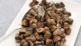
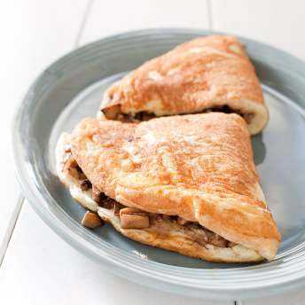
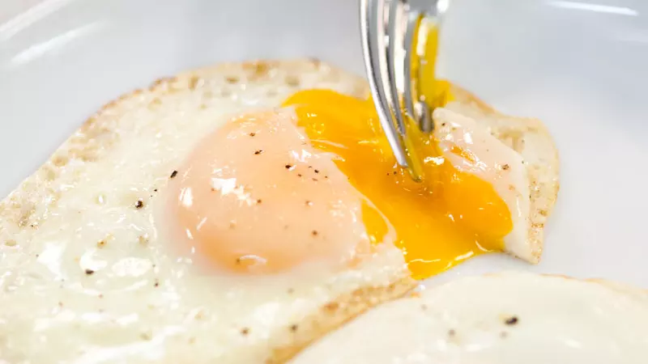

# Mushroom Filling for omelet

`breakfast` `eggs` `mushrooms`

       Menu
 
 
   
   [Upgrade](https://www.americastestkitchen.com/upgrade?incode=MAHBTMULU&purchase_type=multi_site) 
    [Katelyn Account]()  
 
 
   
 
  [Search](https://www.americastestkitchen.com/search?ref=tstickynav) 

      [Our Sites Our Sites]()  
  [America's Test Kitchen](https://www.americastestkitchen.com/) [Cook's Illustrated](https://www.cooksillustrated.com/?extcode=MAHBTC1L0) [Cook's Country](https://www.cookscountry.com/?extcode=MAHBTK1L0) [Cooking School](https://www.americastestkitchen.com/sso/relay?target=https%3A%2F%2Fwww%2Eonlinecookingschool%2Ecom%3fextcode%3DMAHBTS1L0) [Shop](https://shop.americastestkitchen.com/?sourcekey=CAHBTBSL0&___store=default)
 
      [Favorites](https://www.americastestkitchen.com/favorites) 
     [Katelyn Account]()  
 
 
  [Upgrade](https://www.americastestkitchen.com/upgrade?incode=MAHBTMULU&purchase_type=multi_site) 
 

 
     Menu
 
   
   
 
 

 
      
 
 
   Close
 
 
   [Upgrade Membership](https://www.americastestkitchen.com/upgrade?incode=MAHBTMULU&purchase_type=multi_site) [Gift Membership](https://www.americastestkitchen.com/gift_membership/order?incode=MAHBZGML0) [Find TV Listings](https://www.americastestkitchen.com/tv_schedule/new) 
    
-  [Logout](https://www.americastestkitchen.com/sign_out) 
-  [Recipes](https://www.americastestkitchen.com/recipes) 
-  [Equipment Reviews](https://www.americastestkitchen.com/equipment_reviews) 
-  [Taste Tests](https://www.americastestkitchen.com/taste_tests) 
-  Guides  
-  [Features](https://www.americastestkitchen.com/articles) 
-   [Watch Our Show ](https://www.americastestkitchen.com/episodes)

 
 

 
   [America's Test Kitchen](https://www.americastestkitchen.com/) [Cook's Illustrated](https://www.cooksillustrated.com/?extcode=MAHBTC1L0)[Cooking School](https://www.americastestkitchen.com/sso/relay?target=https%3A%2F%2Fwww%2Eonlinecookingschool%2Ecom%3fextcode%3DMAHBTS1L0) [Cook's Country](https://www.cookscountry.com/?extcode=MAHBTK1L0) [Shop](https://shop.americastestkitchen.com/?sourcekey=CAHBTBSL0&___store=default) 
 
 

      # Mushroom Filling

 
  [From _Three Ways with Eggs_](https://www.americastestkitchen.com/episode/407-three-ways-with-eggs)    
  
[0](https://www.americastestkitchen.com/recipes/7329-mushroom-filling#comments)

   ## Why This Recipe Works

 While developing our recipe for fluffy omelet, we realized that we had to rework traditional omelet fillings. We went with intensely flavored but lightweight ingredients that would not impede the omelet’s rise. A touch of Parmesan brought savory depth and also helped hold the filling in place.

 
     [Save](https://www.americastestkitchen.com/recipes/7329-mushroom-filling#save)  
   [Print](https://www.americastestkitchen.com/recipes/7329-mushroom-filling/print) 
   
 
      [

 
   TRY THIS RECOMMENDED COOKING COURSE 
  Perfect Sautéed Mushrooms](https://www.americastestkitchen.com/sso/relay?target=https%3A%2F%2Fwww.onlinecookingschool.com%2Fcourses%2Fperfect-sauteed-mushrooms%3fextcode%3DMARRTCS0H) 
 
 
  
        

    [Watch TV Clip](https://www.americastestkitchen.com/recipes/7329-mushroom-filling#)  
 
 
     ## Ingredients

 [Print Shopping List](https://www.americastestkitchen.com/recipes/7329-mushroom-filling#) 
   |1| teaspoon [olive oil](https://www.americastestkitchen.com/taste_tests/205-regular-olive-oil) |
|-|---------------------------------------------------------------------------------------------|

 |1| shallot, sliced thin |
|-|----------------------|

 |4| ounces white or cremini mushrooms, trimmed and chopped |
|-|--------------------------------------------------------|

 || Salt and pepper |
||-----------------|

 |1| teaspoon [balsamic vinegar](https://www.americastestkitchen.com/taste_tests/341-balsamic-vinegar) |
|-|---------------------------------------------------------------------------------------------------|

 
 
   ## From Our Shop

 
  

 
  

 

   ## From Our Sponsors

 
  

 
 
 
   ## Instructions

 Makes 3/4 cup 
   
 Heat oil in 12\-inch nonstick skillet over medium\-high heat until shimmering. Add shallot and cook until softened and starting to brown, about 2 minutes. Add mushrooms and 1/8 teaspoon salt and season with pepper to taste. Cook until liquid has evaporated and mushrooms begin to brown, 6 to 8 minutes. Transfer mixture to bowl and stir in vinegar.

 
 
    Share photos, tips, and questions about **Mushroom Filling** with fellow fans\! 

  0 Comments 

   Sort by 
 [Questions about what to post?](http://www.americastestkitchen.com/guides/corporate-pages/posting-guidelines) 
   KR

   

 
 
  

 

     ## Watch The Full Episode

      
 

  
  [Three Ways with Eggs](https://www.americastestkitchen.com/episode/407-three-ways-with-eggs)
 Season 14, Ep. 03
   
 
 
 
  

 
    ## More from The Test Kitchen

          
       
  Recipe

  [### Fluffy Omelet](https://www.americastestkitchen.com/recipes/7327-fluffy-omelet)

  
 
 
 

 
  

 
 
 

                       

 
    Websites 
   
- [America's Test Kitchen](http://www.americastestkitchen.com/?incode=MAFLTA1L0)
- [Cook's Illustrated](http://www.cooksillustrated.com/?extcode=MAFLTC1L0)
- [Cook's Country](http://www.cookscountry.com/?extcode=MAFLTK1L0)
- [Online Cooking School](https://www.americastestkitchen.com/sso/relay?target=http%3A%2F%2Fwww%2Eonlinecookingschool%2Ecom%3fextcode%3DMAFLTS1L0)
- [Shop](https://shop.americastestkitchen.com/?sourcekey=CAFLTBSL0&___store=default)

 
 
 
  Magazines 
   
- [Cook's Illustrated](https://w1.buysub.com/servlet/OrdersGateway?cds_mag_code=CID&cds_page_id=198207&cds_response_key=IAF16F200)
- [Give Cook's Illustrated](https://w1.buysub.com/servlet/GiftsGateway?cds_mag_code=CID&cds_response_key=IYA16F200)
- [Cook's Country](https://w1.buysub.com/servlet/OrdersGateway?cds_mag_code=CCY&cds_page_id=102370&cds_response_key=IAF16F200)
- [Give Cook's Country](https://w1.buysub.com/servlet/GiftsGateway?cds_mag_code=CCY&cds_response_key=IYA16F200)
- [Digital Editions](http://www.americastestkitchen.com/mobile)
- [Be a Recipe Tester](http://www.americastestkitchen.com/recipe_testing)

 
 
 
  Customer Service 
   
- [Website FAQs](http://www.americastestkitchen.com/support)
- [Magazine FAQs](http://www.americastestkitchen.com/support)
- [Contact Us](http://www.americastestkitchen.com/support)
- [Give a Gift Membership](https://www.americastestkitchen.com/gift_membership/order?incode=MAFLTGML0)
- [Redeem a Gift Membership](https://www.americastestkitchen.com/redeem?incode=MAFLZFML0)

 
 
 
  Corporate 
   
- [About Us](http://www.americastestkitchen.com/about-us)
- [Terms of Use](https://www.americastestkitchen.com/guides/corporate-pages/terms-of-use)
- [Privacy Policy](https://www.americastestkitchen.com/guides/corporate-pages/privacy-policy)
- [Non\-Use Policy](https://www.americastestkitchen.com/guides/corporate-pages/non-use-policy)
- [Job Opportunities](http://www.americastestkitchen.com/jobs)
- [Email Newsletter](https://www.americastestkitchen.com/newsletter?incode=MAFLTNKL0)
- [Sponsor Our Shows](http://atksponsorship.wordpress.com/)
- [Tour the Test Kitchen](https://www.americastestkitchen.com/tour)
- [Media Contact](http://www.americastestkitchen.com/media-contact)
- [Events & Appearances](http://www.americastestkitchen.com/events)
- [For Media & Booksellers](http://pressroom.americastestkitchen.com/)

 
 
 

 
 © 2017 America's Test Kitchen. All rights reserved.

 
 
   ## A family of brands trusted by millions of home cooks

     
  [Learn real cooking skills from your favorite food experts](https://www.americastestkitchen.com/?incode=MAFLTA2L0)

 
 
    
  [The iconic magazine that investigates how and why recipes work](http://www.cooksillustrated.com/?extcode=MAFLTC2L0)

 
 
    
  [American classics, everyday favorites, and the stories behind them](http://www.cookscountry.com/?extcode=MAFLTK2L0)

 
 
    
  [Experts teach 200\+ online courses for home cooks at every skill level](https://www.americastestkitchen.com/sso/relay?target=http%3A%2F%2Fwww%2Eonlinecookingschool%2Ecom%2F%3fextcode%3DMAFLTX2L0)

 
 
 
 
 

 
