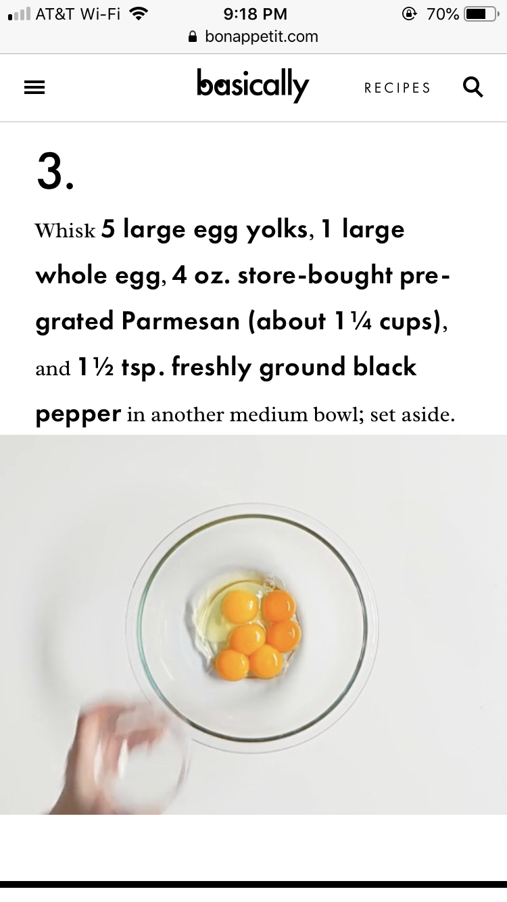

# Mushroom carbonara

`pasta` `mushrooms` `carbonara`

[https://www.bonappetit.com/recipe/mushroom\-carbonara](https://www.bonappetit.com/recipe/mushroom-carbonara)

Jon says very good, add truffles \(white\) if available. 

