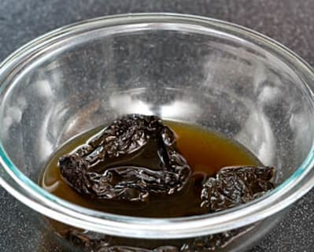
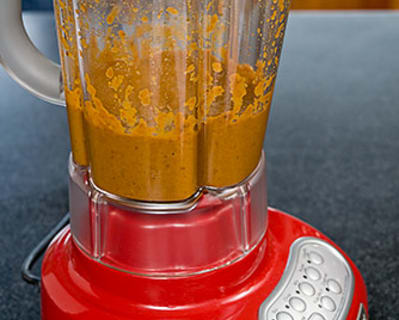
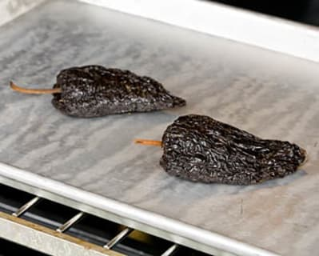

# New Mexican Pork Stew (Posole) | Cook's Country

`winter` `stew` `pork`

## INGREDIENTS

[Print Shopping List](https://www.cookscountry.com/recipes/%23)

|¾|ounce dried ancho chiEles, \(about 3 chiles\) \(see note\)|
|-|----------------------------------------------------------|

|8|cups [low\-sodium chicken broth](https://www.cookscountry.com/taste_tests/202-chicken-broth)|
|-|--------------------------------------------------------------------------------------------|

|2|pounds boneless, country\-style pork ribs|
|-|-----------------------------------------|

||Salt and pepper|
||---------------|

|3|tablespoons [vegetable oil](https://www.cookscountry.com/taste_tests/489-all-purpose-vegetable-oils)|
|-|----------------------------------------------------------------------------------------------------|

|3|\(15\-ounce\) cans white hominy, rinsed and drained well|
|-|--------------------------------------------------------|

|2|onions, chopped|
|-|---------------|

|5|garlic cloves, minced|
|-|---------------------|

|1|tablespoon minced fresh oregano|
|-|-------------------------------|

|1|tablespoon lime juice|
|-|---------------------|

## INSTRUCTIONS

Serves 6 to 8

_Don't use store\-bought chile powder. Dried ancho chiles make all the difference. Serve posole with sliced radishes and green cabbage, chopped avocado, hot sauce, and lime wedges._

**1. PREPARE CHILES** Adjust oven rack to middle position and heat oven to 350 degrees. Place chiles on baking sheet and bake until puffed and \-fragrant, about 6 minutes. When chiles are cool enough to handle, remove stems and seeds. Combine chiles and 1 cup broth in medium bowl. Cover with plastic wrap and microwave until bubbling, about 2 minutes. Let stand until softened, 10 to 15 minutes.

**2. BROWN PORK** Pat pork dry with paper towels and season with salt and pepper. Heat 2 tablespoons oil in Dutch oven over medium\-high heat until just smoking. Cook pork until well browned all over, about 10 minutes. Transfer pork to plate. Add hominy to now\-empty pot and cook, stirring frequently, until fragrant and hominy begins to darken, 2 to 3 \-minutes. Transfer hominy to medium bowl. 

**3. SIMMER BROTH** Heat remaining oil in now\-empty pot over medium heat until shimmering. Add onion and cook until softened, about 5 minutes. Stir in garlic and cook until fragrant, about 30 seconds. Puree onion mixture with softened chile mixture in blender. Combine remaining broth, pureed onion\-chile mixture, pork, oregano, ½ teaspoon salt, and ½ teaspoon pepper in now\-empty pot and bring to boil. Reduce heat to low and simmer, covered, until meat is tender, 1 to 1½ hours.

**4. FINISH STEW** Transfer pork to clean plate. Add hominy to pot and simmer, covered, until tender, about 30 minutes. Skim fat from broth. When meat is cool enough to handle, shred into bite\-size pieces, discarding fat. Return pork to pot and cook until heated through, about 1 minute. Off heat, add lime juice. Season with salt and pepper. \(Posole can be refrigerated in airtight container for 3 days.\)

