# Original Plum Torte Recipe - NYT Cooking

 

[What to Cook This Week](https://cooking.nytimes.com/topics/what-to-cook-this-week?action=click&module=nav&region=editorial%20collection&pgType=recipe-page)[Your Grocery List](https://cooking.nytimes.com/recipes/3783-original-plum-torte)[Your Recipe Box](https://cooking.nytimes.com/recipes/3783-original-plum-torte)

Success\!

This is now in Your Recipe Box. Access all of your saved recipes here.

This is now in Your Recipe Box. Access all of your saved recipes here.

Visit Now

Got It

Your free trial ends soon.
[Subscribe](https://www.nytimes.com/subscriptions/Multiproduct/lp8R3WU.html?return_url=https://cooking.nytimes.com&module=almost-freetrial&pgType=recipe-page&campaignId=6WF6J)Got it

XSearch

 Hide Message

Save

 

 
  [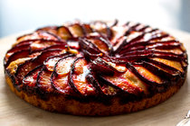

Olive Oil Plum Cake

By Martha Rose Shulman

1 hour 15 minutes](https://cooking.nytimes.com/recipes/1015073-olive-oil-plum-cake?surface=cooking-carousel&fellback=false&req_id=546483428&algo=cooking_doc2vec_weight_1&imp_id=433922271&action=click&module=RecirculationRibbon&pgType=recipedetails&rank=1)

[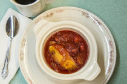

Lazy Sonker

By Kim Severson

1 hour](https://cooking.nytimes.com/recipes/1014847-lazy-sonker?surface=cooking-carousel&fellback=false&req_id=546483428&algo=cooking_doc2vec_weight_1&imp_id=381516905&action=click&module=RecirculationRibbon&pgType=recipedetails&rank=2)

[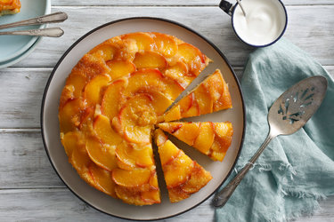

Peach Upside\-Down Cake

By Florence Fabricant

45 minutes](https://cooking.nytimes.com/recipes/6355-peach-upside-down-cake?surface=cooking-carousel&fellback=false&req_id=546483428&algo=cooking_doc2vec_weight_1&imp_id=645249706&action=click&module=RecirculationRibbon&pgType=recipedetails&rank=3)

[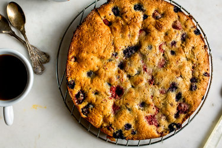

Summer Berry Buckle

By Melissa Clark

1 hour](https://cooking.nytimes.com/recipes/1017644-summer-berry-buckle?surface=cooking-carousel&fellback=false&req_id=546483428&algo=cooking_doc2vec_weight_1&imp_id=128888713&action=click&module=RecirculationRibbon&pgType=recipedetails&rank=4)

[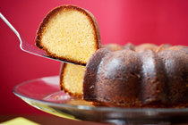

Citrus\-Almond Poundcake

By Mark Bittman

1 1/2 hours](https://cooking.nytimes.com/recipes/1013209-citrus-almond-poundcake?surface=cooking-carousel&fellback=false&req_id=546483428&algo=cooking_doc2vec_weight_1&imp_id=746114710&action=click&module=RecirculationRibbon&pgType=recipedetails&rank=5)

[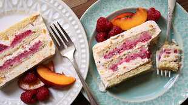

Peach\-Raspberry Ice Cream Cake

By Samantha Seneviratne

1 hour, plus 8 hours' chilling](https://cooking.nytimes.com/recipes/1018259-peach-raspberry-ice-cream-cake?surface=cooking-carousel&fellback=false&req_id=546483428&algo=cooking_doc2vec_weight_1&imp_id=157753166&action=click&module=RecirculationRibbon&pgType=recipedetails&rank=6)

[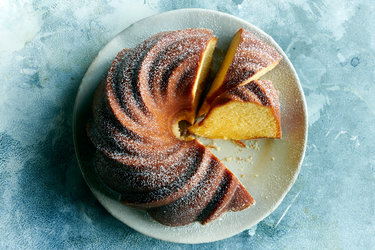

Kentucky Butter Cake

By Margaux Laskey

1 hour 15 minutes](https://cooking.nytimes.com/recipes/1020431-kentucky-butter-cake?surface=cooking-carousel&fellback=false&req_id=546483428&algo=cooking_doc2vec_weight_1&imp_id=922935018&action=click&module=RecirculationRibbon&pgType=recipedetails&rank=7)

[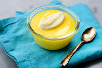

Molly O'Neill's Lemon Curd

By Molly O'Neill

10 minutes, plus refrigeration](https://cooking.nytimes.com/recipes/5999-molly-oneills-lemon-curd?surface=cooking-carousel&fellback=false&req_id=546483428&algo=cooking_doc2vec_weight_1&imp_id=298605298&action=click&module=RecirculationRibbon&pgType=recipedetails&rank=8)

[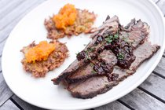

Portuguese Pumpkin Preserves

By David Firestone And Susan Brenna

45 minutes](https://cooking.nytimes.com/recipes/1015339-portuguese-pumpkin-preserves?surface=cooking-carousel&fellback=false&req_id=546483428&algo=cooking_doc2vec_weight_1&imp_id=475025068&action=click&module=RecirculationRibbon&pgType=recipedetails&rank=9)

[

Poundcake

By The New York Times

2 hours](https://cooking.nytimes.com/recipes/1017340-poundcake?surface=cooking-carousel&fellback=false&req_id=546483428&algo=cooking_doc2vec_weight_1&imp_id=275026867&action=click&module=RecirculationRibbon&pgType=recipedetails&rank=10)

[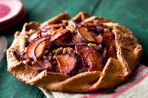

Plum, Almond and Orange Galette

By Martha Rose Shulman

2 hours 15 minutes](https://cooking.nytimes.com/recipes/12725-plum-almond-and-orange-galette?surface=cooking-carousel&fellback=false&req_id=546483428&algo=cooking_doc2vec_weight_1&imp_id=955902525&action=click&module=RecirculationRibbon&pgType=recipedetails&rank=11)

[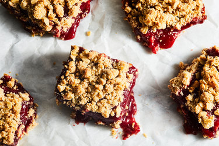

Plum Cobbler Bars

By Erin Jeanne McDowell

1 1/2 hours, plus cooling](https://cooking.nytimes.com/recipes/1019462-plum-cobbler-bars?surface=cooking-carousel&fellback=false&req_id=546483428&algo=cooking_doc2vec_weight_1&imp_id=421074813&action=click&module=RecirculationRibbon&pgType=recipedetails&rank=12)

[

Olive Oil Plum Cake

By Martha Rose Shulman

1 hour 15 minutes](https://cooking.nytimes.com/recipes/1015073-olive-oil-plum-cake?surface=cooking-carousel&fellback=false&req_id=546483428&algo=cooking_doc2vec_weight_1&imp_id=433922271&action=click&module=RecirculationRibbon&pgType=recipedetails&rank=1)

[

Lazy Sonker

By Kim Severson

1 hour](https://cooking.nytimes.com/recipes/1014847-lazy-sonker?surface=cooking-carousel&fellback=false&req_id=546483428&algo=cooking_doc2vec_weight_1&imp_id=381516905&action=click&module=RecirculationRibbon&pgType=recipedetails&rank=2)

[

Peach Upside\-Down Cake

By Florence Fabricant

45 minutes](https://cooking.nytimes.com/recipes/6355-peach-upside-down-cake?surface=cooking-carousel&fellback=false&req_id=546483428&algo=cooking_doc2vec_weight_1&imp_id=645249706&action=click&module=RecirculationRibbon&pgType=recipedetails&rank=3)

[

Summer Berry Buckle

By Melissa Clark

1 hour](https://cooking.nytimes.com/recipes/1017644-summer-berry-buckle?surface=cooking-carousel&fellback=false&req_id=546483428&algo=cooking_doc2vec_weight_1&imp_id=128888713&action=click&module=RecirculationRibbon&pgType=recipedetails&rank=4)

[

Citrus\-Almond Poundcake

By Mark Bittman

1 1/2 hours](https://cooking.nytimes.com/recipes/1013209-citrus-almond-poundcake?surface=cooking-carousel&fellback=false&req_id=546483428&algo=cooking_doc2vec_weight_1&imp_id=746114710&action=click&module=RecirculationRibbon&pgType=recipedetails&rank=5)

[

Peach\-Raspberry Ice Cream Cake

By Samantha Seneviratne

1 hour, plus 8 hours' chilling](https://cooking.nytimes.com/recipes/1018259-peach-raspberry-ice-cream-cake?surface=cooking-carousel&fellback=false&req_id=546483428&algo=cooking_doc2vec_weight_1&imp_id=157753166&action=click&module=RecirculationRibbon&pgType=recipedetails&rank=6)

[

Kentucky Butter Cake

By Margaux Laskey

1 hour 15 minutes](https://cooking.nytimes.com/recipes/1020431-kentucky-butter-cake?surface=cooking-carousel&fellback=false&req_id=546483428&algo=cooking_doc2vec_weight_1&imp_id=922935018&action=click&module=RecirculationRibbon&pgType=recipedetails&rank=7)

[

Molly O'Neill's Lemon Curd

By Molly O'Neill

10 minutes, plus refrigeration](https://cooking.nytimes.com/recipes/5999-molly-oneills-lemon-curd?surface=cooking-carousel&fellback=false&req_id=546483428&algo=cooking_doc2vec_weight_1&imp_id=298605298&action=click&module=RecirculationRibbon&pgType=recipedetails&rank=8)

[

Portuguese Pumpkin Preserves

By David Firestone And Susan Brenna

45 minutes](https://cooking.nytimes.com/recipes/1015339-portuguese-pumpkin-preserves?surface=cooking-carousel&fellback=false&req_id=546483428&algo=cooking_doc2vec_weight_1&imp_id=475025068&action=click&module=RecirculationRibbon&pgType=recipedetails&rank=9)

[

Poundcake

By The New York Times

2 hours](https://cooking.nytimes.com/recipes/1017340-poundcake?surface=cooking-carousel&fellback=false&req_id=546483428&algo=cooking_doc2vec_weight_1&imp_id=275026867&action=click&module=RecirculationRibbon&pgType=recipedetails&rank=10)

[

Plum, Almond and Orange Galette

By Martha Rose Shulman

2 hours 15 minutes](https://cooking.nytimes.com/recipes/12725-plum-almond-and-orange-galette?surface=cooking-carousel&fellback=false&req_id=546483428&algo=cooking_doc2vec_weight_1&imp_id=955902525&action=click&module=RecirculationRibbon&pgType=recipedetails&rank=11)

[

Plum Cobbler Bars

By Erin Jeanne McDowell

1 1/2 hours, plus cooling](https://cooking.nytimes.com/recipes/1019462-plum-cobbler-bars?surface=cooking-carousel&fellback=false&req_id=546483428&algo=cooking_doc2vec_weight_1&imp_id=421074813&action=click&module=RecirculationRibbon&pgType=recipedetails&rank=12)

[

Olive Oil Plum Cake

By Martha Rose Shulman

1 hour 15 minutes](https://cooking.nytimes.com/recipes/1015073-olive-oil-plum-cake?surface=cooking-carousel&fellback=false&req_id=546483428&algo=cooking_doc2vec_weight_1&imp_id=433922271&action=click&module=RecirculationRibbon&pgType=recipedetails&rank=1)

[

Lazy Sonker

By Kim Severson

1 hour](https://cooking.nytimes.com/recipes/1014847-lazy-sonker?surface=cooking-carousel&fellback=false&req_id=546483428&algo=cooking_doc2vec_weight_1&imp_id=381516905&action=click&module=RecirculationRibbon&pgType=recipedetails&rank=2)

[

Peach Upside\-Down Cake

By Florence Fabricant

45 minutes](https://cooking.nytimes.com/recipes/6355-peach-upside-down-cake?surface=cooking-carousel&fellback=false&req_id=546483428&algo=cooking_doc2vec_weight_1&imp_id=645249706&action=click&module=RecirculationRibbon&pgType=recipedetails&rank=3)

[

Summer Berry Buckle

By Melissa Clark

1 hour](https://cooking.nytimes.com/recipes/1017644-summer-berry-buckle?surface=cooking-carousel&fellback=false&req_id=546483428&algo=cooking_doc2vec_weight_1&imp_id=128888713&action=click&module=RecirculationRibbon&pgType=recipedetails&rank=4)

[

Citrus\-Almond Poundcake

By Mark Bittman

1 1/2 hours](https://cooking.nytimes.com/recipes/1013209-citrus-almond-poundcake?surface=cooking-carousel&fellback=false&req_id=546483428&algo=cooking_doc2vec_weight_1&imp_id=746114710&action=click&module=RecirculationRibbon&pgType=recipedetails&rank=5)

[

Peach\-Raspberry Ice Cream Cake

By Samantha Seneviratne

1 hour, plus 8 hours' chilling](https://cooking.nytimes.com/recipes/1018259-peach-raspberry-ice-cream-cake?surface=cooking-carousel&fellback=false&req_id=546483428&algo=cooking_doc2vec_weight_1&imp_id=157753166&action=click&module=RecirculationRibbon&pgType=recipedetails&rank=6)

[

Kentucky Butter Cake

By Margaux Laskey

1 hour 15 minutes](https://cooking.nytimes.com/recipes/1020431-kentucky-butter-cake?surface=cooking-carousel&fellback=false&req_id=546483428&algo=cooking_doc2vec_weight_1&imp_id=922935018&action=click&module=RecirculationRibbon&pgType=recipedetails&rank=7)

[

Molly O'Neill's Lemon Curd

By Molly O'Neill

10 minutes, plus refrigeration](https://cooking.nytimes.com/recipes/5999-molly-oneills-lemon-curd?surface=cooking-carousel&fellback=false&req_id=546483428&algo=cooking_doc2vec_weight_1&imp_id=298605298&action=click&module=RecirculationRibbon&pgType=recipedetails&rank=8)

[

Portuguese Pumpkin Preserves

By David Firestone And Susan Brenna

45 minutes](https://cooking.nytimes.com/recipes/1015339-portuguese-pumpkin-preserves?surface=cooking-carousel&fellback=false&req_id=546483428&algo=cooking_doc2vec_weight_1&imp_id=475025068&action=click&module=RecirculationRibbon&pgType=recipedetails&rank=9)

[

Poundcake

By The New York Times

2 hours](https://cooking.nytimes.com/recipes/1017340-poundcake?surface=cooking-carousel&fellback=false&req_id=546483428&algo=cooking_doc2vec_weight_1&imp_id=275026867&action=click&module=RecirculationRibbon&pgType=recipedetails&rank=10)

[

Plum, Almond and Orange Galette

By Martha Rose Shulman

2 hours 15 minutes](https://cooking.nytimes.com/recipes/12725-plum-almond-and-orange-galette?surface=cooking-carousel&fellback=false&req_id=546483428&algo=cooking_doc2vec_weight_1&imp_id=955902525&action=click&module=RecirculationRibbon&pgType=recipedetails&rank=11)

[

Plum Cobbler Bars

By Erin Jeanne McDowell

1 1/2 hours, plus cooling](https://cooking.nytimes.com/recipes/1019462-plum-cobbler-bars?surface=cooking-carousel&fellback=false&req_id=546483428&algo=cooking_doc2vec_weight_1&imp_id=421074813&action=click&module=RecirculationRibbon&pgType=recipedetails&rank=12)

      [Times Classic](https://cooking.nytimes.com/search?filters%5Bdish_types%5D%5B%5D=times+classics "Search for Times Classic Recipes")   #  Original Plum Torte 

 
  ###   [Marian Burros](https://cooking.nytimes.com/search?q=Marian+Burros)  

 
-  Yield 8 servings 
-  Time 1 hour 15 minutes 

 
 Save to Recipe Box

  [Email]()[Share on Pinterest](http://www.pinterest.com/pin/create/button/?url=https://cooking.nytimes.com/recipes/3783-original-plum-torte?smid=pin-share&description=NYT%20Cooking:%20The%20Times%20published%20Marian%20Burros%E2%80%99s%20recipe%20for%20Plum%20Torte%20every%20September%20from%201983%20until%201989,%20when%20the%20editors%20determined%20that%20enough%20was%20enough.%20%20The%20recipe%20was%20to%20be%20printed%20for%20the%20last%20time%20that%20year.%20%E2%80%9CTo%20counter%20anticipated%20protests,%E2%80%9D%20Ms.%20Burros%20wrote%20a%20few%20years%20later,%20%E2%80%9Cthe%20recipe%20was%20printed%20in%20larger%20type%20than%20usual%20with%20a%20broken-line%20border%20around%20it%20to%20encourage%20clipping.%E2%80%9D%20It%20didn%E2%80%99t...&media=https://static01.nyt.com/images/2019/09/07/dining/plumtorte/plumtorte-verticalTwoByThree735-v2.jpg)[Share on Facebook](http://www.facebook.com/sharer/sharer.php?u=https://cooking.nytimes.com/recipes/3783-original-plum-torte?smid=fb-share)[Share on Twitter](http://twitter.com/intent/tweet?text=Original%20Plum%20Torte&url=https://cooking.nytimes.com/recipes/3783-original-plum-torte?smid=tw-share&hashtags=NYTCooking)
 
 
   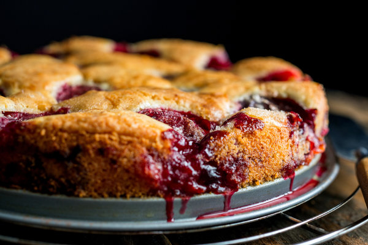

  Andrew Scrivani for The New York Times 

 
   The Times published Marian Burros’s recipe for Plum Torte every September from 1983 until 1989, when the editors determined that enough was enough. The recipe was to be printed for the last time that year. “To counter anticipated protests,” Ms. Burros wrote a few years later, “the recipe was printed in larger type than usual with a broken\-line border around it to encourage clipping.” It didn’t help. The paper was flooded with angry letters. “The appearance of the recipe, like the torte itself, is bittersweet,” wrote a reader in Tarrytown, N.Y. “Summer is leaving, fall is coming. That's what your annual recipe is all about. Don't be grumpy about it.” We are not\! And we pledge that every year, as summer gives way to fall, we will make sure that the recipe is easily available to one and all. The original 1983 recipe called for 1 cup sugar; the 1989 version reduced that to 3/4 cup. We give both options below. Here are [five ways to adapt the torte](http://www.nytimes.com/interactive/2016/09/14/dining/marian-burros-plum-torte-recipe-variations.html).

  Featured in:  [Eating Well](https://www.nytimes.com/1991/09/04/garden/eating-well.html).  

 
 More \+
 
 
   [Times Classics](https://cooking.nytimes.com/tag/times%20classics), [Flour](https://cooking.nytimes.com/tag/flour), [Plum](https://cooking.nytimes.com/tag/plum), [Unsalted Butter](https://cooking.nytimes.com/tag/unsalted%20butter), [Breakfast](https://cooking.nytimes.com/tag/breakfast), [Brunch](https://cooking.nytimes.com/tag/brunch), [Easy](https://cooking.nytimes.com/tag/easy), [Weekday](https://cooking.nytimes.com/tag/weekday), [Dessert](https://cooking.nytimes.com/tag/dessert), [Nut Free](https://cooking.nytimes.com/tag/nut-free), [Vegetarian](https://cooking.nytimes.com/tag/vegetarian) 
      Mark as  **Cooked** 
 
   4,751 ratings     Delicious\!

   
 
 
 
 

 
 
   

   

   

   ### Ingredients

 
-   ¾ to 1   cup sugar  
-   ¬Ω   cup unsalted butter, softened  
-   1   cup unbleached flour, sifted  
-   1   teaspoon baking powder  
-     Pinch of salt \(optional\)  
-   2   eggs  
-   24   halves pitted purple plums  
-     Sugar, lemon juice and cinnamon, for topping  

 Add to Your Grocery List

 [Ingredient Substitution Guide](https://cooking.nytimes.com/guides/79-substitutions-for-cooking)
 
- Nutritional Information
    - ##### Nutritional analysis per serving \(8 servings\)
         350 calories;  13 grams  fat;  8 grams  saturated fat;  0 grams  trans fat;  4 grams  monounsaturated fat;  1 gram  polyunsaturated fat;  57 grams  carbohydrates;  3 grams  dietary fiber;  42 grams  sugars;  4 grams  protein;  63 milligrams  sodium;  
     Note:  The information shown is Edamam’s estimate based on available ingredients and preparation. It should not be considered a substitute for a professional nutritionist’s advice.  
     [Powered by Edamam](https://www.edamam.com/website/wizard.jsp) 

 
 
  ### Preparation

 
1. Heat oven to 350 degrees.
2. Cream the sugar and butter in a bowl. Add the flour, baking powder, salt and eggs and beat well.
3. Spoon the batter into a springform pan of 8, 9 or 10 inches. Place the plum halves skin side up on top of the batter. Sprinkle lightly with sugar and lemon juice, depending on the sweetness of the fruit. Sprinkle with about 1 teaspoon of cinnamon, depending on how much you like cinnamon.
4. Bake 1 hour, approximately. Remove and cool; refrigerate or freeze if desired. Or cool to lukewarm and serve plain or with whipped cream. \(To serve a torte that was frozen, defrost and reheat it briefly at 300 degrees.\)

 ####  Tip 

 
-  To freeze, double\-wrap the torte in foil, place in a plastic bag and seal. 

   Have you cooked this?   Mark as **Cooked**  
 
 ## Cooking Notes

500

Who can see this note?EveryoneOnly You

CancelAdd Note

- [All1076](https://cooking.nytimes.com/recipes/3783-original-plum-torte#notes-thread-tab-content)
- [Most Helpful228](https://cooking.nytimes.com/recipes/3783-original-plum-torte#notes-thread-tab-content)
- [Private0](https://cooking.nytimes.com/recipes/3783-original-plum-torte#notes-thread-tab-content)

Mary2 years ago

Hi \- I'd like clarification on the flour \-\-\- 1 C flour, sifted \- is that one cup of flour and sift and add, or sift the flour to equal one cup of flour \- makes a difference. Thank you.

1616 This is helpful

Jan Wong2 years ago

In 1988 my Toronto newspaper was about to post me to Beijing as a foreign correspondent. Alas, my house wasn't selling. I'd read that the fragrance of baking helps so I bought a frozen loaf of bread, and warmed it in the oven. No sale. Desperate, I baked this torte for an open house. Ta\-dah\! With the kitchen infused with the sweet perfume of Original Plum Torte, the house sold.

694 This is helpful

KLD2 years ago

Sifted flour means sift then measure.

Flour, sifted means measure them sift.

401 This is helpful

John2 years ago

Made this last night after tasting the one made by our daughter. Used raspberries and blackberries, one basket each, instead of plumbs, and 1/3 c. cornmeal and 2/3 c. flour. Fantastic\!\!\! The cornmeal adds a very sophisticated "Italian" character to it, very slight crunch, and amazing flavor. Topped with coarse sugar before baking. Did this in a motorhome convection oven for 50 minutes. Perfect dessert with whipped cream, flavored with a few pureed berries and sugar/vanilla. So easy\!

368 This is helpful

Marty2 years ago

This was GREAT. Sliced the plums and arranged them in a fan pattern \-\- better than halves because prettier and more evenly distributed over cake. Added lemon zest and sliced slivered almonds. Next time I would toss the plums in the lemon juice, lemon zest, sugar, almonds, and cinnamon, because the cinnamon and the zest clumped up when sprinkled. Will also experiment with other fruits.

220 This is helpful

juleezee2 years ago

A nice recipe for Obstkuchen, the German\-speaking bakers' classic\! I grew up on this cake and have been making it for many, many years now. It can be made with any neutral vegetable oil too. Use any kind of nice fruit or berries, just make sure that they are firm, otherwise they can release too much juice during baking. Also, grease the the round or square pan, line the bottom with parchment and grease that one too. No springform required, but it's nice if you have one.

189 This is helpful

Cris2 years ago

A delicious and indeed elegant torte. I have made it twice with these alterations: 50% almond meal; 50%brown sugar and 1/2 teaspoon vanilla. It also freezes well.

178 This is helpful

J. David Nelson2 years ago

A 9" pan gives greater height and moisture to the tart than a 10" pan.

177 This is helpful

MsBlucher2 years ago

Torte, schmorte. It's a delicious, homey dessert you can bake in just about anything \- though a springform pan does make for a somewhat ritzier presentation \- and top with whatever fruit is in season. My Polish mother made it in a rectangular metal pan all summer long \(mmm...placek\!\), though the household favorite WAS the Italian/prune plum iteration. She used grated lemon rind and 1 t. vanilla in the batter, tightly\-spaced skin\-side down fruit, and ground cloves instead of cinnamon atop.

130 This is helpful

Yury2 years ago

Hello, i'm from Russion Federation. This is exellent. I'm cooced it every weekend. My children very liked this pie. I not very well know English. Sorry for mistake. From Russia with love ;\)

124 This is helpful

Ela2 years ago

My favorite recipe from NYT \- annual ritual for 20 years\!

Baked with \- apricots, apples and cranberries when off season.

Also used half whole wheat flour and was perfect. This year sliced the plums thinly and layerd tightly like rose petals \- still the best.

118 This is helpful

Bohemian2 years ago

Plums must have been a lot smaller in 1982. I only needed 4 plums \(8 halves\).

The size of the pan is also going to affect cooking time, rise height, and so on. I used a 9" pan and increased the recipe for the batter to 1 1/2 times. Perfect.

It only took 45 minutes to cook. It would have burned if I'd left it an hour like it said. I could smell it and tested with a toothpick and stopped at 45 minutes when it came out clean.

109 This is helpful

Jen in Astoria2 years ago

Note: My Mom makes this all the time and it's a family and guest favorite. It freezes PHENOMENALLY well\-\-her usual tactic is to wait until it's cool, then into the fridge, THEN when it's really cool you wrap it first in plastic wrap and then in foil REALLY well, like you're launching it into space, and then into the freezer. Also works for leftover torte. If you have more than 1 springform pan make 2 and freeze one for Emergency Company Cake.

106 This is helpful

Lisa F.2 years ago

I've made this many, many times, always in a regular cake pan. A springform is not required\! I also find it better to cut the plums into quarters or eighths as they are then more bite size in the torte.

103 This is helpful

cynthia2 years ago

My aunt used to make this and it's still wonderful. Agree with others\-\-30 minutes. Make it in any pyrex, casserole, anything. Any fruit works. This time, I did frozen, unsweetened cherries. I reduce to 1/2 cup sugar and sometimes could use even less. No reason to roll pie crust\-\-just make this\!

93 This is helpful

Sue Llewellyn2 years ago

Springform or not, shouldn't we grease \(butter\) the pan?

90 This is helpful

Debbie2 years ago

I've been making this recipe for 20 years. Wouldn't be the bittersweet change of season without it. When those first cooler days signal the coming of autumn I go to the market for Italian prune plums,pull out this recipe and remember everything is going to be alright.

88 This is helpful

Greg2 years ago

Dear god, this is good.

87 This is helpful

Margaux Laskey, Staff Editor @ NYT Cooking2 years ago

About 3\-4 cups.

70 This is helpful

Robin2 years ago

This was so easy and as lovely as everyone has written. I added a teaspoon of vanilla extract and a teaspoon of almond extract. Also added peaches when the plums ran out. Fabulous recipe\! Thank you Marian Burros.

69 This is helpful

linh2 years ago

i have been making this torte since the recipe was first given, with prune plums, with nectarines, apples/cranberries, and also peaches \- they are delicious, easy, freeze well and make fine gifts \- but i always put the plums skins down and find the cakes more attractive and bake as well. love it\!

62 This is helpful

Loretta2 years ago

Great recipe, I can see why it's a classic. Added 1/2 cup of ground almonds as someone suggusted. Replaced some of the white sugar with Demerara sugar. Added some almond extract and sprinkled the top with vanilla sugar. It was delicious. Will definitely make it again

57 This is helpful

hermsoven2 years ago

Even better with this trick:

• Fill a six cup cupcake pan with liners.

• Fill liners evenly with batter \(about 3/4 full\)

• Top the 6 unbaked cupcakes with your favorite berry or berry mix and press into the batter. Don't over fill. Sprinkle lightly with cinnamon.

• Bake @350°F for 35\-40 minutes or until tops are nicely browned.

• Allow to cool and serve.

57 This is helpful

SusanY2 years ago

Used gluten free flour. The next morning the leftovers looked a lot like coffee cake so we ate it again.

53 This is helpful

Jane F2 years ago

Made this for the first time using 4 cups of blueberries and raspberries \(mixed\). It was perfect\!

49 This is helpful

Show More Notes

 Private Notes are notes that only you can see. Leave a Private Note.

_For example: “Made for Alex's birthday. Next time double the recipe.”_

Leave a Private Note on this recipe and see it here.

 
  Like this recipe? Save to Recipe Box

  [Email]()[Share on Pinterest](http://www.pinterest.com/pin/create/button/?url=https://cooking.nytimes.com/recipes/3783-original-plum-torte?smid=pin-share&description=NYT%20Cooking:%20The%20Times%20published%20Marian%20Burros%E2%80%99s%20recipe%20for%20Plum%20Torte%20every%20September%20from%201983%20until%201989,%20when%20the%20editors%20determined%20that%20enough%20was%20enough.%20%20The%20recipe%20was%20to%20be%20printed%20for%20the%20last%20time%20that%20year.%20%E2%80%9CTo%20counter%20anticipated%20protests,%E2%80%9D%20Ms.%20Burros%20wrote%20a%20few%20years%20later,%20%E2%80%9Cthe%20recipe%20was%20printed%20in%20larger%20type%20than%20usual%20with%20a%20broken-line%20border%20around%20it%20to%20encourage%20clipping.%E2%80%9D%20It%20didn%E2%80%99t...&media=https://static01.nyt.com/images/2019/09/07/dining/plumtorte/plumtorte-verticalTwoByThree735-v2.jpg)[Share on Facebook](http://www.facebook.com/sharer/sharer.php?u=https://cooking.nytimes.com/recipes/3783-original-plum-torte?smid=fb-share)[Share on Twitter](http://twitter.com/intent/tweet?text=Original%20Plum%20Torte&url=https://cooking.nytimes.com/recipes/3783-original-plum-torte?smid=tw-share&hashtags=NYTCooking)
 
 
 
 
 
 

    

   

   

  ####  Try more recipes like this 

     

 
 
    [###  Plum Fritters 

 By Amanda Hesser

 
 About 1 hour](https://cooking.nytimes.com/recipes/11164-plum-fritters?action=click&module=Recirculation%20Band%20Recipe%20Card&region=Try%20more%20recipes%20like%20this&pgType=recipedetails&rank=1)

       
 

 
     

 
 
    [###  Plum Chutney Crumb Pie 

 By Melissa Clark

 
 About 2 hours, plus 1 to 1 1/2 hours’ chilling and baking](https://cooking.nytimes.com/recipes/1014846-plum-chutney-crumb-pie?action=click&module=Recirculation%20Band%20Recipe%20Card&region=Try%20more%20recipes%20like%20this&pgType=recipedetails&rank=2)

       
 

 
     

 
 
    [###  Plum Tart 

 By Molly O'Neill

 
 1 hour, plus 10 minutes' refrigeration, with additional chilling](https://cooking.nytimes.com/recipes/21-plum-tart?action=click&module=Recirculation%20Band%20Recipe%20Card&region=Try%20more%20recipes%20like%20this&pgType=recipedetails&rank=3)

       
 

 
  

  

  

  

     

 
 
    [###  Plum Tart 

 By Moira Hodgson

 
 50 minutes](https://cooking.nytimes.com/recipes/2034-plum-tart?action=click&module=Recirculation%20Band%20Recipe%20Card&region=Try%20more%20recipes%20like%20this&pgType=recipedetails&rank=8)

       
 

 
 
  ####  More from [Summer Baking Bucket List](https://cooking.nytimes.com/68861692-margaux-laskey-senior-staff-editor/15495779-summer-baking-bucket-list) 

     

 
 
    [###  Blackberry Corn Cobbler 

 By Jerrelle Guy

 
 1 hour](https://cooking.nytimes.com/recipes/1020329-blackberry-corn-cobbler?action=click&module=Recirculation%20Band%20Recipe%20Card&region=More%20from%20Summer%20Baking%20Bucket%20List&pgType=recipedetails&rank=1)

       
 

 
     

 
 
    [###  Rainbow Cake 

 By Erin Jeanne McDowell

 
 2 hours, plus 1 1/2 hours’ chilling](https://cooking.nytimes.com/recipes/1020257-rainbow-cake?action=click&module=Recirculation%20Band%20Recipe%20Card&region=More%20from%20Summer%20Baking%20Bucket%20List&pgType=recipedetails&rank=2)

       
 

 
     

 
 
    [###  Pastelitos \(Guava and Cream Cheese Pastries\) 

 By Daniela Galarza

 
 1 hour](https://cooking.nytimes.com/recipes/1020966-pastelitos-guava-and-cream-cheese-pastries?action=click&module=Recirculation%20Band%20Recipe%20Card&region=More%20from%20Summer%20Baking%20Bucket%20List&pgType=recipedetails&rank=3)

       
 

 
     

 
 
    [###  Lemon Sweet Rolls With Cream Cheese Icing 

 By Yossy Arefi

 
 1 hour, plus rising¬](https://cooking.nytimes.com/recipes/1019242-lemon-sweet-rolls-with-cream-cheese-icing?action=click&module=Recirculation%20Band%20Recipe%20Card&region=More%20from%20Summer%20Baking%20Bucket%20List&pgType=recipedetails&rank=4)†

       
 

 
 
 #### Your [Recently Viewed](https://cooking.nytimes.com/recipe-box/recently-viewed)

[easy](https://cooking.nytimes.com/search?filters%5Bmeal_types%5D%5B%5D=easy)[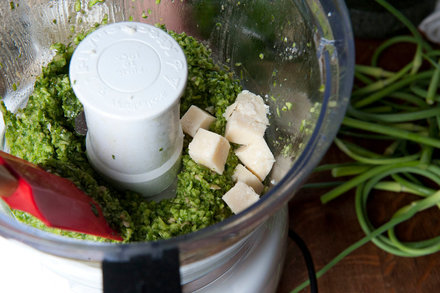

### Garlic Scape Pesto

By Jeff Schwarz And Greg Kessler

3 minutes](https://cooking.nytimes.com/recipes/1015301-garlic-scape-pesto?action=click&module=RecentlyViewed&pgType=recipe-page&region=Recently%20Viewed&rank=0)

[easy](https://cooking.nytimes.com/search?filters%5Bmeal_types%5D%5B%5D=easy)[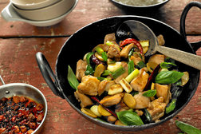

### Three\-Cup Chicken

By Sam Sifton

30 minutes](https://cooking.nytimes.com/recipes/1017456-three-cup-chicken?action=click&module=RecentlyViewed&pgType=recipe-page&region=Recently%20Viewed&rank=1)

[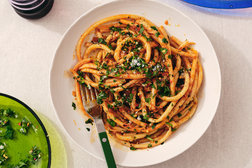

### Caramelized Shallot Pasta

By Alison Roman

40 minutes](https://cooking.nytimes.com/recipes/1020830-caramelized-shallot-pasta?action=click&module=RecentlyViewed&pgType=recipe-page&region=Recently%20Viewed&rank=2)

[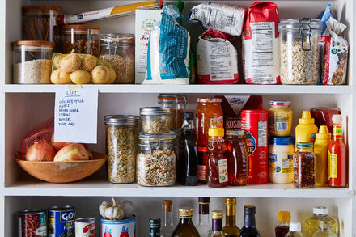

Cooking guide

### How to Stock a Modern Pantry

By Julia Moskin](https://cooking.nytimes.com/guides/56-how-to-stock-a-modern-pantry?action=click&module=RecentlyViewed&pgType=recipe-page&region=Recently%20Viewed&rank=3)

  ####  Brush Up On The Basics With Our Cooking Guides 

      [

 
 
 
  Cooking Guide

 ###  How to Stock a Modern Pantry 

  By Julia Moskin](https://cooking.nytimes.com/guides/56-how-to-stock-a-modern-pantry) 

 
 
 
      [

 
 
 
  Cooking Guide

 ###  How to Make Cranberry Sauce 

  By Melissa Clark](https://cooking.nytimes.com/guides/14-how-to-make-cranberry-sauce) 

 
 
 
      [

 
 
 
  Cooking Guide

 ###  How to Make Stuffing 

  By Melissa Clark](https://cooking.nytimes.com/guides/2-how-to-make-stuffing) 

 
 
 
      [

 
 
 
  Cooking Guide

 ###  How to Make Cassoulet 

  By Melissa Clark](https://cooking.nytimes.com/guides/37-how-to-make-cassoulet) 

 
 
 
 
 
 
      ### Get Our Newsletter

 Get recipes, tips and NYT special offers delivered straight to your inbox. Opt out or [contact us](http://www.nytimes.com/help/index.html) anytime.
 Sign Up Please enter a valid email address.
 

   ### Follow Us

       
 
  ### Get the App

    
 
 
 

     ### About Us

 NYT Cooking is a subscription service of The New York Times. It is a digital cookbook and cooking guide alike, available on all platforms, that helps home cooks of every level discover, save and organize the world’s best recipes, while also helping them become better, more competent cooks. [Subscribe now](https://www.nytimes.com/subscriptions/Multiproduct/lp8R3WU.html?campaignId=79RLU) for full access.

 
   ### Learn More

 
- [Our Cooks](https://cooking.nytimes.com/ourcooks)
- [See Our Features](https://cooking.nytimes.com/see-our-features)
- [FAQ](https://cooking.nytimes.com/frequently-asked-questions)
- [Tools for Saving](https://cooking.nytimes.com/tools)
- [NYTimes.com/food](https://www.nytimes.com/section/food)
- [Send Us Feedback]()

 
  ### Shop

 
- [Gift Subscription](https://www.nytimes.com/subscriptions/Multiproduct/cooking_gift.html?campaignId=7HYRF)

 
 
 
  
-   [©  The New York Times Company](http://www.nytco.com/)   
- [Terms of Service](http://www.nytimes.com/content/help/rights/terms/terms-of-service.html)
- [Privacy Policy](http://www.nytimes.com/content/help/rights/privacy/policy/privacy-policy.html)

 
 
 

 
     Sorry, your changes didn’t save. 
 
 

   
 
  NO YES 
 
 

 
