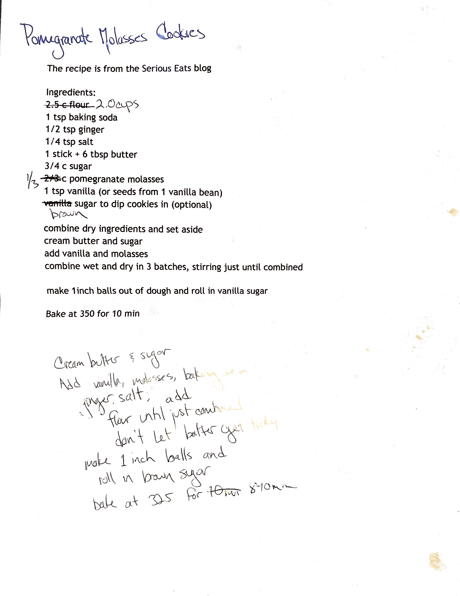

# Pomagranate Molasses Cookies

`Rog Original` `dessert` `cookies` `holidays`

Look at handwritten notes for changes.

2c. flour

1 tsp baking soda

1/2 tsp ginger

1/4 tsp salt

3/4 c sugar

1 stick \+ 6 tbs unsalted butter

1/3 cup pomagranate molasses

1 tsp Vanilla

Brown or turbinato sugar to dip cookies in

Combine dry ingredients and set aside.  Cream butter and sugar.  Add vanilla and molasses. Combine wet and dry ingredients in three batches, stirring until just combined.

Chill dough for at least an hour. Make 1 inch balls and roll in brown sugar. Place balls of cookie dough on baking sheet lined with parchment paper. DO NOT PRESS DOWN. Bake at 350 degrees until bottoms are just slightly browned about 10 minutes.

Filed under [cookies](http://hashtagrecipes.tumblr.com/tagged/cookies), [pomegranate molasses](http://hashtagrecipes.tumblr.com/tagged/pomegranate-molasses), [dessert](http://hashtagrecipes.tumblr.com/tagged/dessert), [baked goods](http://hashtagrecipes.tumblr.com/tagged/baked-goods), [holidays](http://hashtagrecipes.tumblr.com/tagged/holidays)

