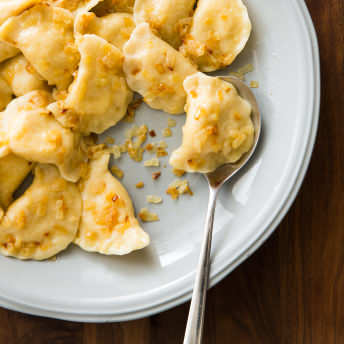
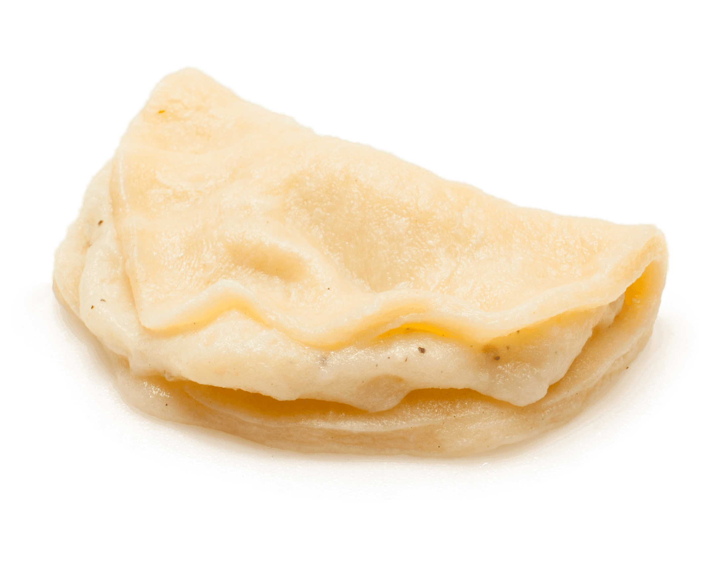
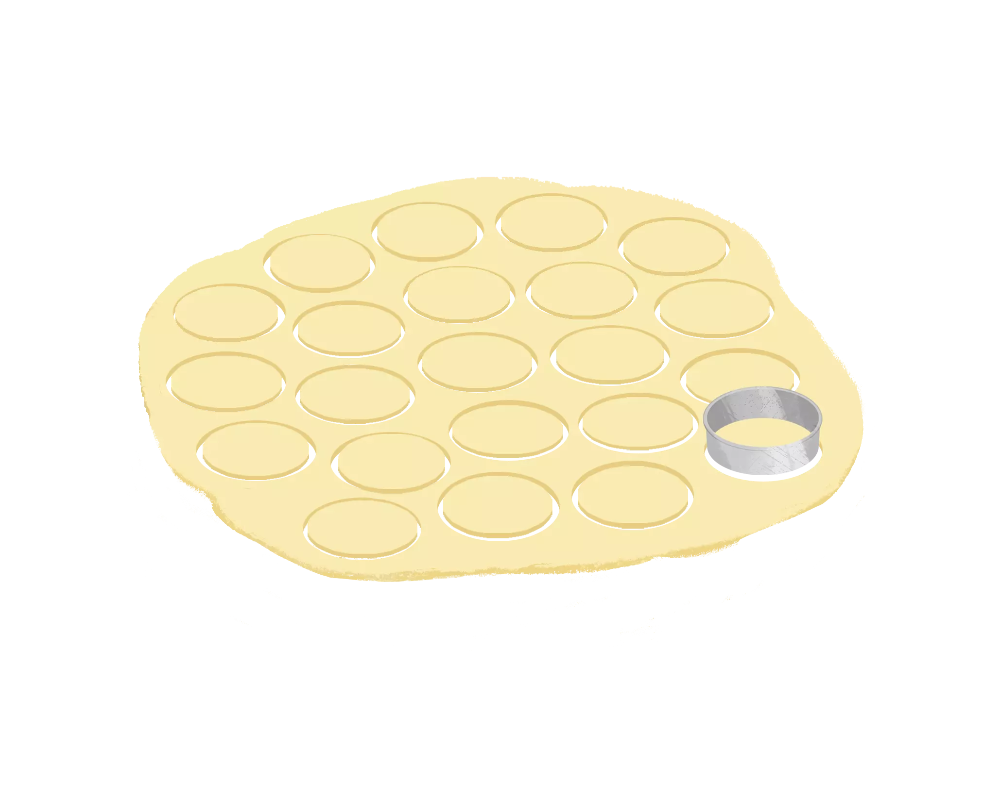
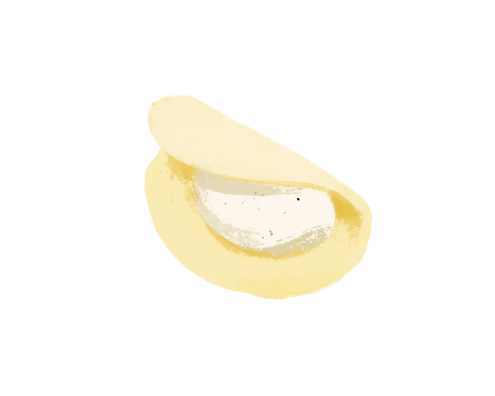

# Potato-Cheddar Pierogi

`autumn` `pork` `roast` `apples`

    February/March 2016

 
 # Potato\-Cheddar Pierogi

  We scoured Pittsburgh’s Polish Hill neighborhood for the secrets to these popular potato\-stuffed boiled dumplings.

 
 
  
  

   ## Why This Recipe Works

 The authentic recipe we tried for these Polish dumplings \(traditionally stuffed with a mixture of mashed potatoes and cheese or sauerkraut\) called for a mix of all\-purpose and semolina flours, and the dumplings couldn’t have been better. But what if you can’t find semolina flour at your local market? We tried substituting bread flour for the two flours and were happy with the pillowy, tender results. We found that the key to a perfect filling is to melt the butter and fully incorporate the other filling ingredients into the mashed potatoes. An easy\-to\-follow filling and folding technique makes quick work of forming the dumplings. 

 
 Read More
 
        

  
 

    ## Ingredients

 [Print Shopping List](https://www.cookscountry.com/recipes/8671-potato-cheddar-pierogi#) 
  ## Instructions

 Makes about 30 pierogi 

    ## Ingredients

 [Print Shopping List](https://www.cookscountry.com/recipes/8671-potato-cheddar-pierogi#) 
   ### Filling

 |1| pound russet potatoes, peeled and sliced 1/2 inch thick |
|-|---------------------------------------------------------|

 || Salt and pepper |
||-----------------|

 |4| ounces [sharp cheddar cheese](https://www.cookscountry.com/taste_tests/49-cheddar-cheese), shredded \(1 cup\) |
|-|---------------------------------------------------------------------------------------------------------------|

 |2| tablespoons [unsalted butter](https://www.cookscountry.com/taste_tests/548-unsalted-butter) |
|-|---------------------------------------------------------------------------------------------|

 
  ### Dough

 |2 ½| cups \(13 3/4 ounces\) bread flour |
|---|------------------------------------|

 |1| teaspoon [baking powder](https://www.cookscountry.com/taste_tests/140-baking-powder) |
|-|--------------------------------------------------------------------------------------|

 || Salt |
||------|

 |1| cup sour cream |
|-|----------------|

 |1| large egg plus 1 large yolk |
|-|-----------------------------|

 
  ### Topping

 |4| tablespoons [unsalted butter](https://www.cookscountry.com/taste_tests/548-unsalted-butter) |
|-|---------------------------------------------------------------------------------------------|

 |1| large onion, chopped fine |
|-|---------------------------|

 |½| teaspoon salt |
|-|---------------|

 
 
   ## From Our Shop

 
  
 
  
 

   ## From Our Sponsors

 
  
 
 

   ## Instructions

 Makes about 30 pierogi 
   When rolling the dough in step 4, be sure not to dust the top surface with too much flour, as that will prevent the edges from forming a tight seal when pinched.

 
      
 

 
   Watch the Cook's Country cast make this recipe
 Play Video

 
 
 
 
 **1. FOR THE FILLING:** Combine potatoes and 1 tablespoon salt in large saucepan and cover with water by 1 inch. Bring to boil over medium\-high heat; reduce heat to medium and cook at vigorous simmer until potatoes are very tender, about 15 minutes.

**2.** Drain potatoes in colander. While still hot, combine potatoes, cheddar, butter, 1/2 teaspoon salt, and 1/2 teaspoon pepper in bowl of stand mixer. Fit mixer with paddle and mix on medium speed until potatoes are smooth and all ingredients are fully combined, about 1 minute. Transfer filling to 8\-inch square baking dish and refrigerate until fully chilled, about 30 minutes, or cover with plastic wrap and refrigerate for up to 24 hours.

**3. FOR THE DOUGH:** Whisk flour, baking powder, and 1/2 teaspoon salt together in clean bowl of stand mixer. Add sour cream and egg and yolk. Fit mixer with dough hook and knead on medium\-high speed for 8 minutes \(dough will be smooth and elastic\). Transfer dough to floured bowl, cover with plastic, and refrigerate until ready to assemble.

**4.** Line rimmed baking sheet with parchment paper and dust with flour. Roll dough on lightly floured counter into 18\-inch circle, about 1/8 inch thick. Using 3\-inch biscuit cutter, cut 20 to 24 circles from dough. Place 1 tablespoon chilled filling in center of each dough round. Fold dough over filling to create half\-moon shape and pinch edges firmly to seal. Transfer to prepared sheet.

**5.** Gather dough scraps and reroll to 1/8\-inch thickness. Cut 6 to 10 more circles from dough and repeat with remaining filling. \(It may be necessary to reroll dough once more to yield 30 pierogi.\) Cover pierogi with plastic and refrigerate until ready to cook, up to 3 hours.

**6. FOR THE TOPPING:** Melt butter in 12\-inch skillet over medium\-low heat. Add onion and salt and cook until onion is caramelized, 15 to 20 minutes. Remove skillet from heat and set aside.

**7.** Bring 4 quarts water to boil in Dutch oven. Add 1 tablespoon salt and half of pierogi to boiling water and cook until tender, about 5 minutes. Using spider or slotted spoon, remove pierogi from water and transfer to skillet with caramelized onion. Return water to boil, cook remaining pierogi, and transfer to skillet with first batch.

**8.** Add 2 tablespoons cooking water to pierogi in skillet. Cook over medium\-low heat, stirring gently, until onion mixture is warmed through and adhered to pierogi. Transfer to platter and serve.

**TO MAKE AHEAD:** Uncooked pierogi can be frozen for several weeks. After sealing pierogi in step 4, freeze them on baking sheet, about 3 hours. Transfer frozen pierogi to zipper\-lock freezer bag. When ready to cook, extend boiling time in step 7 to about 7 minutes.

 
   ### Don't Make This MistakeRuptured Pierogi

 
   

 
  A dumpling that leaks or bursts apart during boiling is lovingly referred to as an “angel.” To contain the filling, be sure to pinch the edges of the dough firmly together.

 
 
  ### Test Kitchen TechniqueCutting and Filling Pierogi

 After cutting the first batch of circles, gather the scraps, reroll the dough, and cut six to 10 more circles.

 
   

 
  **1. CUT:** Using a 3\-inch biscuit cutter, cut 20 to 24 circles from the dough.

 
 
   

 
  **2. FILL AND FOLD:** Place 1 tablespoon of filling in the center of each dough round. Then, fold the dough over the filling to create a half\-moon shape. Pinch firmly to seal.

 
 
  ### On the RoadIn Pursuit of the Perfect Pierogi

 Pierogies Plus occupies a renovated gas station just inches from Island Avenue in McKees Rocks, Pennsylvania, about 5 miles from downtown Pittsburgh. Inside, a peg\-letter menu board hangs behind the counter for takeout business; the rest of the room is tattooed with newspaper clippings extolling the virtues of owner Helen Mannarino’s pierogies, which are famous across Allegheny County.

Mannarino, who immigrated from Poland in 1974, offers a warm greeting before leading me into thesmall kitchen behind the counter. There, a hulking stove, many years past its prime but still well\-loved, anchors the kitchen. Several stockpots of water bubble away on top, and a deep hotel pan of melted butter and softened onions sits to one side. Helen drops pierogies one by one into the water, boils them for several minutes, and then scoops them into a large skillet, where she tosses them with a healthy ladle of the buttery onions before sending them up front for a customer.

In the next room, six serious\- faced women flank a massive flour\-dusted table, speaking softly to each other as a giant laminator extrudes sheets of pierogi dough. They cut circles from the supple dough, drop disks of potato filling into their centers, and then fold and crimp them into half\-moons with quiet confidence. Like a fingerprint, each cook imparts a slightly different crimp to her dumplings; Helen claims she can trace any broken dumplings—called “angels”—back to the culprit.

A burly cook mans the tilt skillet at the end of the table, where he quickly blanches the dumplings before they are frozen and delivered to area bars and restaurants. He pops the occasional dumpling into his mouth, whole, and then looks around to see if anyone noticed. He likes his job.

 

 
  

 
