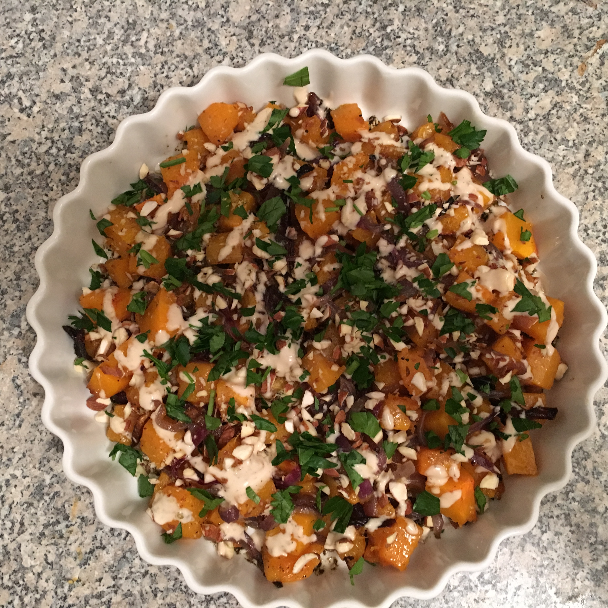

# Roast butternut squash and red onion with tahini and za'atar

`winter` `autumn` `butternut squash` `ottolenghi` `za'atar` `main` `squash`

[Print Recipe]( "Print Recipe") 
 1 large butternut squash \(around 1.1kg\), cut into 2cm x 6cm wedges 

2 red onions, cut into 3cm wedges 

50ml [olive oil](http://www.ottolenghi.co.uk/planeta-olive-oil-shop)

Maldon sea salt and black pepper 

3½ tbsp  [tahini paste](http://www.ottolenghi.co.uk/tahini-despr003008-shop)

1½ tbsp lemon juice 

3 tbsp water 

1 small garlic clove, crushed 

30g [pine nuts](http://www.ottolenghi.co.uk/pine-nuts-pafrt002002-shop)

1 tbsp [za'atar](http://www.ottolenghi.co.uk/palestinian-za-atar-paspi002003-shop)

1 tbsp roughly [chopped parsley]()

   If you want a vegetarian dish to make an impact on the table, this does the job – it looks great and has really complex flavours. Serves four.

 .
  #### Method

 Heat the oven to to 220C/425F/gas mark 7. Put the squash and onions in a large bowl, add three tablespoons of oil, a teaspoon of salt and some black pepper, and toss well. Spread, skin down, on a baking sheet and roast for 40 minutes until the vegetables have taken on some colour and are cooked through. Keep an eye on the onions: they may cook faster than the squash, so may need to be removed earlier. Remove from the oven and leave to cool.

Put the tahini in a small bowl with the lemon juice, water, garlic and a quarter\-teaspoon of salt. Whisk to the consistency of honey, adding more water or tahini as necessary.

Pour the remaining oil into a small frying pan on a medium\-low heat. Add the pine nuts and half a teaspoon of salt, cook for two minutes, stirring, until the nuts are golden brown, then tip the nuts and oil into a small bowl.

To serve, spread the vegetables on a platter and drizzle over the sauce. Scatter the pine nuts and oil on top, followed by the za'atar and parsley.

