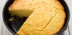
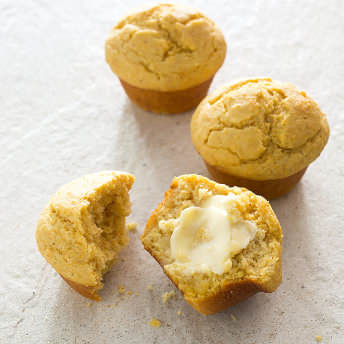

# Savory Corn Muffins

       Menu
 
 
   
   [Upgrade](https://www.americastestkitchen.com/upgrade?incode=MAHBTMULU&purchase_type=multi_site) 
    [Katelyn Account]()  
 
 
   
 
  [Search](https://www.americastestkitchen.com/search?ref=tstickynav) 

      [Our Sites Our Sites]()  
  [America's Test Kitchen](https://www.americastestkitchen.com/) [Cook's Illustrated](https://www.cooksillustrated.com/?extcode=MAHBTC1L0) [Cook's Country](https://www.cookscountry.com/?extcode=MAHBTK1L0) [Cooking School](https://www.americastestkitchen.com/sso/relay?target=https%3A%2F%2Fwww%2Eonlinecookingschool%2Ecom%3fextcode%3DMAHBTS1L0) [Shop](https://shop.americastestkitchen.com/?sourcekey=CAHBTBSL0&___store=default)
 
      [Favorites](https://www.americastestkitchen.com/favorites) 
     [Katelyn Account]()  
 
 
  [Upgrade](https://www.americastestkitchen.com/upgrade?incode=MAHBTMULU&purchase_type=multi_site) 
 

 
     Menu
 
   
   
 
 

 
      
 
 
   Close
 
 
   [Upgrade Membership](https://www.americastestkitchen.com/upgrade?incode=MAHBTMULU&purchase_type=multi_site) [Gift Membership](https://www.americastestkitchen.com/gift_membership/order?incode=MAHBZGML0) [Find TV Listings](https://www.americastestkitchen.com/tv_schedule/new) 
    
-  [Logout](https://www.americastestkitchen.com/sign_out) 
-  [Recipes](https://www.americastestkitchen.com/recipes) 
-  [Equipment Reviews](https://www.americastestkitchen.com/equipment_reviews) 
-  [Taste Tests](https://www.americastestkitchen.com/taste_tests) 
-  Guides  
-  [Features](https://www.americastestkitchen.com/articles) 
-   [Watch Our Show ](https://www.americastestkitchen.com/episodes)

 
 

 
   [America's Test Kitchen](https://www.americastestkitchen.com/) [Cook's Illustrated](https://www.cooksillustrated.com/?extcode=MAHBTC1L0)[Cooking School](https://www.americastestkitchen.com/sso/relay?target=https%3A%2F%2Fwww%2Eonlinecookingschool%2Ecom%3fextcode%3DMAHBTS1L0) [Cook's Country](https://www.cookscountry.com/?extcode=MAHBTK1L0) [Shop](https://shop.americastestkitchen.com/?sourcekey=CAHBTBSL0&___store=default) 
 
 

      # Savory Corn Muffins

 
  [From _Country Ribs and Corn Muffins_](https://www.americastestkitchen.com/episode/507-country-ribs-and-corn-muffins)    
  
[1](https://www.americastestkitchen.com/recipes/8205-savory-corn-muffins?incode=MASAD00L0&ref=new_search_experience_5#comments)

   ## Why This Recipe Works

 For a corn muffin with great cornmeal flavor and proper muffin structure, we used a ratio of 2 parts cornmeal to 1 part flour. We ditched the copious amount of sugar found in most recipes for a truly savory muffin. To help make up for the moisture that sugar normally provides, we used a mix of milk, butter, and sour cream for the right amount of water and fat. Finally, in order to get extra liquid into the batter, we precooked a portion of the cornmeal with additional milk to make a polenta\-like porridge. By hydrating and gelling the starch in the cornmeal, we trapped free water and produced a supermoist muffin. 

 
 Read Less
     [Save](https://www.americastestkitchen.com/recipes/8205-savory-corn-muffins?incode=MASAD00L0&ref=new_search_experience_5#save)  
   [Print](https://www.americastestkitchen.com/recipes/8205-savory-corn-muffins/print) 
   
 
      [

 
   TRY THIS RECOMMENDED COOKING COURSE 
  Southern\-Style Cornbread](https://www.americastestkitchen.com/sso/relay?target=https%3A%2F%2Fwww.onlinecookingschool.com%2Fcourses%2Fsouthern-style-cornbread%3fextcode%3DMARRTCS0H) 
 
 
  
        

    [Watch TV Clip](https://www.americastestkitchen.com/recipes/8205-savory-corn-muffins?incode=MASAD00L0&ref=new_search_experience_5#)  
 
 
     ## Ingredients

 [Print Shopping List](https://www.americastestkitchen.com/recipes/8205-savory-corn-muffins?incode=MASAD00L0&ref=new_search_experience_5#) 
   |2| cups \(10 ounces\) [cornmeal](https://www.americastestkitchen.com/taste_tests/53-cornmeal) |
|-|--------------------------------------------------------------------------------------------|

 |1| cup \(5 ounces\) [all\-purpose flour](https://www.americastestkitchen.com/taste_tests/13-all-purpose-flour) |
|-|-------------------------------------------------------------------------------------------------------------|

 |1 ½| teaspoons [baking powder](https://www.americastestkitchen.com/taste_tests/140-baking-powder) |
|---|----------------------------------------------------------------------------------------------|

 |1| teaspoon baking soda |
|-|----------------------|

 |1 ¼| teaspoons salt |
|---|----------------|

 |1 ¼| cups whole milk |
|---|-----------------|

 |1| cup sour cream |
|-|----------------|

 |8| tablespoons [unsalted butter](https://www.americastestkitchen.com/taste_tests/548-unsalted-butter), melted and cooled slightly |
|-|--------------------------------------------------------------------------------------------------------------------------------|

 |3| tablespoons sugar |
|-|-------------------|

 |2| large eggs, beaten |
|-|--------------------|

 
 
    Nutritional Information 
  
 
   ## From Our Shop

 
  
 
  
 

   ## From Our Sponsors

 
  
 
 
 
   ## Instructions

 Makes 12 Muffins 
   We developed this recipe with our preferred cornmeal, Arrowhead Mills Organic Yellow Cornmeal. Other cornmeals will work in the recipe, but don’t use coarse\-ground or white cornmeal.

 
 **1.** Adjust oven rack to upper\-middle position and heat oven to 425 degrees. Grease 12\-cup muffin tin. Whisk 1 1/2 cups cornmeal, flour, baking powder, baking soda, and salt together in medium bowl.

**2.** Combine milk and remaining 1/2 cup cornmeal in large bowl. Microwave milk\-cornmeal mixture for 1 1/2 minutes. Whisk thoroughly and continue to microwave, whisking every 30 seconds, until thickened to batter\-like consistency \(whisk will leave channel in bottom of bowl that slowly fills in\), 1 to 3 minutes longer. Whisk in sour cream, melted butter, and sugar until combined. Whisk in eggs until combined. Fold in flour mixture until thoroughly combined. Using portion scoop or large spoon, divide batter evenly among prepared muffin cups \(about 1/2 cup batter per cup; batter will mound slightly above rim\).

**3.** Bake until tops are golden brown and toothpick inserted in center comes out clean, 13 to 17 minutes, rotating muffin tin halfway through baking. Let muffins cool in muffin tin on wire rack for 5 minutes. Remove muffins from muffin tin and let cool 5 minutes longer. Serve warm.

 
 
    Share photos, tips, and questions about **Savory Corn Muffins** with fellow fans\! 

  1 Comment 

   Sort by 
 [Questions about what to post?](http://www.americastestkitchen.com/guides/corporate-pages/posting-guidelines) 
   KR

   

   AZ
 
   ANN Z.
 3 months
 
   Can I make this a day in advance and, if so, what is the best way to serve them? Store in plastic bag? Reheat in oven?

 
 
     
 0 This is helpful
 
    
 Reply
 
 
  
 
 
 

 
 
  

 

     ## Watch The Full Episode

      
 

  
  [Country Ribs and Corn Muffins](https://www.americastestkitchen.com/episode/507-country-ribs-and-corn-muffins)
 Season 16, Ep. 22
   
 
 
 
  
 
    ## More from The Test Kitchen

        [19280\_sil\-muffintin\-anolon\-8000.bin](./file/19280_sil-muffintin-anolon-8000.bin)

  
       
  Equipment Review

  [### All\-Purpose Whisks](https://www.americastestkitchen.com/equipment_reviews/1370-all-purpose-whisks)

  
 
       [19280\_sil\-muffintin\-anolon\-8000.bin](./file/19280_sil-muffintin-anolon-8000.bin)

  
       
  Equipment Review

  [### Muffin Tins](https://www.americastestkitchen.com/equipment_reviews/1290-muffin-tins)

  
 
 
 

 
  
 
 
 

                       

 
    Websites 
   
- [America's Test Kitchen](http://www.americastestkitchen.com/?incode=MAFLTA1L0)
- [Cook's Illustrated](http://www.cooksillustrated.com/?extcode=MAFLTC1L0)
- [Cook's Country](http://www.cookscountry.com/?extcode=MAFLTK1L0)
- [Online Cooking School](https://www.americastestkitchen.com/sso/relay?target=http%3A%2F%2Fwww%2Eonlinecookingschool%2Ecom%3fextcode%3DMAFLTS1L0)
- [Shop](https://shop.americastestkitchen.com/?sourcekey=CAFLTBSL0&___store=default)

 
 
 
  Magazines 
   
- [Cook's Illustrated](https://w1.buysub.com/servlet/OrdersGateway?cds_mag_code=CID&cds_page_id=198207&cds_response_key=IAF16F200)
- [Give Cook's Illustrated](https://w1.buysub.com/servlet/GiftsGateway?cds_mag_code=CID&cds_response_key=IYA16F200)
- [Cook's Country](https://w1.buysub.com/servlet/OrdersGateway?cds_mag_code=CCY&cds_page_id=102370&cds_response_key=IAF16F200)
- [Give Cook's Country](https://w1.buysub.com/servlet/GiftsGateway?cds_mag_code=CCY&cds_response_key=IYA16F200)
- [Digital Editions](http://www.americastestkitchen.com/mobile)
- [Be a Recipe Tester](http://www.americastestkitchen.com/recipe_testing)

 
 
 
  Customer Service 
   
- [Website FAQs](http://www.americastestkitchen.com/support)
- [Magazine FAQs](http://www.americastestkitchen.com/support)
- [Contact Us](http://www.americastestkitchen.com/support)
- [Give a Gift Membership](https://www.americastestkitchen.com/gift_membership/order?incode=MAFLTGML0)
- [Redeem a Gift Membership](https://www.americastestkitchen.com/redeem?incode=MAFLZFML0)

 
 
 
  Corporate 
   
- [About Us](http://www.americastestkitchen.com/about-us)
- [Terms of Use](https://www.americastestkitchen.com/guides/corporate-pages/terms-of-use)
- [Privacy Policy](https://www.americastestkitchen.com/guides/corporate-pages/privacy-policy)
- [Non\-Use Policy](https://www.americastestkitchen.com/guides/corporate-pages/non-use-policy)
- [Job Opportunities](http://www.americastestkitchen.com/jobs)
- [Email Newsletter](https://www.americastestkitchen.com/newsletter?incode=MAFLTNKL0)
- [Sponsor Our Shows](https://www.americastestkitchen.com/sponsors)
- [Tour the Test Kitchen](https://www.americastestkitchen.com/tour)
- [Media Contact](http://www.americastestkitchen.com/media-contact)
- [Events & Appearances](http://www.americastestkitchen.com/events)
- [For Media & Booksellers](http://pressroom.americastestkitchen.com/)

 
 
 

 
 © 2018 America's Test Kitchen. All rights reserved.

 
 
   ## A family of brands trusted by millions of home cooks

     
  [Learn real cooking skills from your favorite food experts](https://www.americastestkitchen.com/?incode=MAFLTA2L0)

 
 
    
  [The iconic magazine that investigates how and why recipes work](http://www.cooksillustrated.com/?extcode=MAFLTC2L0)

 
 
    
  [American classics, everyday favorites, and the stories behind them](http://www.cookscountry.com/?extcode=MAFLTK2L0)

 
 
    
  [Experts teach 200\+ online courses for home cooks at every skill level](https://www.americastestkitchen.com/sso/relay?target=http%3A%2F%2Fwww%2Eonlinecookingschool%2Ecom%2F%3fextcode%3DMAFLTX2L0)

 
 
 
 
 

 
