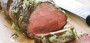
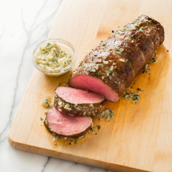

# Shallot and Parsley Butter

       Menu
 
 
   
   [Upgrade](https://www.americastestkitchen.com/upgrade?incode=MAHBTMULU&purchase_type=multi_site) 
    [Katelyn Account]()  
 
 
   
 
  [Search](https://www.americastestkitchen.com/search?ref=tstickynav) 

     [Give the gift of foolproof cooking with our All Access Membership](https://www.americastestkitchen.com/gift?incode=MAGNZGM00)  
   

     [Our Sites Our Sites]()  
  [America's Test Kitchen](https://www.americastestkitchen.com/) [Cook's Illustrated](https://www.cooksillustrated.com/?extcode=MAHBTC1L0) [Cook's Country](https://www.cookscountry.com/?extcode=MAHBTK1L0) [Cooking School](https://www.americastestkitchen.com/sso/relay?target=https%3A%2F%2Fwww%2Eonlinecookingschool%2Ecom%3fextcode%3DMAHBTS1L0) [Shop](https://shop.americastestkitchen.com/?sourcekey=CAHBTBSL0&___store=default)
 
      [Favorites](https://www.americastestkitchen.com/favorites) 
     [Katelyn Account]()  
 
 
  [Upgrade](https://www.americastestkitchen.com/upgrade?incode=MAHBTMULU&purchase_type=multi_site) 
 

 
     Menu
 
   
   
 
 

 
      
 
 
   Close
 
 
   [Upgrade Membership](https://www.americastestkitchen.com/upgrade?incode=MAHBTMULU&purchase_type=multi_site) [Gift Membership](https://www.americastestkitchen.com/gift_membership/order?incode=MAHBZGML0) [Find TV Listings](https://www.americastestkitchen.com/tv_schedule/new) 
    
-  [Logout](https://www.americastestkitchen.com/sign_out) 
-  [Recipes](https://www.americastestkitchen.com/recipes) 
-  [Equipment Reviews](https://www.americastestkitchen.com/equipment_reviews) 
-  [Taste Tests](https://www.americastestkitchen.com/taste_tests) 
-  Guides  
-  [Features](https://www.americastestkitchen.com/articles) 
-   [Watch Our Show ](https://www.americastestkitchen.com/episodes)

 
 

 
   [America's Test Kitchen](https://www.americastestkitchen.com/) [Cook's Illustrated](https://www.cooksillustrated.com/?extcode=MAHBTC1L0)[Cooking School](https://www.americastestkitchen.com/sso/relay?target=https%3A%2F%2Fwww%2Eonlinecookingschool%2Ecom%3fextcode%3DMAHBTS1L0) [Cook's Country](https://www.cookscountry.com/?extcode=MAHBTK1L0) [Shop](https://shop.americastestkitchen.com/?sourcekey=CAHBTBSL0&___store=default) 
 
 

      # Shallot and Parsley Butter

 
      
  
[0](https://www.americastestkitchen.com/recipes/4653-shallot-and-parsley-butter#comments)

   ## Why This Recipe Works

 When devising a no\-fuss recipe for perfectly cooked roast beef tenderloin, we chose to work with Chateaubriand, the smaller center\-cut roast. We reversed the usual cooking process for our tenderloin recipe, roasting first and then searing, to eliminate the ring of overdone meat just below the crust and give the roast a ruby coloring from edge to edge. Salting the meat and rubbing it with softened butter helped it hold on to its juices and gave it richness.

 
     [Save](https://www.americastestkitchen.com/recipes/4653-shallot-and-parsley-butter#save)  
   [Print](https://www.americastestkitchen.com/recipes/4653-shallot-and-parsley-butter/print) 
   
 
      [

 
   TRY THIS RECOMMENDED COOKING COURSE 
  Foolproof Beef Tenderloin](https://www.americastestkitchen.com/sso/relay?target=https%3A%2F%2Fwww.onlinecookingschool.com%2Fcourses%2Ffoolproof-beef-tenderloin%3fextcode%3DMARRTCS0H) 
 
 
  
        

  
 
 
     ## Ingredients

 [Print Shopping List](https://www.americastestkitchen.com/recipes/4653-shallot-and-parsley-butter#) 
   |4| tablespoons [unsalted butter](https://www.americastestkitchen.com/taste_tests/548-unsalted-butter), softened |
|-|--------------------------------------------------------------------------------------------------------------|

 |½| medium shallot, minced \(about 2 tablespoons\) |
|-|------------------------------------------------|

 |1| medium garlic clove, minced or pressed through garlic press \(about 1 teaspoon\) |
|-|----------------------------------------------------------------------------------|

 |1| tablespoon finely chopped fresh parsley leaves |
|-|------------------------------------------------|

 |¼| teaspoon table salt |
|-|---------------------|

 |¼| teaspoon ground black pepper |
|-|------------------------------|

 
 
   ## From Our Shop

 
  

 
  

 

   ## From Our Sponsors

 
  

 
 
 
   ## Instructions

 Makes about 8 tablespoons 
   
 Combine all ingredients in medium bowl.

 
 
    Share photos, tips, and questions about **Shallot and Parsley Butter** with fellow fans\! 

  0 Comments 

   Sort by 
 [Questions about what to post?](http://www.americastestkitchen.com/guides/corporate-pages/posting-guidelines) 
   KR

   

 
 
  

 

    
  

 
    ## More from The Test Kitchen

          
       
  Recipe

  [### Classic Roast Beef Tenderloin](https://www.americastestkitchen.com/recipes/4652-classic-roast-beef-tenderloin)

  
 
 
 

 
  

 
 
 

                       

 
    Websites 
   
- [America's Test Kitchen](http://www.americastestkitchen.com/?incode=MAFLTA1L0)
- [Cook's Illustrated](http://www.cooksillustrated.com/?extcode=MAFLTC1L0)
- [Cook's Country](http://www.cookscountry.com/?extcode=MAFLTK1L0)
- [Online Cooking School](https://www.americastestkitchen.com/sso/relay?target=http%3A%2F%2Fwww%2Eonlinecookingschool%2Ecom%3fextcode%3DMAFLTS1L0)
- [Shop](https://shop.americastestkitchen.com/?sourcekey=CAFLTBSL0&___store=default)

 
 
 
  Magazines 
   
- [Cook's Illustrated](https://w1.buysub.com/servlet/OrdersGateway?cds_mag_code=CID&cds_page_id=198207&cds_response_key=IAF16F200)
- [Give Cook's Illustrated](https://w1.buysub.com/servlet/GiftsGateway?cds_mag_code=CID&cds_response_key=IYA16F200)
- [Cook's Country](https://w1.buysub.com/servlet/OrdersGateway?cds_mag_code=CCY&cds_page_id=102370&cds_response_key=IAF16F200)
- [Give Cook's Country](https://w1.buysub.com/servlet/GiftsGateway?cds_mag_code=CCY&cds_response_key=IYA16F200)
- [Digital Editions](http://www.americastestkitchen.com/mobile)
- [Be a Recipe Tester](http://www.americastestkitchen.com/recipe_testing)

 
 
 
  Customer Service 
   
- [Website FAQs](http://www.americastestkitchen.com/support)
- [Magazine FAQs](http://www.americastestkitchen.com/support)
- [Contact Us](http://www.americastestkitchen.com/support)
- [Give a Gift Membership](https://www.americastestkitchen.com/gift_membership/order?incode=MAFLTGML0)
- [Redeem a Gift Membership](https://www.americastestkitchen.com/redeem?incode=MAFLZFML0)

 
 
 
  Corporate 
   
- [About Us](http://www.americastestkitchen.com/about-us)
- [Terms of Use](https://www.americastestkitchen.com/guides/corporate-pages/terms-of-use)
- [Privacy Policy](https://www.americastestkitchen.com/guides/corporate-pages/privacy-policy)
- [Non\-Use Policy](https://www.americastestkitchen.com/guides/corporate-pages/non-use-policy)
- [Job Opportunities](http://www.americastestkitchen.com/jobs)
- [Email Newsletter](https://www.americastestkitchen.com/newsletter?incode=MAFLTNKL0)
- [Sponsor Our Shows](http://atksponsorship.wordpress.com/)
- [Tour the Test Kitchen](https://www.americastestkitchen.com/tour)
- [Media Contact](http://www.americastestkitchen.com/media-contact)
- [Events & Appearances](http://www.americastestkitchen.com/events)
- [For Media & Booksellers](http://pressroom.americastestkitchen.com/)

 
 
 

 
 © 2017 America's Test Kitchen. All rights reserved.

 
 
   ## A family of brands trusted by millions of home cooks

     
  [Learn real cooking skills from your favorite food experts](https://www.americastestkitchen.com/?incode=MAFLTA2L0)

 
 
    
  [The iconic magazine that investigates how and why recipes work](http://www.cooksillustrated.com/?extcode=MAFLTC2L0)

 
 
    
  [American classics, everyday favorites, and the stories behind them](http://www.cookscountry.com/?extcode=MAFLTK2L0)

 
 
    
  [Experts teach 200\+ online courses for home cooks at every skill level](https://www.americastestkitchen.com/sso/relay?target=http%3A%2F%2Fwww%2Eonlinecookingschool%2Ecom%2F%3fextcode%3DMAFLTX2L0)

 
 
 
 
 

 

 
