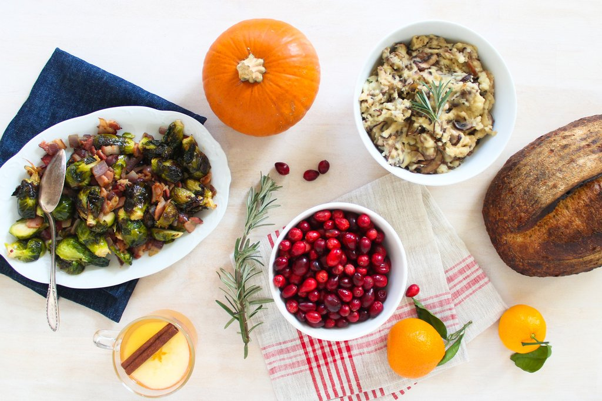

# Shaved Brussels sprouts with bacon

`brussels sprouts` `bacon`

Shaved Brussel Sprouts with Bacon and Onion

Prep Time: 50 minutes

Serves 4

Ingredients:

- 1 pound Brussels Sprouts, stems removed, shaved thinly
- 1 large Onion, diced small
- 8 ounces Bacon, roughly chopped \(optional\)
- 1 Tbsp. Apple Cider Vinegar
- Salt and Pepper to taste

In a large sauté pan over a medium flame, cook the bacon until all the fat is rendered and the bacon is browned and slightly crisp, about 25 minutes. Place the bacon in a small bowl and carefully remove all but 1 Tbsp. of rendered fat. Return pan to a medium flame and add the onions. Cook until slightly browned, about 12 minutes. Stir in the Brussels sprouts and a pinch of salt and continue until the Brussels are cooked through and completely tender, about 7 minutes. Remove from heat and stir in the bacon and vinegar. Place onto a serving platter and season with a pinch of salt and pepper to taste.
