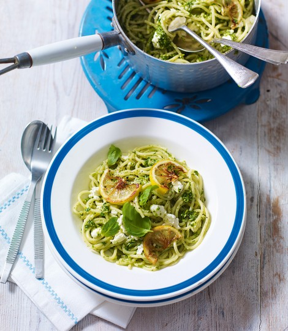

# Spaghetti with watercress and feta pesto

`pasta` `pesto` `watercress pesto` `watercress`

# Spaghetti with watercress and feta pesto

- Serves 4
- Ready in 20 minutes
- Easy

This fabulous pasta recipe takes only 20 minutes to make and with a few added ingredients you will have a fantastic lunch for the next day too \(see tip\).## Nutritional info per serving

- Calories511kcals
- Fat29.2g \(7.1g saturated\)
- Protein15g
- Carbohydrates46.7g \(2.8g sugars\)
- Fibre3.1g 
- Salt0.9g 

 

 

## INGREDIENTS

- 1 large garlic clove
- 30g pine nuts or hazelnuts, toasted
- 100g watercress, picked
- 15g parmesan, plus extra for serving
- 80ml extra\-virgin olive oil
- 70ml olive oil
- 1 lemon, ½ juiced, ½ halved and thinly sliced
- 130g feta, crumbled
- 400g spaghetti
- Small handful of fresh basil, leaves picked

## METHOD

1. 01.Pulse the garlic and nuts in a food processor until roughly chopped, add the watercress and pulse again until you have a coarse paste. Spoon into a bowl, stir through the parmesan, then drizzle in the oils until you have a juicy paste. Season with lemon juice, a pinch of salt and lots of black pepper. Stir through the feta, then set aside.
2. 02.Heat a pan over a high heat. Add the lemon slices and quickly fry on each side until starting to caramelise. Remove and set aside.
3. 03.Meanwhile cook the spaghetti in a large pan of boiling salted water for 10 minutes until al dente. Drain, return to the pan and mix through the pesto and lemon slices. Spoon two\-thirds of the pasta evenly among warmed bowls \(reserve 250g for lunch the next day\), then sprinkle with cracked black pepper and basil leaves to serve.

 
