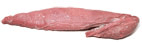

# chateaubriand

`beef` `main`

       Menu
 
 
   
   [Upgrade](https://www.americastestkitchen.com/upgrade?incode=MAHBTMULU&purchase_type=multi_site) 
    [Katelyn Account]()  
 
 
   
 
  [Search](https://www.americastestkitchen.com/search?ref=tstickynav) 

     [Give the gift of foolproof cooking with our All Access Membership](https://www.americastestkitchen.com/gift?incode=MAGNZGM00)  
   

     [Our Sites Our Sites]()  
  [America's Test Kitchen](https://www.americastestkitchen.com/) [Cook's Illustrated](https://www.cooksillustrated.com/?extcode=MAHBTC1L0) [Cook's Country](https://www.cookscountry.com/?extcode=MAHBTK1L0) [Cooking School](https://www.americastestkitchen.com/sso/relay?target=https%3A%2F%2Fwww%2Eonlinecookingschool%2Ecom%3fextcode%3DMAHBTS1L0) [Shop](https://shop.americastestkitchen.com/?sourcekey=CAHBTBSL0&___store=default)
 
      [Favorites](https://www.americastestkitchen.com/favorites) 
     [Katelyn Account]()  
 
 
  [Upgrade](https://www.americastestkitchen.com/upgrade?incode=MAHBTMULU&purchase_type=multi_site) 
 

 
     Menu
 
   
   
 
 

 
      
 
 
   Close
 
 
   [Upgrade Membership](https://www.americastestkitchen.com/upgrade?incode=MAHBTMULU&purchase_type=multi_site) [Gift Membership](https://www.americastestkitchen.com/gift_membership/order?incode=MAHBZGML0) [Find TV Listings](https://www.americastestkitchen.com/tv_schedule/new) 
    
-  [Logout](https://www.americastestkitchen.com/sign_out) 
-  [Recipes](https://www.americastestkitchen.com/recipes) 
-  [Equipment Reviews](https://www.americastestkitchen.com/equipment_reviews) 
-  [Taste Tests](https://www.americastestkitchen.com/taste_tests) 
-  Guides  
-  [Features](https://www.americastestkitchen.com/articles) 
-   [Watch Our Show ](https://www.americastestkitchen.com/episodes)

 
 

 
   [America's Test Kitchen](https://www.americastestkitchen.com/) [Cook's Illustrated](https://www.cooksillustrated.com/?extcode=MAHBTC1L0)[Cooking School](https://www.americastestkitchen.com/sso/relay?target=https%3A%2F%2Fwww%2Eonlinecookingschool%2Ecom%3fextcode%3DMAHBTS1L0) [Cook's Country](https://www.cookscountry.com/?extcode=MAHBTK1L0) [Shop](https://shop.americastestkitchen.com/?sourcekey=CAHBTBSL0&___store=default) 
 
 

      # Classic Roast Beef Tenderloin

 
  [From _Making Meat and Potatoes for Company_](https://www.americastestkitchen.com/episode/256-making-meat-and-potatoes-for-company)    
  
[0](https://www.americastestkitchen.com/recipes/4652-classic-roast-beef-tenderloin#comments)

   ## Why This Recipe Works

 When devising a no\-fuss recipe for perfectly cooked roast beef tenderloin, we chose to work with Chateaubriand, the smaller center\-cut roast. We reversed the usual cooking process for our tenderloin recipe, roasting first and then searing, to eliminate the ring of overdone meat just below the crust and give the roast a ruby coloring from edge to edge. Salting the meat and rubbing it with softened butter helped it hold on to its juices and gave it richness.

 
     [Save](https://www.americastestkitchen.com/recipes/4652-classic-roast-beef-tenderloin#save)  
   [Print](https://www.americastestkitchen.com/recipes/4652-classic-roast-beef-tenderloin/print) 
   
 
      [

 
   TRY THIS RECOMMENDED COOKING COURSE 
  Holiday Roasts](https://www.americastestkitchen.com/sso/relay?target=https%3A%2F%2Fwww.onlinecookingschool.com%2Fcourses%2Fholiday-roasts%3fextcode%3DMARRTCS0H) 
 
 
  
        

    [Watch TV Clip](https://www.americastestkitchen.com/recipes/4652-classic-roast-beef-tenderloin#)  
 
 
     ## Ingredients

 [Print Shopping List](https://www.americastestkitchen.com/recipes/4652-classic-roast-beef-tenderloin#) 
   |1| beef tenderloin center\-cut Châteaubriand \(about 2 pounds\), trimmed of fat and silver skin \(see note\) |
|-|-----------------------------------------------------------------------------------------------------------|

 |2| teaspoons [kosher salt](https://www.americastestkitchen.com/taste_tests/51-salt) \(see note\) |
|-|-----------------------------------------------------------------------------------------------|

 |1| teaspoon [coarsely ground black pepper](https://www.americastestkitchen.com/taste_tests/433-black-pepper) |
|-|-----------------------------------------------------------------------------------------------------------|

 |2| tablespoons [unsalted butter](https://www.americastestkitchen.com/taste_tests/548-unsalted-butter), softened |
|-|--------------------------------------------------------------------------------------------------------------|

 |1| tablespoon [vegetable oil](https://www.americastestkitchen.com/taste_tests/489-all-purpose-vegetable-oils) |
|-|------------------------------------------------------------------------------------------------------------|

 |1| recipe flavored butter \(see related recipes\) |
|-|------------------------------------------------|

 
 
   ## From Our Shop

 
  

 
  

 

   ## From Our Sponsors

 
  

 
 
 
   ## Instructions

 Serves 4 to 6 
   If using table salt, reduce the amount to 1 teaspoon. Ask your butcher to prepare a trimmed, center\-cut Châteaubriand from the whole tenderloin, as this cut is not usually available without special ordering. If you are cooking for a crowd, this recipe can be doubled to make two roasts. Sear the roasts one after the other, wiping out the pan and adding new oil after searing the first roast. Both pieces of meat can be roasted on the same rack.

 
 1. Using 12\-inch lengths of twine, tie roast crosswise at 1 1/2\-inch intervals. Sprinkle roast evenly with salt, cover loosely with plastic wrap, and let stand at room temperature 1 hour. Meanwhile, adjust oven rack to middle position and heat oven to 300 degrees.

 2. Pat roast dry with paper towels. Sprinkle roast evenly with pepper and spread unsalted butter evenly over surface. Transfer roast to wire rack set in rimmed baking sheet. Roast until instant\-read thermometer inserted into center of roast registers 125 degrees for medium\-rare, 40 to 55 minutes, or 135 degrees for medium, 55 to 70 minutes, flipping roast halfway through cooking. 

 3. Heat oil in 12\-inch heavy\-bottomed skillet over medium\-high heat until just smoking. Place roast in skillet and sear until well browned on four sides, 1 to 2 minutes per side \(total of 4 to 8 minutes\). Transfer roast to carving board and spread 2 tablespoons flavored butter evenly over top of roast; let rest 15 minutes. Remove twine and cut meat crosswise into ½\-inch\-thick slices. Serve, passing remaining flavored butter separately.

 
   ## Recipe Testing

 ### Tenderloin Troubles

 
   

 
  **CRUSTY BUT OVERCOOKED**

 Tenderloin with a good flavorful crust is often marred by a band of gray, overcooked meat near the edge.

 
 
   

 
  **EVENLY COOKED BUT NO CRUST**

 Tenderloin that is rosy from edge to edge typically lacks a good crust and meaty flavor.

 
 
  ## Technique

 ### Locating the Chateaubriand

 
   

 
  The center\-cut tenderloin, or Châteaubriand, comes from the middle of the whole tenderloin. The meat sits beneath the spine of the cow and gets no exercise at all, making it exceptionally tender. Furthermore, its cylindrical shape is an advantage for even cooking.

 
 
  ## Step\-by\-Step

 ### A Better Way to Roast Beef Tenderloin

 
   

 
  **1. SALT** meat and let stand 1 hour to intensify flavor.

 
 
   

 
  **2. RUB** roast with small amount of softened butter to further boost flavor.

 
 
   

 
  **3. ROAST ON LOW** to ensure evenly cooked meat throughout.

 
 
   

 
  **4. SEAR ON STOVETOP** after roasting to create well\-caramelized crust with deep meaty flavor.

 
 
   

 
  **5. TOP WITH HERB BUTTER** before meat rests to bring extra layer of bright, rich flavor.

 
 

    Share photos, tips, and questions about **Classic Roast Beef Tenderloin** with fellow fans\! 

  0 Comments 

   Sort by 
 [Questions about what to post?](http://www.americastestkitchen.com/guides/corporate-pages/posting-guidelines) 
   KR

   

 
 
  

 

     ## Watch The Full Episode

      
 

  
  [Making Meat and Potatoes for Company](https://www.americastestkitchen.com/episode/256-making-meat-and-potatoes-for-company)
 Season 10, Ep. 08
   
 
 
 
  

 
    ## More from The Test Kitchen

        [29887\_sfs\-roast\-beef\-tenderloin\-24.bin](./file/29887_sfs-roast-beef-tenderloin-24.bin)

  
       
  Recipe

  [### Blue Cheese Chive Butter](https://www.americastestkitchen.com/recipes/2890-blue-cheese-chive-butter)

  
 
       [29887\_sfs\-roast\-beef\-tenderloin\-24.bin](./file/29887_sfs-roast-beef-tenderloin-24.bin)

  
       
  Equipment Review

  [### Slicing Knives](https://www.americastestkitchen.com/equipment_reviews/1143-slicing-knives)

  
 
       [29887\_sfs\-roast\-beef\-tenderloin\-24.bin](./file/29887_sfs-roast-beef-tenderloin-24.bin)

  
       
  Recipe

  [### Shallot and Parsley Butter](https://www.americastestkitchen.com/recipes/4653-shallot-and-parsley-butter)

  
 
       [29887\_sfs\-roast\-beef\-tenderloin\-24.bin](./file/29887_sfs-roast-beef-tenderloin-24.bin)

  
       
  Recipe

  [### Chipotle and Garlic Butter with Lime and Cilantro](https://www.americastestkitchen.com/recipes/4654-chipotle-and-garlic-butter-with-lime-and-cilantro)

  
 
         
       
  Recipe

  [### French Mashed Potatoes with Cheese and Garlic \(Aligot\)](https://www.americastestkitchen.com/recipes/4663-french-mashed-potatoes-with-cheese-and-garlic-aligot)

  
 
 
 

 
  

 
 
 

                       

 
    Websites 
   
- [America's Test Kitchen](http://www.americastestkitchen.com/?incode=MAFLTA1L0)
- [Cook's Illustrated](http://www.cooksillustrated.com/?extcode=MAFLTC1L0)
- [Cook's Country](http://www.cookscountry.com/?extcode=MAFLTK1L0)
- [Online Cooking School](https://www.americastestkitchen.com/sso/relay?target=http%3A%2F%2Fwww%2Eonlinecookingschool%2Ecom%3fextcode%3DMAFLTS1L0)
- [Shop](https://shop.americastestkitchen.com/?sourcekey=CAFLTBSL0&___store=default)

 
 
 
  Magazines 
   
- [Cook's Illustrated](https://w1.buysub.com/servlet/OrdersGateway?cds_mag_code=CID&cds_page_id=198207&cds_response_key=IAF16F200)
- [Give Cook's Illustrated](https://w1.buysub.com/servlet/GiftsGateway?cds_mag_code=CID&cds_response_key=IYA16F200)
- [Cook's Country](https://w1.buysub.com/servlet/OrdersGateway?cds_mag_code=CCY&cds_page_id=102370&cds_response_key=IAF16F200)
- [Give Cook's Country](https://w1.buysub.com/servlet/GiftsGateway?cds_mag_code=CCY&cds_response_key=IYA16F200)
- [Digital Editions](http://www.americastestkitchen.com/mobile)
- [Be a Recipe Tester](http://www.americastestkitchen.com/recipe_testing)

 
 
 
  Customer Service 
   
- [Website FAQs](http://www.americastestkitchen.com/support)
- [Magazine FAQs](http://www.americastestkitchen.com/support)
- [Contact Us](http://www.americastestkitchen.com/support)
- [Give a Gift Membership](https://www.americastestkitchen.com/gift_membership/order?incode=MAFLTGML0)
- [Redeem a Gift Membership](https://www.americastestkitchen.com/redeem?incode=MAFLZFML0)

 
 
 
  Corporate 
   
- [About Us](http://www.americastestkitchen.com/about-us)
- [Terms of Use](https://www.americastestkitchen.com/guides/corporate-pages/terms-of-use)
- [Privacy Policy](https://www.americastestkitchen.com/guides/corporate-pages/privacy-policy)
- [Non\-Use Policy](https://www.americastestkitchen.com/guides/corporate-pages/non-use-policy)
- [Job Opportunities](http://www.americastestkitchen.com/jobs)
- [Email Newsletter](https://www.americastestkitchen.com/newsletter?incode=MAFLTNKL0)
- [Sponsor Our Shows](http://atksponsorship.wordpress.com/)
- [Tour the Test Kitchen](https://www.americastestkitchen.com/tour)
- [Media Contact](http://www.americastestkitchen.com/media-contact)
- [Events & Appearances](http://www.americastestkitchen.com/events)
- [For Media & Booksellers](http://pressroom.americastestkitchen.com/)

 
 
 

 
 © 2017 America's Test Kitchen. All rights reserved.

 
 
   ## A family of brands trusted by millions of home cooks

     
  [Learn real cooking skills from your favorite food experts](https://www.americastestkitchen.com/?incode=MAFLTA2L0)

 
 
    
  [The iconic magazine that investigates how and why recipes work](http://www.cooksillustrated.com/?extcode=MAFLTC2L0)

 
 
    
  [American classics, everyday favorites, and the stories behind them](http://www.cookscountry.com/?extcode=MAFLTK2L0)

 
 
    
  [Experts teach 200\+ online courses for home cooks at every skill level](https://www.americastestkitchen.com/sso/relay?target=http%3A%2F%2Fwww%2Eonlinecookingschool%2Ecom%2F%3fextcode%3DMAFLTX2L0)

 
 
 
 
 

 

 
