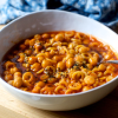
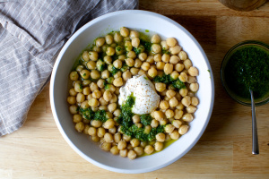

# crispy tortellini with peas and prosciutto

`pasta` `peas` `main` `prociutto`

- **Servings:** 3, petitely or 2, hungrily

Source: Inspired by [Ideas in Food](http://blog.ideasinfood.com/ideas_in_food/2016/03/march-25-2016.html)

##### In the skillet
- 3 thin slices prosciutto \(optional\)
- 1 to 2 tablespoons olive oil
- 1 13\-14 ounce package frozen cheese tortellini \(about 3 cups\)
- 1/2 cup frozen peas, no need to defrost
- 1/3 cup water
- 1 clove garlic, minced 
- Pinch of hot pepper flakes
##### To finish
- 3 tablespoons crème fraîche or mascarpone
- Juice of half a lemon, zest to taste
- Salt and freshly ground pepper
- Grated parmesan \(optional\)

Heat a large, deep skillet with a lid\*\* over medium\-high heat. If using, add prosciutto in a single layer and cook until curling and browned underneath, about 2 minutes. Flip over and let cook until browned on the other side. Transfer a paper towel to blot oil and cool.
Add oil to same skillet and heat it for a minute. Add frozen tortellini in a single layer and cook for 2 to 4 minutes, until they’re browned underneath. Sprinkle with frozen peas and add water to pan. Be careful; it’s going to ROARHISS wildly. Put the lid on, and let them steam for about 5 minutes but don’t go too far because if the water cooks off too quickly, you’ll want to add a splash more. At 5 minutes, all water should have cooked off. Push pasta and peas to the side. Add garlic and hot pepper flakes and stir aroind with pasta. If you find any pasta has stuck, just add a splash more water over high heat to “deglaze” them off — loosen them with a thin spatula and toss them around until they’re crisp again.
Immediately dollop on crème fraîche so it melts over the pasta. Squeeze lemon juice over and add lemon zest, then sprinkle with salt, pepper, crumble prosciutto over \(if using\), then slivers of mint and parmesan, if desired. Dig in. Give your freezer a pat on its back.
- I use [this one](http://amzn.to/24GKxIW).

See more: [Pasta](https://smittenkitchen.com/category/recipes/pasta/), [Peas](https://smittenkitchen.com/category/recipes/vegetable/peas/), [Photo](https://smittenkitchen.com/category/recipes/photo/), [Quick](https://smittenkitchen.com/category/recipes/quick/), [Weeknight Favorite](https://smittenkitchen.com/category/recipes/weeknight-favorite/)

### Rate this:

## Like this post? Subscribe for more\!

## Post navigation

### Leave a Reply [Cancel reply](https://smittenkitchen.com/2016/05/crispy-tortellini-with-peas-and-prosciutto/#respond)

Your email address will not be published. Required fields are marked \*

Comment 

Name \* 

Email \* 

Website 

New here? You might want to check out the [comment guidelines](https://smittenkitchen.com/comment-guidelines) before chiming in.

I Made This

I Have a Question

 Notify me of new comments via email.

## 136 comments on crispy tortellini with peas and prosciutto

1. **Alice**
    Haha\! That is still so, so obviously the freezer of a city dweller. :\) As a dweller of the\-middle\-of\-nowhere\-in\-Montana we have not one but two 20 cubic foot freezers in addition to the one that’s half the fridge. All are so jam packed full that you couldn’t fit another slice of bread in any of them… of course, one of them does have half an elk in it… That takes up quite a bit of room.
    [May 9, 2016at12:03 pm](https://smittenkitchen.com/2016/05/crispy-tortellini-with-peas-and-prosciutto/#comment-832453)[Reply](https://smittenkitchen.com/2016/05/crispy-tortellini-with-peas-and-prosciutto/?replytocom=832453#respond)
2. **Jeri Lynn**
    Oh man\! that sounds amazing\! I shall have to try this sooner than later\! \<3
    [May 9, 2016at12:10 pm](https://smittenkitchen.com/2016/05/crispy-tortellini-with-peas-and-prosciutto/#comment-832454)[Reply](https://smittenkitchen.com/2016/05/crispy-tortellini-with-peas-and-prosciutto/?replytocom=832454#respond)
3. [Mike @ Optional Kitchen](http://optionalkitchen.com/)
    I laughed through this whole thing, because I tried to put a bottle of fruit brandy in my freezer the other day, and entirely failed to fit it among that piles of random frozen berries, Thin Mints, and chicken bones. And now that I need to start stocking tortellini — because this crispy tortellini business is eye\-opening — it’ll be even harder :\)
    [May 9, 2016at12:11 pm](https://smittenkitchen.com/2016/05/crispy-tortellini-with-peas-and-prosciutto/#comment-832455)[Reply](https://smittenkitchen.com/2016/05/crispy-tortellini-with-peas-and-prosciutto/?replytocom=832455#respond)
4. [Kristin](http://www.thirdstoryies.com/)
    Ha\! I love Alice’s comment.
    We grew up with a deep freeze as well. I refuse to get one because the thought of it filling up and us never reaching the bottom makes me slightly crazy. I prefer the jam\-packed tiny one.
    Love this idea – we had kebobs with tortellini on them this past weekend while camping. I think the crispy part might be fantastic for that use as well.
    [May 9, 2016at12:16 pm](https://smittenkitchen.com/2016/05/crispy-tortellini-with-peas-and-prosciutto/#comment-832456)[Reply](https://smittenkitchen.com/2016/05/crispy-tortellini-with-peas-and-prosciutto/?replytocom=832456#respond)
5. [Ashley](http://www.twotylersandababy.com/)
    Do you think this would work with the refrigerated tortellini? Or should I freeze them first?
    [May 9, 2016at12:16 pm](https://smittenkitchen.com/2016/05/crispy-tortellini-with-peas-and-prosciutto/#comment-832457)[Reply](https://smittenkitchen.com/2016/05/crispy-tortellini-with-peas-and-prosciutto/?replytocom=832457#respond)
6. [Kristin](http://www.thirdstoryies.com/)
    Also – to Mike’s comment – Yes, thin mint overload in our freezer as well.
    [May 9, 2016at12:16 pm](https://smittenkitchen.com/2016/05/crispy-tortellini-with-peas-and-prosciutto/#comment-832458)[Reply](https://smittenkitchen.com/2016/05/crispy-tortellini-with-peas-and-prosciutto/?replytocom=832458#respond)
7. [Annette | Food Science Nerd](http://foodsciencenerd.com/)
    What an absolutely perfect weeknight meal\! I’ll definitely have to try this… maybe with some of the frozen veggies that fall out of my own freezer every time I open it\!
    [May 9, 2016at12:16 pm](https://smittenkitchen.com/2016/05/crispy-tortellini-with-peas-and-prosciutto/#comment-832459)[Reply](https://smittenkitchen.com/2016/05/crispy-tortellini-with-peas-and-prosciutto/?replytocom=832459#respond)
8. Oh wow\! I haven’t done anything with frozen tortellini except mix it with pesto and broccoli. This looks amazing\!
    Do you think it would work with asparagus? \(We’re a low\-pea household.\)
    [May 9, 2016at12:17 pm](https://smittenkitchen.com/2016/05/crispy-tortellini-with-peas-and-prosciutto/#comment-832460)[Reply](https://smittenkitchen.com/2016/05/crispy-tortellini-with-peas-and-prosciutto/?replytocom=832460#respond)
    **JustaTech**
9. [Mary](http://www.blossomtostem.net/)
    I have an irrational fear of being crushed in a freezer cascade…
    I love Aki and Alex’s blog\! I missed their post on this, but this is genius.
    [May 9, 2016at12:19 pm](https://smittenkitchen.com/2016/05/crispy-tortellini-with-peas-and-prosciutto/#comment-832461)[Reply](https://smittenkitchen.com/2016/05/crispy-tortellini-with-peas-and-prosciutto/?replytocom=832461#respond)
10. [Raising The Capable Student](http://www.thecapablestudent.com/)
    I have to admit that I have a freezer in my garage in addition to my fridge/freezer, but sadly no forgotten tortellini resides either. This looks worth keeping a bag or two on hand, though\!
    [May 9, 2016at12:28 pm](https://smittenkitchen.com/2016/05/crispy-tortellini-with-peas-and-prosciutto/#comment-832462)[Reply](https://smittenkitchen.com/2016/05/crispy-tortellini-with-peas-and-prosciutto/?replytocom=832462#respond)
11. Would ricotta work in place of creme fraiche? I am more likely to have that hanging around.
    And my sad freezer situation is almost\-empty cartons of ice cream. Why finish when you could just start a new one?
    [May 9, 2016at12:34 pm](https://smittenkitchen.com/2016/05/crispy-tortellini-with-peas-and-prosciutto/#comment-832463)[Reply](https://smittenkitchen.com/2016/05/crispy-tortellini-with-peas-and-prosciutto/?replytocom=832463#respond)
    **Margaret**
12. **araminty**
    This also works with ravioli, fwiw.
    [May 9, 2016at12:35 pm](https://smittenkitchen.com/2016/05/crispy-tortellini-with-peas-and-prosciutto/#comment-832464)[Reply](https://smittenkitchen.com/2016/05/crispy-tortellini-with-peas-and-prosciutto/?replytocom=832464#respond)
13. [Allyson](http://consideringtheradish.wordpress.com/)
    Having no kids yet, I haven’t had frozen tortellini since I was a kid \(when I used to eat them frozen as a snack\). Now I remember on all the brilliance I’m missing out on.
    [May 9, 2016at12:41 pm](https://smittenkitchen.com/2016/05/crispy-tortellini-with-peas-and-prosciutto/#comment-832465)[Reply](https://smittenkitchen.com/2016/05/crispy-tortellini-with-peas-and-prosciutto/?replytocom=832465#respond)
14. I think I could sell this to Mr. Anti\-Pasta \(unfortunately he isn’t Mr. Antipasto\). And I am totally in with JustaTech’s asparagus substitution. Our freezer is too full for frozen peas right now.
    Seriously, how did you not exploit the modern miracle that is a freezer until now? But welcome to the club\!
    [May 9, 2016at12:41 pm](https://smittenkitchen.com/2016/05/crispy-tortellini-with-peas-and-prosciutto/#comment-832466)[Reply](https://smittenkitchen.com/2016/05/crispy-tortellini-with-peas-and-prosciutto/?replytocom=832466#respond)
    [Taste of France](http://francetaste.wordpress.com/)
15. **Thalia**
    With three kids under five at home and absolutely zero desire to drag them all to a market before dinner I love this idea. The problem is I don’t have creme fraiche or mascarpone in the house right now. Do you think plain greek yogurt would work? Thanks\!\!
    [May 9, 2016at12:43 pm](https://smittenkitchen.com/2016/05/crispy-tortellini-with-peas-and-prosciutto/#comment-832467)[Reply](https://smittenkitchen.com/2016/05/crispy-tortellini-with-peas-and-prosciutto/?replytocom=832467#respond)
16. **Thomas**
    Second the fridge vs. frozen tortellini question. I’ve got some of that open right now so I may need to try this tonight.
    [May 9, 2016at12:43 pm](https://smittenkitchen.com/2016/05/crispy-tortellini-with-peas-and-prosciutto/#comment-832468)[Reply](https://smittenkitchen.com/2016/05/crispy-tortellini-with-peas-and-prosciutto/?replytocom=832468#respond)
17. **Brianne**
    Do you have a a favored frozen tortellini brand? Frozen torts are a weekday kid food staple in our house and this might make it appetizing enough for the grown\-ups, too:\)
    [May 9, 2016at12:44 pm](https://smittenkitchen.com/2016/05/crispy-tortellini-with-peas-and-prosciutto/#comment-832469)[Reply](https://smittenkitchen.com/2016/05/crispy-tortellini-with-peas-and-prosciutto/?replytocom=832469#respond)
18. **Rachel**
    About 6 months ago I did something like this when I discovered your tomato sauce with the onion and butter…my kids get tired of pasta and sauce. I re\-branded it as Italian won\-tons after crisping the ravioli in a pan of butter and they happily dipped and asked for more\!\!
    [May 9, 2016at12:46 pm](https://smittenkitchen.com/2016/05/crispy-tortellini-with-peas-and-prosciutto/#comment-832470)[Reply](https://smittenkitchen.com/2016/05/crispy-tortellini-with-peas-and-prosciutto/?replytocom=832470#respond)
19. [Ashleigh @ Betty Crocker’s Daughter](http://bettycrockersdaughter.com/)
    This is totally genius. I am definitely going to add this to next week’s menu. Do you have any suggestions for a vegetarian\-friendly alternative to the prosciutto? I’m sure the salty bite it has adds a lot to the dish, so I’m hesitant to skip it entirely.
    [May 9, 2016at12:59 pm](https://smittenkitchen.com/2016/05/crispy-tortellini-with-peas-and-prosciutto/#comment-832471)[Reply](https://smittenkitchen.com/2016/05/crispy-tortellini-with-peas-and-prosciutto/?replytocom=832471#respond)
20. **Kris**
    Ha, I just realized I am so part of the “childless young couple” freezer gang – ours currently has 1/3 of a bottle of gin, two bags of frozen berries, and an ice cube tray.
    [May 9, 2016at1:00 pm](https://smittenkitchen.com/2016/05/crispy-tortellini-with-peas-and-prosciutto/#comment-832472)[Reply](https://smittenkitchen.com/2016/05/crispy-tortellini-with-peas-and-prosciutto/?replytocom=832472#respond)
21. **C**
    could you please fix this typo? \(years and kids have \*wreaked\* havoc\)
    [May 9, 2016at1:10 pm](https://smittenkitchen.com/2016/05/crispy-tortellini-with-peas-and-prosciutto/#comment-832473)[Reply](https://smittenkitchen.com/2016/05/crispy-tortellini-with-peas-and-prosciutto/?replytocom=832473#respond)
22. [Emily @ Her Lime Life](http://www.herlimelife.com/)
    The fact that you can cook tortellini like potstickers is absolutely life changing for me. I love the idea of peas and prosciutto with this\! My 4\-year\-old will be a huge fan.
    [May 9, 2016at1:20 pm](https://smittenkitchen.com/2016/05/crispy-tortellini-with-peas-and-prosciutto/#comment-832474)[Reply](https://smittenkitchen.com/2016/05/crispy-tortellini-with-peas-and-prosciutto/?replytocom=832474#respond)
23. **Laura P.**
    Hmm. I may be part of a childless\-so\-far young couple, but my freezer is JAM PACKED because 1\) I love to cook, and 2\) I hate wasting food. Too much pasta sauce for the night’s pasta? Into the freezer with it. Brown rice takes forever to cook? Make a double batch, and stick half in the freezer. And of course, save that roasted red pepper sauce with smoked paprika, in case you need something quick and tasty to toss with some of those frozen shrimp you keep on hand, after you’ve thawed, shelled, and cooked them. Oh, and need something quick for a weeknight single\-girl dinner when the husband is away for work and you don’t want to spend forever cooking after you’ve worked out? Gotta have those veggie burgers and buns on hand. Someone brought a whole quiche to a party, it never got cut into, and no one wanted to bring it home? Into the freezer with it\!
    Now, I’m just trying to get better about actually USING the stuff I put in the freezer. Labeling helps, I find.
    [May 9, 2016at1:47 pm](https://smittenkitchen.com/2016/05/crispy-tortellini-with-peas-and-prosciutto/#comment-832475)[Reply](https://smittenkitchen.com/2016/05/crispy-tortellini-with-peas-and-prosciutto/?replytocom=832475#respond)
    1. **C**
        Same here. I find I have a lot of bread ends for crumbs. I made a “map” that lists the contents of each section — good for “I know I had X, but where is it?” That doesn’t mean I cleared out enough this summer to make room for the ice cream canister, though .
        [November 1, 2016at3:34 pm](https://smittenkitchen.com/2016/05/crispy-tortellini-with-peas-and-prosciutto/#comment-863312)[Reply](https://smittenkitchen.com/2016/05/crispy-tortellini-with-peas-and-prosciutto/?replytocom=863312#respond)
24. **Lauren**
    I always look forward to your posts, but I’ve never commented before. :\) This recipe looks great\! As a mother of two quite small children, I love quick recipes with ingredients from the freezer\! Also couldn’t help but notice the Lansinoh bags in the door. Your freezer looks just like mine. :\)
    [May 9, 2016at1:52 pm](https://smittenkitchen.com/2016/05/crispy-tortellini-with-peas-and-prosciutto/#comment-832476)[Reply](https://smittenkitchen.com/2016/05/crispy-tortellini-with-peas-and-prosciutto/?replytocom=832476#respond)
25. **Lee**
    And now I know what to do with the leftover prosciutto from the asparagus frittata\!
    [May 9, 2016at2:04 pm](https://smittenkitchen.com/2016/05/crispy-tortellini-with-peas-and-prosciutto/#comment-832477)[Reply](https://smittenkitchen.com/2016/05/crispy-tortellini-with-peas-and-prosciutto/?replytocom=832477#respond)
26. **JP**
    Besides our bottom of the fridge freezer, we have a full standing freezer that gets to the point where I beg my husband \(who keeps buying great deals in the meat dept. to freeze\) to please write an inventory of what is inside because I have no idea what is in there any more. Our new motto is “shop the freezer”\(meaning: no more purchases until the freezer is at least semi empty\). I don’t think even a bag of tortellini would fit in there since my husband brought home a whole ham from his mother’s house. sigh.
    [May 9, 2016at2:26 pm](https://smittenkitchen.com/2016/05/crispy-tortellini-with-peas-and-prosciutto/#comment-832478)[Reply](https://smittenkitchen.com/2016/05/crispy-tortellini-with-peas-and-prosciutto/?replytocom=832478#respond)
27. **Kelsey Lane**
    I am going to make this with chopped vegetarian bacon. And maybe half a dozen finely chopped kalamata olives.
    [May 9, 2016at2:32 pm](https://smittenkitchen.com/2016/05/crispy-tortellini-with-peas-and-prosciutto/#comment-832479)[Reply](https://smittenkitchen.com/2016/05/crispy-tortellini-with-peas-and-prosciutto/?replytocom=832479#respond)
28. **Maya**
    Any substitutions you would suggest for the prosciutto? This sounds amazing but the Jewish guilt in me won’t let me try pork products just yet haha
    [May 9, 2016at2:52 pm](https://smittenkitchen.com/2016/05/crispy-tortellini-with-peas-and-prosciutto/#comment-832480)[Reply](https://smittenkitchen.com/2016/05/crispy-tortellini-with-peas-and-prosciutto/?replytocom=832480#respond)
29. [deb](http://smittenkitchen.com/)
    Prosciutto — I promise, you will not miss it. I added it for color and texture, but for flavor, there’s so much going on \(cheesy tortellini, sweet peas, lemon, cream, mint, salt, pepper and more cheese, if you like\) that you’ll be just fine without it. That said, my favorite bacon\-less crispy swap? Fried capers. I don’t know that I’d use them here, or that you need to \(again, peas, cream, mint, lemon\) but they’re wonderfully crunchy and salty. [I talk about them here.](https://smittenkitchen.com/blog/2014/09/cauliflower-slaw/) 
    C — Whoops, now fixed.
    Favorite brand of tortellini — I don’t have one. I probably buy the Trader Joe’s “spinach” ones more often than most and will freeze them until needed; they’re pretty good. I went on a little research bender and found that someone \(Serious Eats or Cook’s Illustrated or the like\) had tested many brands and found the Servioli brand to be their favorite. If I went to the store looking for meat tortellini, I wouldn’t find it in 10 stores, but of course this was all my store had in this brand so I didn’t use it here. 
    Fridge vs. freezer — I’d go ahead and freeze any refrigerated ones or it won’t work as well here.
    Ricotta for creme fraiche — I like this in pasta dolloped on at the end. It does not melt into a creamy sauce and you should use more than 1T per bowl. [See here for how I do it](https://smittenkitchen.com/blog/2013/06/bowties-with-sugar-snaps-lemon-and-ricotta/).
    Using greek yogurt for creme fraiche — It’s not my favorite in warm situations or with lemon juice because it can curdle a little.
    JustaTech — Definitely. I would cut a few stalks into very thin slices on the bias when still raw, add when you’d the peas.
    Lauren — Hopefully you’re smart enough not to store them on the door, which means they always fall, which means their corners bust a little, which we forget about until we defrost them and they leak.
    [May 9, 2016at3:18 pm](https://smittenkitchen.com/2016/05/crispy-tortellini-with-peas-and-prosciutto/#comment-832481)[Reply](https://smittenkitchen.com/2016/05/crispy-tortellini-with-peas-and-prosciutto/?replytocom=832481#respond)
30. [Jess](http://www.pluckys-secondthought.com/)
    WOW…this sounds amazing\!\! YUMMY\!
    I would LOVE to invite you to share this with my viewers at Cooking and Crafting with J & J: [http://www.pluckys\-secondthought.com/cooking\-crafting\-j\-j\-link\-49\-48\-features/](http://www.pluckys-secondthought.com/cooking-crafting-j-j-link-49-48-features/)
    Also, you can share this with my Recipes, Crafts, Tips and Tricks Facebook group: [https://www.facebook.com/groups/pluckyrecipescraftstips/](https://www.facebook.com/groups/pluckyrecipescraftstips/)
    [May 9, 2016at3:27 pm](https://smittenkitchen.com/2016/05/crispy-tortellini-with-peas-and-prosciutto/#comment-832482)[Reply](https://smittenkitchen.com/2016/05/crispy-tortellini-with-peas-and-prosciutto/?replytocom=832482#respond)
31. [Tree](http://www.nwxne.com/)
    This combines many things I love. And, with our own little one at home, we often have frozen tortellini in the \(also\-packed\) freezer. I might even get her to eat peas this way\! \(Maybe… she’s been picking out green things lately. Sigh.\) Thank you again for a wonderful and totally do\-able recipe. :\)
    [May 9, 2016at3:32 pm](https://smittenkitchen.com/2016/05/crispy-tortellini-with-peas-and-prosciutto/#comment-832483)[Reply](https://smittenkitchen.com/2016/05/crispy-tortellini-with-peas-and-prosciutto/?replytocom=832483#respond)
32. **Laryssa K**
    I’m not a fan of peas, but I suspect this would be amazing with some ribboned asparagus instead\!
    [May 9, 2016at3:41 pm](https://smittenkitchen.com/2016/05/crispy-tortellini-with-peas-and-prosciutto/#comment-832484)[Reply](https://smittenkitchen.com/2016/05/crispy-tortellini-with-peas-and-prosciutto/?replytocom=832484#respond)
33. **Nicole**
    HAPPY BIRTHDAY TO ME\!\!\! I will be making this for my birthday [dinner on Wednesday](). And cake. Still need to plan my cake.
    [May 9, 2016at3:41 pm](https://smittenkitchen.com/2016/05/crispy-tortellini-with-peas-and-prosciutto/#comment-832485)[Reply](https://smittenkitchen.com/2016/05/crispy-tortellini-with-peas-and-prosciutto/?replytocom=832485#respond)
34. **Sowmya**
    Hey Deb,
    This is completely unrelated to this post but I figured this is as good a place as any to thank you :\)
    I started reading your blog 6 years back when my first attempt to bake a cake turned into a square so\-crunchy\-it\-can\-break\-your\-teeth mess that I actually hid it on top of the fridge before my dinner guests came over. Over the years, I started trying simple recipes from your blog and gained enough confidence to try my own variations. Really love all the details you add to your recipes and the prompt responses\! I should also add that more often than not, if I ctrl\+f a specific substitution/variation there’s at least one other person who has given it a try, the comment section is as useful as the actual recipe :\)
    This past weekend I made a quarter sheet cake and cupcakes to serve 55 guests for my daughter’s birthday party. I made way more cake than we needed because I usually overestimate the amount of food we need and expected to end up with lot of leftovers. Imagine my surprise when more than half the guests helped themselves to seconds and we had no cake left and had barely enough for the rest of the family\! I would like to sincerely thank you for all your help through these years :\) Cheers\!
    p.s: Apologize for the long comment, this was long overdue. I start typing a thank you note every time I throw a successful dinner party or brunch but the success from last weekend made me actually post the note :\)
    [May 9, 2016at3:52 pm](https://smittenkitchen.com/2016/05/crispy-tortellini-with-peas-and-prosciutto/#comment-832486)[Reply](https://smittenkitchen.com/2016/05/crispy-tortellini-with-peas-and-prosciutto/?replytocom=832486#respond)
35. **Sowmya**
    Oops, I meant barely enough cupcakes\*
    Also, am one of the few people that bought your cookbook because I like the way you write, I hope to actually start cooking from it before you release your second book ;\)
    [May 9, 2016at3:54 pm](https://smittenkitchen.com/2016/05/crispy-tortellini-with-peas-and-prosciutto/#comment-832487)[Reply](https://smittenkitchen.com/2016/05/crispy-tortellini-with-peas-and-prosciutto/?replytocom=832487#respond)
36. Deb\! You look great; I think this is my favorite picture of you from now on :\) what a nice gang\! That dress looks perfecto on you.
    When I opened up SK I thought, oh crap now we have to make tortellini? The weather was just starting to get better\! So I was relieved to hear that they are frozen ones, phew. My guess is that someone will ask if we can make this with homemade tortellini, haha\!
    I used to stock the freezer quite well but now I don’t bother anymore since we’ve moved to a cheaper city \+ I have more time. My always around freezer items are; homemade puff pastry, various meats \(all prepped and labeled\), your bolognese sauce, pasta, ice cubes and my ice cream maker\! Love the comment about the elk ;\)
    [May 9, 2016at4:06 pm](https://smittenkitchen.com/2016/05/crispy-tortellini-with-peas-and-prosciutto/#comment-832488)[Reply](https://smittenkitchen.com/2016/05/crispy-tortellini-with-peas-and-prosciutto/?replytocom=832488#respond)
    **minik**
37. [Kari @ sweetteasweetie.com](http://sweetteasweetie.com/)
    It looks extra good with the crispy bacon\!
    [May 9, 2016at4:46 pm](https://smittenkitchen.com/2016/05/crispy-tortellini-with-peas-and-prosciutto/#comment-832489)[Reply](https://smittenkitchen.com/2016/05/crispy-tortellini-with-peas-and-prosciutto/?replytocom=832489#respond)
38. Sounds yummy.
    My kids like tortellini in soup, but think frozen peas should remain frozen till they hit their mouths. \(We remain well stocked with frozen peas throughout the summer months for cool snacks.\) I may try this out on them anyway – just in case they change their minds, as my kids tend to over time.
    [May 9, 2016at5:12 pm](https://smittenkitchen.com/2016/05/crispy-tortellini-with-peas-and-prosciutto/#comment-832490)[Reply](https://smittenkitchen.com/2016/05/crispy-tortellini-with-peas-and-prosciutto/?replytocom=832490#respond)
    [Anita](http://www.1stteacher.wordpress.com/)
39. Love the dress\! Where’s it from?
    And your freezer is much less packed than mine…it’s a nightmare.
    [May 9, 2016at5:17 pm](https://smittenkitchen.com/2016/05/crispy-tortellini-with-peas-and-prosciutto/#comment-832491)[Reply](https://smittenkitchen.com/2016/05/crispy-tortellini-with-peas-and-prosciutto/?replytocom=832491#respond)
    **JessB**
40. **Ramie**
    Made this tonight and it was phenomenal\! My hubs proclaimed it was the best thing he’s ever tasted\! Very decadent but very worth it. Thanks\!\!
    [May 9, 2016at9:56 pm](https://smittenkitchen.com/2016/05/crispy-tortellini-with-peas-and-prosciutto/#comment-832492)[Reply](https://smittenkitchen.com/2016/05/crispy-tortellini-with-peas-and-prosciutto/?replytocom=832492#respond)
41. **Lisa**
    I didn’t have any cremfresh but had some herbed goat cheese…delish\! Thanks for the quick recipe. I’m adding it to my rotation\!
    [May 9, 2016at10:01 pm](https://smittenkitchen.com/2016/05/crispy-tortellini-with-peas-and-prosciutto/#comment-832493)[Reply](https://smittenkitchen.com/2016/05/crispy-tortellini-with-peas-and-prosciutto/?replytocom=832493#respond)
42. **Chad**
    I just made sure that my sugar snap peas had no empty space in my planting. Looks like I will enjoy this dish [in 60 days]() more or less. Wit peas and pods.
    [May 9, 2016at10:02 pm](https://smittenkitchen.com/2016/05/crispy-tortellini-with-peas-and-prosciutto/#comment-832494)[Reply](https://smittenkitchen.com/2016/05/crispy-tortellini-with-peas-and-prosciutto/?replytocom=832494#respond)
43. **Sally**
    For ordinary Chinese potstickers I like to use chicken broth as the liquid. I lightly brown them, add the broth, cover and simmer til done, then remove the cover and raise the heat to evaporate the broth. Beautifully brown and crispy. I think I’m going to try that with tortellini, assuming I can find any that seem to say “Chinese”.
    [May 9, 2016at10:03 pm](https://smittenkitchen.com/2016/05/crispy-tortellini-with-peas-and-prosciutto/#comment-832495)[Reply](https://smittenkitchen.com/2016/05/crispy-tortellini-with-peas-and-prosciutto/?replytocom=832495#respond)
44. **Kora**
    Quick tip for storing the breast milk bags\- a loaf pan. That way you put the new bags in the back and the older ones get pushed to the front. Orderly and in order. Congrats on keeping up with the nursing and pumping\!\! It’s not easy.
    [May 9, 2016at10:55 pm](https://smittenkitchen.com/2016/05/crispy-tortellini-with-peas-and-prosciutto/#comment-832496)[Reply](https://smittenkitchen.com/2016/05/crispy-tortellini-with-peas-and-prosciutto/?replytocom=832496#respond)
45. **Sara**
    Love the ‘ROARHISS’ descriptor\!
    [May 9, 2016at10:55 pm](https://smittenkitchen.com/2016/05/crispy-tortellini-with-peas-and-prosciutto/#comment-832497)[Reply](https://smittenkitchen.com/2016/05/crispy-tortellini-with-peas-and-prosciutto/?replytocom=832497#respond)
46. **Gerrie**
    Ok going to try this tomorrow with following change: fried sage in a wee bit of butter instead of procuitto\!
    [May 9, 2016at11:20 pm](https://smittenkitchen.com/2016/05/crispy-tortellini-with-peas-and-prosciutto/#comment-832498)[Reply](https://smittenkitchen.com/2016/05/crispy-tortellini-with-peas-and-prosciutto/?replytocom=832498#respond)
47. [Michelle](https://www.makeandmess.com/)
    This is the most delicious thing I have seen this week, I love making pasta with peas and proscuitto seems to be the perfect companion for them. I will do this\! 
    [May 10, 2016at3:10 am](https://smittenkitchen.com/2016/05/crispy-tortellini-with-peas-and-prosciutto/#comment-832499)[Reply](https://smittenkitchen.com/2016/05/crispy-tortellini-with-peas-and-prosciutto/?replytocom=832499#respond)
48. **Jenna**
    Mmm, pan fried ravioli \(we just added pasta sauce with some ripped up basil & mozzarella\) was our favourite easy meal pre\-child. We actually used fridge ravioli & I didn’t use water, I guess ravioli cooks a bit more evenly then tortellini so maybe that’s why. I also didn’t use water when I used frozen ravioli. Also a big fan of the pan fried gnocchi, boiling is so overrated… haha. Sadly my daughter is allergic to eggs, I so hope she grows out of it so I can try your amazing\-looking iteration\! Or I need to summon up the energy to make some homemade egg\-free ravioli ;\)
    [May 10, 2016at3:25 am](https://smittenkitchen.com/2016/05/crispy-tortellini-with-peas-and-prosciutto/#comment-832500)[Reply](https://smittenkitchen.com/2016/05/crispy-tortellini-with-peas-and-prosciutto/?replytocom=832500#respond)
49. **Alex**
    Oh. My. God.
    This is going to be a life changer, I can just feel it. Deb, as always, you’re an inspiration\!
    [May 10, 2016at4:07 am](https://smittenkitchen.com/2016/05/crispy-tortellini-with-peas-and-prosciutto/#comment-832501)[Reply](https://smittenkitchen.com/2016/05/crispy-tortellini-with-peas-and-prosciutto/?replytocom=832501#respond)
50. [Alexandra](http://thenewbaguette.com/)
    Yumm\! Can’t think of a perfect\-er dinner after a long day’s work.
    Potstickers and tortellini also intersect with Ukrainian varenyky\! Those are the best boiled and fried :\)
    [May 10, 2016at7:25 am](https://smittenkitchen.com/2016/05/crispy-tortellini-with-peas-and-prosciutto/#comment-832502)[Reply](https://smittenkitchen.com/2016/05/crispy-tortellini-with-peas-and-prosciutto/?replytocom=832502#respond)
51. **Jen**
    I do this with ravioli \(fresh or frozen\), flipping to get a nice crispiness on both sides. Looking forward to trying with tortellini.
    [May 10, 2016at7:41 am](https://smittenkitchen.com/2016/05/crispy-tortellini-with-peas-and-prosciutto/#comment-832503)[Reply](https://smittenkitchen.com/2016/05/crispy-tortellini-with-peas-and-prosciutto/?replytocom=832503#respond)
52. **maggie**
    Oh Alice, you just made laugh out loud\! Elk? Please tell me that I’m not the only one who is familiar with the story about dogs, wild\-ish dogs, elk, almond milk and guests from the city?
    [May 10, 2016at8:00 am](https://smittenkitchen.com/2016/05/crispy-tortellini-with-peas-and-prosciutto/#comment-832504)[Reply](https://smittenkitchen.com/2016/05/crispy-tortellini-with-peas-and-prosciutto/?replytocom=832504#respond)
53. **Vanessa F**
    Love seeing the Lansinoh bags in the door and the old\-school ice cube tray :\) Although my breastfeeding days have passed, I’m crazy about Kora’s suggestion of a loaf pan for those esrtwhile bags\!
    [May 10, 2016at9:12 am](https://smittenkitchen.com/2016/05/crispy-tortellini-with-peas-and-prosciutto/#comment-832505)[Reply](https://smittenkitchen.com/2016/05/crispy-tortellini-with-peas-and-prosciutto/?replytocom=832505#respond)
54. [deb](http://smittenkitchen.com/)
    Alice — I agree, that’s hilarious. 
    Sowmya — Thank you. I’m so glad the cake was a hit. And you’ll have lots of time to cook from it before book two because I’m rather slow at these things. ;\)
    The dress — From [Boden](http://www.bodenusa.com/en-us/womens-dresses/day-dresses/wh986/womens-casual-linen-tunic), where I spend too much time these days because they started embroidering farm animals on baby clothes and I cannot think straight when I see this. I don’t know if anyone else finds this, but I always have to order a FULL size down for women’s stuff at Boden, sometimes two. \(Thanks?\)
    [May 10, 2016at9:34 am](https://smittenkitchen.com/2016/05/crispy-tortellini-with-peas-and-prosciutto/#comment-832507)[Reply](https://smittenkitchen.com/2016/05/crispy-tortellini-with-peas-and-prosciutto/?replytocom=832507#respond)
55. **Mary**
    I’m sitting in my office pumping for my 8 mo old and am pleased to see those Lansinoh bags in your freezer. I saw the \(genius\) tortellini potsticker cooking suggestion in a previous post, but then thought… well, that’s not really a full dinner. Thank you so much for all your wonderful recipes that work so well and are so tasty.
    [May 10, 2016at9:51 am](https://smittenkitchen.com/2016/05/crispy-tortellini-with-peas-and-prosciutto/#comment-832508)[Reply](https://smittenkitchen.com/2016/05/crispy-tortellini-with-peas-and-prosciutto/?replytocom=832508#respond)
56. [Malou](https://www.maloupeters.nl/)
    It looks great. Added it on my to make list. Thanks for sharing
    [May 10, 2016at10:06 am](https://smittenkitchen.com/2016/05/crispy-tortellini-with-peas-and-prosciutto/#comment-832509)[Reply](https://smittenkitchen.com/2016/05/crispy-tortellini-with-peas-and-prosciutto/?replytocom=832509#respond)
57. **stephanie**
    haha, we have the ice \+ vodka freezer\! but, we are a childfree couple who also no longer has roommates or hosts parties, so yeah, you know how that goes :\) i do cook six nights a week but i don’t care for frozen fruit or vegetables, and aim to not make more food than we can eat in a night plus one or two lunches. also, our fridge is old and annoying and the top shelf of the refrigerator section actually keeps most stuff just frozen enough until i need it that week, lol. \(sigh.\)
    ANYWAY…i don’t even like peas, or mint in savory foods and yet…i think i’m gonna try this. it just looks so good. also gonna check out that blog\!
    [May 10, 2016at10:22 am](https://smittenkitchen.com/2016/05/crispy-tortellini-with-peas-and-prosciutto/#comment-832510)[Reply](https://smittenkitchen.com/2016/05/crispy-tortellini-with-peas-and-prosciutto/?replytocom=832510#respond)
58. [M Obaid](http://fashionideaspk.blogspot.com/)
    Great\!
    [May 10, 2016at11:46 am](https://smittenkitchen.com/2016/05/crispy-tortellini-with-peas-and-prosciutto/#comment-832511)[Reply](https://smittenkitchen.com/2016/05/crispy-tortellini-with-peas-and-prosciutto/?replytocom=832511#respond)
59. **Sarah**
    I have that linen tunic \(in an older print\) and live in it in the summer\! Also have worn it with skinny jeans in fall. And I also order down a size at Boden.
    [May 10, 2016at11:58 am](https://smittenkitchen.com/2016/05/crispy-tortellini-with-peas-and-prosciutto/#comment-832512)[Reply](https://smittenkitchen.com/2016/05/crispy-tortellini-with-peas-and-prosciutto/?replytocom=832512#respond)
60.  However. YOU WILL BE MINE CRISPY STUFFED THINGS.
     Gonna try rolling the mint and peas into balls, dropping them into a cheese/flour mix \(think yuanxiao – sweet dumplings that are made like truffles, only while shake\-shake\-shaking them in a basket of their coating\) and steam\-sautéing them to shattering frico\-ness.
     And, should this event heartbreakingly fail to pass, I shall top them with a Crispy Egg. ;\) 
     Thanks for the inspiration as usual\!
    [May 10, 2016at12:25 pm](https://smittenkitchen.com/2016/05/crispy-tortellini-with-peas-and-prosciutto/#comment-832513)[Reply](https://smittenkitchen.com/2016/05/crispy-tortellini-with-peas-and-prosciutto/?replytocom=832513#respond)
    **Linda**These are the times that I despise living in France, Land of Miniscule Freezers \(for us obsessive small\-kitchen home cooks, that is ;…and often no fridge at all in the hotels.\) 
61. **Shannon**
    Thank you so much for the perfectly written directions. I saw this on your Instagram and immediately went out and bought frozen tortellini but then wound up boiling them because I got intimidated trying to figure it out myself. I can always count on you to make it easy\!
    [May 10, 2016at2:42 pm](https://smittenkitchen.com/2016/05/crispy-tortellini-with-peas-and-prosciutto/#comment-832514)[Reply](https://smittenkitchen.com/2016/05/crispy-tortellini-with-peas-and-prosciutto/?replytocom=832514#respond)
62. [Kathy Goldman](http://www.playinwithmyfood.com/)
    This was dinner tonight and it was fabulous\! Thanks for a quick, easy, and tasty meal.
    [May 10, 2016at6:24 pm](https://smittenkitchen.com/2016/05/crispy-tortellini-with-peas-and-prosciutto/#comment-832515)[Reply](https://smittenkitchen.com/2016/05/crispy-tortellini-with-peas-and-prosciutto/?replytocom=832515#respond)
63. So, I am always waaaaay annoyed by people who comment on a recipe when they changed everything in the recipe…LOL
    I fully planned to try it as written BUT I discovers that I had no prosciutto, mint nor any peas\! I did, however have shelled edamame, bacon and sage :\)
    So there you have it. Delicious, but kind of the original’s rougher, louder brother. LOL
    [May 10, 2016at6:55 pm](https://smittenkitchen.com/2016/05/crispy-tortellini-with-peas-and-prosciutto/#comment-832516)[Reply](https://smittenkitchen.com/2016/05/crispy-tortellini-with-peas-and-prosciutto/?replytocom=832516#respond)
    **Risottogirl**
64. [Mariko Paterson](http://www.foragestudios.com/)
    Saw it. Made it. Loved it\!\!
    Hoping you won’t mind me trying a wide variety of variations in the future as Halifax, Nova Scotia has some amazing farmer market offerings as well as scallop and lobster hauls that would be pretty springy in this simple mix. PS. Love hearing you on WNYC, my former home from time to time.
    [May 10, 2016at7:13 pm](https://smittenkitchen.com/2016/05/crispy-tortellini-with-peas-and-prosciutto/#comment-832517)[Reply](https://smittenkitchen.com/2016/05/crispy-tortellini-with-peas-and-prosciutto/?replytocom=832517#respond)
65. **Pamcita**
    We always, ALWAYS have tortellini in the freezer\! I used about 2/3 of the package for this dish and then I just boiled up the rest for the kids \(we get the 20 oz family size package\). So fast, so easy, and really flavorful\! Salty crispy prosciutto makes everything better :\) 
    \(And if you’re looking for a dish to use that leftover mascarpone in, check out the 5\-ingredient strawberry tart over at howsweeteats\!\! Seriously yummy\!\)
    [May 10, 2016at7:15 pm](https://smittenkitchen.com/2016/05/crispy-tortellini-with-peas-and-prosciutto/#comment-832518)[Reply](https://smittenkitchen.com/2016/05/crispy-tortellini-with-peas-and-prosciutto/?replytocom=832518#respond)
66. **Tracy**
    Saw this today and made it tonight. As easy and quick and delicious as advertised\! So good\! Will enter our weeknight dinner rotation for sure.
    [May 10, 2016at7:50 pm](https://smittenkitchen.com/2016/05/crispy-tortellini-with-peas-and-prosciutto/#comment-832519)[Reply](https://smittenkitchen.com/2016/05/crispy-tortellini-with-peas-and-prosciutto/?replytocom=832519#respond)
67. [Dani](http://www.saltsugarandi.com/)
    Such a great idea to spruce up frozen tortellini\!\! Will be giving this a go next time I have some in the freezer for sure :\) Thanks for sharing x
    [May 10, 2016at8:11 pm](https://smittenkitchen.com/2016/05/crispy-tortellini-with-peas-and-prosciutto/#comment-832520)[Reply](https://smittenkitchen.com/2016/05/crispy-tortellini-with-peas-and-prosciutto/?replytocom=832520#respond)
68. **Ali**
    Genius technique\! I made this as close as possible to the original with the stuff I had in my house… so not very close at all. I used cheese tortellini, peas, Parmesan, Thai basil, and a lemongrass\-mint balsamic. Ridiculously good\!
    [May 10, 2016at8:44 pm](https://smittenkitchen.com/2016/05/crispy-tortellini-with-peas-and-prosciutto/#comment-832521)[Reply](https://smittenkitchen.com/2016/05/crispy-tortellini-with-peas-and-prosciutto/?replytocom=832521#respond)
69. **Charlene**
    Hmmmm . . . New way to cook frozen pierogies?
    [May 10, 2016at11:08 pm](https://smittenkitchen.com/2016/05/crispy-tortellini-with-peas-and-prosciutto/#comment-832522)[Reply](https://smittenkitchen.com/2016/05/crispy-tortellini-with-peas-and-prosciutto/?replytocom=832522#respond)
70. [Lindsay](http://lindsaysessions.wordpress.com/)
    I agree with you…Crispy tortellini are everything\! Thanks for sharing; can’t wait to try with my family\!
    [May 10, 2016at11:48 pm](https://smittenkitchen.com/2016/05/crispy-tortellini-with-peas-and-prosciutto/#comment-832523)[Reply](https://smittenkitchen.com/2016/05/crispy-tortellini-with-peas-and-prosciutto/?replytocom=832523#respond)
71. [THE HUNGRY MUM](http://www.thehungrymum.com/)
    lightbulb moment\- my gals would inhale these\! Such a fab weeknight dinner.
    [May 11, 2016at2:49 am](https://smittenkitchen.com/2016/05/crispy-tortellini-with-peas-and-prosciutto/#comment-832524)[Reply](https://smittenkitchen.com/2016/05/crispy-tortellini-with-peas-and-prosciutto/?replytocom=832524#respond)
72. [Sylwia](http://sylwiakunicka.com/)
    “ROARHISS” I almost died laughing. Genius writing 
    [May 11, 2016at7:41 am](https://smittenkitchen.com/2016/05/crispy-tortellini-with-peas-and-prosciutto/#comment-832525)[Reply](https://smittenkitchen.com/2016/05/crispy-tortellini-with-peas-and-prosciutto/?replytocom=832525#respond)
73. [Alida @My Little Italian Kitchen](http://www.mylittleitaliankitchen.com/)
    Great idea\! My children would have tortellini twice a week. I like the way you have prepared them.. crispy\!
    [May 11, 2016at10:04 am](https://smittenkitchen.com/2016/05/crispy-tortellini-with-peas-and-prosciutto/#comment-832526)[Reply](https://smittenkitchen.com/2016/05/crispy-tortellini-with-peas-and-prosciutto/?replytocom=832526#respond)
74. **Leslie**
    Loved this\! My 18\-year\-old daughter came home from her first day as a summer landscaper, craving carbs, and just about keeled over from delight. Substituted bacon for pancetta \(we have a monthly bacon subscription at a local farm where the pigs are well and happily raised\). Didn’t have creme fraiche, so I mashed cream cheese and sour cream together. Love the crispy undersides of the tortellini. Great recipe\!
    [May 11, 2016at12:56 pm](https://smittenkitchen.com/2016/05/crispy-tortellini-with-peas-and-prosciutto/#comment-832527)[Reply](https://smittenkitchen.com/2016/05/crispy-tortellini-with-peas-and-prosciutto/?replytocom=832527#respond)
75. **Katie H**
    This is a fantastic recipe. I have small kids, too and frozen ravioli or tortellini and peas are staples. The prosciutto, lemon, mint and creme fraiche added a really nice touch at the end. It’s in the permanent rotation – thank you\!
    [May 11, 2016at3:10 pm](https://smittenkitchen.com/2016/05/crispy-tortellini-with-peas-and-prosciutto/#comment-832528)[Reply](https://smittenkitchen.com/2016/05/crispy-tortellini-with-peas-and-prosciutto/?replytocom=832528#respond)
76. **Anne**
    I just made this. I REALLY love the “tooth” of the pasta done this way, it’s a revelation\! I only used 2 slices of proscuitto, which I thought was enough. I also served the hot pasta/peas over mustard greens and let them get melted by the heat to up the green in this recipe. It needed something…garlic? Chili flakes? Capers?
    [May 11, 2016at9:20 pm](https://smittenkitchen.com/2016/05/crispy-tortellini-with-peas-and-prosciutto/#comment-832529)[Reply](https://smittenkitchen.com/2016/05/crispy-tortellini-with-peas-and-prosciutto/?replytocom=832529#respond)
77. **Susan S. Dahlem**
    Home run. Fast. Flavorful. The prosciutto is a nice salty topper
    [May 11, 2016at10:35 pm](https://smittenkitchen.com/2016/05/crispy-tortellini-with-peas-and-prosciutto/#comment-832530)[Reply](https://smittenkitchen.com/2016/05/crispy-tortellini-with-peas-and-prosciutto/?replytocom=832530#respond)
78. **Laura**
    Oh, what a great idea\! Our family goes through tons of potstickers from our local Asian markets. And now I will also be adding tortellini to our freezer\! Thanks, Deb\!\!
    And I am glad that somebody else has to open their freezer carefully. My friends make jokes about it…
    [May 12, 2016at4:40 pm](https://smittenkitchen.com/2016/05/crispy-tortellini-with-peas-and-prosciutto/#comment-832531)[Reply](https://smittenkitchen.com/2016/05/crispy-tortellini-with-peas-and-prosciutto/?replytocom=832531#respond)
79. **Rena**
    We always wish we could like tortellini…but they are always so unsatisfying\! Lots of dry dough, very little filling. We buy a bag now and then to see if maybe they have improved but they never have. Anyone else find this?\!
    [May 12, 2016at8:14 pm](https://smittenkitchen.com/2016/05/crispy-tortellini-with-peas-and-prosciutto/#comment-832532)[Reply](https://smittenkitchen.com/2016/05/crispy-tortellini-with-peas-and-prosciutto/?replytocom=832532#respond)
80. [Kristina](http://www.kristinadoestheinternets.com/)
    Just made this – it was SO good\!\!
    [May 12, 2016at9:01 pm](https://smittenkitchen.com/2016/05/crispy-tortellini-with-peas-and-prosciutto/#comment-832533)[Reply](https://smittenkitchen.com/2016/05/crispy-tortellini-with-peas-and-prosciutto/?replytocom=832533#respond)
81. **Heather**
    Just made this & loved it. Used mascarpone cheese and skipped the mint.
    [May 12, 2016at9:47 pm](https://smittenkitchen.com/2016/05/crispy-tortellini-with-peas-and-prosciutto/#comment-832534)[Reply](https://smittenkitchen.com/2016/05/crispy-tortellini-with-peas-and-prosciutto/?replytocom=832534#respond)
82. **Ginger Marks**
    Made a slight variation of your recipe tonight\! My family acted like animals. I think they were just so damn happy to have something different than the usual rotation that they simply couldn’t control themselves. Oh and the fact that it was really delicious. Pancetta for president\! Well done, thank you\!\!
    [May 13, 2016at8:11 am](https://smittenkitchen.com/2016/05/crispy-tortellini-with-peas-and-prosciutto/#comment-832535)[Reply](https://smittenkitchen.com/2016/05/crispy-tortellini-with-peas-and-prosciutto/?replytocom=832535#respond)
83. **Randi**
    Delicious. Made this with what we had in the house – bacon and asparagus. Really tasty, but sadly I skipped the marscapone and used a splash of heavy cream instead with the pasta’d water. Got absorbed and didn’t make enough of a sauce. Won’t skimp on that next time. Thanks for this easy but tasty idea.
    [May 13, 2016at4:25 pm](https://smittenkitchen.com/2016/05/crispy-tortellini-with-peas-and-prosciutto/#comment-832536)[Reply](https://smittenkitchen.com/2016/05/crispy-tortellini-with-peas-and-prosciutto/?replytocom=832536#respond)
    1. **Obelia**
        I used Greek yoghurt as that’s what I tend to have on hand – worked beautifully \(though for me it was better dolloped on deliciously cool – not sure whether it would have worked if stirred in before serving\).
        [January 11, 2017at4:16 am](https://smittenkitchen.com/2016/05/crispy-tortellini-with-peas-and-prosciutto/#comment-889153)[Reply](https://smittenkitchen.com/2016/05/crispy-tortellini-with-peas-and-prosciutto/?replytocom=889153#respond)
84. [Michelle](http://whatscooking.whiddon.org/)
    This popped up on Facebook this morning, and I immediately knew it would be dinner tonight. 5 stars\! It was absolutely divine, and I thank you, for bringing such a quick and tasty dish into my life\! I was only able to get fresh agnolotti, not frozen tortellini, but I followed the rest of the recipe. It tasted fantastic, and but for the shape of the pasta it looked like the pictures, so I’m assuming it wasn’t much of a change to the original recipe. 
    There was a little left over, and hubby and I are wondering if it can be frozen \(if it’s not eaten [for breakfast tomorrow morning]()\)? I’m leaning towards no, but sincerely hoping yes, because if it can, I’m making a batch and freezing it as an emergency stash\!
    [May 14, 2016at5:20 am](https://smittenkitchen.com/2016/05/crispy-tortellini-with-peas-and-prosciutto/#comment-832537)[Reply](https://smittenkitchen.com/2016/05/crispy-tortellini-with-peas-and-prosciutto/?replytocom=832537#respond)
85. **Wendy**
    Hey\! Just wanted to say thanks for this recipe, and inspiring a meal. I have grown to really love cooking, largely from reading recipes on this site and learning to experiment. I love that you share how you tweaked things, and what worked and didn’t. When I can follow recipes I do, but I have also felt more confident changing things up, and using what is fresh and on hand.
    [May 15, 2016at6:01 pm](https://smittenkitchen.com/2016/05/crispy-tortellini-with-peas-and-prosciutto/#comment-832538)[Reply](https://smittenkitchen.com/2016/05/crispy-tortellini-with-peas-and-prosciutto/?replytocom=832538#respond)
86. [Michelle](http://whatscooking.whiddon.org/)
    Actually… it doesn’t keep well. Didn’t freeze it, but covered and refrigerated, and eaten the next day. Edible, but loses so much. 
    More for us the day we cook it\!
    [May 15, 2016at9:00 pm](https://smittenkitchen.com/2016/05/crispy-tortellini-with-peas-and-prosciutto/#comment-832539)[Reply](https://smittenkitchen.com/2016/05/crispy-tortellini-with-peas-and-prosciutto/?replytocom=832539#respond)
87. [Ashleigh @ Betty Crocker’s Daughter](http://www.bettycrockersdaughter.com/)
    OK, you were totally right. I made this for dinner and it was amazing. It was much more flavorful than I thought it would be, even without the prosciutto. My husband was shocked when I started making dinner at 6 and called him in to eat [at 6:15](). I will definitely be tweaking the recipe all spring and summer long\!
    [May 16, 2016at6:40 pm](https://smittenkitchen.com/2016/05/crispy-tortellini-with-peas-and-prosciutto/#comment-832540)[Reply](https://smittenkitchen.com/2016/05/crispy-tortellini-with-peas-and-prosciutto/?replytocom=832540#respond)
88. [Morgan](http://www.morganworoner.com/)
    Oh man…I made this for dinner tonight. SO GOOD. We replaced the water with a dry white wine, which worked out well. Thanks again for a time saver that looks and tastes like it came from a restaurant.
    [May 16, 2016at7:19 pm](https://smittenkitchen.com/2016/05/crispy-tortellini-with-peas-and-prosciutto/#comment-832541)[Reply](https://smittenkitchen.com/2016/05/crispy-tortellini-with-peas-and-prosciutto/?replytocom=832541#respond)
89. **Naomi**
    Prior to reading this, I’d had pan fried gnocchi \(or as my Bubby called them, kliskalech\) but never pan fried tortellini. I made it last night and it was a delicious quick meal. I added cherry tomatoes and chopped zucchini to the pan at the end, and I subbed sour cream and basil for the creme fraiche and mint. Topped with the prosciutto, this meal is definitely going on my make\-again list\! Thanks\!
    [May 18, 2016at6:40 am](https://smittenkitchen.com/2016/05/crispy-tortellini-with-peas-and-prosciutto/#comment-832542)[Reply](https://smittenkitchen.com/2016/05/crispy-tortellini-with-peas-and-prosciutto/?replytocom=832542#respond)
90. **Susan**
    Do the tortellini have to be frozen for this to work? My grocery store only carries fresh, but I could put them in the freezer overnight if need be.
    [May 19, 2016at12:50 pm](https://smittenkitchen.com/2016/05/crispy-tortellini-with-peas-and-prosciutto/#comment-832543)[Reply](https://smittenkitchen.com/2016/05/crispy-tortellini-with-peas-and-prosciutto/?replytocom=832543#respond)
91. **Diana**
    Holy Moses\! This recipe looks both scrumptious and easy, my fave combo, so will definitely be trying it but … I clicked onto your 2008 ‘Project Wedding Cake’ blog entries, and whoa\! You must REALLY REALLY love your friends\!\! I am envious of your skill, in awe of your fortitude, and jealous of all of the guests at the party who got to eat it. Wow. I LOVE YOUR BLOG, truly\!
    [May 19, 2016at8:38 pm](https://smittenkitchen.com/2016/05/crispy-tortellini-with-peas-and-prosciutto/#comment-832544)[Reply](https://smittenkitchen.com/2016/05/crispy-tortellini-with-peas-and-prosciutto/?replytocom=832544#respond)
92. **Sarah**
    This is going to save my life when my daughter comes home from college and wants to try out her cooking skills. Thanks\! But hey, what about deglazing with a little white wine/chicken broth instead of \(or in addition to\) water? Too much flavor?
    [May 20, 2016at12:43 pm](https://smittenkitchen.com/2016/05/crispy-tortellini-with-peas-and-prosciutto/#comment-832545)[Reply](https://smittenkitchen.com/2016/05/crispy-tortellini-with-peas-and-prosciutto/?replytocom=832545#respond)
93. **Kim**
    Awesome\! A huge hit with my family. On my husband’s “keeper” list. 
    6
    [May 20, 2016at7:40 pm](https://smittenkitchen.com/2016/05/crispy-tortellini-with-peas-and-prosciutto/#comment-832546)[Reply](https://smittenkitchen.com/2016/05/crispy-tortellini-with-peas-and-prosciutto/?replytocom=832546#respond)
94. [Silvia](http://silvialacenails.blogspot.it/)
    I like to comment on your recipes from time to time. As one of your Italian readers I find it difficult to comment on this particular recipe, especially since I live in the birthplace of tortellini. It’s actually quite funny to see other people use tortellini in a way that doesn’t involve either broth or cream and parmigiano \(the tortellino cult only accepts broth, handmade obviously\). I’m sure if I shared this with my friends they’d all be raising their fists in the air and curse, but nothing fazes me after I saw that tortellini salad one time. I could see this as a great option for pasta, though I’d skip on the peas for personal preference. I wish I could send you some of my handmade tortellini\!\!\!
    [May 22, 2016at3:46 am](https://smittenkitchen.com/2016/05/crispy-tortellini-with-peas-and-prosciutto/#comment-832547)[Reply](https://smittenkitchen.com/2016/05/crispy-tortellini-with-peas-and-prosciutto/?replytocom=832547#respond)
95. **Perdy**
    Just made this for the children’s supper and they loved it\! We always seem to have frozen pasta lurking in the freezer so this has immediately become a great recipe for us. Children are particularly impressed it is a recipe all the way from New York \(we are in the UK\)\!
    [May 22, 2016at12:37 pm](https://smittenkitchen.com/2016/05/crispy-tortellini-with-peas-and-prosciutto/#comment-832548)[Reply](https://smittenkitchen.com/2016/05/crispy-tortellini-with-peas-and-prosciutto/?replytocom=832548#respond)
96. **Lina Di Marco**
    This recipe looks very interesting but i would love to know if meat filled frozen tortellini can be used instead?
    T\-Y…from Montreal
    [May 22, 2016at3:27 pm](https://smittenkitchen.com/2016/05/crispy-tortellini-with-peas-and-prosciutto/#comment-832549)[Reply](https://smittenkitchen.com/2016/05/crispy-tortellini-with-peas-and-prosciutto/?replytocom=832549#respond)
    1. [deb](http://smittenkitchen.com/)
        Lina — I’ve done it with meat ones too. \(Not with peas and proscuitto, but that’s to each their own.\)
        [May 23, 2016at1:33 pm](https://smittenkitchen.com/2016/05/crispy-tortellini-with-peas-and-prosciutto/#comment-832550)[Reply](https://smittenkitchen.com/2016/05/crispy-tortellini-with-peas-and-prosciutto/?replytocom=832550#respond)
97. **MaggieToo**
    Brilliant, just brilliant. Potstickers/tortellini=basically the same thing. Why can’t my brain work in such an imaginative way?
    Made these last night, as shown with peas & prosciutto, finished with lots of lemon and parm, and they were positively swoony. I used the kind filled with Italian sweet sausage, so fennel/lemon/parm/prosciutto, what’s not to love?
    This could be highly adaptive too, maybe even salad\-type applications. Someone mentioned shaved asparagus, which would be outtasight, ditto shaved fennel.
    [May 24, 2016at3:09 pm](https://smittenkitchen.com/2016/05/crispy-tortellini-with-peas-and-prosciutto/#comment-832551)[Reply](https://smittenkitchen.com/2016/05/crispy-tortellini-with-peas-and-prosciutto/?replytocom=832551#respond)
98. **Shirley**
    One word – YUMMY\! Made as directed and we gobbled it up. Don’t understand how proscuitto is optional. I know, I know. For a vegetarian option. One thing: I have a pretty large frying pan and the tortellini were really crowded. 
    This was quick and delicious.
    [May 24, 2016at6:04 pm](https://smittenkitchen.com/2016/05/crispy-tortellini-with-peas-and-prosciutto/#comment-832552)[Reply](https://smittenkitchen.com/2016/05/crispy-tortellini-with-peas-and-prosciutto/?replytocom=832552#respond)
99. **Danielle**
    Where…How…SO GOOD\! You are a food genius\! Tried this recipe last night, you know, to impress a date I had lol and it came out wonderfully\! He asked for seconds, it fit in with my diet plan I have going on, meanwhile tasting so good I thought I was cheating my diet for the night\!
    [May 25, 2016at5:57 pm](https://smittenkitchen.com/2016/05/crispy-tortellini-with-peas-and-prosciutto/#comment-832553)[Reply](https://smittenkitchen.com/2016/05/crispy-tortellini-with-peas-and-prosciutto/?replytocom=832553#respond)
100. **Amy**
    Made this for dinner tonight and it was awesome. So easy and delicious\! This will be one of our go to recipes\!
    [June 1, 2016at8:39 pm](https://smittenkitchen.com/2016/05/crispy-tortellini-with-peas-and-prosciutto/#comment-832554)[Reply](https://smittenkitchen.com/2016/05/crispy-tortellini-with-peas-and-prosciutto/?replytocom=832554#respond)
101. [Pamela](http://girlgonewestblog.com/)
    I made this tonight and it was SO GOOD. We are generally hedonists when it comes to food so we used an entire package of prosciutto, a whole lemon and served it over arugula. Split between my boyfriend and I, we were very satisfied and pleased\! Thanks so much for being my favorite food blog in the history of ever.
    [June 6, 2016at1:00 am](https://smittenkitchen.com/2016/05/crispy-tortellini-with-peas-and-prosciutto/#comment-832555)[Reply](https://smittenkitchen.com/2016/05/crispy-tortellini-with-peas-and-prosciutto/?replytocom=832555#respond)
102. [Lauren](http://www.seabiscuitblog.com/)
    Living on our sailboat, sometimes we sustain ourselves for months with meals from the freezer\! Love this trick – will be sure to pull it out for our next beach party potluck with the other sailors. Do you think it would work with frozen, handmade pasta?
    [June 7, 2016at5:03 pm](https://smittenkitchen.com/2016/05/crispy-tortellini-with-peas-and-prosciutto/#comment-832556)[Reply](https://smittenkitchen.com/2016/05/crispy-tortellini-with-peas-and-prosciutto/?replytocom=832556#respond)
103. [Tory](http://www.apinchofthis.nyc/)
    I LOVE this idea. Must try it. First, though, I need to empty some of my overflowing freezer to house the tortellini until I’m ready to use them.
    [June 14, 2016at1:15 pm](https://smittenkitchen.com/2016/05/crispy-tortellini-with-peas-and-prosciutto/#comment-832558)[Reply](https://smittenkitchen.com/2016/05/crispy-tortellini-with-peas-and-prosciutto/?replytocom=832558#respond)
104. **Heidi**
    Just finished eating this for dinner, and it was awesome\! When you published this, we were living in India, which, while diverse in its culinary delights, is sorely lacking in the cured meats and frozen stuffed pasta departments. As soon as we got back to States, this got into my menus\! Thanks\!
    [June 14, 2016at8:41 pm](https://smittenkitchen.com/2016/05/crispy-tortellini-with-peas-and-prosciutto/#comment-832559)[Reply](https://smittenkitchen.com/2016/05/crispy-tortellini-with-peas-and-prosciutto/?replytocom=832559#respond)
105. **Shannon**
    Made this last night, and it was amazing\! Husband and I loved it\! Very simple, yet seemingly gourmet.
    [June 17, 2016at10:00 am](https://smittenkitchen.com/2016/05/crispy-tortellini-with-peas-and-prosciutto/#comment-832561)[Reply](https://smittenkitchen.com/2016/05/crispy-tortellini-with-peas-and-prosciutto/?replytocom=832561#respond)
106. **Sarah**
    Made the tortellini but trying to use up what I had in the kitchen, I made a balsamic vinegar brown butter sauce and served with toasted walnuts and parmesan – it was great, definitely making the tortellini again
    [June 20, 2016at11:16 am](https://smittenkitchen.com/2016/05/crispy-tortellini-with-peas-and-prosciutto/#comment-832562)[Reply](https://smittenkitchen.com/2016/05/crispy-tortellini-with-peas-and-prosciutto/?replytocom=832562#respond)
107. **KatieK**
    This was wonderful\!\!\! Don’t skip the prosciutto, it adds just the right amount of umami; the butcher department at my grocery store can slice just what I needed so I don’t get a package. And my husband adores peas–anything with them and he is in heaven. He took the left overs for lunch the next day and reported that it was even better. Quick and easy; perfect weeknight dinner.
    [June 21, 2016at6:50 pm](https://smittenkitchen.com/2016/05/crispy-tortellini-with-peas-and-prosciutto/#comment-832563)[Reply](https://smittenkitchen.com/2016/05/crispy-tortellini-with-peas-and-prosciutto/?replytocom=832563#respond)
108. [Sarah](http://anachronismlife.blogspot.com/)
    Just made tortellini this way with zucchini and carrots fresh from the garden. Worked like a charm. Such a good concept\!
    [June 22, 2016at12:53 pm](https://smittenkitchen.com/2016/05/crispy-tortellini-with-peas-and-prosciutto/#comment-832564)[Reply](https://smittenkitchen.com/2016/05/crispy-tortellini-with-peas-and-prosciutto/?replytocom=832564#respond)
109. **Kelly**
    I so badly want to love this recipe that I think I’m going to try it again. Last time the tortellini was hard but not crunchy and the creme fraiche just sunk to a pool at the bottom instead of coating the dish. It was kind of… Just okay. Super disappointed compared to the revelation I was expecting. The proscuitto was necessary on the spoon for any real flavor. Suggestions for what I did wrong would be most welcome\!\!\!
    [June 26, 2016at2:33 pm](https://smittenkitchen.com/2016/05/crispy-tortellini-with-peas-and-prosciutto/#comment-832565)[Reply](https://smittenkitchen.com/2016/05/crispy-tortellini-with-peas-and-prosciutto/?replytocom=832565#respond)
    1. **carol**
        I just made this. I scooped the tortellini onto a plate, immediately added a spoonful of the creme fraiche, and immediately tossed it together to coat the tortellini. Then I added the lemon, S & P, mint, and cheese. It melted into the tortellini just right. I did this separately for each plate rather than do the whole batch and then serve it. It just seemed “the freshest” this way. Not practical if you have too many people though. There were only 3 of us eating tonight, so it worked out.
        [February 22, 2017at11:59 pm](https://smittenkitchen.com/2016/05/crispy-tortellini-with-peas-and-prosciutto/#comment-901532)[Reply](https://smittenkitchen.com/2016/05/crispy-tortellini-with-peas-and-prosciutto/?replytocom=901532#respond)
110. **Lucy W**
    @Ashleigh or for any other veggie people on here, I’ve made a similar recipe with portobello mushrooms instead of the prosciutto, and it totally works to add the umami flavor that the dish needs
    [July 5, 2016at11:16 am](https://smittenkitchen.com/2016/05/crispy-tortellini-with-peas-and-prosciutto/#comment-832566)[Reply](https://smittenkitchen.com/2016/05/crispy-tortellini-with-peas-and-prosciutto/?replytocom=832566#respond)
111. **KenRUK**
    This is a perfect way to store tortellini or tortelloni \(I had used tortelloni and it worked really nicely\) \-in the freezer so it doesn’t go off, not to mention always having frozen peas in there\- and then straight to the pan when you’re actually ready to eat it. And gotta love the one pot aspect of the dish. Lovely meal\! I’ll be experimenting with fresh tomato, pancetta, and other fresh herbs in future.
    [August 3, 2016at3:44 pm](https://smittenkitchen.com/2016/05/crispy-tortellini-with-peas-and-prosciutto/#comment-840573)[Reply](https://smittenkitchen.com/2016/05/crispy-tortellini-with-peas-and-prosciutto/?replytocom=840573#respond)
112. Loved it\!
    I added some cream to the last steaming round and it reduced into a lovely sauce that picked up all the flavour from the pancetta..YUM
    [August 25, 2016at2:01 pm](https://smittenkitchen.com/2016/05/crispy-tortellini-with-peas-and-prosciutto/#comment-846640)[Reply](https://smittenkitchen.com/2016/05/crispy-tortellini-with-peas-and-prosciutto/?replytocom=846640#respond)
    **Anna**
113. **Jeannette**
    Deb, whenever I don’t know what to cook, I head straight to your blog and cookbook. Thanks for another winner\!
    [August 28, 2016at7:51 pm](https://smittenkitchen.com/2016/05/crispy-tortellini-with-peas-and-prosciutto/#comment-848496)[Reply](https://smittenkitchen.com/2016/05/crispy-tortellini-with-peas-and-prosciutto/?replytocom=848496#respond)
114. **Jane**
    As always, the bomb. And it only took about 10 minutes to make, start to finish. My children devoured it. Well done Deb.
    [August 30, 2016at8:47 pm](https://smittenkitchen.com/2016/05/crispy-tortellini-with-peas-and-prosciutto/#comment-850315)[Reply](https://smittenkitchen.com/2016/05/crispy-tortellini-with-peas-and-prosciutto/?replytocom=850315#respond)
115. What have you done?\!
    I usually make this “peas and prociutto” type thing with gnocchi or orichette for my “I don’t feel like cooking” dinner.
    Ever since I have figured out this whole “crispy tortellini” thing, it has taken over my life since you posted it. I eat it for lunch with shallots, sage, and pine nuts. Or plain tomato sauce. I can’t stop eating it.
    Forget my family —\- this is all for me.
    [October 1, 2016at8:27 pm](https://smittenkitchen.com/2016/05/crispy-tortellini-with-peas-and-prosciutto/#comment-857453)[Reply](https://smittenkitchen.com/2016/05/crispy-tortellini-with-peas-and-prosciutto/?replytocom=857453#respond)
    **DW**
116. **solsdottir**
    I think Elizabeth David had a similar recipe in her Italian Food, except she listed it among the appetizers. I can’t remember if she wanted you to cook them like you did or if it was more of a deep\-fry. I always meant to try it, and now I wll. So thanks for the inspiration.
    [November 17, 2016at3:47 pm](https://smittenkitchen.com/2016/05/crispy-tortellini-with-peas-and-prosciutto/#comment-869671)[Reply](https://smittenkitchen.com/2016/05/crispy-tortellini-with-peas-and-prosciutto/?replytocom=869671#respond)
117. **Rachael**
    I’ve made this several times, it is such a great go to meal when you have no time/will to make a big meal. Still feels like you’re eating something out of a restaurant. I use sour cream instead of the creme fraiche/marscapone as my small town grocery store does not carry either \(sigh\). Works like a charm\! Deb, you are a lifesaver. I always come here first anytime I want to try a new recipe or when I’m planning a menu for company, I’ve never been dissapointed with a SK recipe.
    [January 20, 2017at12:53 am](https://smittenkitchen.com/2016/05/crispy-tortellini-with-peas-and-prosciutto/#comment-891083)[Reply](https://smittenkitchen.com/2016/05/crispy-tortellini-with-peas-and-prosciutto/?replytocom=891083#respond)
    1. **Ken**
        I have to agree; this is such an easy, versatile, and rather posh recipe, that can be served quickly, either after long day at work, or for guests on the weekend. I’ve used left over ricotta with a bit of lemon juice mixed through it, on top, as well.
        [January 21, 2017at9:28 am](https://smittenkitchen.com/2016/05/crispy-tortellini-with-peas-and-prosciutto/#comment-891308)[Reply](https://smittenkitchen.com/2016/05/crispy-tortellini-with-peas-and-prosciutto/?replytocom=891308#respond)
118. **karyld2016**
    What?\! I had NO idea. I’m always hesitant to cook tortellini because they get mushy…now I have the answer. I’m adding tortellini to my grocery list today.
    [February 22, 2017at1:02 pm](https://smittenkitchen.com/2016/05/crispy-tortellini-with-peas-and-prosciutto/#comment-901429)[Reply](https://smittenkitchen.com/2016/05/crispy-tortellini-with-peas-and-prosciutto/?replytocom=901429#respond)
119. **Sarah**
    This might also be good with burrata over the top, instead of crème fraiche.
    [February 22, 2017at2:20 pm](https://smittenkitchen.com/2016/05/crispy-tortellini-with-peas-and-prosciutto/#comment-901439)[Reply](https://smittenkitchen.com/2016/05/crispy-tortellini-with-peas-and-prosciutto/?replytocom=901439#respond)
120. **carol**
    I made this tonight. Husband really liked it, even though I forgot to put the parmesan cheese on his. I loved all the flavors, especially the combo of mint/prosciutto/creme fraiche…I think I want to put mint in everything now\! But I didn’t love the tortellini. Maybe it’s because I’m just not a big tortellini person. \(I like it the normal way with pesto on it, but I don’t love it.\) I do love potstickers. I reckon I can make this again with some kind of short \(non\-crispy\) pasta, maybe with the peas and some broccoli and asparagus, like a pasta primavera???
    [February 22, 2017at11:48 pm](https://smittenkitchen.com/2016/05/crispy-tortellini-with-peas-and-prosciutto/#comment-901531)[Reply](https://smittenkitchen.com/2016/05/crispy-tortellini-with-peas-and-prosciutto/?replytocom=901531#respond)
121. **C**
    The sauce was great — fresh and simple. Sadly, I had no prosciutto — next time\!
    The crispy tortellini, though… I used fresh and may not have steamed them as long as directed \(the water evaporated — maybe I should have added more and kept them going longer\). They didn’t seem quite done, but the crispy part didn’t seem remarkable, either.
    [April 5, 2017at1:05 pm](https://smittenkitchen.com/2016/05/crispy-tortellini-with-peas-and-prosciutto/#comment-910990)[Reply](https://smittenkitchen.com/2016/05/crispy-tortellini-with-peas-and-prosciutto/?replytocom=910990#respond)
    1. **C**
        Quick addendum — I later realized I had purchased tortelloni, not tortellini — they probably take longer to cook.
        [April 13, 2017at11:11 am](https://smittenkitchen.com/2016/05/crispy-tortellini-with-peas-and-prosciutto/#comment-914198)[Reply](https://smittenkitchen.com/2016/05/crispy-tortellini-with-peas-and-prosciutto/?replytocom=914198#respond)
122. Hoping to make tonight. Two questions:
    1\>can you please recommend any store brands of frozen tortellini or should I go to a specialty shop?
    2\> I am finding frozen ravioli much easier than I am finding frozen tortellini. How would this recipe work with frozen ravioli, or should I keep up my search for tortellini?
    Thank you\!
    [April 27, 2017at11:54 am](https://smittenkitchen.com/2016/05/crispy-tortellini-with-peas-and-prosciutto/#comment-916565)[Reply](https://smittenkitchen.com/2016/05/crispy-tortellini-with-peas-and-prosciutto/?replytocom=916565#respond)
    [jmansky](http://jmansky.wordpress.com/)
    1. 1. I don’t have a favorite brand but I often keep Trader Joe’s spinach tortellini \(I think it has green flecks in the pasta\) in the freezer because the pieces are small, not too rich.
        2. I haven’t tried this with ravioli. I’m more worried that the center will not defrost fast enough but it can’t hurt to find out, just give it more time steaming.
        [April 27, 2017at3:02 pm](https://smittenkitchen.com/2016/05/crispy-tortellini-with-peas-and-prosciutto/#comment-916592)[Reply](https://smittenkitchen.com/2016/05/crispy-tortellini-with-peas-and-prosciutto/?replytocom=916592#respond)
        [deb](http://smittenkitchen.com/)
        1. [jmansky](http://jmansky.wordpress.com/)
            Thanks\! One more question. Would this fail with fresh tortellini? Or what if I froze fresh pasta first?
            [April 28, 2017at11:26 am](https://smittenkitchen.com/2016/05/crispy-tortellini-with-peas-and-prosciutto/#comment-916755)[Reply](https://smittenkitchen.com/2016/05/crispy-tortellini-with-peas-and-prosciutto/?replytocom=916755#respond)
            1. [deb](http://smittenkitchen.com/)
                No, I think it could work just fine. But if it’s not as thin as storebought — not to insult your tortellini skills\! my homemade would definitely not be — be ready to give it more time or steam as needed.
                [April 28, 2017at4:46 pm](https://smittenkitchen.com/2016/05/crispy-tortellini-with-peas-and-prosciutto/#comment-916790)[Reply](https://smittenkitchen.com/2016/05/crispy-tortellini-with-peas-and-prosciutto/?replytocom=916790#respond)
                1. [jmansky](http://jmansky.wordpress.com/)
                    Sorry – by “fresh” I meant store bought refrigerated instead of frozen which seems easier to find. However I did find some frozen today and wil try to recipe tonight. Thanks again\!
                    [April 28, 2017at6:04 pm](https://smittenkitchen.com/2016/05/crispy-tortellini-with-peas-and-prosciutto/#comment-916798)[Reply](https://smittenkitchen.com/2016/05/crispy-tortellini-with-peas-and-prosciutto/?replytocom=916798#respond)
123. **Meredith**
    I’ve made his a couple times now, and love it – was wondering what you thought of adding a little pangrattato? I’m wondering if that little extra crunch might put it over the top – but would it be in a good way or a bad way?
    [May 28, 2017at8:13 pm](https://smittenkitchen.com/2016/05/crispy-tortellini-with-peas-and-prosciutto/#comment-923240)[Reply](https://smittenkitchen.com/2016/05/crispy-tortellini-with-peas-and-prosciutto/?replytocom=923240#respond)
    1. [deb](http://smittenkitchen.com/)
        Pangrattato is never a bad idea on pasta.
        [May 30, 2017at8:11 pm](https://smittenkitchen.com/2016/05/crispy-tortellini-with-peas-and-prosciutto/#comment-923675)[Reply](https://smittenkitchen.com/2016/05/crispy-tortellini-with-peas-and-prosciutto/?replytocom=923675#respond)
124. **Lee Sestrich**
    Omg. Can’t wait to try this recipe\!\!
    [May 30, 2017at8:24 pm](https://smittenkitchen.com/2016/05/crispy-tortellini-with-peas-and-prosciutto/#comment-923678)[Reply](https://smittenkitchen.com/2016/05/crispy-tortellini-with-peas-and-prosciutto/?replytocom=923678#respond)

# Sign up for the weekly digest

# Popular Right Now

# THE NEW BOOK IS HERE\!

# FALL 2017 BOOK TOUR

Search for:

# Spotlight

Weeknight Favorites

fall

246 vegetarian dishes

# Archives

Archives
