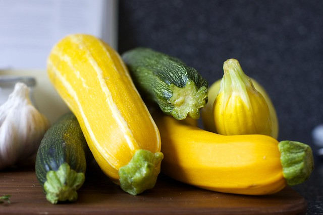
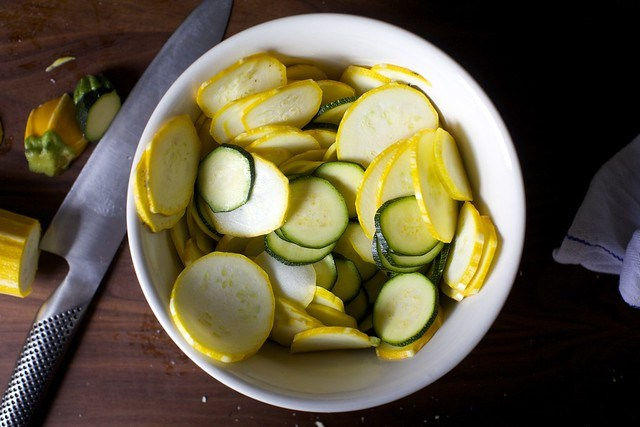
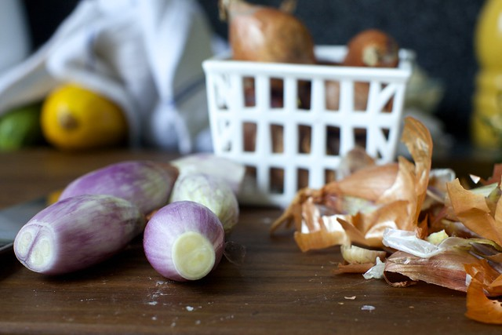
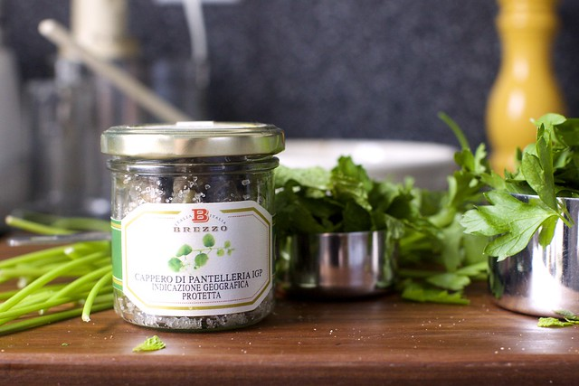
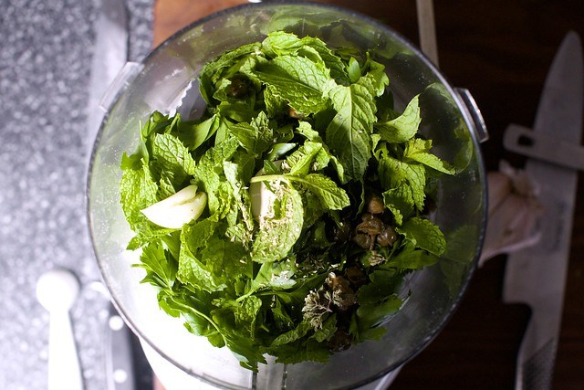
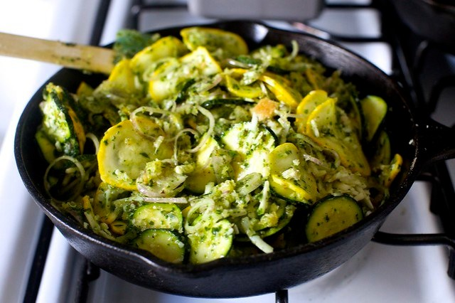
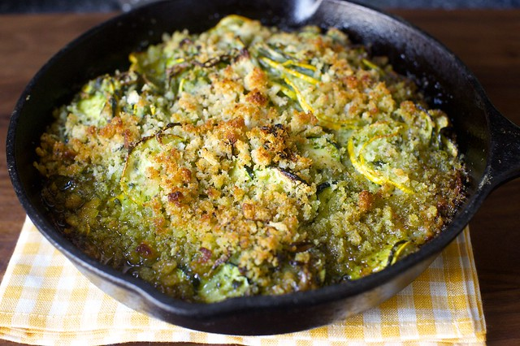
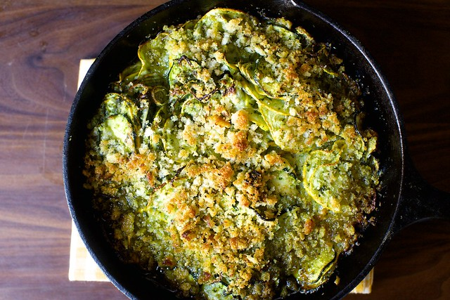

# summer squash gratin with salsa verde – smitten kitchen

`summer squash`

[Skip to content](https://smittenkitchen.com/2014/07/summer-squash-gratin-with-salsa-verde/#content)

[smitten kitchen](https://smittenkitchen.com/)

Menu[Surprise\!](https://smittenkitchen.com/?random&timestamp=1594257676685)

- [Surprise me\!](https://smittenkitchen.com/?random&timestamp=1594257676685)
- [Recipes](https://smittenkitchen.com/recipes)
- [BEST OF](https://smittenkitchen.com/recipe-collection/best-of-smitten-kitchen/?format=photo)
- [Books](https://smittenkitchen.com/book/)
- [Newsletter](https://smittenkitchen.com/subscribe/)
- [Video](https://smittenkitchen.com/video/)
- [More](https://smittenkitchen.com/2014/07/summer-squash-gratin-with-salsa-verde/#)
    - [Events](https://smittenkitchen.com/events/)
    - [About](https://smittenkitchen.com/about/)
    - [Contact](https://smittenkitchen.com/contact/)
    - [Cooking Conversions](https://smittenkitchen.com/cooking-conversions/)
    - [Good Reads](https://smittenkitchen.com/reading/)
        - [black cookbooks and memoirs](https://smittenkitchen.com/reading/black-cookbooks-and-memoirs/)
    - [Travel](https://smittenkitchen.com/travel/)
        - [48 hours in new orleans](https://smittenkitchen.com/travel/48-hours-in-new-orleans/)
        - [ten days in ireland](https://smittenkitchen.com/travel/ten-days-in-ireland/)
        - [a few favorites from spain](https://smittenkitchen.com/travel/a-few-favorites-from-spain/)
        - [notes from a weekend in mexico city](https://smittenkitchen.com/travel/notes-from-a-weekend-in-mexico-city/)
    - [Deb’s New York Favorites](https://smittenkitchen.com/travel/debs-new-york/)
    - [FAQ](https://smittenkitchen.com/about/faq/)

Search for:

## Post navigation

[Previous post: grilled peach splits \+ news\!](https://smittenkitchen.com/2014/07/grilled-peach-splits-news/) 

[Next post: bourbon slush punch](https://smittenkitchen.com/2014/07/bourbon-slush-punch/)

Recipes
# [summer squash gratin with salsa verde](https://smittenkitchen.com/2014/07/summer-squash-gratin-with-salsa-verde/)

July 22, 2014

August 11, 2017
 by [deb](https://smittenkitchen.com/author/debsk/)Jump to [comments](https://smittenkitchen.com/2014/07/summer-squash-gratin-with-salsa-verde/#comments)

For someone who has, at best, only moderate interest in eating all things zucchini and summer squash, this [site’s](https://smittenkitchen.com/recipes/vegetable/zucchini/?format=photo) [archives](https://smittenkitchen.com/recipes/vegetable/summer-squash/?format=photo) tell different story. I mean, how about a [torte](http://smittenkitchen.com/blog/2008/07/herbed-summer-squash-and-potato-torte/), some [fritters](http://smittenkitchen.com/blog/2011/08/zucchini-fritters/), [zucchini bread](http://smittenkitchen.com/blog/2007/07/summer-of-the-bats/) or [zucchini bread pancakes](http://smittenkitchen.com/blog/2012/07/zucchini-bread-pancakes/)? Maybe a [rice gratin](http://smittenkitchen.com/blog/2012/07/zucchini-rice-gratin/), [crisps](http://smittenkitchen.com/blog/2013/09/zucchini-parmesan-crisps/) or my [favorite 5\-minute side dish](http://smittenkitchen.com/blog/2007/08/my-favorite-side-dish/) is more your speed? The 40\-plus recipes from previous summers would make you think I jump for joy when the inevitable August glut of green and yellow piles at the Greenmarkets; instead, I approach them warily.

I blame my weird need for a challenge. I find zucchini and summer squash a little… slippery and limp in most dishes. It’s usually under\-seasoned. But rather than wear my failure to see what others do in a food as a [badge of honor](http://ihatecilantro.com/), it bothers me. I want to be proven wrong. Show me the light, crooknecks and cocozzelles\!

And here, to my glee, I was again shown the error of my presumptions. Summer squash is given the [Suzanne Goin](http://www.lucques.com/suzanne_goin.html) treatment, which is to say [raised](http://smittenkitchen.com/blog/2008/03/hazelnut-brown-butter-cake/) to one of its [highest](http://smittenkitchen.com/blog/2010/03/romesco-potatoes/) [callings](http://smittenkitchen.com/blog/2009/02/devils-chicken-thighs-braised-leeks/). It’s salted to help remove its moisture, then mixed with shallots, gruyere cheese, brown buttered breadcrumbs and, finally, a salsa verde \(imagine a mixed\-herb pesto without cheese which you should definitely make extra of because it’s good on everything\) before being baked together into something that’s crunchy, complex and downright a little fancy. Tuesdays should be [celebrated](https://www.flickr.com/photos/smitten/14530456180/) too, after all. 

**A good thing to know:** We tend to refer to summer squash as summer squash when it’s yellow, but as zucchini when it is green. They’re actually both summer squash and can be used interchangeably in recipes because they all taste and cook similarly. When making exchanges, use weight, of course, not number of squash as [zucchini the size of bats](http://smittenkitchen.com/blog/2007/07/summer-of-the-bats/) are a real, actual thing.

**One year ago:** [Avocado\-Shrimp Salsa](http://smittenkitchen.com/blog/2013/07/mama-canales-garcias-avocado-shrimp-salsa/)

**Two years ago:** [Zucchini Rice Gratin](http://smittenkitchen.com/blog/2012/07/zucchini-rice-gratin/)

**Three years ago:** [Sugar Plum Crepes with Ricotta and Honey](http://smittenkitchen.com/blog/2011/08/sugar-plum-crepes-with-ricotta-and-honey/)

**Four years ago:** [Scalloped Tomatoes with Croutons](http://smittenkitchen.com/blog/2010/07/scalloped-tomatoes-with-croutons/)

**Five years ago:** [Arugula Potato and Green Bean Salad](http://smittenkitchen.com/blog/2009/07/arugula-potato-and-green-bean-salad/) and [Peach and Creme Fraiche Pie](http://smittenkitchen.com/blog/2009/07/peach-and-creme-fraiche-pie/)

**Six years ago:** [Nectarine Mascarpone and Gingersnap Tart](http://smittenkitchen.com/blog/2008/07/nectarine-mascarpone-and-gingersnap-tart/)

**Seven years ago:** [Red Pepper Soup](http://smittenkitchen.com/blog/2007/07/at-last-this-soup/)

ADVERTISEMENT \- CONTINUE READING BELOW

**Summer Sqaush Gratin with Gruyere and Salsa Verde**

Adapted from [Sunday Suppers at Lucques](http://www.amazon.com/gp/product/1400042151/ref=as_li_tl?ie=UTF8&camp=1789&creative=390957&creativeASIN=1400042151&linkCode=as2&tag=smitten-20&linkId=7R3K2OV2BFNNXXGU), one of my favorite cookbooks

This recipe is riffed from one in one of my all\-time favorite cookbooks, Sunday Suppers at Lucques, though I confess that this is also the first recipe that I didn’t love exactly as written. I felt there was too much oil in the recipe \(yours will have less than photographed above\); the zucchini were swimming a bit. When I remade it, I streamlined the recipe a bit too from its restaurant origins. There’s something fancy about this, but in a good way, whether or not you serve it with an egg on top or the veal chops she recommends \(we use lamb chops\); it’s definitely more work than your average toss\-and\-bake weeknight dish, but there’s also miles more flavor than in my usual vegetable roast.

A few ingredient notes: As noted above, you can use zucchini or summer squash interchangeably here. You can grind 1 1/2 cup fresh breadcrumbs from 2 small dinner rolls or 3 slices of sandwich bread. If you’re not into anchovies, you can skip it \(which will also make this a vegetarian dish\), but you might want to bump up the capers a little so you don’t miss out on the salty/brininess. 

Serves 4 to 6

Gratin

2 pounds summer squash

Salt

1 1/2 cup fresh breadcrumbs

3 tablespoons unsalted butter

3/4 cup thinly sliced shallots \(from 4 to 5 medium\)

1 cup grated gruyere cheese

1/4 cup salsa verde \(below\)

Freshly ground black pepper

Salsa verde

1 tablespoon thyme leaves

1 teaspoon marjoram or oregano leaves \(or half, if dried\)

1/4 cup coarsely chopped mint leaves

1 cup coarsely chopped flat\-leaf parsley

2 small cloves garlic

1 salt\-packed anchovy, rinsed and bones removed

1 tablespoon capers, drained \(and rinsed, too, if salt\-packed\)

1/2 cup olive oil

1/2 lemon, or more to taste

Heat your oven to 400°F. Cut the squash into thin \(1/8\-inch thick\) coins. Toss with 1 teaspoon kosher salt and set aside for at least 10 minutes. Drain zucchini in a colander, and if you have time, spread them on a towel for a few minutes to further wick away moisture before placing it in a large mixing bowl.

Meanwhile, place breadcrumbs in a small bowl. In a small skillet or saucepan, melt butter and keep cooking it over medium heat until it browns and smells nutty. Carefully pour \(in a small drizzle at first\) over breadcrumbs and be sure to scrape out any brown bits from the pot. Toss crumbs to evenly coat.

Make the salsa verde by blending the herbs in a food processor or blender with garlic, anchovy and capers until it forms a paste, scraping down as needed. With the machine running, stream in the olive oil in a drizzle. Season with salt and black pepper. Add lemon juice to taste.

Add shallots, gruyere, half the breadcrumbs, 1/4 cup salsa verde \(about half; you can use the rest to dress eggs or any roasted meat\) and some freshly ground black pepper to the bowl with the summer squash and toss. Transfer to a 9×9\-inch \(or equivalent; I used a 9\-inch round cast\-iron skillet\) baking dish. Scatter remaining breadcrumbs over the top and bake 35 to 40 minutes, until the squash is tender and the crumbs are crisp.

### _Related_

#### [summer squash pizza](https://smittenkitchen.com/2016/08/summer-squash-pizza/ "summer squash pizza")

Stop what you're doing. Dinner tonight is the very best kind there is: it has five ingredients including the ones to make the pizza dough. It's seasonal, which means you can use it to decimate your CSA pile\-up. And it doesn't care what else you had in mind; recipes like…

In "5 Ingredients or Fewer"

#### [ultimate zucchini bread](https://smittenkitchen.com/2019/08/ultimate-zucchini-bread/ "ultimate zucchini bread")

In "Cake"

#### [zucchini grilled cheese](https://smittenkitchen.com/2017/06/zucchini-grilled-cheese/ "zucchini grilled cheese")

Just in time for prime picnic season, a melty summer sandwich that wants to go everywhere with you.

In "Picnics"

See more: [Casserole](https://smittenkitchen.com/category/recipes/casserole/), [Photo](https://smittenkitchen.com/category/recipes/photo/), [Side Dish](https://smittenkitchen.com/category/recipes/side-dish/), [Summer](https://smittenkitchen.com/category/recipes/summer/), [Summer Squash](https://smittenkitchen.com/category/recipes/vegetable/summer-squash/), [Zucchini](https://smittenkitchen.com/category/recipes/vegetable/zucchini/)### Do More:

- [Twitter](https://smittenkitchen.com/2014/07/summer-squash-gratin-with-salsa-verde/?share=twitter&nb=1 "Click to share on Twitter")
- [Facebook](https://smittenkitchen.com/2014/07/summer-squash-gratin-with-salsa-verde/?share=facebook&nb=1 "Click to share on Facebook")
- [Pinterest](https://smittenkitchen.com/2014/07/summer-squash-gratin-with-salsa-verde/?share=pinterest&nb=1 "Click to share on Pinterest")
- [Print](https://smittenkitchen.com/2014/07/summer-squash-gratin-with-salsa-verde/#print "Click to print")
- [Email](https://smittenkitchen.com/2014/07/summer-squash-gratin-with-salsa-verde/?share=email&nb=1 "Click to email this to a friend")

## Like this post? Subscribe for more\!

## Post navigation

[grilled peach splits \+ news\!](https://smittenkitchen.com/2014/07/grilled-peach-splits-news/) 

[bourbon slush punch](https://smittenkitchen.com/2014/07/bourbon-slush-punch/)

ADVERTISEMENT \- CONTINUE READING BELOW

### Leave a Reply 

Your email address will not be published. Required fields are marked \*

Comment 

Name \* 

Email \* 

Website 

 Save my name, email, and website in this browser for the next time I comment.

New here? You might want to check out the [comment guidelines](https://smittenkitchen.com/comment-guidelines) before chiming in.

I Made This

I Have a Question

 Notify me of follow\-up comments by email.

 

## 131 comments on summer squash gratin with salsa verde

[All Comments](https://smittenkitchen.com/2014/07/summer-squash-gratin-with-salsa-verde/#)[I Made This\!](https://smittenkitchen.com/2014/07/summer-squash-gratin-with-salsa-verde/#)[Questions](https://smittenkitchen.com/2014/07/summer-squash-gratin-with-salsa-verde/#)

1. **[Molly](http://www.cheapbeets.wordpress.com/)**
    Marjoram?
    We have Comte in the fridge. I’m thinking that will work just as well as the Gruyere…
    Our bundle of joy was up before 6 this morning. Any chance Jacob wants to do a field trip to Boston for early morning book readings? Please?
    [July 22, 2014at12:32 pm](https://smittenkitchen.com/2014/07/summer-squash-gratin-with-salsa-verde/#comment-804297)
    [Reply](https://smittenkitchen.com/2014/07/summer-squash-gratin-with-salsa-verde/?replytocom=804297#respond)
2. **[The Episodic Eater](http://www.theepisodiceater.com/)**
    Gruyere makes everything delicious, and the salsa verde looks amazing\! And thanks for referring to the squash in pounds, not by number, because there is always a huge difference between our farmer’s market varieties. Looking forward to trying this soon\!
    [July 22, 2014at12:36 pm](https://smittenkitchen.com/2014/07/summer-squash-gratin-with-salsa-verde/#comment-804298)
    [Reply](https://smittenkitchen.com/2014/07/summer-squash-gratin-with-salsa-verde/?replytocom=804298#respond)
3. **[Amy @ The American\-Made Guide to Life](http://americanmadeguidetolife.blogspot.com/)**
    Perfect. I just bought a bit too much squash at the farmers’ market and wasn’t quite sure what to do with it. Now I know.
    [July 22, 2014at12:37 pm](https://smittenkitchen.com/2014/07/summer-squash-gratin-with-salsa-verde/#comment-804299)
    [Reply](https://smittenkitchen.com/2014/07/summer-squash-gratin-with-salsa-verde/?replytocom=804299#respond)
ADVERTISEMENT \- CONTINUE READING BELOW
4. **[Diane @ Vintage Zest](http://www.vintagezest.com/)**
    Hi\! I know that you mention omitting the anchovy and bumping up the capers to account for the loss of saltiness/brininess. However, I’m very sensitive to saltiness and capers in general. Do you know of a substitute that can bring the flavor without so much salt? Otherwise, I could just rinse REALLY well?
    [July 22, 2014at12:39 pm](https://smittenkitchen.com/2014/07/summer-squash-gratin-with-salsa-verde/#comment-804300)
    [Reply](https://smittenkitchen.com/2014/07/summer-squash-gratin-with-salsa-verde/?replytocom=804300#respond)
5. **andrea**
    Wow – perfect timing. We were just gifted our neighbor’s entire squash harvest \(6 yellow, 2 green\) as they are out of town. I needed something to change up our grilled summer squash routine, and this totally fits the bill. Thanks\!\!
    [July 22, 2014at12:39 pm](https://smittenkitchen.com/2014/07/summer-squash-gratin-with-salsa-verde/#comment-804301)
    [Reply](https://smittenkitchen.com/2014/07/summer-squash-gratin-with-salsa-verde/?replytocom=804301#respond)
6. **Erika**
    My most recent favorite summer squash recipe–leaves the veggies raw so crisp and refreshing\!
    [http://www.blueapron.com/recipes/oregano\-chicken\-thighs\-with\-squash\-ribbons\-quinoa](http://www.blueapron.com/recipes/oregano-chicken-thighs-with-squash-ribbons-quinoa)
    [July 22, 2014at12:41 pm](https://smittenkitchen.com/2014/07/summer-squash-gratin-with-salsa-verde/#comment-804302)
    [Reply](https://smittenkitchen.com/2014/07/summer-squash-gratin-with-salsa-verde/?replytocom=804302#respond)
7. **Deanna**
    I find restaurant cookbooks pretty consistently use a TON more oil than necessary. Sure, it might taste amazing, but I usually scale it down to a more normal amount. I’ve found the Mozza cookbook to be pretty guilty of using a lot oil too…although I think the introduction warns that they didn’t modify the oil amount even though Nancy wanted to.
    [July 22, 2014at12:43 pm](https://smittenkitchen.com/2014/07/summer-squash-gratin-with-salsa-verde/#comment-804303)
    [Reply](https://smittenkitchen.com/2014/07/summer-squash-gratin-with-salsa-verde/?replytocom=804303#respond)
8. **[amy](http://amykannel.com/)**
    I hate to run out and buy anchovies OR capers for this – we don’t otherwise eat either one…but I always have fish sauce on hand. do you think that would work?
    [July 22, 2014at12:46 pm](https://smittenkitchen.com/2014/07/summer-squash-gratin-with-salsa-verde/#comment-804304)
    [Reply](https://smittenkitchen.com/2014/07/summer-squash-gratin-with-salsa-verde/?replytocom=804304#respond)
    1. **[deb](http://smittenkitchen.com/)**
        amy — You can definitely tweak it in any way that you’d like. Just start with a dash and see if you like where it is going.
        Diane — You can rinse them really well. Definitely don’t buy salt\-packed capers, which are of course saltier.
        Molly — Comte, definitely a good swap. What is UP with the kids waking up early all summer? We had one freak day on Monday with a 7:55 \(\!\!\!\) wakeup because he was so exhausted from our weekend vacation but otherwise, it’s been all 6s. At least at almost\-5 \(and in a small apartment so we could hear trouble brewing if needed\), he mostly fends for himself in the morning for a bit. Today, he went in the fridge, got a yogurt, got a spoon from the drawer and “made” his own breakfast.
        [July 22, 2014at12:48 pm](https://smittenkitchen.com/2014/07/summer-squash-gratin-with-salsa-verde/#comment-804305)
        [Reply](https://smittenkitchen.com/2014/07/summer-squash-gratin-with-salsa-verde/?replytocom=804305#respond)
9. **[Alison/DC Celine](http://dcceline.blogspot.com/)**
    Oh, for heaven’s sake, is it really this easy? Loved the torte from last year, but glad to have something w/out the potatoes. Question on the salting/draining: am I salting, tossing, then letting drain in the colander, and then drying off on towel? Little confused about the setting aside, then draining bit.
    And now, off to look up that rice recipe ;\-\)
    [July 22, 2014at12:48 pm](https://smittenkitchen.com/2014/07/summer-squash-gratin-with-salsa-verde/#comment-804306)
    [Reply](https://smittenkitchen.com/2014/07/summer-squash-gratin-with-salsa-verde/?replytocom=804306#respond)
    1. **[deb](http://smittenkitchen.com/)**
        Alison — Yes. It’s a lot, I realize\! But it’s not hard work. FWIW, Goin only recommends draining it. The first time I made this, I had them in the colander for a long time \(slow cook, here\) and it was great. The second time, I only drained it for a few minutes and the torte still felt wet to me. So, I’m suggesting the towels too. It’s quick.
        [July 22, 2014at12:54 pm](https://smittenkitchen.com/2014/07/summer-squash-gratin-with-salsa-verde/#comment-804309)
        [Reply](https://smittenkitchen.com/2014/07/summer-squash-gratin-with-salsa-verde/?replytocom=804309#respond)
10. **[Allyn](http://girlnamedallyn.wordpress.com/)**
    I did a great summer squash gratin a few weeks ago, but mine was the lazy version. Just sliced seasoned squash in a casserole dish, topped with breadcrumbs, rosemary, and a little parmesan reggiano, and baked.
    This version looks like the older, much cooler cousin, and completely delicious.
    [July 22, 2014at12:49 pm](https://smittenkitchen.com/2014/07/summer-squash-gratin-with-salsa-verde/#comment-804307)
    [Reply](https://smittenkitchen.com/2014/07/summer-squash-gratin-with-salsa-verde/?replytocom=804307#respond)
11. **[Zoe](http://www.sabrosita.wordpress.com/)**
    This looks so perfect. Just bought too many capers to know what to do with and I love Gruyère in any/everything. The yellow squash are growing happily in the garden. Can’t wait to make this when they are ready \(:
    [July 22, 2014at12:50 pm](https://smittenkitchen.com/2014/07/summer-squash-gratin-with-salsa-verde/#comment-804308)
    [Reply](https://smittenkitchen.com/2014/07/summer-squash-gratin-with-salsa-verde/?replytocom=804308#respond)
12. **JCC**
    How much olive oil for the salsa verde?
    [July 22, 2014at12:56 pm](https://smittenkitchen.com/2014/07/summer-squash-gratin-with-salsa-verde/#comment-804310)
    [Reply](https://smittenkitchen.com/2014/07/summer-squash-gratin-with-salsa-verde/?replytocom=804310#respond)
13. **[Laura \(Tutti Dolci\)](http://tutti-dolci.com/)**
    Those brown buttered breadcrumbs – yes\!
    [July 22, 2014at12:59 pm](https://smittenkitchen.com/2014/07/summer-squash-gratin-with-salsa-verde/#comment-804311)
    [Reply](https://smittenkitchen.com/2014/07/summer-squash-gratin-with-salsa-verde/?replytocom=804311#respond)
14. **[Molly @ BubGourmand](http://www.bubgourmand.com/)**
    Don’t forgot the Summer\-Squash Soup with Parsley\-Mint Pistou in the archives, which is sort of like the soup version of this casserole dish \(and one of my favorite summer soups btw\). Glad you’re valiantly fighting your summer squash hate, because we love it over here, and love new recipes.
    [July 22, 2014at1:05 pm](https://smittenkitchen.com/2014/07/summer-squash-gratin-with-salsa-verde/#comment-804312)
    [Reply](https://smittenkitchen.com/2014/07/summer-squash-gratin-with-salsa-verde/?replytocom=804312#respond)
15. **[Sabine](http://www.chezsabine.com/)**
    I’m the person who wants anchovies on her pizza, and I snatch them off of people’s Caesar salads and plop them on garlic bread. Pasta Puttanesca is an absolute fave, so I feel the same about capers. Perfect recipe for me. Thanks mucho.
    [July 22, 2014at1:05 pm](https://smittenkitchen.com/2014/07/summer-squash-gratin-with-salsa-verde/#comment-804313)
    [Reply](https://smittenkitchen.com/2014/07/summer-squash-gratin-with-salsa-verde/?replytocom=804313#respond)
16. **Allison**
    What is that delicious looking lamb chop dish next to the gratin in your photo?\!?\! RECIPE PLEASE I BEG YOU\!\!\!
    [July 22, 2014at1:11 pm](https://smittenkitchen.com/2014/07/summer-squash-gratin-with-salsa-verde/#comment-804314)
    [Reply](https://smittenkitchen.com/2014/07/summer-squash-gratin-with-salsa-verde/?replytocom=804314#respond)
17. **ck**
    The salsa verde looks amazing\! But also looks like an awful lot of small amounts of different fresh herbs that I didn’t grow this year\! Any thoughts on substitutions for the marjoram/oregano or thyme? What about eschewing them entirely?
    [July 22, 2014at1:11 pm](https://smittenkitchen.com/2014/07/summer-squash-gratin-with-salsa-verde/#comment-804315)
    [Reply](https://smittenkitchen.com/2014/07/summer-squash-gratin-with-salsa-verde/?replytocom=804315#respond)
    1. **[deb](http://smittenkitchen.com/)**
        ck — I agree, it’s a lot of herbs for someone without an herb garden at their backyard disposal\! Use the ones you like. :\)
        Allison — I just season the bejeezus out of them with salt and pepper and brown them well on both sides in a cast\-iron skillet. If they need more time after that \(these tiny Frenched ones never do\), you can pop them in a 450 degree oven for a few minutes. I finished them with squeeze of lemon juice and dabbed a bit of salsa verde on each. We are not always this fancy on weeknights. I was having a moment. 
        [July 22, 2014at1:14 pm](https://smittenkitchen.com/2014/07/summer-squash-gratin-with-salsa-verde/#comment-804316)
        [Reply](https://smittenkitchen.com/2014/07/summer-squash-gratin-with-salsa-verde/?replytocom=804316#respond)
18. **castor\_de\_luxe**
    Do you think that this would freeze well?
    [July 22, 2014at1:35 pm](https://smittenkitchen.com/2014/07/summer-squash-gratin-with-salsa-verde/#comment-804317)
    [Reply](https://smittenkitchen.com/2014/07/summer-squash-gratin-with-salsa-verde/?replytocom=804317#respond)
19. **Allison**
    I made the kale and wild rice gratin from your cookbook last week, substituting yellow squash for the kale and red rice for the wild rice, it was super\! Looking forward to trying this one as I have more squash \(don’t we all at this point?\) and I love salsa verde on all kinds of veg\!
    [July 22, 2014at1:36 pm](https://smittenkitchen.com/2014/07/summer-squash-gratin-with-salsa-verde/#comment-804318)
    [Reply](https://smittenkitchen.com/2014/07/summer-squash-gratin-with-salsa-verde/?replytocom=804318#respond)
20. **[Maryea {happy healthy mama}](http://happyhealthymama.com/)**
    I feel the same way about squash. I think I’m mediocre about it, then it surprises me. This looks like one of those dishes that would surprise me.
    [July 22, 2014at1:45 pm](https://smittenkitchen.com/2014/07/summer-squash-gratin-with-salsa-verde/#comment-804319)
    [Reply](https://smittenkitchen.com/2014/07/summer-squash-gratin-with-salsa-verde/?replytocom=804319#respond)
21. **[Tom @ Raise Your Garden](http://www.raiseyourgarden.com/)**
    Great and different summer squash recipe. We have a lot of squash coming up in our garden and you gave us a good way to put them all to use.
    [July 22, 2014at2:16 pm](https://smittenkitchen.com/2014/07/summer-squash-gratin-with-salsa-verde/#comment-804320)
    [Reply](https://smittenkitchen.com/2014/07/summer-squash-gratin-with-salsa-verde/?replytocom=804320#respond)
22. **Katie**
    I recently made this recipe from the book and loved it\! I only used 1/4 cup of olive oil when making the salsa verde. I think SG’s recipe called for 3/4 cup. Anchovies definitely added a great taste, even if I was hesitant to use.
    [July 22, 2014at2:19 pm](https://smittenkitchen.com/2014/07/summer-squash-gratin-with-salsa-verde/#comment-804321)
    [Reply](https://smittenkitchen.com/2014/07/summer-squash-gratin-with-salsa-verde/?replytocom=804321#respond)
23. **Grace**
    Diane @ Vintage Zest: I’ve found a good sub for anchovies \(or capers\) is diced sun dried tomatoes. They are pretty salty, but they are chewy and have a bit of umame \(protein\) flavor. You could soak them first to get rid of some of the saltiness if you find them too salty. But, even without soaking, I think they’re less salty than anchovies.
    [July 22, 2014at2:39 pm](https://smittenkitchen.com/2014/07/summer-squash-gratin-with-salsa-verde/#comment-804322)
    [Reply](https://smittenkitchen.com/2014/07/summer-squash-gratin-with-salsa-verde/?replytocom=804322#respond)
24. **siobhan**
    Looks absolutely crunch\-licious\! One thing: I know you said you cut back on the olive oil, but it seems to have vanished altogether \(perhaps like the vermouth in the famous “extra\-dry” martini recipe?\).
    [July 22, 2014at2:40 pm](https://smittenkitchen.com/2014/07/summer-squash-gratin-with-salsa-verde/#comment-804323)
    [Reply](https://smittenkitchen.com/2014/07/summer-squash-gratin-with-salsa-verde/?replytocom=804323#respond)
25. **[Jen](http://www.jenfromtheblock.com/)**
    I just made a very very similar gratin to this over the weekend — I used homemade pesto in lieu of the salsa verde and added thinly sliced potatoes; everything else stayed the same as above \(brown butter breadcrumbs, gruyere, shallots, squash\). It was great to have a fairly quick and deeply satisfying “comfort food” in the middle of July. :\)
    [July 22, 2014at2:53 pm](https://smittenkitchen.com/2014/07/summer-squash-gratin-with-salsa-verde/#comment-804324)
    [Reply](https://smittenkitchen.com/2014/07/summer-squash-gratin-with-salsa-verde/?replytocom=804324#respond)
26. **Jo\-Anne**
    Is there a set measurement for the olive oil for the salsa verde or just eyeball it?
    [July 22, 2014at3:02 pm](https://smittenkitchen.com/2014/07/summer-squash-gratin-with-salsa-verde/#comment-804325)
    [Reply](https://smittenkitchen.com/2014/07/summer-squash-gratin-with-salsa-verde/?replytocom=804325#respond)
    1. **[deb](http://smittenkitchen.com/)**
        Whoops\! Olive oil now added. I used 1/2 cup. Goin recommended 3/4 cup, but we felt that it was too high a proportion of oil to get any flavor impact from the herbs.
        Shannon — I saw their version, I actually meant to mention that the hot pepper might be nice here. Will update.
        [July 22, 2014at3:18 pm](https://smittenkitchen.com/2014/07/summer-squash-gratin-with-salsa-verde/#comment-804327)
        [Reply](https://smittenkitchen.com/2014/07/summer-squash-gratin-with-salsa-verde/?replytocom=804327#respond)
27. **Shannon**
    I first made this a couple years ago when it was featured on food52 and didn’t realize until several months later that it came from one of the most beloved yet intimidating members of my cookbook collection.
    [July 22, 2014at3:18 pm](https://smittenkitchen.com/2014/07/summer-squash-gratin-with-salsa-verde/#comment-804326)
    [Reply](https://smittenkitchen.com/2014/07/summer-squash-gratin-with-salsa-verde/?replytocom=804326#respond)
28. **Brittany W.**
    Is the mint flavor strong? I like mint, but my husband doesn’t, so I can leave it out, but will add some if it adds depth to the dish without being overpowering. Thanks\!
    [July 22, 2014at3:47 pm](https://smittenkitchen.com/2014/07/summer-squash-gratin-with-salsa-verde/#comment-804328)
    [Reply](https://smittenkitchen.com/2014/07/summer-squash-gratin-with-salsa-verde/?replytocom=804328#respond)
29. **[Luisa Marie](http://chicmunchie.blogspot.com/)**
    Have you tried Zucchini chips already? It’s very easy and a healthy snack. I will try you recipe this week\!
    [July 22, 2014at4:08 pm](https://smittenkitchen.com/2014/07/summer-squash-gratin-with-salsa-verde/#comment-804329)
    [Reply](https://smittenkitchen.com/2014/07/summer-squash-gratin-with-salsa-verde/?replytocom=804329#respond)
30. **Julie**
    Hi Deb, I love collecting cookbooks, but my favorites are those with nice photography – does Sunday Suppers at Lucques have pics? Also was wondering what your thoughts were on Alice Waters cookbooks – any you would recommend?
    Thank you\!
    Julie
    [July 22, 2014at4:12 pm](https://smittenkitchen.com/2014/07/summer-squash-gratin-with-salsa-verde/#comment-804330)
    [Reply](https://smittenkitchen.com/2014/07/summer-squash-gratin-with-salsa-verde/?replytocom=804330#respond)
31. **[Tamara Elster](http://saltofthehearth.com/)**
    This looks completely unbelievable\!\! Can’t wait to try it – so up my street :\-\) Thanks for sharing as always xx
    [July 22, 2014at4:26 pm](https://smittenkitchen.com/2014/07/summer-squash-gratin-with-salsa-verde/#comment-804331)
    [Reply](https://smittenkitchen.com/2014/07/summer-squash-gratin-with-salsa-verde/?replytocom=804331#respond)
32. **[Angel Reyes](http://healthyroadadventures.blogspot.com/)**
    I love it\! I’ve been having a blast this summer with zucchini and summer squash. They are local and in season, which means they are quite inexpensive. I would suggest anyone to go for it, and try as many recipes as possible.
    [July 22, 2014at4:28 pm](https://smittenkitchen.com/2014/07/summer-squash-gratin-with-salsa-verde/#comment-804332)
    [Reply](https://smittenkitchen.com/2014/07/summer-squash-gratin-with-salsa-verde/?replytocom=804332#respond)
33. **[kitchen afternoon](http://kitchenafternoon.blogspot.com/)**
    I made red pesto with my zucchini today, no escaping zucchini this month\! Gruyere is the perfect touch, an maybe some Sauvignon Blanc.
    [July 22, 2014at4:30 pm](https://smittenkitchen.com/2014/07/summer-squash-gratin-with-salsa-verde/#comment-804333)
    [Reply](https://smittenkitchen.com/2014/07/summer-squash-gratin-with-salsa-verde/?replytocom=804333#respond)
34. **irma**
    we’ve been eating zucchini all summer, every week – i know what you mean\! my mother in law started coming up with her own recipes, like zucchini soup with curry :\) tastes great\!
    im excited about the salsa verde. i have three different types of oregano \(i think one is thyme\) and mint in my garden so I will definitely try this recipe.
    how long do you think the salsa will keep in the refrigerator? any recommendations for what to use it with; salads and pasta maybe?
    [July 22, 2014at5:19 pm](https://smittenkitchen.com/2014/07/summer-squash-gratin-with-salsa-verde/#comment-804334)
    [Reply](https://smittenkitchen.com/2014/07/summer-squash-gratin-with-salsa-verde/?replytocom=804334#respond)
35. **RT Boyce**
    My family\-beloved, weeknight\-go\-to summer squash recipe is pretty simple: 3 zucchini slivered, 3 cobs raw sweet corn cut off the cob, half a bunch of green onion chopped; stir\-fry the veggies in a tablespoon of olive oil over med\-high heat for 5\-10 minutes; add salt and pepper. Ah, summer is here. And everyone will say it tastes like you used butter. Vary by adding fresh or dry herbs \(not too much\) to suit your main dish.
    [July 22, 2014at5:23 pm](https://smittenkitchen.com/2014/07/summer-squash-gratin-with-salsa-verde/#comment-804335)
    [Reply](https://smittenkitchen.com/2014/07/summer-squash-gratin-with-salsa-verde/?replytocom=804335#respond)
36. **Victoria**
    I love all these courgette recipes\! Our garden is bursting with them and I LOVE something more to do with them\! As an 18 yr old who has been priming herself for college life I must say that every recipe from you is prefect\! My mom is an amazing cook and has brought me up with home cooking but your blog has given me some edge, ie making pasta for me is now a weeknight dinner thing and pies? the peach \(with a 5oz flour 3oz butter crust\) gets requested at gatherings. Thank You\!\!
    [July 22, 2014at5:36 pm](https://smittenkitchen.com/2014/07/summer-squash-gratin-with-salsa-verde/#comment-804336)
    [Reply](https://smittenkitchen.com/2014/07/summer-squash-gratin-with-salsa-verde/?replytocom=804336#respond)
37. **[Kiri](http://www.stateofsunshineblog.com/)**
    My husband is no fan of zucchini but I am a fiend for all veggies so I will have to give this a try. Also, can’t vouch enough for salting and draining this type of veggie. Makes them so much more delicious. 
    [http://www.stateofsunshineblog.com](http://www.stateofsunshineblog.com/)
    [July 22, 2014at6:01 pm](https://smittenkitchen.com/2014/07/summer-squash-gratin-with-salsa-verde/#comment-804337)
    [Reply](https://smittenkitchen.com/2014/07/summer-squash-gratin-with-salsa-verde/?replytocom=804337#respond)
38. **LeslieKV**
    Deb, any idea how this will hold up for a potluck if constructed ahead of time? I envision making it up to the point where it gets baked, chilling it, then baking it five hours later in the host’s kitchen. Thanks\!
    [July 22, 2014at6:20 pm](https://smittenkitchen.com/2014/07/summer-squash-gratin-with-salsa-verde/#comment-804338)
    [Reply](https://smittenkitchen.com/2014/07/summer-squash-gratin-with-salsa-verde/?replytocom=804338#respond)
    1. **[deb](http://smittenkitchen.com/)**
        LeslieKV — I think it would be just fine. I might keep the breadcrumbs for the top on the side until right before baking, just to make sure they don’t absorb too much moisture to crisp.
        [July 22, 2014at8:38 pm](https://smittenkitchen.com/2014/07/summer-squash-gratin-with-salsa-verde/#comment-804340)
        [Reply](https://smittenkitchen.com/2014/07/summer-squash-gratin-with-salsa-verde/?replytocom=804340#respond)
39. **JP**
    Had to laugh when I imagined the “zucchini bats” flying off to the belfry. But it was only a thought, because many a time we missed zucchini out in my grandma’s zucchini patch and they honestly do grow almost as big as a baseball bat \(and a lot fatter\!\). The recipe looks very tasty. Thank you for a new one for a very prolific veg.
    [July 22, 2014at8:27 pm](https://smittenkitchen.com/2014/07/summer-squash-gratin-with-salsa-verde/#comment-804339)
    [Reply](https://smittenkitchen.com/2014/07/summer-squash-gratin-with-salsa-verde/?replytocom=804339#respond)
40. **[Molly](http://www.cheapbeets.wordpress.com/)**
    Made a simplified version \(read: skipped the shallots\) of this tonight using the herbs I had on hand: basil, mint and parsley. I had one medium\-sized zucchini so I scaled back the rest of the ingredients to fit. The end result was terrific, thank you.The comte works. I may have eaten it directly from the pan for dinner — I did share a few discs with Lilli as part of her dinner. 
    I have to go to bed now since I’ll probably have a 5AM wake up.
    [July 22, 2014at9:19 pm](https://smittenkitchen.com/2014/07/summer-squash-gratin-with-salsa-verde/#comment-804341)
    [Reply](https://smittenkitchen.com/2014/07/summer-squash-gratin-with-salsa-verde/?replytocom=804341#respond)
41. **[Katrina @ Warm Vanilla Sugar](http://warmvanillasugar.com/)**
    I love a good summer veg gratin\! This looks delightful\!
    [July 22, 2014at9:23 pm](https://smittenkitchen.com/2014/07/summer-squash-gratin-with-salsa-verde/#comment-804342)
    [Reply](https://smittenkitchen.com/2014/07/summer-squash-gratin-with-salsa-verde/?replytocom=804342#respond)
42. **Dayna**
    I’ve harvested a TON of zucchini from my garden \(and one zuc so big that I’ve already made four loaves of bread from it and I have plenty left\!\) so I am def. going to give this recipe a shot. It’ll be a nice change from all the zucchini bread\!\! :\-P
    [July 22, 2014at10:43 pm](https://smittenkitchen.com/2014/07/summer-squash-gratin-with-salsa-verde/#comment-804343)
    [Reply](https://smittenkitchen.com/2014/07/summer-squash-gratin-with-salsa-verde/?replytocom=804343#respond)
43. **[GaiaGoodnessNaturalFoods](http://thegaiagoodnessco.com/)**
    Yum\! I love squash and zucchini. It’s been a while since I made some. I think I’ll give this recipe a try. I love anything gratin and this recipe sounds amazing\!
    [July 22, 2014at10:55 pm](https://smittenkitchen.com/2014/07/summer-squash-gratin-with-salsa-verde/#comment-804344)
    [Reply](https://smittenkitchen.com/2014/07/summer-squash-gratin-with-salsa-verde/?replytocom=804344#respond)
44. **[Alice @ The Kitchen Smiths](http://www.thekitchensmiths.com/)**
    I am always attracted to your courgette recipes\! I made your fried courgette and pasta recipe a few weeks back and it was absolutely delicious. This looks equally as divine, I think it has already made it onto my shopping list for next week\! x
    [July 23, 2014at5:08 am](https://smittenkitchen.com/2014/07/summer-squash-gratin-with-salsa-verde/#comment-804345)
    [Reply](https://smittenkitchen.com/2014/07/summer-squash-gratin-with-salsa-verde/?replytocom=804345#respond)
45. **Dahlink**
    It is recipes like this one that make me so happy for my pots of herbs growing on the kitchen steps\!
    [July 23, 2014at6:37 am](https://smittenkitchen.com/2014/07/summer-squash-gratin-with-salsa-verde/#comment-804346)
    [Reply](https://smittenkitchen.com/2014/07/summer-squash-gratin-with-salsa-verde/?replytocom=804346#respond)
46. **[debio](http://madartteacher.blogspot.com/)**
    Good morning\! Maybe someone else has mentioned this, but this morning when I clicked my email link, I was immediately hijacked by a 30 sec. ad about “Cover Girl Drops Ellen”. I thought you wanted to know this, but maybe not?? 
    Your creativity with zucchini apparently knows no bounds\!\! :\)
    [July 23, 2014at7:41 am](https://smittenkitchen.com/2014/07/summer-squash-gratin-with-salsa-verde/#comment-804347)
    [Reply](https://smittenkitchen.com/2014/07/summer-squash-gratin-with-salsa-verde/?replytocom=804347#respond)
    1. **[deb](http://smittenkitchen.com/)**
        debio — Ugh, sorry about the ad. We will try to remove it from the rotation.
        [July 23, 2014at10:14 am](https://smittenkitchen.com/2014/07/summer-squash-gratin-with-salsa-verde/#comment-804351)
        [Reply](https://smittenkitchen.com/2014/07/summer-squash-gratin-with-salsa-verde/?replytocom=804351#respond)
47. **Katie C.**
    For anyone that doesn’t want to buy a whole container of anchovies, you can get anchovy paste in a tube just like the tomato paste\! It works for me. We have six squash plants with lots of blossoms but only one measly zucchini so far. I had to get mine at the farmers’ market. I think I will try to make this tonight – thanks\!
    BTW, congrats on starting a second book.
    [July 23, 2014at8:20 am](https://smittenkitchen.com/2014/07/summer-squash-gratin-with-salsa-verde/#comment-804348)
    [Reply](https://smittenkitchen.com/2014/07/summer-squash-gratin-with-salsa-verde/?replytocom=804348#respond)
48. **Pippa**
    Looks great\! I love zucchini, and have about 10 plants in my garden\! \(some are fruiting now and others will give more later, so a steady supply\). I pickle them a lot, which we love, also this is a great Nigel Slater recipe: [http://www.theguardian.com/lifeandstyle/2004/aug/08/foodanddrink.features](http://www.theguardian.com/lifeandstyle/2004/aug/08/foodanddrink.features) \(zucchini and feta cakes, from the Kitchen Diaries 1. Have a good fresh tomato salad or salsa with them\). A savoury courgette tarte \(could be a galette\) with lots of basil is also yum – I don’t have a recipe though. Over to you, Deb\!
    [July 23, 2014at8:42 am](https://smittenkitchen.com/2014/07/summer-squash-gratin-with-salsa-verde/#comment-804349)
    [Reply](https://smittenkitchen.com/2014/07/summer-squash-gratin-with-salsa-verde/?replytocom=804349#respond)
ADVERTISEMENT \- CONTINUE READING BELOW
49. **[Dani](https://theloveofvanilla.blogspot.com/)**
    Your photo’s are beautiful.
    I love the yellow squash… so fresh and summery\!
    [July 23, 2014at9:10 am](https://smittenkitchen.com/2014/07/summer-squash-gratin-with-salsa-verde/#comment-804350)
    [Reply](https://smittenkitchen.com/2014/07/summer-squash-gratin-with-salsa-verde/?replytocom=804350#respond)
50. **[Teri](http://smittenkitchen.com/)**
    Do you rinse the salt off the zucchini? or just leave it in the colander and pat the salt off with the paper towel? Thanks,
    [July 23, 2014at10:35 am](https://smittenkitchen.com/2014/07/summer-squash-gratin-with-salsa-verde/#comment-804352)
    [Reply](https://smittenkitchen.com/2014/07/summer-squash-gratin-with-salsa-verde/?replytocom=804352#respond)
    1. **[deb](http://smittenkitchen.com/)**
        Teri — I did not, but this means that you might not need to add any additional salt to the dish. If you’re sensitive to salt, you can rinse the wilted squash.
        [July 23, 2014at10:51 am](https://smittenkitchen.com/2014/07/summer-squash-gratin-with-salsa-verde/#comment-804354)
        [Reply](https://smittenkitchen.com/2014/07/summer-squash-gratin-with-salsa-verde/?replytocom=804354#respond)
51. **[Kari @ Cooking with Toddlers](http://www.cookingwithtoddlers.org/)**
    This looks delicious\! At this point in summer, every recipe that involves summer squash is most welcome given we are drowning in it\! Your pictures are lovely.
    [July 23, 2014at10:41 am](https://smittenkitchen.com/2014/07/summer-squash-gratin-with-salsa-verde/#comment-804353)
    [Reply](https://smittenkitchen.com/2014/07/summer-squash-gratin-with-salsa-verde/?replytocom=804353#respond)
52. **Christine**
    It’s funny, I always say zucchini and summer squash are my least favorite vegetables, but they’re so ubiquitous and usually fast to make I always end up buying some. Plus, the husband and baby eat them without complaint. Now I know what I’m making the next time it is cool enough to turn on my oven.
    [July 23, 2014at11:10 am](https://smittenkitchen.com/2014/07/summer-squash-gratin-with-salsa-verde/#comment-804355)
    [Reply](https://smittenkitchen.com/2014/07/summer-squash-gratin-with-salsa-verde/?replytocom=804355#respond)
53. **[Matea](http://www.mateamilojkovic.com/)**
    This looks so good\! And we have a bunch of squash, so we’re ready to make this dish\!
    [July 23, 2014at12:59 pm](https://smittenkitchen.com/2014/07/summer-squash-gratin-with-salsa-verde/#comment-804356)
    [Reply](https://smittenkitchen.com/2014/07/summer-squash-gratin-with-salsa-verde/?replytocom=804356#respond)
54. **[Taylor](http://www.welcomehometaylor.com/)**
    This looks delicious and so easy to make. Yum\!
    xoxo
    Taylor
    [July 23, 2014at1:41 pm](https://smittenkitchen.com/2014/07/summer-squash-gratin-with-salsa-verde/#comment-804357)
    [Reply](https://smittenkitchen.com/2014/07/summer-squash-gratin-with-salsa-verde/?replytocom=804357#respond)
55. **[Ella](http://www.youtube.com/sparklesandsuch26)**
    I’m always a bit suspicious of squash as well. It’s just never as AMAZING as i would have hoped. This looks really good, though\!
    [July 23, 2014at2:32 pm](https://smittenkitchen.com/2014/07/summer-squash-gratin-with-salsa-verde/#comment-804358)
    [Reply](https://smittenkitchen.com/2014/07/summer-squash-gratin-with-salsa-verde/?replytocom=804358#respond)
56. **PL**
    Is there any substitute besides the salty anchovies? I would be very interested in using this recipe\! Thank you.
    [July 23, 2014at3:53 pm](https://smittenkitchen.com/2014/07/summer-squash-gratin-with-salsa-verde/#comment-804359)
    [Reply](https://smittenkitchen.com/2014/07/summer-squash-gratin-with-salsa-verde/?replytocom=804359#respond)
57. **Susan**
    You can use a couple of kalamata olives instead of the anchovies.
    [July 23, 2014at4:43 pm](https://smittenkitchen.com/2014/07/summer-squash-gratin-with-salsa-verde/#comment-804360)
    [Reply](https://smittenkitchen.com/2014/07/summer-squash-gratin-with-salsa-verde/?replytocom=804360#respond)
58. **Michele**
    I suppose this is a better use of anchovies than simply eating them out of the can…this looks divine, and I love anchovies, and there’s a weird glut of jars of capers at my house…perfect\!\!
    [July 23, 2014at4:59 pm](https://smittenkitchen.com/2014/07/summer-squash-gratin-with-salsa-verde/#comment-804361)
    [Reply](https://smittenkitchen.com/2014/07/summer-squash-gratin-with-salsa-verde/?replytocom=804361#respond)
59. **Linda Lawson**
    Made this last night and it was superb. No changes whatsover. I may slice the squash a little thicker next time though as they were kinda squishy.
    [July 23, 2014at8:12 pm](https://smittenkitchen.com/2014/07/summer-squash-gratin-with-salsa-verde/#comment-804362)
    [Reply](https://smittenkitchen.com/2014/07/summer-squash-gratin-with-salsa-verde/?replytocom=804362#respond)
60. **[Lucy L](http://smittenkitchen/)**
    I haven’t made this dish yet, but squash, cucumber and especially eggplant \(for any recipe\) taste much better after salting and draining. For caponata, for example, I cube the eggplant, sprinkle with kosher salt and let stand for hours to extract the liquid. No need to weight the eggplant, and no need to rinse before cooking.
    [July 23, 2014at10:39 pm](https://smittenkitchen.com/2014/07/summer-squash-gratin-with-salsa-verde/#comment-804363)
    [Reply](https://smittenkitchen.com/2014/07/summer-squash-gratin-with-salsa-verde/?replytocom=804363#respond)
61. **[molly](http://www.remedialeating.com/)**
    aw, geez. and i’d already settled on my Zucchinni Dish of All Time \(or at least, of This Summer\). 
    time to add another.
    \(a.k.a.: thanks\!\!\!\!\)
    m
    [July 23, 2014at11:06 pm](https://smittenkitchen.com/2014/07/summer-squash-gratin-with-salsa-verde/#comment-804364)
    [Reply](https://smittenkitchen.com/2014/07/summer-squash-gratin-with-salsa-verde/?replytocom=804364#respond)
62. **christiane**
    hey deb, i just want to thank you for alllll of the delicious things i have made from your blog\! last night it was this dish, i have made the pickled cucumbers, i love your coleslaw, hell, i even made the wedding cake for my sister \(and for myself after that\!\). i love having a reliable steady source of great new recipes and i like your writing a lot too..
    not to scare you or anything, my son is the same age as yours and you can guess his name :\) but that WAS a coincidence\!
    Thank you for all the work you put into this\!
    [July 24, 2014at4:06 am](https://smittenkitchen.com/2014/07/summer-squash-gratin-with-salsa-verde/#comment-804365)
    [Reply](https://smittenkitchen.com/2014/07/summer-squash-gratin-with-salsa-verde/?replytocom=804365#respond)
63. **[Lisa at GarlicandZest.com](http://garlicandzest.com/)**
    I’m in the love/hate camp on summer squash. My grandmother made squash casseroles in my youth which still make me shudder to remember them — mushy and virtually flavorless, squash became the bane of my childhood. Now, I make squash with regularity, taking care not to cook them to mushy oblivion \(lest my better half howl\). This rendition makes me want to revisit the casserole. And of course, anything is good with gruyere. The salsa verde would brighten the flavors too, right?
    [July 24, 2014at9:01 am](https://smittenkitchen.com/2014/07/summer-squash-gratin-with-salsa-verde/#comment-804366)
    [Reply](https://smittenkitchen.com/2014/07/summer-squash-gratin-with-salsa-verde/?replytocom=804366#respond)
64. **[Jill @ 42potatoes](http://42potatoes.wordpress.com/)**
    Ooo with so much summer squash coming in these days \(and sitting sad and lonely in the bottom of my fridge, like the last kid picked for Red Rover\), I’m excited to try this dish. The Salsa Verde looks wonderful, as well. I think I might also try it served with a wood\-fired whole fish for a gourmet camping experience\! Thank you, Deb\!
    [July 24, 2014at11:56 am](https://smittenkitchen.com/2014/07/summer-squash-gratin-with-salsa-verde/#comment-804367)
    [Reply](https://smittenkitchen.com/2014/07/summer-squash-gratin-with-salsa-verde/?replytocom=804367#respond)
65. **[Kate @¡Hola\! Jalapeño](http://www.holajalapeno.com/)**
    Okay, this looks so good I want to eat my computer screen. I love all things summer squash and never get bored with it. yes, yes, yes\!
    [July 24, 2014at12:25 pm](https://smittenkitchen.com/2014/07/summer-squash-gratin-with-salsa-verde/#comment-804368)
    [Reply](https://smittenkitchen.com/2014/07/summer-squash-gratin-with-salsa-verde/?replytocom=804368#respond)
66. **JP**
    You might be interested to know that Cook’s Illustrated suggests that you put a piece of very lightly toasted \(maybe rather just dried in the toaster\) sandwich bread \(cut up to make 1/2 cup and then ground with the rest of the ingredients\) into the salsa verde to keep it from separating. Seems like a good idea.
    [July 24, 2014at4:51 pm](https://smittenkitchen.com/2014/07/summer-squash-gratin-with-salsa-verde/#comment-804369)
    [Reply](https://smittenkitchen.com/2014/07/summer-squash-gratin-with-salsa-verde/?replytocom=804369#respond)
67. **Monika**
    Just got 2 lbs of summer squash in our CSA, and now this gratin is in the oven :\)
    [July 24, 2014at6:42 pm](https://smittenkitchen.com/2014/07/summer-squash-gratin-with-salsa-verde/#comment-804370)
    [Reply](https://smittenkitchen.com/2014/07/summer-squash-gratin-with-salsa-verde/?replytocom=804370#respond)
68. **Stephanie**
    This was a wonderful use of my CSA and garden veg\! Thank you for such an incredible recipe\!
    Used 3 squash–one green, one yellow, one yellow pattypan–and leeks we’d gotten in our share. The salsa verde was a lot of parsley \(CSA\) \+ garden\-grown mint, savory, oregano and garlic scapes. I couldn’t find that last lemon I thought was in my fridge, so I used preserved lemon \(i.e. the organic lemon rinds I pack in sea salt and leave in a jar on my counter\) and the juice of 1/4 of an orange.
    [July 25, 2014at11:24 am](https://smittenkitchen.com/2014/07/summer-squash-gratin-with-salsa-verde/#comment-804371)
    [Reply](https://smittenkitchen.com/2014/07/summer-squash-gratin-with-salsa-verde/?replytocom=804371#respond)
69. **Heather**
    what’s the approximate equivalent weight for one cup of grated gruyere? 2 ounces? 4 ounces? just trying to figure out how much to get \(without getting too too much, not that getting too much is a bad thing…\).
    [July 25, 2014at2:12 pm](https://smittenkitchen.com/2014/07/summer-squash-gratin-with-salsa-verde/#comment-804372)
    [Reply](https://smittenkitchen.com/2014/07/summer-squash-gratin-with-salsa-verde/?replytocom=804372#respond)
70. **[Leti @ Pick Me Meal CLub](http://pickmemealplan.com/)**
    Holy smokes what a good use of summer squash. You never cease to amaze me doll. And btw, made your tomato onion butter pasta sauce for lunch. Mind blowing\!\!\!\! Gonna try this soon too. Yum.
    [July 27, 2014at12:12 am](https://smittenkitchen.com/2014/07/summer-squash-gratin-with-salsa-verde/#comment-804373)
    [Reply](https://smittenkitchen.com/2014/07/summer-squash-gratin-with-salsa-verde/?replytocom=804373#respond)
71. **Laura**
    I tried this as I am always looking for a way to use up squash. I didn’t feel like making the green sauce, so I substituted home\-made pesto I had frozen, and it turned out pretty well. Obviously not the same flavor. 4 oz block cheese should work about right, Heather.
    [July 27, 2014at9:35 pm](https://smittenkitchen.com/2014/07/summer-squash-gratin-with-salsa-verde/#comment-804374)
    [Reply](https://smittenkitchen.com/2014/07/summer-squash-gratin-with-salsa-verde/?replytocom=804374#respond)
72. **[Liz](http://functionaladult.blogspot.com/)**
    Yummy\! I made this Saturday night to fancy up what was otherwise going to be a pretty usual summer dinner \(accompanying grilled chicken breasts and a green salad\). This came out delicious – cheesy and crunchy and herbaceous. Not to mention that it looked extra elaborate presented in the case iron skillet. 
    Also, I turned out great even though I, ahem, failed to read properly the recipe for the salsa verde and just dumped everything in the blender at once, including the olive oil. Whoops. Still worked\! And the salsa verde is a new favorite – Husband now wants to put it on every food.
    I was confused about the quantity of shallots? You suggested 4\-5 shallots to get 3/4 of a cup… I used only one and was almost there. Are our shallots radically different sizes?
    [July 28, 2014at11:34 am](https://smittenkitchen.com/2014/07/summer-squash-gratin-with-salsa-verde/#comment-804375)
    [Reply](https://smittenkitchen.com/2014/07/summer-squash-gratin-with-salsa-verde/?replytocom=804375#respond)
    1. **[deb](http://smittenkitchen.com/)**
        Liz — They might be. I bought shallots at the market last week that were each the size of a garlic clove \(and not elephant garlic, either\) and I’ve also bought ones that size of plums. It’s hard to estimate amounts. I thought what I’d used were medium for U.S. grocery stores. \(They’re definitely smaller in Europe. Like everything else.\)
        [July 29, 2014at11:49 am](https://smittenkitchen.com/2014/07/summer-squash-gratin-with-salsa-verde/#comment-804380)
        [Reply](https://smittenkitchen.com/2014/07/summer-squash-gratin-with-salsa-verde/?replytocom=804380#respond)
73. **[deb](http://smittenkitchen.com/)**
    Heather — It should be 4 ounces. I’ll add the rest of the weights soon.
    [July 28, 2014at12:10 pm](https://smittenkitchen.com/2014/07/summer-squash-gratin-with-salsa-verde/#comment-804376)
    [Reply](https://smittenkitchen.com/2014/07/summer-squash-gratin-with-salsa-verde/?replytocom=804376#respond)
74. **janelle**
    made this. damn, its good zucchini.
    [July 28, 2014at7:52 pm](https://smittenkitchen.com/2014/07/summer-squash-gratin-with-salsa-verde/#comment-804377)
    [Reply](https://smittenkitchen.com/2014/07/summer-squash-gratin-with-salsa-verde/?replytocom=804377#respond)
75. **Gail**
    1\-1/2 c of bread crumbs was way WAY too much. Was that a misprint? I’m thinking 1/2 c would be good\!\!
    [July 29, 2014at12:46 am](https://smittenkitchen.com/2014/07/summer-squash-gratin-with-salsa-verde/#comment-804378)
    [Reply](https://smittenkitchen.com/2014/07/summer-squash-gratin-with-salsa-verde/?replytocom=804378#respond)
    1. **[deb](http://smittenkitchen.com/)**
        Gail — Sorry you found them to be too much. What kind of breadcrumbs did you use? I wonder if it relates. \(I used fresh ones, which tend to be coarse a loose, thus it’s much less in weight than you might get from packaged crumbs.\)
        [July 29, 2014at11:38 am](https://smittenkitchen.com/2014/07/summer-squash-gratin-with-salsa-verde/#comment-804379)
        [Reply](https://smittenkitchen.com/2014/07/summer-squash-gratin-with-salsa-verde/?replytocom=804379#respond)
76. **Tia**
    This was amazing with a fried egg on top\! Also, I had leftover breadcrumbs mixed with crushed sea salt jalapeño chips so I skipped the anchovies and capers, and the extra kick was amazing. Not exactly very French but very delicious nonetheless.
    [July 29, 2014at4:14 pm](https://smittenkitchen.com/2014/07/summer-squash-gratin-with-salsa-verde/#comment-804381)
    [Reply](https://smittenkitchen.com/2014/07/summer-squash-gratin-with-salsa-verde/?replytocom=804381#respond)
77. **Lynne**
    deb\- i make quite a few recipes from your site and i never comment but i thought i would on this one because it’s fantastic. my fav is your chard and white bean stew which we eat almost all winter. this easily qualifies for a must make summer dish. I followed the recipe/weights exactly and i couldn’t be more pleased. thanks and much continued success to your cooking efforts and keeping up with the almost 5\-year old who’s now “making” his own breakfast\!
    [July 29, 2014at9:49 pm](https://smittenkitchen.com/2014/07/summer-squash-gratin-with-salsa-verde/#comment-804382)
    [Reply](https://smittenkitchen.com/2014/07/summer-squash-gratin-with-salsa-verde/?replytocom=804382#respond)
78. **Kayte**
    Tried this last night and it was the perfect buttered breadcrumbs vehicle. Had it with skirt steak and the salsa verde was an awesome chimichurri for my mediocre\-ly cooked meet\! Thanks so much\!
    [July 30, 2014at11:24 am](https://smittenkitchen.com/2014/07/summer-squash-gratin-with-salsa-verde/#comment-804383)
    [Reply](https://smittenkitchen.com/2014/07/summer-squash-gratin-with-salsa-verde/?replytocom=804383#respond)
79. **Mara**
    Oh, so flexible\! No anchovy, more basil than parsley, grating cheese that was on hand in place of gruyere, random CSA veg like peeled broccoli stem and a wee fennel bulb that I couldn’t do anything else with, kinda off the cuff and still so delicious\! I tucked little cherry toms into the top for their color and prettiness. The salting was key, of course, I even squeezed extra moisture out of the squash with my hands. Can’t wait for next week’s CSA squash.
    [July 30, 2014at4:13 pm](https://smittenkitchen.com/2014/07/summer-squash-gratin-with-salsa-verde/#comment-804384)
    [Reply](https://smittenkitchen.com/2014/07/summer-squash-gratin-with-salsa-verde/?replytocom=804384#respond)
80. **[Liz](http://functionaladult.blogspot.com/)**
    Deb – thanks for the clarifications on the shallots\! Mine was 2/3 the size of a white onion, so much bigger than yours. I never knew mileage varies so much on shallots\!
    The other adventure I had in grocery shopping was that the produce section of the store I stopped at had no scales, so I was guessing wildly on how many squash to buy. When I got home, I realized I had way too many and saved a bunch of them. After I made this on Saturday night, we liked it so much I gave the same treatment to the remaining squashes on Monday night and we loved it again, even though I was now out of shallot \(or any other onion\) and my blender decided to be stupid and refuse to puree the salsa properly. Still delicious. 
    Oh, and I even cheated on breadcrumbs: just used store\-bought panko. I bet this is even tastier when made by a person less lazy than me who makes her own crumbs.
    I think this is now in my top\-5 favorites of your recipes\! Thank you\!
    [July 31, 2014at2:28 pm](https://smittenkitchen.com/2014/07/summer-squash-gratin-with-salsa-verde/#comment-804385)
    [Reply](https://smittenkitchen.com/2014/07/summer-squash-gratin-with-salsa-verde/?replytocom=804385#respond)
81. **lisa**
    Because I didn’t feel like going to the store but had to make the I used pesto instead of the salsa Verde \(although I do love it\) and Fatima instead of the gutters\! Wonderful\! My husband finished his plate then came back with a big bowl of this. Thanks so much Deb. Keep them coming:\)
    [August 2, 2014at9:09 am](https://smittenkitchen.com/2014/07/summer-squash-gratin-with-salsa-verde/#comment-804386)
    [Reply](https://smittenkitchen.com/2014/07/summer-squash-gratin-with-salsa-verde/?replytocom=804386#respond)
82. **pb**
    I made this and while it was ok I didn’t find it to be a standout – I would not make it again \(the leftovers were even more mediocre than the original dish\). There are better squash recipes. Having said that, I am a devoted Smitten Kitchen follower and this doesn’t change that \(one dud out of many, many stellar recipes\).
    [August 4, 2014at3:05 pm](https://smittenkitchen.com/2014/07/summer-squash-gratin-with-salsa-verde/#comment-804387)
    [Reply](https://smittenkitchen.com/2014/07/summer-squash-gratin-with-salsa-verde/?replytocom=804387#respond)
83. **Liz**
    Help\!\! I really want to make this for a date, but I can’t figure out a good main dish to go with it? The boy likes meat; I only cook white meat, no fish… Does anyone have ideas on a good chicken dish to pair with this? Thank you\!
    [August 4, 2014at8:44 pm](https://smittenkitchen.com/2014/07/summer-squash-gratin-with-salsa-verde/#comment-804388)
    [Reply](https://smittenkitchen.com/2014/07/summer-squash-gratin-with-salsa-verde/?replytocom=804388#respond)
    1. **[deb](http://smittenkitchen.com/)**
        Liz — What about roasted or grilled sausages? Or pork chops?
        [August 5, 2014at11:58 am](https://smittenkitchen.com/2014/07/summer-squash-gratin-with-salsa-verde/#comment-804390)
        [Reply](https://smittenkitchen.com/2014/07/summer-squash-gratin-with-salsa-verde/?replytocom=804390#respond)
84. **Ashley**
    Oh, and notes for others: Gruyere was too spendy at our store, and I found Jarlsberg worked just fine \(though Gruyere WOULD have been optimal.\) Went with half a yellow onion instead of a shallot, because I only had enough shallot for the potato salad and thought it would be more vital there \(and the onion was fine in this dish.\) And like Liz, I, too, used Panko for similar reasons of laziness and thought it was just fine \(I do think regular storebought breadcrumbs would NOT have worked well enough, however, and definitely recommend Panko as a lazy sub instead.\) Everything else I did as per your direction — I HIGHLY recommend not forgoing the anchovy \(but, then again, I love all things briny.\)
    [August 5, 2014at11:51 am](https://smittenkitchen.com/2014/07/summer-squash-gratin-with-salsa-verde/#comment-804389)
    [Reply](https://smittenkitchen.com/2014/07/summer-squash-gratin-with-salsa-verde/?replytocom=804389#respond)
85. **Liz**
    Deb – Thank you so much, but by white meat I mean poultry\! I’ve never cooked pork or sausage in my life… :\( Do you have any chicken or turkey ideas?
    [August 5, 2014at9:17 pm](https://smittenkitchen.com/2014/07/summer-squash-gratin-with-salsa-verde/#comment-804391)
    [Reply](https://smittenkitchen.com/2014/07/summer-squash-gratin-with-salsa-verde/?replytocom=804391#respond)
86. **Liz**
    What about your buttermilk roast chicken? \<3 \<3
    [August 5, 2014at9:26 pm](https://smittenkitchen.com/2014/07/summer-squash-gratin-with-salsa-verde/#comment-804392)
    [Reply](https://smittenkitchen.com/2014/07/summer-squash-gratin-with-salsa-verde/?replytocom=804392#respond)
87. **[Kelly](http://theeverydaycharming.wordpress.com/)**
    Love the anchovies with this\!\!
    [August 6, 2014at3:34 pm](https://smittenkitchen.com/2014/07/summer-squash-gratin-with-salsa-verde/#comment-804393)
    [Reply](https://smittenkitchen.com/2014/07/summer-squash-gratin-with-salsa-verde/?replytocom=804393#respond)
88. **[Liz](http://functionaladult.blogspot.com/)**
    @ \(other\) Liz:
    We had it with grilled chicken breasts, which we pounded out with a mallet, then brined in salty water for 10\-20 minutes, then peppered. Nothing fancy but I thought it made the veggies the star\!
    [August 6, 2014at3:58 pm](https://smittenkitchen.com/2014/07/summer-squash-gratin-with-salsa-verde/#comment-804394)
    [Reply](https://smittenkitchen.com/2014/07/summer-squash-gratin-with-salsa-verde/?replytocom=804394#respond)
89. **Wendy**
    Made this for dinner this evening with the first zucchini from the garden which weighed in at 2.4 lbs. Could not find mint at the store in any form so I added an extra 1/4 cup of parsley to make up for the lack of bulk from the mint and added a little mint extract for the flavor. My husband said “It was worth your work and you would never know you were eating zucchini.” I have enough salsa Verde and Gruyere for another recipe so as soon as the zucchini grows enough – one or two days at the most – I’ll make this again. Thanks for another great recipe.
    [August 7, 2014at11:46 pm](https://smittenkitchen.com/2014/07/summer-squash-gratin-with-salsa-verde/#comment-804395)
    [Reply](https://smittenkitchen.com/2014/07/summer-squash-gratin-with-salsa-verde/?replytocom=804395#respond)
90. **Patty Cucman**
    Well my oh my but this is good. I thought I had gruyere but someone must have eaten it so I used fresh Mexican queso – dry and salty. It was very good. Herbs came from my garden. Served it for lunch with a salad. It was perfect.
    [August 8, 2014at5:57 pm](https://smittenkitchen.com/2014/07/summer-squash-gratin-with-salsa-verde/#comment-804396)
    [Reply](https://smittenkitchen.com/2014/07/summer-squash-gratin-with-salsa-verde/?replytocom=804396#respond)
91. **Liv**
    I can’t believe there aren’t more comments because this was an amazing recipe\!\! I made a few changes because my grocery store is very limited–I used curly parsley, skipped the thyme, used Swiss instead of Gruyere, and used half a yellow onion instead of shallots. Even with all of those changes, this was the best dinner I’ve made in awhile\-so flavorful\!\! I can only imagine how delicious it is if you follow the recipe exactly.
    [August 14, 2014at6:59 am](https://smittenkitchen.com/2014/07/summer-squash-gratin-with-salsa-verde/#comment-804397)
    [Reply](https://smittenkitchen.com/2014/07/summer-squash-gratin-with-salsa-verde/?replytocom=804397#respond)
92. **Megan**
    This was really good, thank you\! We didn’t get around to eating it until it was room temp, still delicious. I made it in a saute pan that’s probably 12″ in diameter and it worked out great.
    [August 14, 2014at11:00 am](https://smittenkitchen.com/2014/07/summer-squash-gratin-with-salsa-verde/#comment-804398)
    [Reply](https://smittenkitchen.com/2014/07/summer-squash-gratin-with-salsa-verde/?replytocom=804398#respond)
93. **meredith**
    I got really excited because I had a ton of zucchini and also salsa verde in the fridge.
    come to find out the salsa verde in this recipe is very different than the one in this one [http://smittenkitchen.com/blog/2008/10/acorn\-squash\-quesadillas\-tomatillo\-salsa/](http://smittenkitchen.com/blog/2008/10/acorn-squash-quesadillas-tomatillo-salsa/) \(which i have leftovers of\)
    foiled. sigh.
    [August 21, 2014at8:27 pm](https://smittenkitchen.com/2014/07/summer-squash-gratin-with-salsa-verde/#comment-804399)
    [Reply](https://smittenkitchen.com/2014/07/summer-squash-gratin-with-salsa-verde/?replytocom=804399#respond)
    1. **[deb](http://smittenkitchen.com/)**
        meredith — Ha\! That’s been bothering me for weeks, the differences between the two. We need a better naming system\! \(But I hardly think that would be bad here; I might just use a sharper cheese, add some taco\-type spices — cumin, paprika, coriander — and just dollop the tomatillo salsa on as you serve it.\)
        [August 22, 2014at12:12 pm](https://smittenkitchen.com/2014/07/summer-squash-gratin-with-salsa-verde/#comment-804400)
        [Reply](https://smittenkitchen.com/2014/07/summer-squash-gratin-with-salsa-verde/?replytocom=804400#respond)
94. **[meleyna](http://makingitwithmeleyna.com/)**
    Finally caught up on a month’s worth of your posts. Lovely little Monday evening treat. This is on the short list for weeknight dinner, along with the Julia Child zucchini tian I just discovered on Food52.
    [August 26, 2014at11:22 am](https://smittenkitchen.com/2014/07/summer-squash-gratin-with-salsa-verde/#comment-804401)
    [Reply](https://smittenkitchen.com/2014/07/summer-squash-gratin-with-salsa-verde/?replytocom=804401#respond)
ADVERTISEMENT \- CONTINUE READING BELOW
95. **April**
    I’ve made this a few times now but substituted parmesan for the gruyere \(because we like that better and tend to have LOTS of parmesan on hand\) and even though the parmesan is dryer, it’s always turned out really well. I also made it once and included rounds of sausage which made it more a one dish meal. Thanks for the yummy recipes\!
    [August 27, 2014at4:08 pm](https://smittenkitchen.com/2014/07/summer-squash-gratin-with-salsa-verde/#comment-804402)
    [Reply](https://smittenkitchen.com/2014/07/summer-squash-gratin-with-salsa-verde/?replytocom=804402#respond)
96. **Renee Person**
    Deb – I’ve made this many times since you posted it and my large family has thoroughly enjoyed it on its own. We eventually made this a one\-dish meal by saving out 1/2 of the bread\-crumb/salsa mixture, pouring a homemade creamy macaroni and cheese over the top and sprinkling on the rest of the breadcrumbs. After baking it up it was devoured by the happy clan. It’s now part of the regular Sunday dinner rotation.
    [December 16, 2014at7:07 pm](https://smittenkitchen.com/2014/07/summer-squash-gratin-with-salsa-verde/#comment-804403)
    [Reply](https://smittenkitchen.com/2014/07/summer-squash-gratin-with-salsa-verde/?replytocom=804403#respond)
97. **Ritu H Pandulla**
    This sounds delish. Can’t wait to try it. Wondering if someone has tried salsa verde without the anchovies? My husband hates anchovies and I am wondering if omitting them will compromise the flavor of the dish.
    [January 4, 2015at12:31 pm](https://smittenkitchen.com/2014/07/summer-squash-gratin-with-salsa-verde/#comment-804404)
    [Reply](https://smittenkitchen.com/2014/07/summer-squash-gratin-with-salsa-verde/?replytocom=804404#respond)
98. **[Hope Malott](https://www.facebook.com/studio511emainstr?ref=br_rs&pnref=lhc)**
    I made this for dinner on the stove top and put toasted croutons on top like a salad. It was yummy\!
    [July 9, 2015at9:59 am](https://smittenkitchen.com/2014/07/summer-squash-gratin-with-salsa-verde/#comment-804405)
    [Reply](https://smittenkitchen.com/2014/07/summer-squash-gratin-with-salsa-verde/?replytocom=804405#respond)
99. **Athina**
    This gratin is in the oven right now as we speak\-let me just tell you\- the aroma itself is reason enough to make this\-and I mean it. It has an amazing savory aroma\-and I know this is going to be scrumptious. I will, of course, return back to update my comment, but boy oh boy, this smells heavenly\!\!\!
    [July 9, 2015at4:36 pm](https://smittenkitchen.com/2014/07/summer-squash-gratin-with-salsa-verde/#comment-804406)
    [Reply](https://smittenkitchen.com/2014/07/summer-squash-gratin-with-salsa-verde/?replytocom=804406#respond)
100. **Athina**
    ok, well here it goes….I had my first serving, with a fried egg on top\-kind of a mistake, as it destroyed the wonderful crispiness on top that we created for a reason\! My second serving was at room temp, sans egg, and wow\!\!\! there is a wonderful complexity and many layers of flavor here. \(I would guess that the umami factor is very high here\).The crispy buttery topping, the background notes of the herbs, the hint of anchovy and lemon, and then the cheese of course. The squash is really just a vehicle here.There really is no \(discernable\) flavor in squash. I drained mine well, wrapped it in a towel to soak up the moisture, and nonetheless, it was still rather “juicy”\-delicious anyways…can’t wait to bring leftovers to work tomorrow.When I heat it up no doubt, one of my coworkers will say, “mmmm…that smells really good, what is that?”
    [July 9, 2015at7:05 pm](https://smittenkitchen.com/2014/07/summer-squash-gratin-with-salsa-verde/#comment-804407)
    [Reply](https://smittenkitchen.com/2014/07/summer-squash-gratin-with-salsa-verde/?replytocom=804407#respond)
101. **[Valerie](http://www.thekitchenscout.com/)**
    Just made this for a dinner party, cutting back on the squash a bit and adding some fresh corn kernels cut from the cob and some sliced cherry tomatoes that I also salted. I only had mint, parsley and dried oregano for the salsa verde and used panko. Was a huge hit. Drying out the squash is key. Thank you, Deb for this recipe\!
    [July 24, 2015at7:49 am](https://smittenkitchen.com/2014/07/summer-squash-gratin-with-salsa-verde/#comment-804408)
    [Reply](https://smittenkitchen.com/2014/07/summer-squash-gratin-with-salsa-verde/?replytocom=804408#respond)
102. **Jessica**
    I made this with tomatillo salsa verde and it was fantastic\! Thank you for a new way to use summer squash.
    [September 5, 2015at9:24 am](https://smittenkitchen.com/2014/07/summer-squash-gratin-with-salsa-verde/#comment-804409)
    [Reply](https://smittenkitchen.com/2014/07/summer-squash-gratin-with-salsa-verde/?replytocom=804409#respond)
103. **Laura W.**
    This freezes beautifully\! After a 45ish minute thaw, it was just 20 minutes in a 420 oven covered in foil \(I got a little aggressive with the browning before I froze and didn’t want to brown the top any more\) until we had 2/3 of dinner made with extremely little effort. The once\-frozen dish was was indistinguishable from a fresh\-made version.
    [September 24, 2015at10:44 am](https://smittenkitchen.com/2014/07/summer-squash-gratin-with-salsa-verde/#comment-804410)
    [Reply](https://smittenkitchen.com/2014/07/summer-squash-gratin-with-salsa-verde/?replytocom=804410#respond)
104. **Alex**
    Made this tonight and it was lovely\! Minor changes I’d make next time – maybe less breadcrumbs \(though mine were store bought and very fine so the measurement was off\) and I wouldn’t toss throughout the mixture – I’d just put on top. I’d also add some red pepper flakes to the squash/shallot mixture and maybe up the cheese a bit \(I used comte instead of gruyere and it was fab\!\).
    [May 26, 2016at1:38 am](https://smittenkitchen.com/2014/07/summer-squash-gratin-with-salsa-verde/#comment-804411)
    [Reply](https://smittenkitchen.com/2014/07/summer-squash-gratin-with-salsa-verde/?replytocom=804411#respond)
105. **Mary**
    So, to say “I made this” would be quite generate and a bit inaccurate\! I used the recipe as a guide, with numerous substitutions necessary to crank out dinner before 8:00pm with what was on hand. The end result, however, was delicious\! Here are the funky deviations: in addition to the squash coins, I used some leftover grated zucchini from 5 days ago \(from SK bread\- also good\!\), broke up 3 brown rice cakes in lieu of breadcrumbs \(… and I really liked this change\!\), used dried herbs excluding the parsley \(and I only had about 1/2 cup in the garden and forgot to augment with dried\), no anchovies, used 1/2 white cheddar and 1/2 Romano, onions instead of shallots, reduced to oil to 1/3 cup \(only because I grabbed the wrong dry measuring cup\!\) and accidentally dumped all the salsa into the mix. It was on the oily side \(ahem, see last error\), but overall a great template recipe.
    [August 17, 2016at11:43 am](https://smittenkitchen.com/2014/07/summer-squash-gratin-with-salsa-verde/#comment-844678)
    [Reply](https://smittenkitchen.com/2014/07/summer-squash-gratin-with-salsa-verde/?replytocom=844678#respond)
    1. **Mary**
        Uh, generous, not generate\!
        [August 17, 2016at11:44 am](https://smittenkitchen.com/2014/07/summer-squash-gratin-with-salsa-verde/#comment-844679)
        [Reply](https://smittenkitchen.com/2014/07/summer-squash-gratin-with-salsa-verde/?replytocom=844679#respond)
106. **Ashby**
    This is fabulous, and way richer than summer squash has any right to be. I doubled the recipe but made it in a deeper, 10″ diameter dutch oven, so it took 90 minutes to cook. This was great because I wanted it to be very very soft and very very brown. The result was amazing. 
    I didn’t have the recommended salsa verde ingredients so I used the formula but swapped chard for the parsley and mixed the herbs up a bit, and used extra capers instead of the anchovy.
    [September 13, 2016at10:23 am](https://smittenkitchen.com/2014/07/summer-squash-gratin-with-salsa-verde/#comment-853529)
    [Reply](https://smittenkitchen.com/2014/07/summer-squash-gratin-with-salsa-verde/?replytocom=853529#respond)
107. **Fiona Flower**
    You are reading my mind\! I am – yet again – up to my armpits in home grown courgettes \(UK style\!\) and struggle to come up with new recipes. I loved your zucchini and rice gratin last week, and plan to whip up this one tonight. I can tell it’ll be a winner – it has all the right stuff in.
    Last year, it was courgette relish and courgette bhajis – I love my annual challenge…
    [August 11, 2017at2:42 am](https://smittenkitchen.com/2014/07/summer-squash-gratin-with-salsa-verde/#comment-951814)
    [Reply](https://smittenkitchen.com/2014/07/summer-squash-gratin-with-salsa-verde/?replytocom=951814#respond)
108. **Katia**
    I love all your recipes – they never ever fail me. Was very exicted to try this one and we were not disappointed. I only had 1 cup of breadcrumbs \(and no time to make more\) so I reduced the butter to 2 tbsp. I didn’t make any other changes. The dish was amazing\! Even my meat\-loving husband ate two huge portions with country bread. Can’t wait to have the leftovers.
    Do you think we could recreate it with potatoes? I imagine the baking time would be longer, but flavor\-wise, it doesn’t seem like much would need to change. Thanks for another great recipe\!
    [August 15, 2017at2:52 pm](https://smittenkitchen.com/2014/07/summer-squash-gratin-with-salsa-verde/#comment-953589)
    [Reply](https://smittenkitchen.com/2014/07/summer-squash-gratin-with-salsa-verde/?replytocom=953589#respond)
109. **Jayne Niemi**
    Wow. Made this last night and it was super good\! We don’t do mint around here, so it was a basil salsa verde, and anchovy paste had to do. Magnificent results. I think the spousal unit told me four or five times, unsolicited, how good it was. It was our main dish. Could easily see it accompanying grilled chops. Can hardly wait.
    [July 17, 2018at9:47 am](https://smittenkitchen.com/2014/07/summer-squash-gratin-with-salsa-verde/#comment-1098209)
    [Reply](https://smittenkitchen.com/2014/07/summer-squash-gratin-with-salsa-verde/?replytocom=1098209#respond)
110. **Sandy Bloomer**
    What kind of mandoline do you use when slicing, cannot decide which one to buy. This recipe is going to be a must for summer. By the way, your raspberry cake was a family hit, so good, thanks 😘
    [August 12, 2018at2:38 pm](https://smittenkitchen.com/2014/07/summer-squash-gratin-with-salsa-verde/#comment-1130312)
    [Reply](https://smittenkitchen.com/2014/07/summer-squash-gratin-with-salsa-verde/?replytocom=1130312#respond)
    1. **[deb](http://smittenkitchen.com/)**
        I have and love [this one](http://amzn.to/2xSvk9U), although if I were buying it again I’d probably get [this wider one](http://amzn.to/2xe2PH0) that they make now. Glad you liked the cake\!
        [August 13, 2018at12:50 pm](https://smittenkitchen.com/2014/07/summer-squash-gratin-with-salsa-verde/#comment-1132361)
        [Reply](https://smittenkitchen.com/2014/07/summer-squash-gratin-with-salsa-verde/?replytocom=1132361#respond)
111. **Mia T**
    Sounds delish\! I think your ‘salsa verde’ could be closer to a pesto, so a homemade or purchased pesto could easily be substituted. Even the capers could still be included, but I’d leave out the anchovy if using a basil or spinach pesto. If not wanting too much salt from capers/ anchovies, I’d suggest adding Worcestershire sauce \(still salty, so use sparingly\) for flavor along with any fresh or dried herbs such as thyme, rosemary, basil, or even a bit of fresh sage. Be creative\! I think the gruyere, shallots and breadcrumb topping would be the mainstay ingredients for this zucchini recipe.
    [August 13, 2018at2:14 pm](https://smittenkitchen.com/2014/07/summer-squash-gratin-with-salsa-verde/#comment-1132499)
    [Reply](https://smittenkitchen.com/2014/07/summer-squash-gratin-with-salsa-verde/?replytocom=1132499#respond)
112. **Jessica A**
    I made this the other night and loved it. It was cozy but not too heavy and full of flavor. Huge crowd pleaser. I was a little suspicious of the salsa verde but it’s perfect, and the leftovers are idyllic on eggs.
    I made a handful of tiny tweaks, mostly out of circumstance:
    1. I added a handful/two of kale, cooked down slightly on a med\-low heat pan after removing from the stalk \(because I didn’t have enough squash\)
    2. I used parm instead of gruyere \(because I had parm in the fridge\)
    3. Three slices of whole wheat bread for the breadcrumbs \(because summer bod?\)
    4. Added another generous dash of parm on top with the breadcrumbs \(because of course\)
    5. Cooked it in a Dutch Oven \(because I don’t own a cast\-iron mostly because I’m intimidated by seasoning it\)
    6. No anchovy \(because it freaks me out\)
    It was a delight. My only complaint is because we loved it so much, there were no leftovers. Will make more next time\!
    [August 14, 2018at8:37 am](https://smittenkitchen.com/2014/07/summer-squash-gratin-with-salsa-verde/#comment-1134200)
    [Reply](https://smittenkitchen.com/2014/07/summer-squash-gratin-with-salsa-verde/?replytocom=1134200#respond)
113. **michelle**
    Could you use store bought salsa verde as a sub?
    [October 31, 2018at1:59 pm](https://smittenkitchen.com/2014/07/summer-squash-gratin-with-salsa-verde/#comment-1274269)
    [Reply](https://smittenkitchen.com/2014/07/summer-squash-gratin-with-salsa-verde/?replytocom=1274269#respond)
    1. **[deb](http://smittenkitchen.com/)**
        I’ve never bought it so I’m not sure. Theoretically, I’d think so\!
        [October 31, 2018at8:04 pm](https://smittenkitchen.com/2014/07/summer-squash-gratin-with-salsa-verde/#comment-1274739)
        [Reply](https://smittenkitchen.com/2014/07/summer-squash-gratin-with-salsa-verde/?replytocom=1274739#respond)
114. **[eekelsey](http://emmaekelsey.wordpress.com/)**
    This is probably my favorite recipe on the site. I’ve made it three or four times, but without the parsley, anchovies, and capers. It is absolutely delicious. You must try it\!
    [December 1, 2018at1:31 am](https://smittenkitchen.com/2014/07/summer-squash-gratin-with-salsa-verde/#comment-1319912)
    [Reply](https://smittenkitchen.com/2014/07/summer-squash-gratin-with-salsa-verde/?replytocom=1319912#respond)
115. **Ruthan**
    Came by for the salsa verde, remembering it would be a pleasant way to dispose of the inevitable glut of parsley one experiences when one needs 1 tablespoon and must purchase an enormous bundle, and it turns out I have you to thank for the “you need to dry out your spongy nightshades” idea. THANK YOU. I have blown many a mind by oiling and grilling planks of salt\-dried veg\!
    [February 3, 2019at3:56 pm](https://smittenkitchen.com/2014/07/summer-squash-gratin-with-salsa-verde/#comment-1362581)
    [Reply](https://smittenkitchen.com/2014/07/summer-squash-gratin-with-salsa-verde/?replytocom=1362581#respond)
116. **Catherine**
    Do you think this could be made a day in advance? Do you have any tips on how to do so successfully?
    [August 21, 2019at3:25 pm](https://smittenkitchen.com/2014/07/summer-squash-gratin-with-salsa-verde/#comment-1440320)
    [Reply](https://smittenkitchen.com/2014/07/summer-squash-gratin-with-salsa-verde/?replytocom=1440320#respond)
117. **Tamra**
    After the quarantine stupor wore off, I was in need of something interesting and exciting to bring to the table. My fiance is a very picky eater but he likes squash and cheese\! This dish was surprisingly easy to put together and tasted so great. I didn’t really measure the mint and parsley, and used dried oregano and thyme. The breadcrumbs might be my favorite part about this, other than the wonderful flavor that comes from the summer squash. My picky\-eater fiance may even let me make it again, even after telling him about the anchovies\! Thank you :\)
    [June 11, 2020at7:28 am](https://smittenkitchen.com/2014/07/summer-squash-gratin-with-salsa-verde/#comment-1574084)
    [Reply](https://smittenkitchen.com/2014/07/summer-squash-gratin-with-salsa-verde/?replytocom=1574084#respond)

Search for:

- [Facebook](http://www.facebook.com/smittenkitchen)
- [Twitter](http://twitter.com/smittenkitchen)
- [Pinterest](http://www.pinterest.com/smittenkitchen)
- [Instagram](http://instagram.com/smittenkitchen)
- [Feed](http://feeds.feedburner.com/smittenkitchen)

# The Weekly Newsletter

# Popular Right Now

# THE SMITTEN KITCHEN COOKBOOKS

ADVERTISEMENT \- CONTINUE READING BELOW

# Spotlight

Pantry Recipes

how I stock the smitten kitchen

# Archives

ArchivesSelect Month

ADVERTISEMENT \- CONTINUE READING BELOW

- [Facebook](http://www.facebook.com/smittenkitchen)
- [Twitter](http://twitter.com/smittenkitchen)
- [Pinterest](http://www.pinterest.com/smittenkitchen)
- [Instagram](http://instagram.com/smittenkitchen)
- [Feed](http://feeds.feedburner.com/smittenkitchen)

## Recently

- [whole lemon meringue pie bars](https://smittenkitchen.com/2020/06/whole-lemon-meringue-pie-bars/)
- [smashed potatoes with sweet corn relish](https://smittenkitchen.com/2020/06/smashed-potatoes-with-sweet-corn-relish/)
- [beach bean salad](https://smittenkitchen.com/2020/05/beach-bean-salad/)
- [any\-kind\-of\-fruit galette](https://smittenkitchen.com/2020/05/any-kind-of-fruit-galette/)
- [simple, essential bolognese](https://smittenkitchen.com/2020/05/simple-essential-bolognese/)

## best of smitten kitchen

[Back to top](https://smittenkitchen.com/2014/07/summer-squash-gratin-with-salsa-verde/#masthead)
First published July 22, 2014 on smittenkitchen.com |©2009–2020 Smitten Kitchen. Proudly powered by[WordPress](https://wordpress.com/). Hosted by[Pressable](https://pressable.com/?utm_source=Automattic&utm_medium=rpc&utm_campaign=Concierge%20Referral&utm_term=concierge).

Close ad

